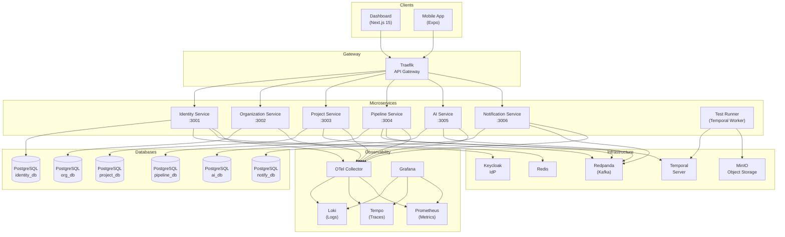
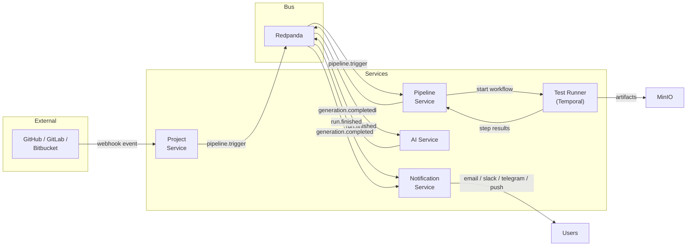

# System Architecture

## High-Level Architecture

The platform follows a microservices architecture with an API gateway pattern, event-driven communication, and workflow orchestration.

## Service Interaction Diagram

This diagram shows the primary data flows between services during a typical test pipeline execution.

## Technology Stack Justifications

| Technology | Purpose | Justification |
|---|---|---|
| **NestJS** | Backend framework | Modular architecture with decorators, DI, guards, and interceptors aligns with microservice patterns |
| **Prisma** | ORM | Type-safe database access with auto-generated client, migrations, and schema-first design |
| **PostgreSQL** | Database | Battle-tested RDBMS with JSON support, ideal for structured domain data |
| **Redpanda** | Event streaming | Kafka-compatible with lower resource footprint; ideal for event-driven decoupling |
| **Temporal** | Workflow orchestration | Durable workflow execution with retries, timeouts, and visibility for long-running test pipelines |
| **Keycloak** | Identity provider | Enterprise-grade SSO with OAuth2/OIDC, social login, and realm management |
| **Traefik** | API gateway | Dynamic routing, automatic TLS, middleware chains, native Docker/K8s integration |
| **MinIO** | Object storage | S3-compatible artifact storage for test reports, screenshots, and coverage data |
| **Redis** | Cache/sessions | Token blacklisting, rate limiting counters, and session caching |
| **Next.js 15** | Dashboard | App Router with RSC, server actions, middleware auth, and streaming SSR |
| **Expo** | Mobile app | Cross-platform React Native with managed workflow, OTA updates, and push notifications |
| **OpenTelemetry** | Observability | Vendor-neutral telemetry collection for traces, logs, and metrics |
| **Grafana stack** | Monitoring | Unified visualization for Loki (logs), Tempo (traces), and Prometheus (metrics) |
| **LangGraph** | AI agents | Stateful multi-step agent graphs with tool use, ideal for complex AI workflows |
| **pgvector** | Vector similarity | Embedding storage and cosine similarity search for RAG knowledge base |

## Design Principles

### Database-per-Service

Each microservice owns its own PostgreSQL database. No service directly accesses another service's database. This ensures:

- **Loose coupling** -- services can evolve their schemas independently
- **Independent scaling** -- each database can be scaled based on its service's load
- **Fault isolation** -- a database failure affects only the owning service

| Service | Database | Port |
|---|---|---|
| Identity | identity_db | 5441 |
| Organization | org_db | 5434 |
| Project | project_db | 5437 |
| Pipeline | pipeline_db | 5438 |
| AI | ai_db | 5440 |
| Notification | notify_db | 5439 |
| Keycloak | keycloak_db | 5435 |
| Temporal | temporal_db | 5436 |

### Event-Driven Communication

Services communicate asynchronously through Redpanda (Kafka-compatible) topics. This provides:

- **Temporal decoupling** -- producers and consumers operate independently
- **Replay capability** -- events can be replayed for debugging or reprocessing
- **Fan-out** -- a single event can trigger multiple downstream consumers

### CQRS-Lite

While not a full CQRS implementation, the architecture separates command paths (writes through REST APIs) from query/reaction paths (reads and side effects through events). For example:

1. Pipeline Service receives a `POST /test-runs` command and creates a test run
2. It emits a `run.started` event to Redpanda
3. Notification Service consumes the event and sends alerts (read/react path)

### API Gateway Pattern

Traefik sits in front of all services, providing:

- **Unified entry point** -- single domain for all API routes
- **JWT validation** -- middleware-level token verification
- **Rate limiting** -- per-route rate limits (stricter for auth endpoints)
- **TLS termination** -- Let's Encrypt certificate management
- **Path-based routing** -- `/api/identity/*`, `/api/org/*`, etc.
