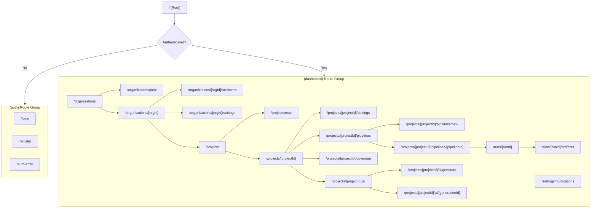
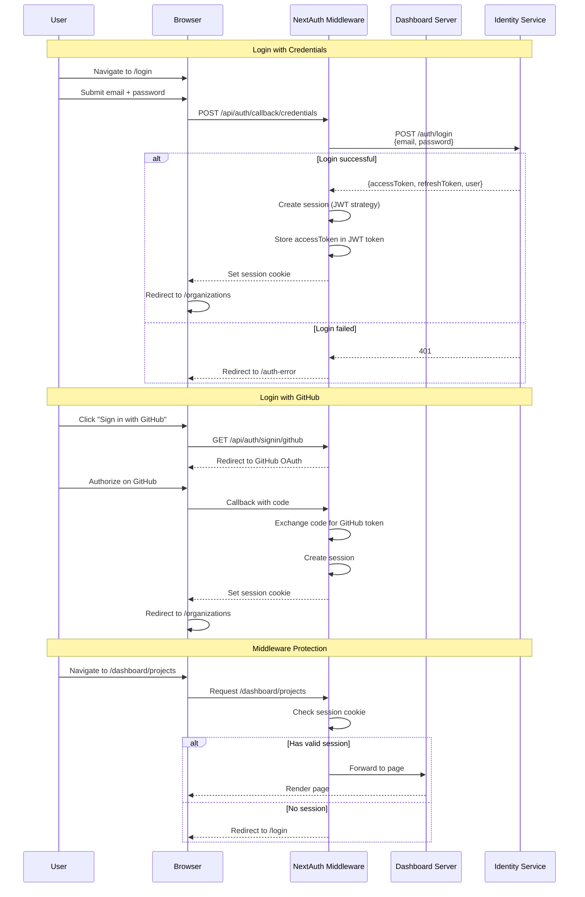
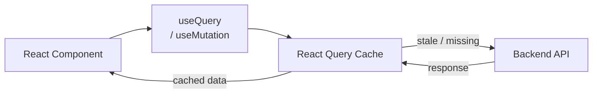
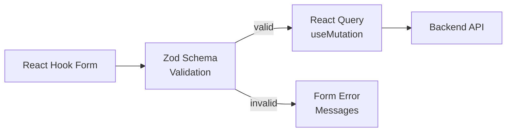

# Dashboard (Web)

## Overview

| Property | Value |
|---|---|
| **Framework** | Next.js 15 (App Router) |
| **React** | 19.0 |
| **Auth** | NextAuth v5 (beta) |
| **Styling** | Tailwind CSS 3.4 |
| **Component Library** | shadcn/ui (Radix UI primitives) |
| **State Management** | Zustand 5 + React Query 5 |
| **Forms** | react-hook-form + Zod |
| **Port** | 4200 |
| **Package Name** | `@testing-ai/dashboard` |

## App Router Structure

```
src/app/
  layout.tsx                          # Root layout (providers, global styles)
  page.tsx                            # Landing / redirect
  api/auth/[...nextauth]/route.ts     # NextAuth API route

  (auth)/                             # Auth route group (no sidebar)
    layout.tsx
    login/page.tsx
    register/page.tsx
    auth-error/page.tsx

  (dashboard)/                        # Dashboard route group (with sidebar)
    layout.tsx

    organizations/
      page.tsx                        # Organization list
      new/page.tsx                    # Create organization
      [orgId]/
        page.tsx                      # Organization overview
        members/page.tsx              # Member management
        settings/page.tsx             # Organization settings

    projects/
      page.tsx                        # Project list
      new/page.tsx                    # Create project
      [projectId]/
        page.tsx                      # Project overview
        settings/page.tsx             # Project settings
        pipelines/
          page.tsx                    # Pipeline list
          new/page.tsx                # Create pipeline
          [pipelineId]/page.tsx       # Pipeline details & run history
        coverage/page.tsx             # Coverage dashboard
        ai/
          page.tsx                    # AI generations list
          generate/page.tsx           # Trigger new generation
          [generationId]/page.tsx     # Generation details

    runs/
      [runId]/
        page.tsx                      # Test run details & results
        artifacts/page.tsx            # Test artifacts viewer

    settings/
      notifications/page.tsx          # Notification configuration
```

## Page Map



## Auth Flow (NextAuth v5)



### Auth Configuration

```typescript
// src/lib/auth/auth.config.ts
export const authConfig: NextAuthConfig = {
  pages: {
    signIn: '/login',
    error: '/auth-error',
  },
  callbacks: {
    authorized({ auth, request }) {
      // Protect /dashboard and /organizations routes
      // Redirect authenticated users away from /login and /register
    },
    async jwt({ token, user }) {
      // Store accessToken and refreshToken in the JWT
    },
    async session({ session, token }) {
      // Expose userId and accessToken to the client session
    },
  },
  providers: [
    Credentials({ ... }),  // Email + password via Identity Service
    GitHub({ ... }),       // GitHub OAuth
  ],
};
```

### Protected Routes

| Route Pattern | Access |
|---|---|
| `/login`, `/register` | Public (redirects to `/organizations` if already authenticated) |
| `/auth-error` | Public |
| `/dashboard/*` | Requires authentication |
| `/organizations/*` | Requires authentication |
| `/projects/*` | Requires authentication |
| `/runs/*` | Requires authentication |
| `/settings/*` | Requires authentication |

## State Management

### Server State (React Query)

React Query manages all data fetched from backend APIs:



| Feature | Configuration |
|---|---|
| **Stale time** | 60 seconds |
| **Retry** | 2 attempts |
| **Refetch on window focus** | Enabled |
| **Background refetching** | Enabled |

### Client State (Zustand)

Zustand manages UI state that is not derived from server data:

| State | Description |
|---|---|
| Active organization ID | Currently selected organization context |
| Sidebar collapsed | Dashboard sidebar visibility |
| Theme preference | Light/dark mode |
| Filter states | Active filters on list pages |

## Component Library (shadcn/ui)

The dashboard uses shadcn/ui components built on Radix UI primitives with Tailwind CSS styling.

### Installed Components

| Component | Radix Package | Usage |
|---|---|---|
| **Button** | `@radix-ui/react-slot` | Actions, navigation |
| **Dialog** | `@radix-ui/react-dialog` | Modals, confirmations |
| **Dropdown Menu** | `@radix-ui/react-dropdown-menu` | Context menus, actions |
| **Avatar** | `@radix-ui/react-avatar` | User avatars |
| **Label** | `@radix-ui/react-label` | Form labels |
| **Separator** | `@radix-ui/react-separator` | Visual dividers |
| **Toast** | `@radix-ui/react-toast` | Notifications |
| **Select** | `@radix-ui/react-select` | Dropdowns |

### Utility Libraries

| Library | Purpose |
|---|---|
| `class-variance-authority` | Component variant management |
| `clsx` | Conditional class name joining |
| `tailwind-merge` | Tailwind class conflict resolution |
| `lucide-react` | Icon library |

## Forms

Forms use `react-hook-form` with `@hookform/resolvers/zod` for validation:



### Example Form Flow

1. Define a Zod schema for the form data
2. Create a `useForm` hook with the Zod resolver
3. Render form fields bound to the hook
4. On submit, validate with Zod, then call a React Query mutation
5. On success, invalidate related queries and navigate
6. On error, display server error messages

## Key Pages

| Page | Description |
|---|---|
| **Organization List** | Card grid of user's organizations with plan badges |
| **Organization Members** | Table of members with role badges, approve/reject/invite actions |
| **Project Overview** | Project details, recent runs, coverage trend chart |
| **Pipeline Configuration** | Step editor with drag-and-drop ordering, trigger type selection |
| **Test Run Details** | Real-time step progress (SSE), result cards, coverage metrics |
| **Artifacts Viewer** | Browse screenshots, videos, and coverage reports from MinIO |
| **AI Generations** | List of AI generations with accept/reject actions and feedback |
| **AI Generate** | Form to trigger a new AI generation with type and context selection |
| **Coverage Dashboard** | Line/branch/function coverage charts with historical trends |
| **Notification Settings** | Configure notification channels per organization and event type |

## Technology Stack

| Technology | Version | Purpose |
|---|---|---|
| Next.js | ^15.1.0 | App Router, RSC, middleware |
| React | ^19.0.0 | UI framework |
| next-auth | ^5.0.0-beta.25 | Authentication (NextAuth v5) |
| Tailwind CSS | ^3.4.0 | Utility-first styling |
| Radix UI | Various | Accessible component primitives |
| react-hook-form | ^7.54.0 | Form state management |
| @hookform/resolvers | ^3.9.0 | Zod integration for forms |
| Zustand | ^5.0.0 | Client state management |
| @tanstack/react-query | ^5.62.0 | Server state management |
| Zod | ^3.23.0 | Schema validation |
| lucide-react | ^0.468.0 | Icon library |
| class-variance-authority | ^0.7.0 | Component variants |
