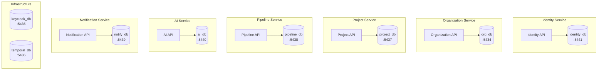
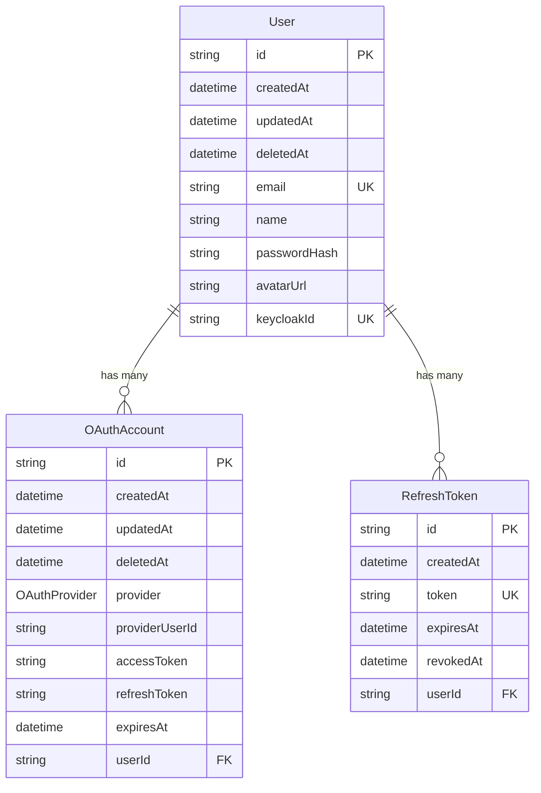
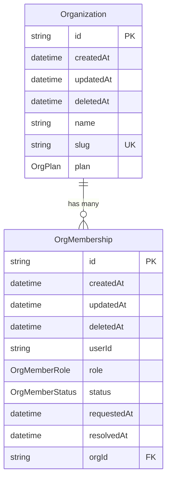
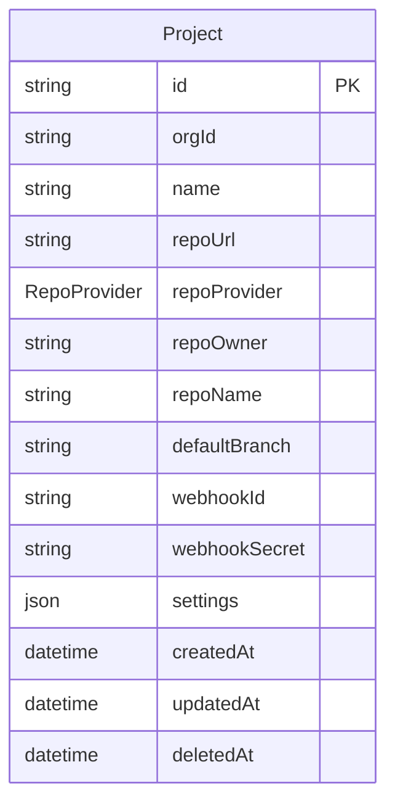
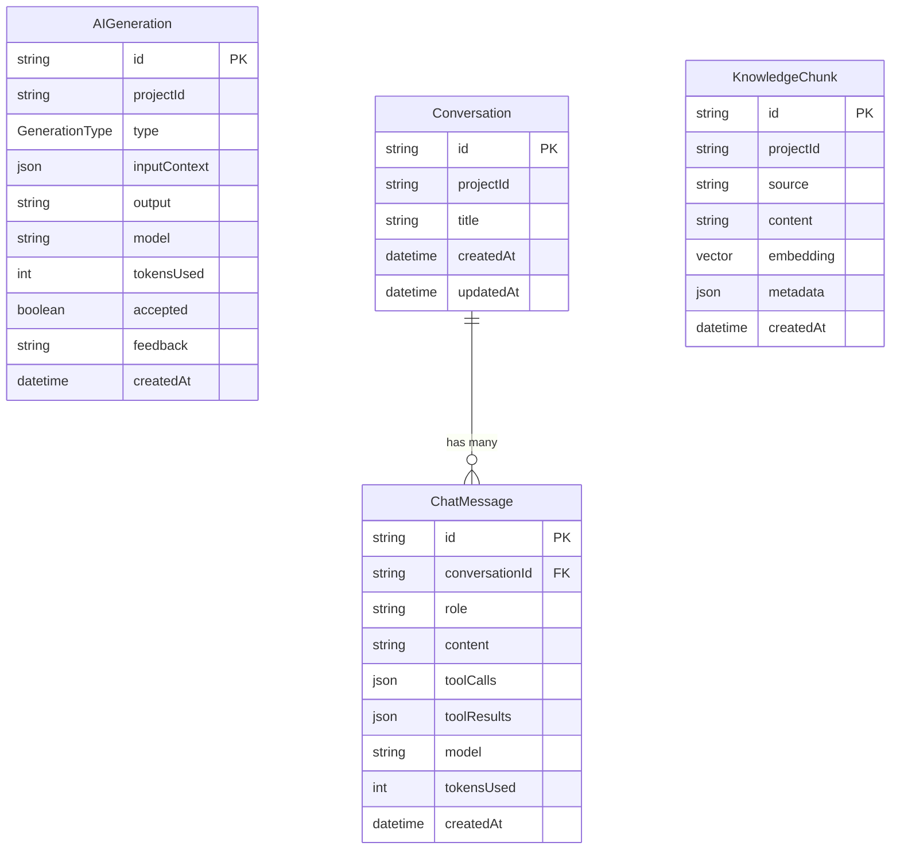
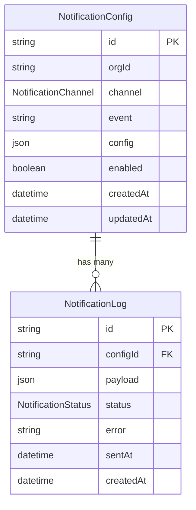
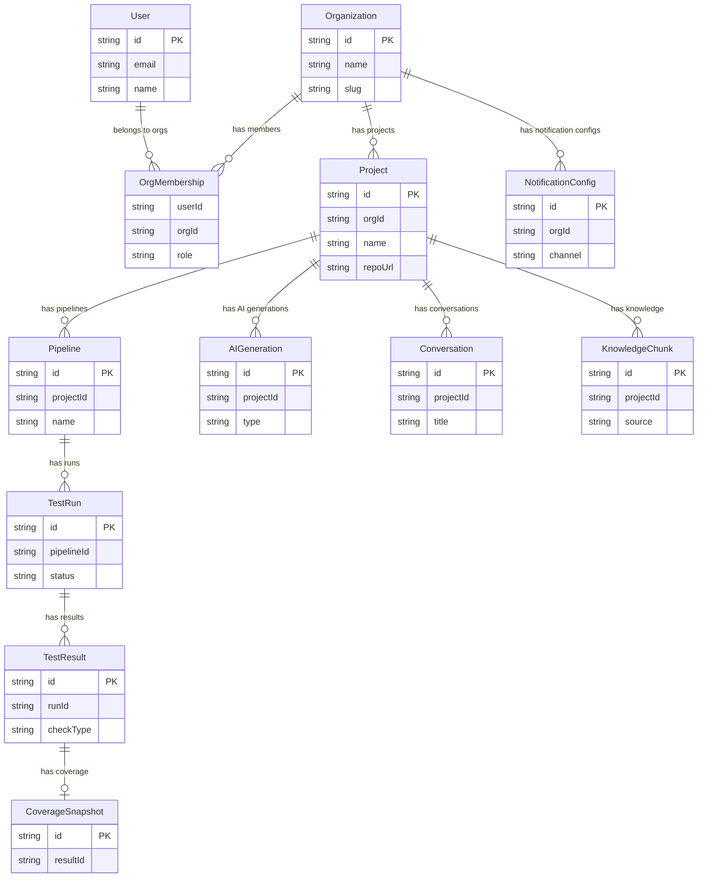

# Database Architecture

## Database-per-Service Pattern

Each microservice owns and manages its own PostgreSQL database. No service directly queries another service's database. Cross-service data is obtained through API calls or event consumption.



### Benefits

| Benefit | Description |
|---|---|
| **Independent evolution** | Each service can modify its schema without coordinating with other teams |
| **Fault isolation** | A database failure or corruption affects only the owning service |
| **Independent scaling** | Each database can be scaled (vertical or horizontal) based on its specific load patterns |
| **Technology freedom** | Services could theoretically use different database engines (though all currently use PostgreSQL) |
| **Security boundary** | Database credentials are scoped per service; no shared superuser |

### Trade-offs

| Trade-off | Mitigation |
|---|---|
| No cross-database joins | Services communicate via REST APIs or events |
| Eventual consistency | Redpanda events propagate state changes asynchronously |
| Data duplication | Acceptable for read-heavy denormalized data (e.g., user name cached in org membership) |
| Distributed transactions | Saga pattern via Temporal workflows |

## Entity-Relationship Diagrams

### Identity Service



### Organization Service



### Project Service



### Pipeline Service

```mermaid
erDiagram
    Pipeline {
        string id PK
        string projectId
        string name
        PipelineTrigger trigger
        string cronExpr
        json steps
        boolean enabled
        datetime createdAt
        datetime updatedAt
    }

    TestRun {
        string id PK
        string pipelineId FK
        string commitSha
        string branch
        TestRunStatus status
        datetime startedAt
        datetime finishedAt
        string triggeredBy
        json metadata
        datetime createdAt
    }

    TestResult {
        string id PK
        string runId FK
        TestCheckType checkType
        TestStatus status
        string summary
        json details
        string artifactUrl
        int durationMs
        datetime createdAt
    }

    CoverageSnapshot {
        string id PK
        string resultId FK UK
        float linePct
        float branchPct
        float functionPct
        json uncovered
    }

    Pipeline ||--o{ TestRun : "has many"
    TestRun ||--o{ TestResult : "has many"
    TestResult ||--o| CoverageSnapshot : "has one (optional)"
```

### AI Service



### Notification Service



## Combined Overview

This diagram shows how entities relate conceptually across services. Note that these relationships are not enforced by foreign keys at the database level -- they are maintained through application logic, API calls, and events.



## Migration Strategy

### Prisma Migrations

Each service manages its own migrations using Prisma Migrate. Migrations are stored in each service's `prisma/migrations/` directory.

```bash
# Generate a new migration after schema changes
cd services/<service-name>
npx prisma migrate dev --name <migration-name>

# Apply migrations in production
npx prisma migrate deploy

# Reset database (development only)
npx prisma migrate reset
```

### Migration Best Practices

| Practice | Description |
|---|---|
| **Additive changes** | Prefer adding new columns/tables over modifying existing ones |
| **Nullable new columns** | New columns should be nullable or have defaults to avoid breaking existing data |
| **Separate schema and data** | Use Prisma for schema migrations, application code for data migrations |
| **Review before deploy** | Always review generated SQL before applying to staging/production |
| **Version control** | Migration files are committed to git alongside schema changes |

### Running All Migrations

From the repository root:

```bash
# Generate Prisma clients for all services
pnpm db:generate

# Run migrations for all services
pnpm db:migrate
```

These commands use Turborepo to run the corresponding Prisma commands across all services in parallel.
