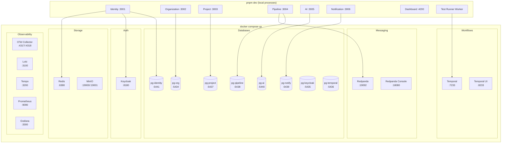
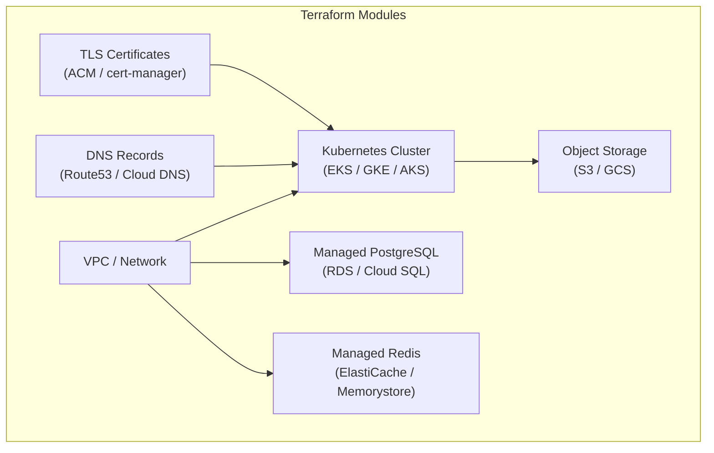

# Deployment Guide

## Environments

| Environment | Infrastructure | Purpose |
|---|---|---|
| **Development** | Docker Compose | Local development and testing |
| **Staging** | Kubernetes (Helm) | Pre-production validation |
| **Production** | Kubernetes (Helm + ArgoCD) | Live environment |

## Development: Docker Compose

The `docker-compose.yml` at the repository root provides all infrastructure dependencies for local development.

### Architecture



### Commands

```bash
# Start all infrastructure
pnpm docker:up

# Stop all infrastructure
pnpm docker:down

# Reset (destroy volumes and restart)
pnpm docker:reset

# View logs
docker compose logs -f <service-name>
```

## Staging / Production: Kubernetes + Helm

### Helm Chart Structure

```
infrastructure/helm/
  testing-ai/
    Chart.yaml
    values.yaml
    values-staging.yaml
    values-production.yaml
    templates/
      _helpers.tpl
      identity-deployment.yaml
      identity-service.yaml
      organization-deployment.yaml
      organization-service.yaml
      project-deployment.yaml
      project-service.yaml
      pipeline-deployment.yaml
      pipeline-service.yaml
      ai-deployment.yaml
      ai-service.yaml
      notification-deployment.yaml
      notification-service.yaml
      test-runner-deployment.yaml
      dashboard-deployment.yaml
      dashboard-service.yaml
      ingress.yaml
      configmap.yaml
      secrets.yaml
      hpa.yaml
```

### Key Helm Values

```yaml
# values.yaml (defaults)
global:
  imageRegistry: ghcr.io/your-org/testing-ai
  imageTag: latest
  imagePullPolicy: IfNotPresent

identity:
  replicas: 2
  port: 3001
  resources:
    requests: { cpu: 100m, memory: 256Mi }
    limits: { cpu: 500m, memory: 512Mi }
  env:
    JWT_EXPIRATION: "1h"

organization:
  replicas: 2
  port: 3002
  resources:
    requests: { cpu: 100m, memory: 256Mi }
    limits: { cpu: 500m, memory: 512Mi }

project:
  replicas: 2
  port: 3003

pipeline:
  replicas: 2
  port: 3004

ai:
  replicas: 2
  port: 3005
  resources:
    requests: { cpu: 200m, memory: 512Mi }
    limits: { cpu: 1000m, memory: 1Gi }

notification:
  replicas: 2
  port: 3006

testRunner:
  replicas: 3
  resources:
    requests: { cpu: 500m, memory: 1Gi }
    limits: { cpu: 2000m, memory: 4Gi }

dashboard:
  replicas: 2
  port: 4200

ingress:
  enabled: true
  className: traefik
  annotations:
    cert-manager.io/cluster-issuer: letsencrypt-prod
  hosts:
    - host: app.testing-ai.example.com
      paths: ["/"]
    - host: api.testing-ai.example.com
      paths: ["/api"]

autoscaling:
  enabled: true
  minReplicas: 2
  maxReplicas: 10
  targetCPUUtilization: 70
```

### Environment-Specific Overrides

**Staging** (`values-staging.yaml`):
```yaml
global:
  imageTag: staging
identity:
  replicas: 1
autoscaling:
  enabled: false
```

**Production** (`values-production.yaml`):
```yaml
global:
  imageTag: "1.0.0"
identity:
  replicas: 3
ai:
  replicas: 4
testRunner:
  replicas: 5
autoscaling:
  enabled: true
  maxReplicas: 20
```

### Deploying with Helm

```bash
# Staging
helm upgrade --install testing-ai ./infrastructure/helm/testing-ai \
  -f ./infrastructure/helm/testing-ai/values-staging.yaml \
  -n testing-ai-staging --create-namespace

# Production
helm upgrade --install testing-ai ./infrastructure/helm/testing-ai \
  -f ./infrastructure/helm/testing-ai/values-production.yaml \
  -n testing-ai-production --create-namespace
```

## ArgoCD GitOps Flow

Production deployments use ArgoCD for GitOps-based continuous delivery.

```mermaid
flowchart LR
    subgraph Developer
        Code["Push code<br/>to main"]
    end

    subgraph GitHubActions["GitHub Actions CI"]
        Test["Run tests<br/>+ lint"]
        Build["Build Docker<br/>images"]
        Push["Push to<br/>GHCR"]
        UpdateValues["Update Helm<br/>values imageTag"]
    end

    subgraph GitRepo["Git Repository"]
        HelmValues["infrastructure/helm/<br/>values-production.yaml"]
    end

    subgraph ArgoCD
        Sync["ArgoCD detects<br/>values change"]
        Apply["Apply Helm<br/>chart to K8s"]
    end

    subgraph Kubernetes["Kubernetes Cluster"]
        RollingUpdate["Rolling update<br/>of deployments"]
    end

    Code --> Test
    Test -- pass --> Build
    Build --> Push
    Push --> UpdateValues
    UpdateValues --> HelmValues
    HelmValues --> Sync
    Sync --> Apply
    Apply --> RollingUpdate
```



### CI/CD Pipeline Steps

1. **Developer pushes** code to the `main` branch
2. **GitHub Actions** triggers:
   - Run linting and tests across all packages
   - Build Docker images for each service
   - Push images to GitHub Container Registry (GHCR) with version tags
   - Update `imageTag` in Helm values file
   - Commit updated values file back to the repository
3. **ArgoCD** detects the change in the Helm values file
4. **ArgoCD** performs a Helm diff and applies changes to the Kubernetes cluster
5. **Kubernetes** performs a rolling update of affected deployments

## Terraform Infrastructure

Terraform manages the cloud infrastructure that hosts the Kubernetes cluster and supporting services.



### Terraform Structure

```
infrastructure/terraform/
  modules/
    networking/     # VPC, subnets, security groups
    kubernetes/     # EKS/GKE/AKS cluster
    databases/      # PostgreSQL instances
    redis/          # Redis/ElastiCache
    storage/        # S3/MinIO buckets
    dns/            # DNS records
  environments/
    staging/
      main.tf
      variables.tf
      terraform.tfvars
    production/
      main.tf
      variables.tf
      terraform.tfvars
```

## Environment Configuration Differences

| Aspect | Development | Staging | Production |
|---|---|---|---|
| **Databases** | Docker Compose PostgreSQL | Managed (single instance) | Managed (multi-AZ, replicas) |
| **Redis** | Docker Compose Redis | Managed (single node) | Managed (clustered) |
| **Message Broker** | Docker Compose Redpanda | Managed Kafka or Redpanda | Managed Kafka (multi-broker) |
| **Object Storage** | Docker Compose MinIO | Managed S3/GCS | Managed S3/GCS (versioned) |
| **Temporal** | Docker Compose Temporal | Self-hosted on K8s | Temporal Cloud |
| **Keycloak** | Docker Compose | Self-hosted on K8s | Self-hosted on K8s (HA) |
| **TLS** | None (HTTP) | Let's Encrypt (staging) | Let's Encrypt (production) |
| **Replicas** | 1 (local process) | 1-2 per service | 2-10+ (auto-scaled) |
| **Observability** | Docker Compose Grafana stack | Grafana Cloud (free tier) | Grafana Cloud (paid) |
| **CI/CD** | Manual (`pnpm dev`) | GitHub Actions + ArgoCD | GitHub Actions + ArgoCD |
| **Secrets** | `.env` file | Kubernetes Secrets | Vault + External Secrets Operator |
