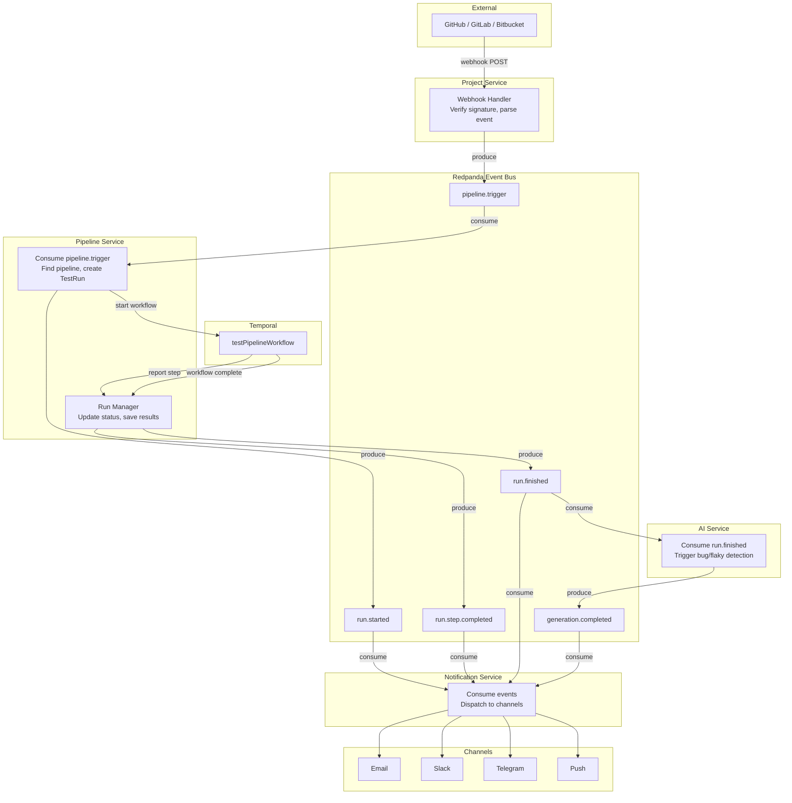
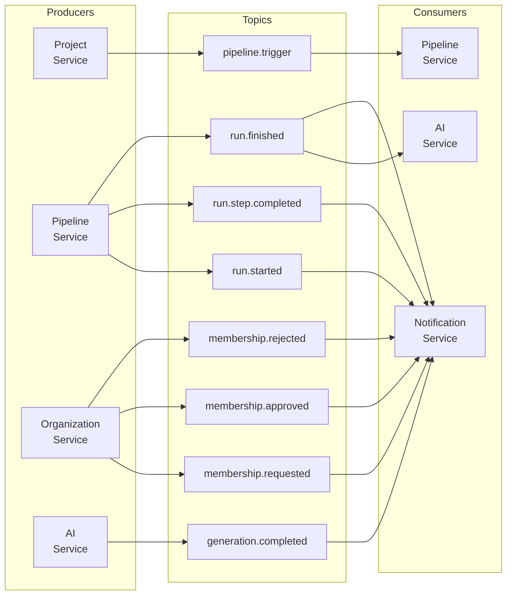

# Event-Driven Architecture

## Overview

The platform uses Redpanda (a Kafka-compatible streaming platform) as the central event bus for asynchronous inter-service communication. This decouples producers from consumers, enables fan-out, and provides event replay capabilities.

## Redpanda Configuration

| Property | Value |
|---|---|
| **Broker Address (internal)** | `redpanda:29092` |
| **Broker Address (external)** | `localhost:19092` |
| **Schema Registry** | `localhost:18081` |
| **Console UI** | `http://localhost:18080` |

## Topic Registry

| Topic | Description |
|---|---|
| `pipeline.trigger` | A pipeline should be triggered (from webhook or schedule) |
| `run.started` | A test run has begun execution |
| `run.step.completed` | A single step within a test run has completed |
| `run.finished` | A test run has fully completed |
| `membership.requested` | A user was invited to an organization |
| `membership.approved` | A membership request was approved |
| `membership.rejected` | A membership request was rejected |
| `generation.completed` | An AI generation has completed |
| `coverage.updated` | Coverage data has been updated for a project |

## Event Flow: Full Pipeline Execution

This diagram shows the complete data flow from a git webhook event to user notification.

## Event Types Reference

### pipeline.trigger

| Field | Type | Description |
|---|---|---|
| `projectId` | string | Project that received the webhook |
| `commitSha` | string | Commit SHA that triggered the pipeline |
| `branch` | string | Branch name |
| `trigger` | enum | `PUSH`, `PULL_REQUEST`, `SCHEDULE`, `MANUAL` |
| `repoUrl` | string | Repository clone URL |
| `metadata` | object | Additional context (PR number, author, etc.) |

**Producer**: Project Service
**Consumers**: Pipeline Service

### run.started

| Field | Type | Description |
|---|---|---|
| `runId` | string | Test run ID |
| `pipelineId` | string | Pipeline ID |
| `projectId` | string | Project ID |
| `commitSha` | string | Commit SHA |
| `branch` | string | Branch name |
| `triggeredBy` | string | User ID or "webhook" |

**Producer**: Pipeline Service
**Consumers**: Notification Service

### run.step.completed

| Field | Type | Description |
|---|---|---|
| `runId` | string | Test run ID |
| `checkType` | string | Step type (unit, lint, sast, etc.) |
| `status` | string | Step status (passed, failed, errored) |
| `summary` | string | Human-readable summary |
| `durationMs` | number | Step duration in milliseconds |
| `artifactUrl` | string | URL to artifact in MinIO (if any) |

**Producer**: Pipeline Service (via Temporal reporting)
**Consumers**: Notification Service (optional, for step-level alerts)

### run.finished

| Field | Type | Description |
|---|---|---|
| `runId` | string | Test run ID |
| `pipelineId` | string | Pipeline ID |
| `projectId` | string | Project ID |
| `status` | string | Final status (PASSED, FAILED, ERRORED) |
| `commitSha` | string | Commit SHA |
| `branch` | string | Branch name |
| `durationMs` | number | Total run duration |
| `coverage` | object | Coverage metrics (if collected) |

**Producer**: Pipeline Service
**Consumers**: AI Service, Notification Service

### membership.requested

| Field | Type | Description |
|---|---|---|
| `orgId` | string | Organization ID |
| `userId` | string | Invited user ID |
| `invitedBy` | string | Admin user ID who invited |
| `role` | string | Requested role |

**Producer**: Organization Service
**Consumers**: Notification Service

### membership.approved / membership.rejected

| Field | Type | Description |
|---|---|---|
| `orgId` | string | Organization ID |
| `userId` | string | User ID |
| `resolvedBy` | string | Admin user ID who resolved |
| `status` | string | `APPROVED` or `REJECTED` |

**Producer**: Organization Service
**Consumers**: Notification Service

### generation.completed

| Field | Type | Description |
|---|---|---|
| `generationId` | string | AI generation ID |
| `projectId` | string | Project ID |
| `type` | string | Generation type |
| `model` | string | Model used |
| `tokensUsed` | number | Total tokens consumed |

**Producer**: AI Service
**Consumers**: Notification Service

## Producer/Consumer Matrix

## EventEmitter2 Internal Events

In addition to Redpanda events for inter-service communication, each NestJS service uses `EventEmitter2` for intra-service event handling. These events do not cross service boundaries.

| Service | Internal Event | Description |
|---|---|---|
| Pipeline | `testrun.status.changed` | TestRun status updated; triggers SSE push to connected clients |
| Pipeline | `testresult.saved` | TestResult saved to DB; triggers SSE step update |
| Identity | `user.created` | New user registered; triggers Keycloak sync |
| Identity | `user.oauth.linked` | OAuth account linked to user |
| Organization | `membership.status.changed` | Membership status updated; triggers Redpanda event |
| AI | `generation.started` | AI generation began processing |
| AI | `generation.finished` | AI generation completed; triggers Redpanda event |
| Notification | `notification.dispatched` | Notification sent to channel; updates log |

## Consumer Groups

Each consuming service uses a dedicated consumer group to ensure:

- **Independent consumption**: Each service processes events at its own pace
- **At-least-once delivery**: Failed processing triggers redelivery within the consumer group
- **Parallel processing**: Multiple instances of a service can share the load within a consumer group

| Consumer Group | Service | Topics Consumed |
|---|---|---|
| `pipeline-service` | Pipeline Service | `pipeline.trigger` |
| `ai-service` | AI Service | `run.finished` |
| `notification-service` | Notification Service | `run.started`, `run.step.completed`, `run.finished`, `membership.*`, `generation.completed` |
