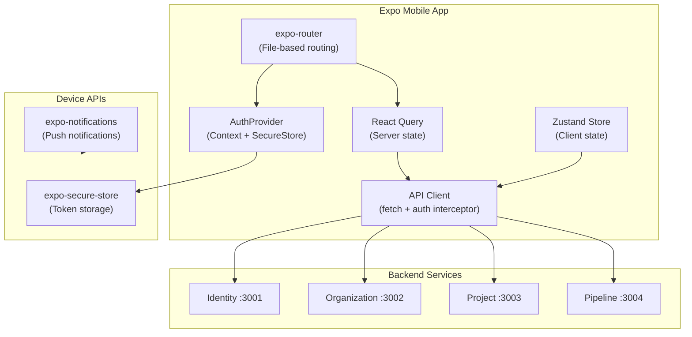
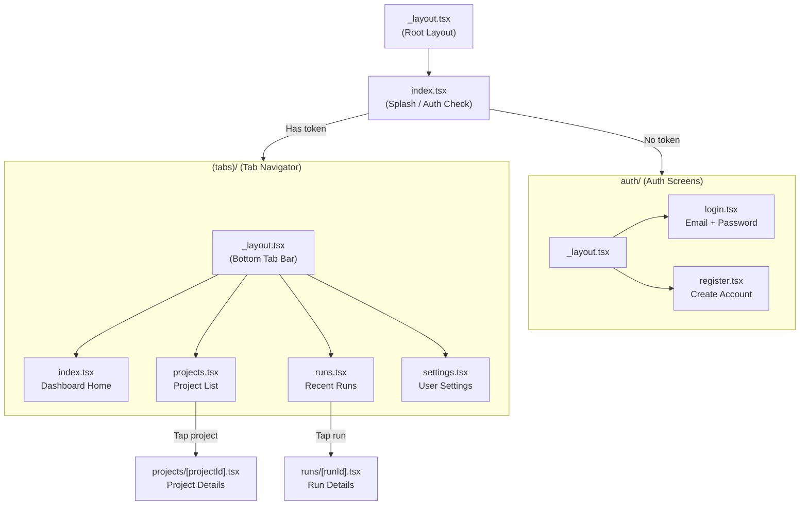
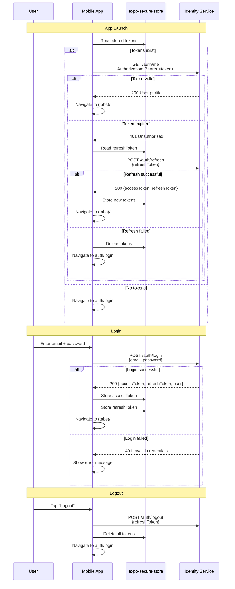
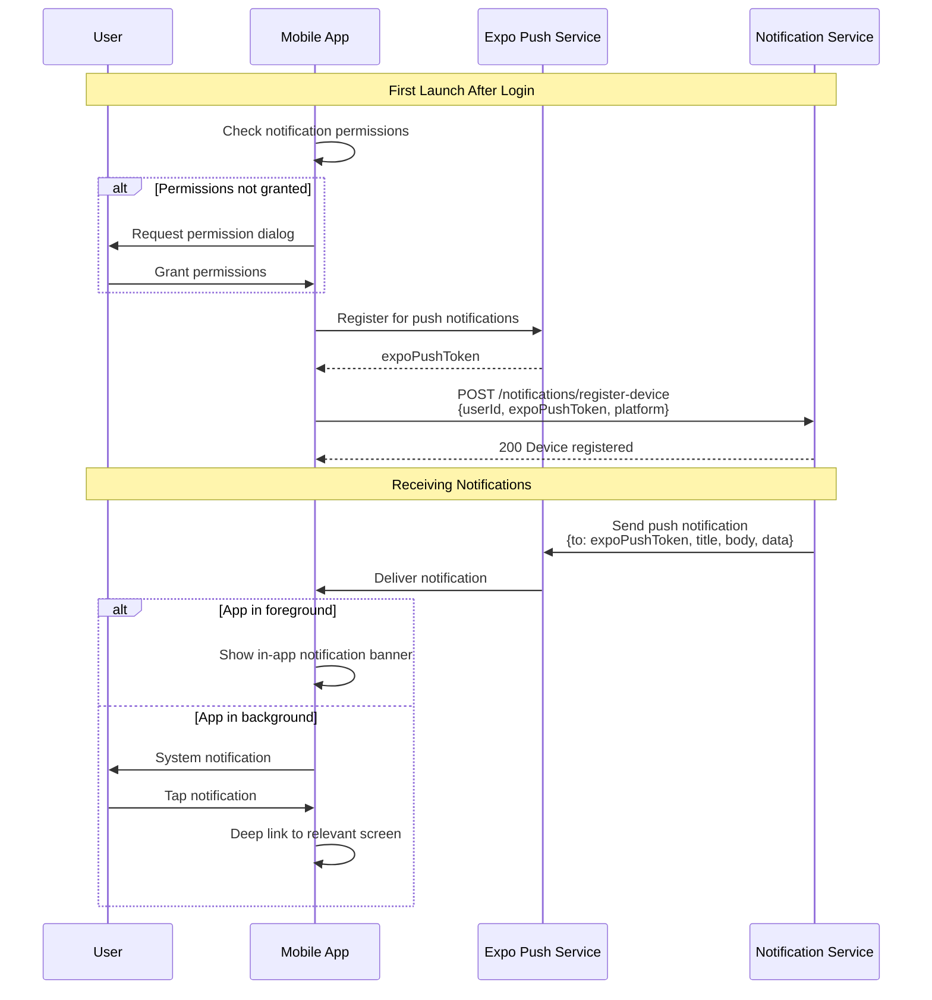

# Mobile App

## Overview

| Property | Value |
|---|---|
| **Framework** | Expo (React Native) |
| **Expo Version** | ~52.0.0 |
| **React Native** | 0.76.5 |
| **Router** | expo-router ~4.0.0 |
| **State Management** | Zustand 5 + React Query 5 |
| **Package Name** | `@testing-ai/mobile` |

## Architecture



## Screen Map



## Auth Flow



## Push Notifications

### Setup Flow



### Push Notification Types

| Event | Title | Body | Deep Link |
|---|---|---|---|
| `run.finished` (PASSED) | "Tests Passed" | "{project}: All tests passed on {branch}" | `/runs/{runId}` |
| `run.finished` (FAILED) | "Tests Failed" | "{project}: {failedCount} tests failed on {branch}" | `/runs/{runId}` |
| `membership.approved` | "Membership Approved" | "You've been added to {orgName}" | `/` |
| `generation.completed` | "AI Generation Ready" | "{type} completed for {project}" | `/projects/{projectId}` |

## API Integration

The API client is a configured `fetch` wrapper with automatic token injection and refresh:

### API Modules

| Module | File | Endpoints Called |
|---|---|---|
| **Auth** | `src/lib/api/auth.ts` | `POST /auth/login`, `POST /auth/register`, `POST /auth/refresh`, `POST /auth/logout` |
| **Organizations** | `src/lib/api/organizations.ts` | `GET /organizations`, `POST /organizations`, members endpoints |
| **Projects** | `src/lib/api/projects.ts` | `GET /projects`, `GET /projects/:id`, webhook endpoints |
| **Test Runs** | `src/lib/api/test-runs.ts` | `GET /test-runs`, `GET /test-runs/:id`, `POST /test-runs/:id/cancel` |

### Client Configuration

```typescript
// src/lib/api/client.ts
// - Base URL from environment
// - Automatic Authorization header injection
// - 401 interceptor triggers token refresh
// - Retry logic for network failures
```

## State Management

| Layer | Technology | Purpose |
|---|---|---|
| **Server state** | React Query (TanStack) | API data caching, background refetching, optimistic updates |
| **Client state** | Zustand | UI state (active tab, filters, user preferences) |
| **Auth state** | React Context + SecureStore | Token management, current user |

### Zustand Store

```typescript
// src/lib/stores/app-store.ts
interface AppStore {
  // Active organization context
  activeOrgId: string | null;
  setActiveOrgId: (id: string) => void;

  // UI preferences
  theme: 'light' | 'dark';
  // ... other client state
}
```

## Technology Stack

| Technology | Version | Purpose |
|---|---|---|
| Expo | ~52.0.0 | Managed React Native workflow |
| expo-router | ~4.0.0 | File-based routing |
| expo-secure-store | ~14.0.0 | Encrypted token storage |
| expo-notifications | ~0.29.0 | Push notification handling |
| React | 18.3.1 | UI framework |
| React Native | 0.76.5 | Native rendering |
| @react-navigation/native | ^7.0.0 | Navigation primitives |
| @tanstack/react-query | ^5.62.0 | Server state management |
| Zustand | ^5.0.0 | Client state management |
| Zod | ^3.23.0 | Runtime type validation |
| lucide-react-native | ^0.468.0 | Icon library |
