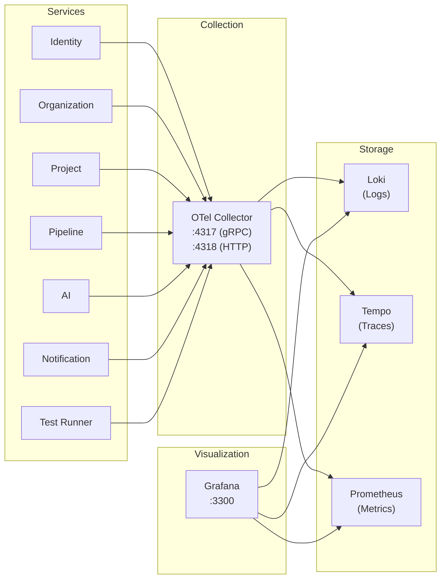
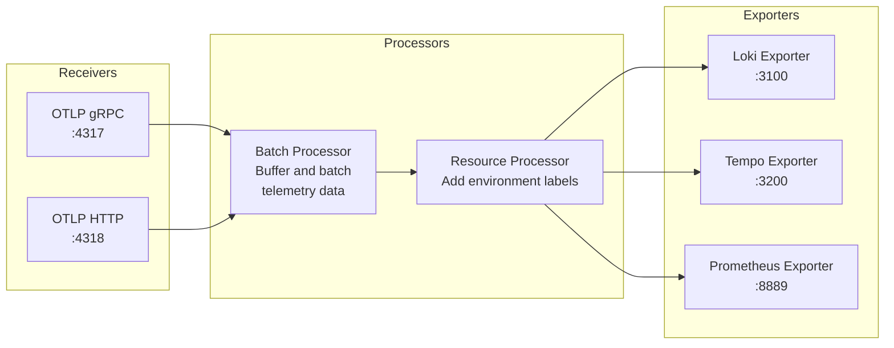
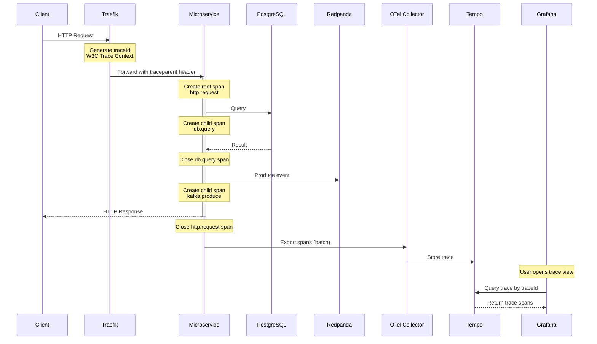
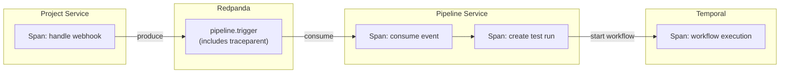
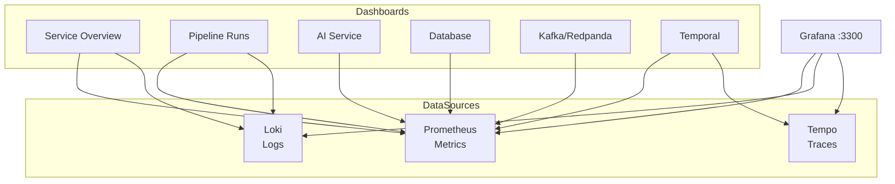

# Observability

## Overview

The platform uses the OpenTelemetry (OTel) standard for collecting traces, logs, and metrics from all microservices. Data flows through the OTel Collector and is stored in the Grafana stack (Tempo, Loki, Prometheus) for visualization.



## OpenTelemetry Setup

Each NestJS service includes the OTel SDK instrumentation that automatically captures:

- **Traces**: HTTP request spans, database query spans, Kafka produce/consume spans
- **Logs**: Structured JSON logs with trace context (traceId, spanId)
- **Metrics**: Request latency histograms, error counters, active connection gauges

### Configuration

| Variable | Default | Description |
|---|---|---|
| `OTEL_EXPORTER_OTLP_ENDPOINT` | `http://localhost:4318` | OTel Collector OTLP endpoint |
| `OTEL_SERVICE_NAME` | `testing-ai` | Base service name for telemetry |

Each service appends its own name to the base, resulting in service names like `testing-ai-identity`, `testing-ai-pipeline`, etc.

### OTel Collector Configuration

The collector receives telemetry data and routes it to the appropriate backends:

```
infrastructure/observability/otel-collector/otel-collector-config.yml
```



## Tracing

### Request Tracing Flow



### Trace Propagation Across Services

When one service calls another (via HTTP or Kafka), the trace context is propagated:



All spans share the same `traceId`, providing a complete distributed trace across services.

## Logging (Loki)

### Log Format

All services emit structured JSON logs:

```json
{
  "timestamp": "2025-01-15T10:30:00.000Z",
  "level": "info",
  "service": "testing-ai-pipeline",
  "traceId": "abc123def456",
  "spanId": "789ghi",
  "message": "Test run created",
  "context": {
    "runId": "run-uuid",
    "pipelineId": "pipeline-uuid",
    "status": "QUEUED"
  }
}
```

### Log Levels

| Level | Usage |
|---|---|
| `error` | Unrecoverable errors, exceptions |
| `warn` | Recoverable issues, degraded performance |
| `info` | Business events (run started, generation completed) |
| `debug` | Detailed diagnostic information |
| `verbose` | Trace-level detail (database queries, HTTP calls) |

### Querying Logs in Grafana

Use LogQL queries in Grafana:

```
# All errors from pipeline service
{service="testing-ai-pipeline"} |= "error"

# Logs for a specific test run
{service="testing-ai-pipeline"} | json | runId="<run-id>"

# All logs for a trace
{traceId="<trace-id>"}
```

## Tracing (Tempo)

| Property | Value |
|---|---|
| **Port** | 3200 |
| **Protocol** | OTLP gRPC via OTel Collector |
| **Retention** | Configurable (default: 72 hours in dev) |

### Key Trace Attributes

| Attribute | Description |
|---|---|
| `service.name` | Service that generated the span |
| `http.method` | HTTP method (GET, POST, etc.) |
| `http.url` | Full request URL |
| `http.status_code` | Response status code |
| `db.system` | Database type (postgresql) |
| `db.statement` | SQL query (truncated) |
| `messaging.system` | Messaging system (kafka) |
| `messaging.destination` | Kafka topic name |

## Metrics (Prometheus)

### Scraped Metrics

Prometheus scrapes metrics from services via the OTel Collector's Prometheus exporter on port `8889`.

| Metric | Type | Description |
|---|---|---|
| `http_requests_total` | Counter | Total HTTP requests by service, method, path, status |
| `http_request_duration_seconds` | Histogram | HTTP request latency distribution |
| `db_query_duration_seconds` | Histogram | Database query latency |
| `kafka_produce_total` | Counter | Total Kafka messages produced |
| `kafka_consume_total` | Counter | Total Kafka messages consumed |
| `kafka_consumer_lag` | Gauge | Consumer group lag |
| `temporal_workflow_completed` | Counter | Completed Temporal workflows |
| `temporal_activity_duration_seconds` | Histogram | Temporal activity execution time |
| `ai_tokens_used_total` | Counter | Total AI tokens consumed |
| `ai_generation_duration_seconds` | Histogram | AI generation latency |

## Grafana Dashboards

Access Grafana at http://localhost:3300 (admin/admin in development).

### Pre-configured Dashboards

| Dashboard | Description |
|---|---|
| **Service Overview** | Request rates, latency percentiles, error rates across all services |
| **Pipeline Runs** | Test run counts, pass/fail ratios, average duration |
| **AI Service** | Generation counts, token usage, model distribution, feedback rates |
| **Database** | Query latency, connection pool usage, slow query logs |
| **Kafka/Redpanda** | Message throughput, consumer lag, topic sizes |
| **Temporal** | Workflow completion rates, activity durations, retry counts |
| **Infrastructure** | CPU, memory, disk usage per service |

### Dashboard Architecture



## Alert Configuration

Alerts are defined in Grafana and triggered based on Prometheus metrics.

### Recommended Alerts

| Alert | Condition | Severity |
|---|---|---|
| **High Error Rate** | HTTP 5xx rate > 5% for 5 minutes | Critical |
| **High Latency** | p95 latency > 5s for 5 minutes | Warning |
| **Service Down** | Health check fails for 2 minutes | Critical |
| **Kafka Consumer Lag** | Lag > 1000 messages for 10 minutes | Warning |
| **Database Connection Pool** | Active connections > 80% of pool for 5 minutes | Warning |
| **Temporal Workflow Failures** | Workflow failure rate > 10% for 10 minutes | Warning |
| **AI Token Budget** | Daily token usage > 80% of budget | Warning |
| **Disk Usage** | Any volume > 80% capacity | Warning |

### Alert Notification Channels

Grafana alerts can be routed to:

- **Slack**: Via webhook integration
- **Email**: Via SMTP configuration
- **PagerDuty**: For critical production alerts
- **Webhook**: Custom integrations
