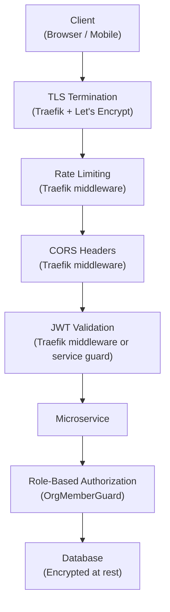
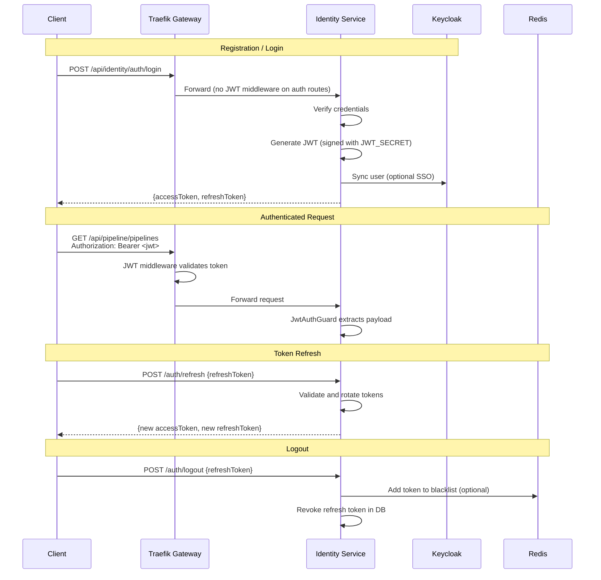
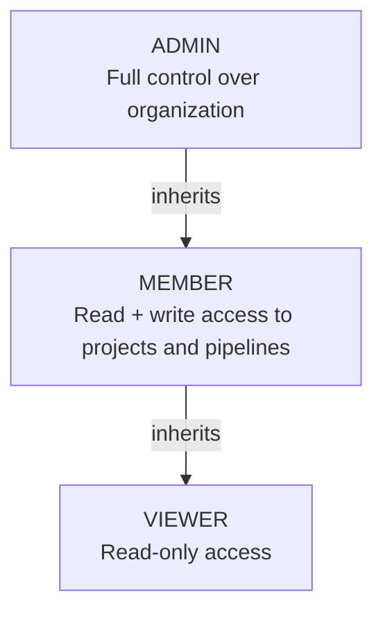
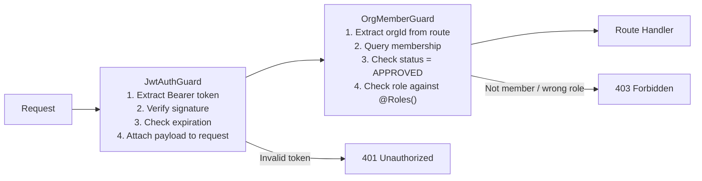
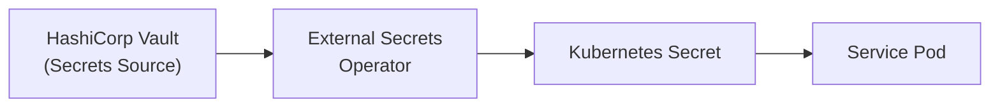

# Security

## Overview

Security is implemented in layers: TLS termination at the gateway, JWT-based authentication, role-based authorization, secrets management, and secure coding practices.



## Authentication Flow

### Keycloak + JWT Architecture



### Token Lifecycle

| Token | Lifetime | Storage (Client) | Revocation |
|---|---|---|---|
| **Access Token (JWT)** | 1 hour | Memory / HttpOnly cookie | Expires naturally; blacklist via Redis for forced revocation |
| **Refresh Token** | 7 days | Secure storage (SecureStore on mobile, HttpOnly cookie on web) | Revoked in database (revokedAt field) |

## Authorization Model

### Role Hierarchy



### Guard Chain

Every authenticated request passes through a chain of guards:



### Permission Matrix

| Resource | ADMIN | MEMBER | VIEWER | Public |
|---|---|---|---|---|
| Register / Login | - | - | - | Yes |
| View organization | Yes | Yes | Yes | No |
| Manage members | Yes | No | No | No |
| Create project | Yes | Yes | No | No |
| View project | Yes | Yes | Yes | No |
| Manage pipelines | Yes | Yes | No | No |
| View test runs | Yes | Yes | Yes | No |
| Trigger test runs | Yes | Yes | No | No |
| AI generations | Yes | Yes | No | No |
| Notification configs | Yes | No | No | No |

## Traefik Security Middlewares

The Traefik API gateway applies several security middlewares to incoming requests.

### Rate Limiting

```yaml
# Auth endpoints: stricter rate limiting
rate-limit-auth:
  rateLimit:
    average: 20
    burst: 10
    period: 1m

# General API endpoints
rate-limit-global:
  rateLimit:
    average: 100
    burst: 50
    period: 1m
```

| Route Pattern | Rate Limit | Burst | Period |
|---|---|---|---|
| `/api/identity/auth/*` | 20 req | 10 | 1 minute |
| All other `/api/*` | 100 req | 50 | 1 minute |

### CORS Headers

```yaml
cors-headers:
  headers:
    accessControlAllowOriginList:
      - "https://app.testing-ai.example.com"
      - "http://localhost:4200"
    accessControlAllowMethods:
      - GET
      - POST
      - PATCH
      - DELETE
      - OPTIONS
    accessControlAllowHeaders:
      - Authorization
      - Content-Type
    accessControlMaxAge: 86400
```

### JWT Validation Middleware

```yaml
jwt-auth:
  plugin:
    jwt:
      secret: "${JWT_SECRET}"
      alg: HS256
      headerName: Authorization
      headerPrefix: "Bearer "
```

This middleware validates the JWT signature at the gateway level before forwarding requests to services. The Identity Service route (`/api/identity`) does not use this middleware because it includes public endpoints (login, register, refresh).

### Security Headers

```yaml
security-headers:
  headers:
    frameDeny: true
    browserXssFilter: true
    contentTypeNosniff: true
    stsSeconds: 31536000
    stsIncludeSubdomains: true
    stsPreload: true
    referrerPolicy: "strict-origin-when-cross-origin"
    contentSecurityPolicy: "default-src 'self'"
```

### Compression

```yaml
compression:
  compress:
    excludedContentTypes:
      - text/event-stream
```

SSE connections are excluded from compression to ensure real-time delivery.

## TLS Configuration

### Development

TLS is not used in development. All communication is over HTTP on localhost.

### Staging / Production

Traefik handles TLS termination with Let's Encrypt certificates:

```yaml
# traefik static configuration
entryPoints:
  web:
    address: ":80"
    http:
      redirections:
        entryPoint:
          to: websecure
          scheme: https
  websecure:
    address: ":443"

certificatesResolvers:
  letsencrypt:
    acme:
      email: admin@testing-ai.example.com
      storage: /acme/acme.json
      httpChallenge:
        entryPoint: web
```

All HTTP traffic is redirected to HTTPS. Certificates are automatically provisioned and renewed.

## Vault Secrets Management

In production, secrets are managed by HashiCorp Vault with the External Secrets Operator syncing secrets to Kubernetes.



### Managed Secrets

| Secret | Service | Description |
|---|---|---|
| `JWT_SECRET` | Identity | JWT signing key |
| `*_DB_URL` | All services | Database connection strings with credentials |
| `OPENAI_API_KEY` | AI | OpenAI API key |
| `GITHUB_CLIENT_SECRET` | Identity | GitHub OAuth secret |
| `GITLAB_CLIENT_SECRET` | Identity | GitLab OAuth secret |
| `BITBUCKET_CLIENT_SECRET` | Identity | Bitbucket OAuth secret |
| `SMTP_PASS` | Notification | SMTP password |
| `SLACK_BOT_TOKEN` | Notification | Slack bot token |
| `TELEGRAM_BOT_TOKEN` | Notification | Telegram bot token |
| `MINIO_SECRET_KEY` | Test Runner | MinIO secret key |
| `NEXTAUTH_SECRET` | Dashboard | NextAuth encryption secret |

## OWASP Considerations

| OWASP Top 10 | Mitigation |
|---|---|
| **A01: Broken Access Control** | JWT + OrgMemberGuard with role-based checks on every endpoint |
| **A02: Cryptographic Failures** | bcrypt for passwords, JWT HS256 signing, TLS for transit, encrypted DB at rest |
| **A03: Injection** | Prisma ORM with parameterized queries; input validation via class-validator DTOs |
| **A04: Insecure Design** | Database-per-service isolation; principle of least privilege for roles |
| **A05: Security Misconfiguration** | Security headers via Traefik; no default credentials in production (Vault) |
| **A06: Vulnerable Components** | Dependency audit step in test pipelines; automated `dep_audit` check type |
| **A07: Auth Failures** | Rate limiting on auth endpoints; refresh token rotation; token blacklisting |
| **A08: Software/Data Integrity** | Webhook signature verification; signed Docker images; ArgoCD git source of truth |
| **A09: Logging Failures** | Structured logging with OTel; audit trail via notification logs |
| **A10: SSRF** | Git adapter validates repository URLs; no user-controlled outbound HTTP |

## Password Security

| Aspect | Implementation |
|---|---|
| **Hashing** | bcrypt with auto-generated salt (cost factor 10) |
| **Storage** | `passwordHash` field in User model; null for OAuth-only users |
| **Validation** | Minimum length, complexity rules enforced by DTO validation |
| **Comparison** | Constant-time bcrypt compare to prevent timing attacks |
