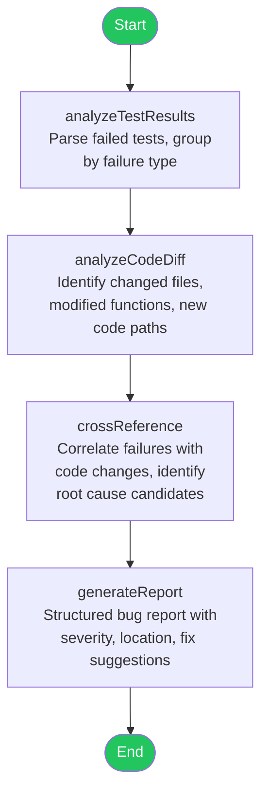
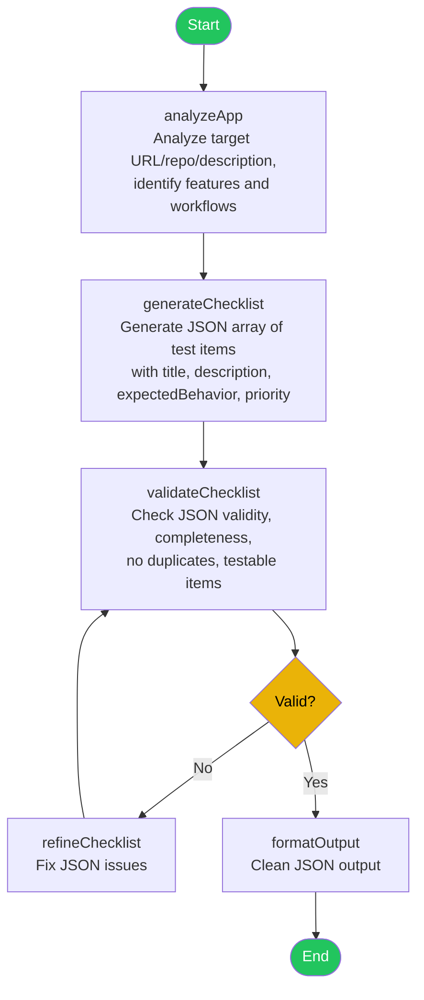
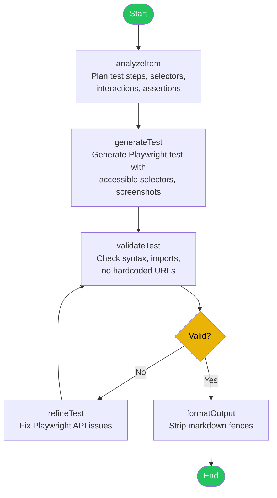
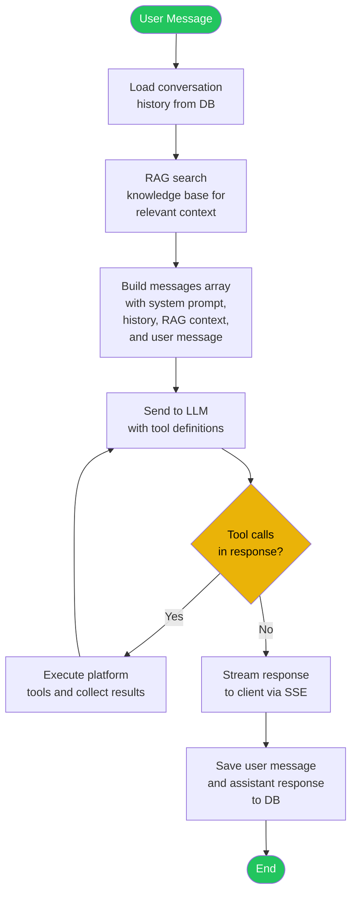
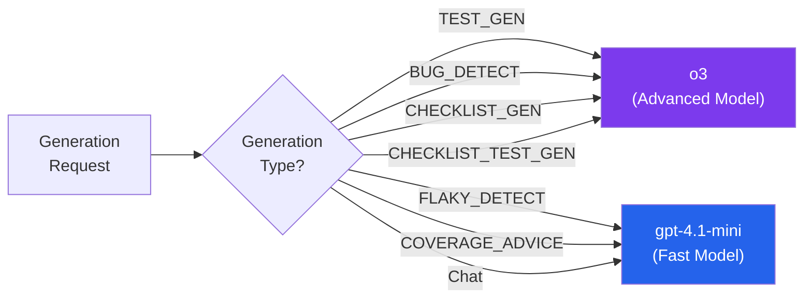
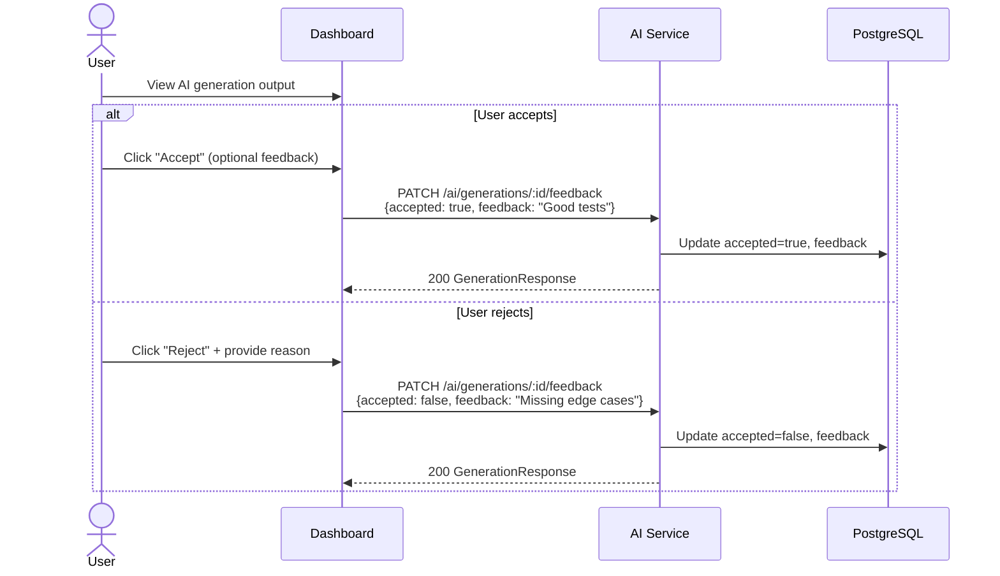

# AI Service

## Overview

| Property | Value |
|---|---|
| **Purpose** | AI-powered test generation, bug detection, flaky test detection, coverage advice, checklist generation, and checklist test generation |
| **Port** | 3005 |
| **Database** | `ai_db` (PostgreSQL, port 5440) |
| **Framework** | NestJS |
| **Gateway Route** | `/api/ai/*` |
| **AI Framework** | LangGraph (LangChain) |
| **Models** | gpt-4.1-mini (fast), o3 (advanced) |

## Prisma Schema

```prisma
enum GenerationType {
  TEST_GEN
  BUG_DETECT
  FLAKY_DETECT
  COVERAGE_ADVICE
  CHECKLIST_GEN
  CHECKLIST_TEST_GEN
}

model AIGeneration {
  id           String         @id @default(uuid())
  projectId    String
  type         GenerationType
  inputContext Json
  output       String         @db.Text
  model        String
  tokensUsed   Int            @default(0)
  accepted     Boolean?
  feedback     String?
  createdAt    DateTime       @default(now())
}

enum ChatMessageRole {
  USER
  ASSISTANT
  SYSTEM
  TOOL
}

model Conversation {
  id        String        @id @default(uuid())
  projectId String
  userId    String
  title     String?
  createdAt DateTime      @default(now())
  updatedAt DateTime      @updatedAt
  messages  ChatMessage[]
}

model ChatMessage {
  id             String          @id @default(uuid())
  conversationId String
  conversation   Conversation    @relation(fields: [conversationId], references: [id], onDelete: Cascade)
  role           ChatMessageRole
  content        String          @db.Text
  toolCalls      Json?
  tokensUsed     Int             @default(0)
  model          String?
  createdAt      DateTime        @default(now())
}

model KnowledgeChunk {
  id        String                    @id @default(uuid())
  projectId String?
  source    String
  title     String?
  content   String                    @db.Text
  embedding Unsupported("vector")?
  tokens    Int                       @default(0)
  createdAt DateTime                  @default(now())
  updatedAt DateTime                  @updatedAt
}
```

## API Endpoints

All endpoints require `Bearer JWT` authentication.

| Method | Path | Auth | Description |
|---|---|---|---|
| `POST` | `/ai/generate` | Bearer JWT | Trigger an AI generation |
| `GET` | `/ai/generations?projectId=<id>&type=<type>` | Bearer JWT | List generations for a project (optionally filtered by type) |
| `GET` | `/ai/generations/stats?projectId=<id>` | Bearer JWT | Get generation statistics for a project |
| `GET` | `/ai/generations/:id` | Bearer JWT | Get generation details |
| `PATCH` | `/ai/generations/:id/feedback` | Bearer JWT | Accept or reject a generation with feedback |
| `POST` | `/ai/chat` | Bearer JWT | Send chat message (SSE stream response) |
| `GET` | `/ai/chat/conversations?projectId=` | Bearer JWT | List conversations |
| `GET` | `/ai/chat/conversations/:id` | Bearer JWT | Get conversation with messages |
| `DELETE` | `/ai/chat/conversations/:id` | Bearer JWT | Delete conversation |
| `POST` | `/ai/knowledge/index` | Bearer JWT | Re-index documentation |
| `GET` | `/ai/knowledge/search?q=&projectId=` | Bearer JWT | Search knowledge base |

## Generation Types

| Type | Description | Typical Model |
|---|---|---|
| `TEST_GEN` | Generate unit/integration tests for source code | o3 (advanced) |
| `BUG_DETECT` | Analyze test results and code diffs to detect bugs | o3 (advanced) |
| `FLAKY_DETECT` | Identify flaky tests through statistical and pattern analysis | gpt-4.1-mini (fast) |
| `COVERAGE_ADVICE` | Analyze coverage data and recommend improvements | gpt-4.1-mini (fast) |
| `CHECKLIST_GEN` | Generate a test checklist from app description or URL | o3 (advanced) |
| `CHECKLIST_TEST_GEN` | Generate Playwright E2E test code from a checklist item | o3 (advanced) |

## LangGraph Agent Architecture

Each generation type is implemented as a LangGraph agent -- a directed graph of processing nodes with conditional edges and an optional refinement loop.

### Test Generator Agent


**Input context**: Source file contents, existing test files, test framework configuration, language/framework.

**Output**: Generated test file(s) with imports, describe blocks, test cases, assertions, and mocks.

**Model routing**: Uses the advanced model (o3) for complex code analysis and test generation logic.

### Bug Detector Agent



**Input context**: Test run results (failed tests), git diff between commits, file contents around failures.

**Output**: Bug report with severity ratings, affected files/lines, root cause analysis, and suggested fixes.

**Model routing**: Uses the advanced model (o3) for deep reasoning about failure causes.

### Flaky Test Detector Agent


**Input context**: Historical test run results (last N runs), test names, durations, pass/fail history.

**Output**: Ranked list of flaky tests with flakiness scores, pattern classifications, and stabilization recommendations.

**Model routing**: Uses the fast model (gpt-4.1-mini) since pattern matching and statistical analysis are less reasoning-intensive.

### Coverage Advisor Agent


**Input context**: Coverage snapshot data (line/branch/function percentages, uncovered file map), source code for uncovered areas.

**Output**: Prioritized list of coverage improvement recommendations with specific test case suggestions.

**Model routing**: Uses the fast model (gpt-4.1-mini) for straightforward coverage analysis.

### Checklist Generator Agent



**Input context**: Target URL, repository URL, app description, known features list.

**Output**: JSON array of checklist items (10-25 items) with title, description, expected behavior, and priority.

**Model routing**: Uses the advanced model (o3) for thorough feature analysis.

### Checklist Test Generator Agent



**Input context**: Checklist item (title, description, expectedBehavior), target URL, framework (playwright).

**Output**: Complete Playwright test file using accessible selectors (`getByRole`, `getByLabel`, `getByText`), with screenshots at key points.

**Model routing**: Uses the advanced model (o3) for accurate selector and assertion generation.

## Chat Agent Architecture

The chat agent provides a conversational interface for interacting with the platform. It supports multi-turn conversations with tool calling, RAG-augmented context, and SSE streaming responses.



**Model routing**: Uses the fast model (gpt-4.1-mini) for low-latency conversational responses.

**Conversation persistence**: Each conversation is stored with its full message history. Conversations are scoped to a project and user, allowing contextual follow-up questions.

**Tool loop**: When the LLM decides to call a tool, the agent executes it and feeds the result back to the LLM. This loop continues until the LLM produces a final text response.

## RAG Knowledge Base

The knowledge base provides retrieval-augmented generation (RAG) by indexing documentation into vector embeddings for semantic search.

### How it works

- Documentation from `docs/en/` and `user_docs/en/` is indexed into `KnowledgeChunk` records
- Text is split into ~500 token chunks with overlap to preserve context at boundaries
- Embeddings are generated via OpenAI `text-embedding-3-small` (1536 dimensions)
- Embeddings are stored as pgvector columns for efficient cosine similarity search
- On user question: embed the query, find top-K similar chunks, inject into the system prompt as context

### Indexing and Query Flow

```mermaid
flowchart TD
    subgraph Indexing["Indexing Pipeline"]
        Docs["Read docs from<br/>docs/en/ and user_docs/en/"] --> Split
        Split["Split into ~500<br/>token chunks"] --> Embed
        Embed["Generate embeddings<br/>via text-embedding-3-small"] --> Store
        Store["Store chunks +<br/>vectors in pgvector"]
    end

    subgraph Query["Query Pipeline"]
        Question["User question"] --> EmbedQuery
        EmbedQuery["Embed query via<br/>text-embedding-3-small"] --> Search
        Search["Cosine similarity<br/>search in pgvector"] --> TopK
        TopK["Return top-K<br/>relevant chunks"] --> Inject
        Inject["Inject chunks into<br/>system prompt as context"]
    end

    style Docs fill:#2563eb,color:#fff
    style Store fill:#2563eb,color:#fff
    style Question fill:#22c55e,color:#fff
    style Inject fill:#22c55e,color:#fff
```



### Configuration

| Parameter | Default | Description |
|---|---|---|
| Chunk size | ~500 tokens | Target size for each text chunk |
| Chunk overlap | ~50 tokens | Overlap between consecutive chunks |
| Embedding model | `text-embedding-3-small` | OpenAI embedding model (1536 dimensions) |
| Top-K | 5 | Number of chunks returned per query |
| Similarity threshold | 0.7 | Minimum cosine similarity score to include |

## Platform Tools

The chat agent has access to platform tools that allow it to query and interact with the testing platform on behalf of the user.

| Tool | Description | Target Service |
|---|---|---|
| `list_projects` | List all projects accessible to the user | Project |
| `list_pipelines` | List pipelines for a given project | Pipeline |
| `trigger_pipeline` | Trigger a new pipeline run | Pipeline |
| `get_run_status` | Get the current status of a test run | Pipeline |
| `list_checklists` | List test checklists for a project | Pipeline |
| `create_checklist` | Create a new test checklist | Pipeline |
| `run_checklist` | Execute a checklist run | Pipeline |
| `get_checklist_run` | Get checklist run status and results | Pipeline |
| `generate_tests` | Trigger AI test generation for source code | AI |
| `search_knowledge` | Search the RAG knowledge base | AI |

Each tool is defined with a JSON Schema describing its parameters. The LLM decides when and how to call tools based on the user's request. Tool results are returned to the LLM for incorporation into the final response.

## Model Routing Strategy

The service uses two OpenAI models with different characteristics:



| Model | Variable | Use Cases | Characteristics |
|---|---|---|---|
| **gpt-4.1-mini** | `OPENAI_MODEL_FAST` | Flaky detection, coverage advice, chat | Low latency, lower cost, sufficient for pattern matching and conversation |
| **o3** | `OPENAI_MODEL_ADVANCED` | Test generation, bug detection, checklist generation, checklist test generation | Deep reasoning, higher accuracy for code generation |

## Feedback Loop

Users can accept or reject AI generations with optional textual feedback. This data is stored alongside the generation record and can be used to improve future generations.


