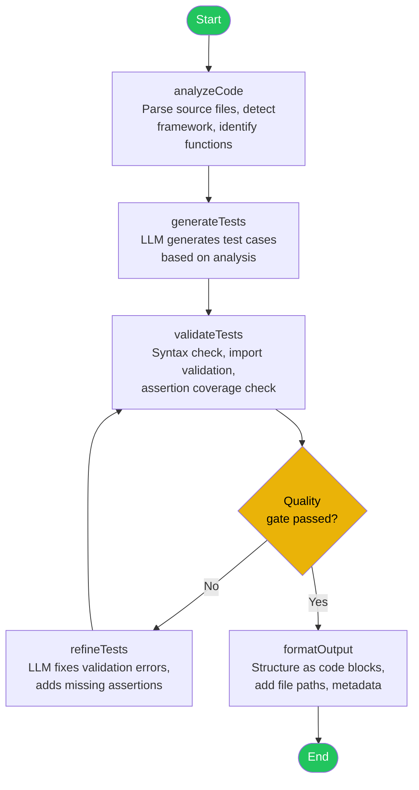
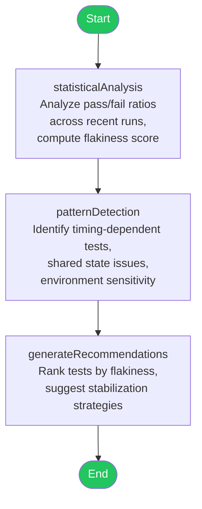
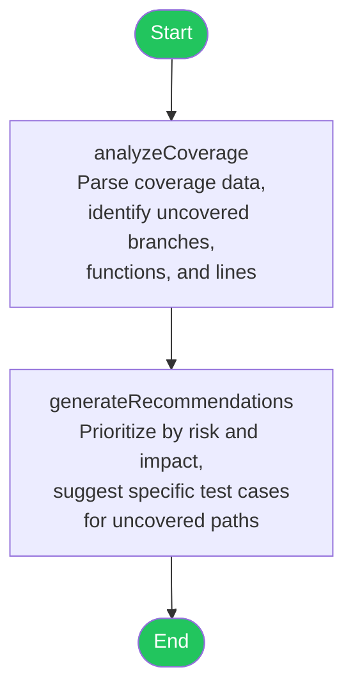
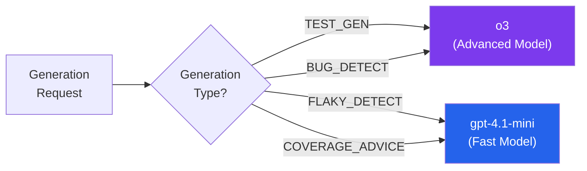
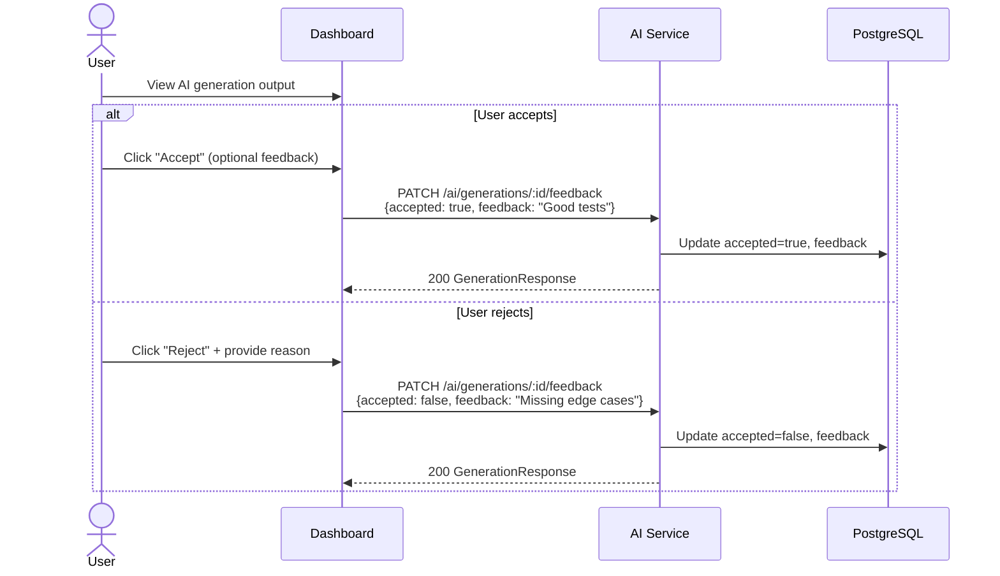

# AI Service

## Overview

| Property | Value |
|---|---|
| **Purpose** | AI-powered test generation, bug detection, flaky test detection, and coverage advice |
| **Port** | 3005 |
| **Database** | `ai_db` (PostgreSQL, port 5440) |
| **Framework** | NestJS |
| **Gateway Route** | `/api/ai/*` |
| **AI Framework** | LangGraph (LangChain) |
| **Models** | gpt-4.1-mini (fast), o3 (advanced) |

## Prisma Schema

```prisma
enum GenerationType {
  TEST_GEN
  BUG_DETECT
  FLAKY_DETECT
  COVERAGE_ADVICE
}

model AIGeneration {
  id           String         @id @default(uuid())
  projectId    String
  type         GenerationType
  inputContext Json
  output       String         @db.Text
  model        String
  tokensUsed   Int            @default(0)
  accepted     Boolean?
  feedback     String?
  createdAt    DateTime       @default(now())
}
```

## API Endpoints

All endpoints require `Bearer JWT` authentication.

| Method | Path | Auth | Description |
|---|---|---|---|
| `POST` | `/ai/generate` | Bearer JWT | Trigger an AI generation |
| `GET` | `/ai/generations?projectId=<id>&type=<type>` | Bearer JWT | List generations for a project (optionally filtered by type) |
| `GET` | `/ai/generations/stats?projectId=<id>` | Bearer JWT | Get generation statistics for a project |
| `GET` | `/ai/generations/:id` | Bearer JWT | Get generation details |
| `PATCH` | `/ai/generations/:id/feedback` | Bearer JWT | Accept or reject a generation with feedback |

## Generation Types

| Type | Description | Typical Model |
|---|---|---|
| `TEST_GEN` | Generate unit/integration tests for source code | o3 (advanced) |
| `BUG_DETECT` | Analyze test results and code diffs to detect bugs | o3 (advanced) |
| `FLAKY_DETECT` | Identify flaky tests through statistical and pattern analysis | gpt-4.1-mini (fast) |
| `COVERAGE_ADVICE` | Analyze coverage data and recommend improvements | gpt-4.1-mini (fast) |

## LangGraph Agent Architecture

Each generation type is implemented as a LangGraph agent -- a directed graph of processing nodes with conditional edges and an optional refinement loop.

### Test Generator Agent



**Input context**: Source file contents, existing test files, test framework configuration, language/framework.

**Output**: Generated test file(s) with imports, describe blocks, test cases, assertions, and mocks.

**Model routing**: Uses the advanced model (o3) for complex code analysis and test generation logic.

### Bug Detector Agent


**Input context**: Test run results (failed tests), git diff between commits, file contents around failures.

**Output**: Bug report with severity ratings, affected files/lines, root cause analysis, and suggested fixes.

**Model routing**: Uses the advanced model (o3) for deep reasoning about failure causes.

### Flaky Test Detector Agent



**Input context**: Historical test run results (last N runs), test names, durations, pass/fail history.

**Output**: Ranked list of flaky tests with flakiness scores, pattern classifications, and stabilization recommendations.

**Model routing**: Uses the fast model (gpt-4.1-mini) since pattern matching and statistical analysis are less reasoning-intensive.

### Coverage Advisor Agent



**Input context**: Coverage snapshot data (line/branch/function percentages, uncovered file map), source code for uncovered areas.

**Output**: Prioritized list of coverage improvement recommendations with specific test case suggestions.

**Model routing**: Uses the fast model (gpt-4.1-mini) for straightforward coverage analysis.

## Model Routing Strategy

The service uses two OpenAI models with different characteristics:



| Model | Variable | Use Cases | Characteristics |
|---|---|---|---|
| **gpt-4.1-mini** | `OPENAI_MODEL_FAST` | Flaky detection, coverage advice | Low latency, lower cost, sufficient for pattern matching |
| **o3** | `OPENAI_MODEL_ADVANCED` | Test generation, bug detection | Deep reasoning, higher accuracy for code generation |

## Feedback Loop

Users can accept or reject AI generations with optional textual feedback. This data is stored alongside the generation record and can be used to improve future generations.


