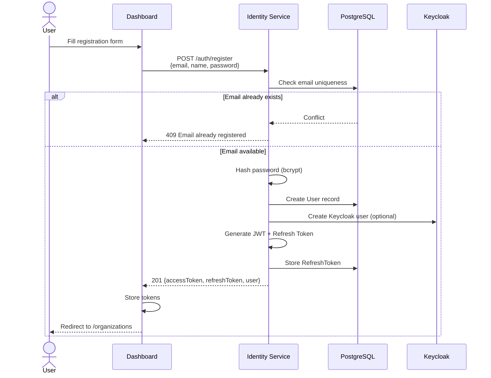
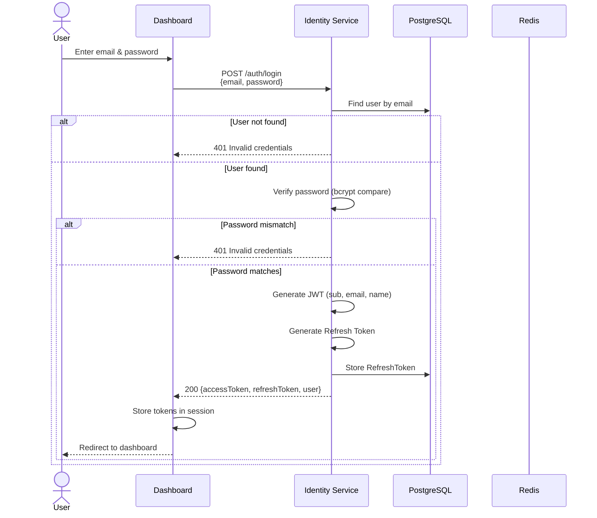
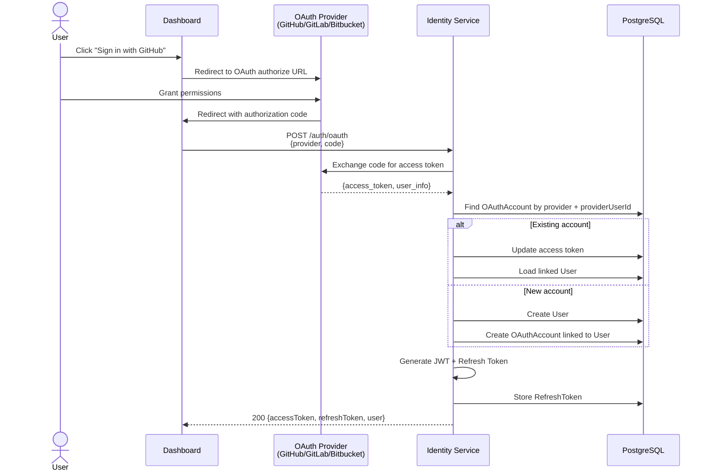
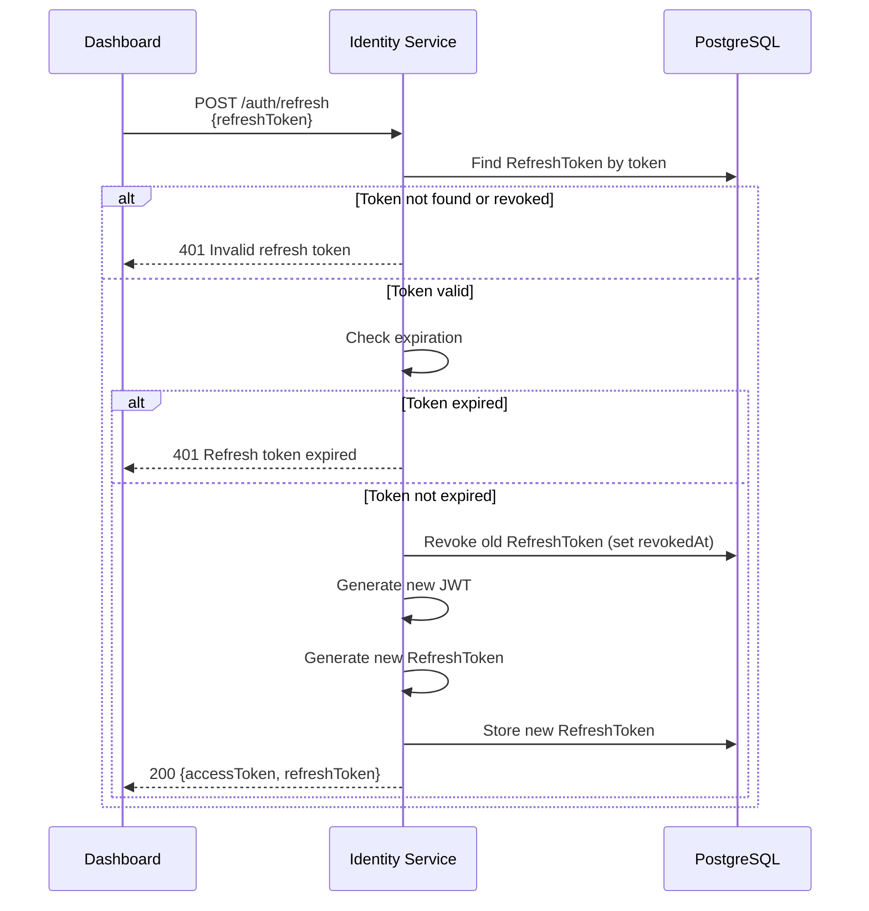

# Identity Service

## Overview

| Property | Value |
|---|---|
| **Purpose** | User authentication, registration, OAuth, and JWT token management |
| **Port** | 3001 |
| **Database** | `identity_db` (PostgreSQL, port 5441) |
| **Framework** | NestJS |
| **Gateway Route** | `/api/identity/*` |

## Prisma Schema

```prisma
enum OAuthProvider {
  GITHUB
  GITLAB
  BITBUCKET
}

model User {
  id           String    @id @default(cuid())
  createdAt    DateTime  @default(now())
  updatedAt    DateTime  @updatedAt
  deletedAt    DateTime?

  email        String    @unique
  name         String
  passwordHash String?
  avatarUrl    String?
  keycloakId   String?   @unique

  oauthAccounts OAuthAccount[]
  refreshTokens RefreshToken[]
}

model OAuthAccount {
  id             String        @id @default(cuid())
  createdAt      DateTime      @default(now())
  updatedAt      DateTime      @updatedAt
  deletedAt      DateTime?

  provider       OAuthProvider
  providerUserId String
  accessToken    String
  refreshToken   String?
  expiresAt      DateTime?

  userId         String
  user           User          @relation(fields: [userId], references: [id])

  @@unique([provider, providerUserId])
}

model RefreshToken {
  id        String    @id @default(cuid())
  createdAt DateTime  @default(now())

  token     String    @unique
  expiresAt DateTime
  revokedAt DateTime?

  userId    String
}
```

## API Endpoints

| Method | Path | Auth | Description |
|---|---|---|---|
| `POST` | `/auth/register` | Public | Register a new user |
| `POST` | `/auth/login` | Public | Login with email and password |
| `POST` | `/auth/refresh` | Public | Refresh access token using refresh token |
| `POST` | `/auth/logout` | Bearer JWT | Logout and revoke refresh token |
| `GET` | `/auth/me` | Bearer JWT | Get current authenticated user profile |

## Authentication Flows

### Registration Flow



### Login Flow



### OAuth Flow (GitHub / GitLab / Bitbucket)



### Token Refresh Flow



## JWT Token Structure

The access token is a signed JWT with the following payload:

```json
{
  "sub": "cuid_user_id",
  "email": "user@example.com",
  "name": "User Name",
  "iat": 1700000000,
  "exp": 1700003600
}
```

| Claim | Description |
|---|---|
| `sub` | User ID (CUID) |
| `email` | User email address |
| `name` | User display name |
| `iat` | Issued-at timestamp |
| `exp` | Expiration timestamp (default: 1 hour after issuance) |

## Guards and Decorators

### `JwtAuthGuard`

A NestJS guard that validates the `Authorization: Bearer <token>` header. Applied globally to all routes unless overridden by `@Public()`.

### `@Public()`

Decorator that marks a route as publicly accessible, bypassing JWT authentication. Used on `/auth/register`, `/auth/login`, and `/auth/refresh`.

### `@CurrentUser()`

Parameter decorator that extracts the JWT payload from the request. Returns a `JwtPayload` object with `sub`, `email`, and `name` fields.

```typescript
@Get('me')
@UseGuards(JwtAuthGuard)
async me(@CurrentUser() user: JwtPayload): Promise<UserResponseDto> {
  const found = await this.userService.findById(user.sub);
  return UserResponseDto.fromEntity(found);
}
```
