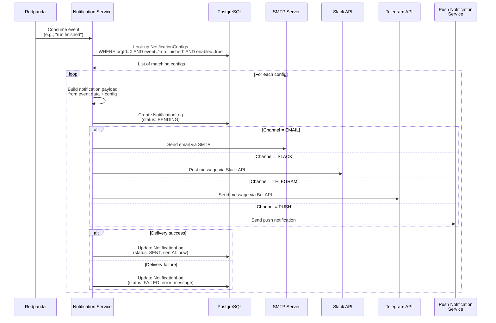

# Notification Service

## Overview

| Property | Value |
|---|---|
| **Purpose** | Multi-channel notification dispatch and configuration management |
| **Port** | 3006 |
| **Database** | `notify_db` (PostgreSQL, port 5439) |
| **Framework** | NestJS |
| **Gateway Route** | `/api/notifications/*` |

## Prisma Schema

```prisma
enum NotificationChannel {
  EMAIL
  SLACK
  TELEGRAM
  PUSH
}

enum NotificationStatus {
  PENDING
  SENT
  FAILED
}

model NotificationConfig {
  id        String              @id @default(uuid())
  orgId     String
  channel   NotificationChannel
  event     String              // e.g. "run.finished", "membership.requested"
  config    Json                @default("{}")
  enabled   Boolean             @default(true)
  createdAt DateTime            @default(now())
  updatedAt DateTime            @updatedAt
  logs      NotificationLog[]

  @@unique([orgId, channel, event])
}

model NotificationLog {
  id        String             @id @default(uuid())
  configId  String
  payload   Json
  status    NotificationStatus @default(PENDING)
  error     String?
  sentAt    DateTime?
  createdAt DateTime           @default(now())
  config    NotificationConfig @relation(fields: [configId], references: [id])
}
```

## API Endpoints

All endpoints require `Bearer JWT` authentication.

| Method | Path | Auth | Description |
|---|---|---|---|
| `POST` | `/notifications/configs` | Bearer JWT | Create notification config |
| `GET` | `/notifications/configs?orgId=<id>` | Bearer JWT | List notification configs by organization |
| `GET` | `/notifications/configs/:id` | Bearer JWT | Get notification config by ID |
| `PATCH` | `/notifications/configs/:id` | Bearer JWT | Update notification config |
| `DELETE` | `/notifications/configs/:id` | Bearer JWT | Delete notification config |

## Notification Flow



## Supported Events

| Event | Producer | Description |
|---|---|---|
| `run.started` | Pipeline Service | A test run has begun |
| `run.finished` | Pipeline Service | A test run has completed |
| `membership.requested` | Organization Service | A user was invited/requested membership |
| `membership.approved` | Organization Service | A membership was approved |
| `membership.rejected` | Organization Service | A membership was rejected |
| `generation.completed` | AI Service | An AI generation has completed |
| `pipeline.trigger` | Project Service | A pipeline was triggered (webhook) |

## Channel Configuration Examples

### Email

```json
{
  "orgId": "org_abc123",
  "channel": "EMAIL",
  "event": "run.finished",
  "enabled": true,
  "config": {
    "recipients": ["dev-team@example.com", "qa-lead@example.com"],
    "subjectTemplate": "[{{projectName}}] Test run {{status}} on {{branch}}",
    "onlyOnFailure": true
  }
}
```

Required environment variables: `SMTP_HOST`, `SMTP_PORT`, `SMTP_USER`, `SMTP_PASS`

### Slack

```json
{
  "orgId": "org_abc123",
  "channel": "SLACK",
  "event": "run.finished",
  "enabled": true,
  "config": {
    "channelId": "C01ABCDEF",
    "mentionOnFailure": ["U01GHIJKL", "U01MNOPQR"],
    "includeDetails": true
  }
}
```

Required environment variables: `SLACK_BOT_TOKEN`

### Telegram

```json
{
  "orgId": "org_abc123",
  "channel": "TELEGRAM",
  "event": "run.finished",
  "enabled": true,
  "config": {
    "chatId": "-1001234567890",
    "parseMode": "Markdown",
    "onlyOnFailure": false
  }
}
```

Required environment variables: `TELEGRAM_BOT_TOKEN`

### Push Notification

```json
{
  "orgId": "org_abc123",
  "channel": "PUSH",
  "event": "run.finished",
  "enabled": true,
  "config": {
    "userIds": ["user_abc", "user_def"],
    "priority": "high",
    "onlyOnFailure": true
  }
}
```

Push notifications are delivered to registered mobile devices via Expo Push Notification service.

## Notification Log

Every notification delivery attempt is logged in the `NotificationLog` table for auditability:

| Field | Description |
|---|---|
| `configId` | Reference to the NotificationConfig that triggered this log |
| `payload` | Full payload sent to the channel |
| `status` | `PENDING`, `SENT`, or `FAILED` |
| `error` | Error message if delivery failed |
| `sentAt` | Timestamp of successful delivery |
| `createdAt` | Timestamp of log creation |
