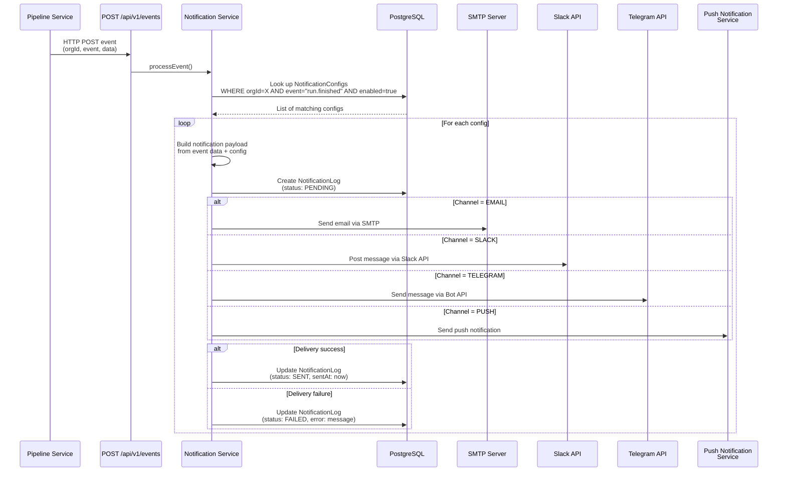

# Notification Service

## Overview

| Property | Value |
|---|---|
| **Purpose** | Multi-channel notification dispatch and configuration management |
| **Port** | 3006 |
| **Database** | `notify_db` (PostgreSQL, port 5439) |
| **Framework** | NestJS |
| **Gateway Route** | `/api/notifications/*` |

## Prisma Schema

```prisma
enum NotificationChannel {
  EMAIL
  SLACK
  TELEGRAM
  PUSH
}

enum NotificationStatus {
  PENDING
  SENT
  FAILED
}

model NotificationConfig {
  id        String              @id @default(uuid())
  orgId     String
  channel   NotificationChannel
  event     String              // e.g. "run.finished", "membership.requested"
  config    Json                @default("{}")
  enabled   Boolean             @default(true)
  createdAt DateTime            @default(now())
  updatedAt DateTime            @updatedAt
  logs      NotificationLog[]

  @@unique([orgId, channel, event])
}

model NotificationLog {
  id        String             @id @default(uuid())
  configId  String
  payload   Json
  status    NotificationStatus @default(PENDING)
  error     String?
  sentAt    DateTime?
  createdAt DateTime           @default(now())
  config    NotificationConfig @relation(fields: [configId], references: [id])
}
```

## API Endpoints

### Public endpoints (JWT required)

| Method | Path | Auth | Description |
|---|---|---|---|
| `POST` | `/notifications/configs` | Bearer JWT | Create notification config |
| `GET` | `/notifications/configs?orgId=<id>` | Bearer JWT | List notification configs by organization |
| `GET` | `/notifications/configs/:id` | Bearer JWT | Get notification config by ID |
| `PATCH` | `/notifications/configs/:id` | Bearer JWT | Update notification config |
| `DELETE` | `/notifications/configs/:id` | Bearer JWT | Delete notification config |
| `POST` | `/notifications/configs/:id/test` | Bearer JWT | Send a test notification through this config |

### Internal endpoints (no auth, `@Public()`)

| Method | Path | Auth | Description |
|---|---|---|---|
| `POST` | `/api/v1/events` | None | Receive events from other services |

#### `POST /api/v1/events`

Used by other services (e.g., Pipeline) to trigger notifications. This endpoint replaces the previous in-process `EventEmitter` approach, which did not work across separate NestJS processes.

**Request body:**

```json
{
  "orgId": "org-uuid",
  "event": "run.finished",
  "data": {
    "runId": "run-uuid",
    "runName": "Smoke tests",
    "passed": 42,
    "failed": 3,
    "total": 45,
    "duration": "2m 15s"
  }
}
```

**Response:** `{ "received": true }`

The endpoint calls `SenderService.processEvent()` which looks up all enabled `NotificationConfig` records matching the `orgId` and `event`, then dispatches through the appropriate channel sender.

#### `POST /notifications/configs/:id/test`

Sends a test notification through a specific config only. Uses `SenderService.sendToConfig()` to dispatch a sample payload to a single config without affecting other configs.

## Inter-Service Integration

### Pipeline → Notification

When a test run completes (`TestRunService.complete()`), the Pipeline service sends an HTTP POST to the Notification service:

```
POST http://localhost:3006/api/v1/events
{
  "orgId": "<resolved via project service>",
  "event": "run.finished" | "run.failed",
  "data": { runId, runName, passed, failed, total, ... }
}
```

The Pipeline service resolves the `orgId` by fetching the project from the Project service (since runs are linked to projects, and projects belong to organizations).

**Environment variable in Pipeline service:**
```env
NOTIFICATION_SERVICE_URL=http://localhost:3006
```

## Notification Flow



## Supported Events

| Event | Producer | Description |
|---|---|---|
| `run.finished` | Pipeline Service | A test run has completed |
| `run.failed` | Pipeline Service | A test run has failed |
| `membership.requested` | Organization Service | A user was invited/requested membership |
| `membership.approved` | Organization Service | A membership was approved |
| `membership.rejected` | Organization Service | A membership was rejected |
| `generation.completed` | AI Service | An AI generation has completed |
| `pipeline.trigger` | Project Service | A pipeline was triggered (webhook) |

## Channel Configuration Examples

### Email

```json
{
  "orgId": "org_abc123",
  "channel": "EMAIL",
  "event": "run.finished",
  "enabled": true,
  "config": {
    "emails": ["dev-team@example.com", "qa-lead@example.com"]
  }
}
```

Required environment variables: `SMTP_HOST`, `SMTP_PORT`, `SMTP_USER`, `SMTP_PASS`

### Slack

```json
{
  "orgId": "org_abc123",
  "channel": "SLACK",
  "event": "run.finished",
  "enabled": true,
  "config": {
    "slackChannel": "#ci-results"
  }
}
```

Required environment variables: `SLACK_BOT_TOKEN` (OAuth bot token with `chat:write` scope)

### Telegram

```json
{
  "orgId": "org_abc123",
  "channel": "TELEGRAM",
  "event": "run.finished",
  "enabled": true,
  "config": {
    "chatId": "-1001234567890"
  }
}
```

Required environment variables: `TELEGRAM_BOT_TOKEN`

### Push Notification

```json
{
  "orgId": "org_abc123",
  "channel": "PUSH",
  "event": "run.finished",
  "enabled": true,
  "config": {
    "userIds": ["user_abc", "user_def"],
    "priority": "high",
    "onlyOnFailure": true
  }
}
```

Push notifications are delivered to registered mobile devices via Expo Push Notification service.

## Key Classes

| Class | Purpose |
|---|---|
| `ConfigController` | CRUD for notification configs + test endpoint |
| `EventsController` | Internal `@Public()` endpoint for receiving events from other services |
| `SenderService` | Dispatches notifications; `processEvent()` for multi-config, `sendToConfig()` for single config |
| `EmailSender` | Sends via SMTP (Nodemailer) |
| `SlackSender` | Posts to Slack channels (reads `slackChannel` from config) |
| `TelegramSender` | Sends via Telegram Bot API (reads `chatId` from config) |

## Notification Log

Every notification delivery attempt is logged in the `NotificationLog` table for auditability:

| Field | Description |
|---|---|
| `configId` | Reference to the NotificationConfig that triggered this log |
| `payload` | Full payload sent to the channel |
| `status` | `PENDING`, `SENT`, or `FAILED` |
| `error` | Error message if delivery failed |
| `sentAt` | Timestamp of successful delivery |
| `createdAt` | Timestamp of log creation |
