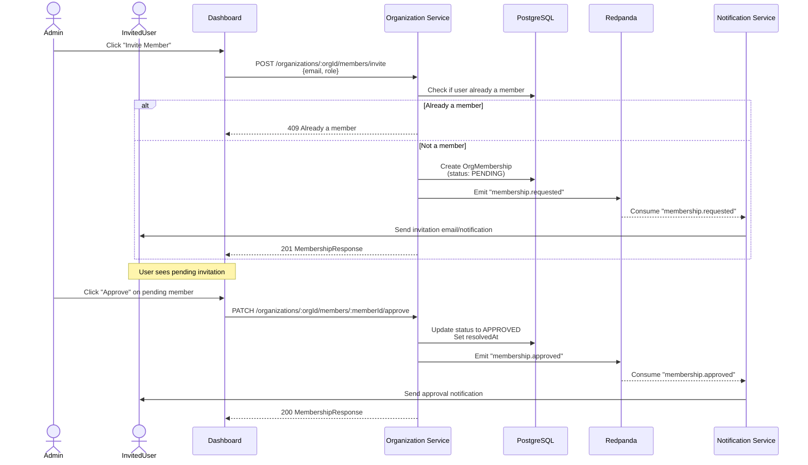
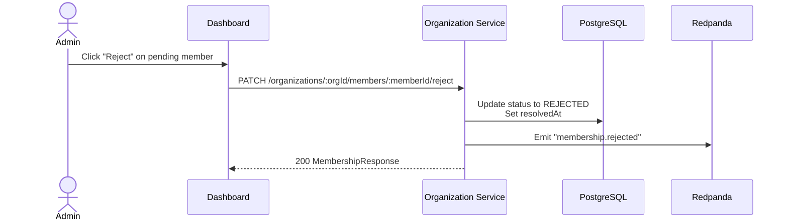
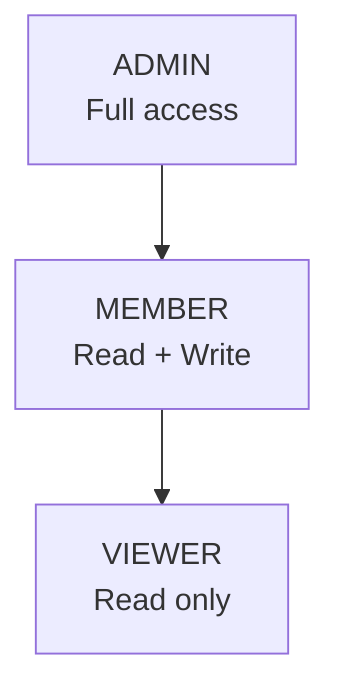
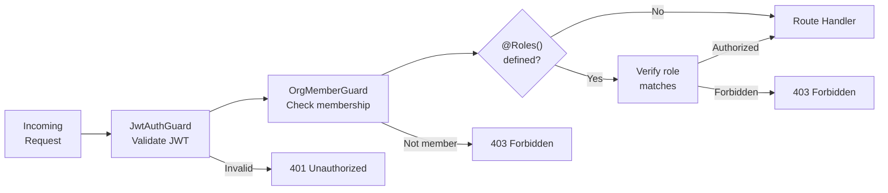

# Organization Service

## Overview

| Property | Value |
|---|---|
| **Purpose** | Organization management, membership invitations, and role-based access control |
| **Port** | 3002 |
| **Database** | `org_db` (PostgreSQL, port 5434) |
| **Framework** | NestJS |
| **Gateway Route** | `/api/org/*` |

## Prisma Schema

```prisma
enum OrgPlan {
  FREE
  PRO
  ENTERPRISE
}

enum OrgMemberRole {
  ADMIN
  MEMBER
  VIEWER
}

enum OrgMemberStatus {
  PENDING
  APPROVED
  REJECTED
}

model Organization {
  id        String   @id @default(cuid())
  createdAt DateTime @default(now())
  updatedAt DateTime @updatedAt
  deletedAt DateTime?

  name String
  slug String @unique
  plan OrgPlan @default(FREE)

  memberships OrgMembership[]
}

model OrgMembership {
  id          String          @id @default(cuid())
  createdAt   DateTime        @default(now())
  updatedAt   DateTime        @updatedAt
  deletedAt   DateTime?

  userId      String
  role        OrgMemberRole   @default(MEMBER)
  status      OrgMemberStatus @default(PENDING)
  requestedAt DateTime        @default(now())
  resolvedAt  DateTime?

  orgId        String
  organization Organization @relation(fields: [orgId], references: [id])

  @@unique([userId, orgId])
}
```

## API Endpoints

All endpoints require `Bearer JWT` authentication. The membership endpoints are scoped under an organization and additionally require OrgMemberGuard validation.

| Method | Path | Auth | Role Required | Description |
|---|---|---|---|---|
| `POST` | `/organizations/:orgId/members/invite` | Bearer JWT | ADMIN | Invite a member to the organization |
| `GET` | `/organizations/:orgId/members` | Bearer JWT | Any member | List organization members |
| `PATCH` | `/organizations/:orgId/members/:memberId/approve` | Bearer JWT | ADMIN | Approve a pending membership |
| `PATCH` | `/organizations/:orgId/members/:memberId/reject` | Bearer JWT | ADMIN | Reject a pending membership |
| `PATCH` | `/organizations/:orgId/members/:memberId/role` | Bearer JWT | ADMIN | Change a member's role |
| `DELETE` | `/organizations/:orgId/members/:memberId` | Bearer JWT | ADMIN | Remove a member from the organization |

## Membership Invitation Flow



## Membership Rejection Flow



## Role-Based Access Control

### Role Hierarchy



### Role Permissions

| Action | ADMIN | MEMBER | VIEWER |
|---|---|---|---|
| View organization details | Yes | Yes | Yes |
| List members | Yes | Yes | Yes |
| Create projects | Yes | Yes | No |
| Invite members | Yes | No | No |
| Approve/reject memberships | Yes | No | No |
| Change member roles | Yes | No | No |
| Remove members | Yes | No | No |
| Update organization settings | Yes | No | No |
| Delete organization | Yes | No | No |

## OrgMemberGuard

The `OrgMemberGuard` is a NestJS guard that performs two checks:

1. **Membership verification**: Confirms the authenticated user is a member of the organization specified by the `:orgId` route parameter and their membership status is `APPROVED`.

2. **Role authorization**: If the `@Roles()` decorator is present on the handler, it verifies the member's role matches one of the required roles.

```typescript
@Controller('organizations/:orgId/members')
@UseGuards(JwtAuthGuard, OrgMemberGuard)
export class MembershipController {

  @Post('invite')
  @Roles('ADMIN')  // Only ADMIN can invite
  async invite(...) { ... }

  @Get()
  // No @Roles() -- any approved member can list
  async findAll(...) { ... }
}
```

### Guard Execution Order


