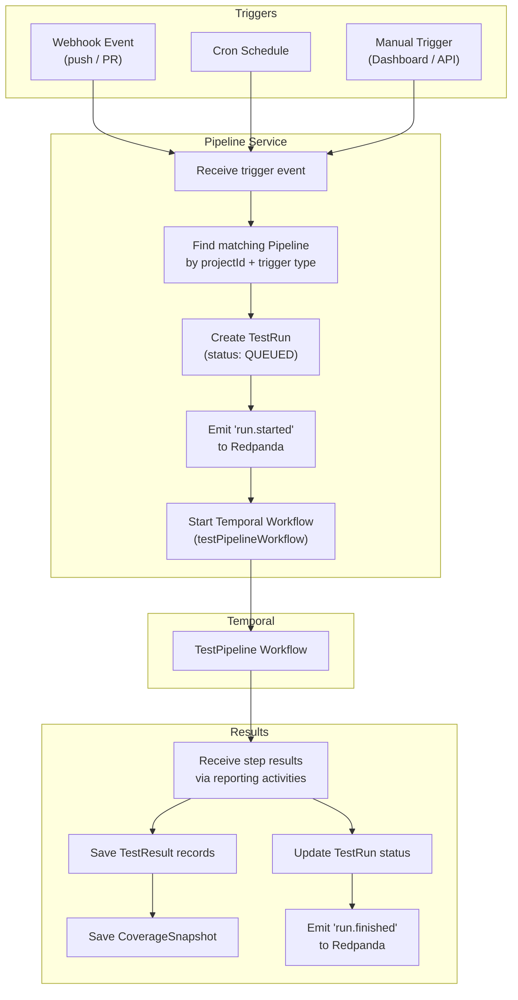
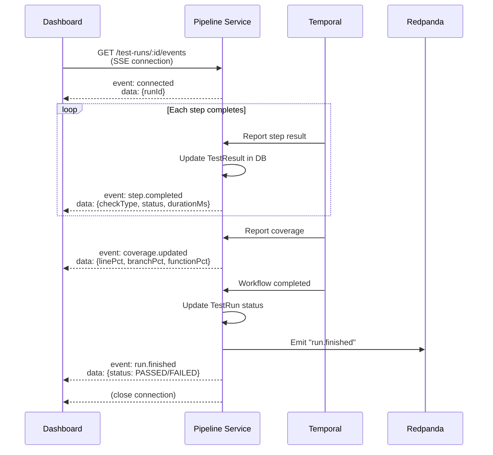
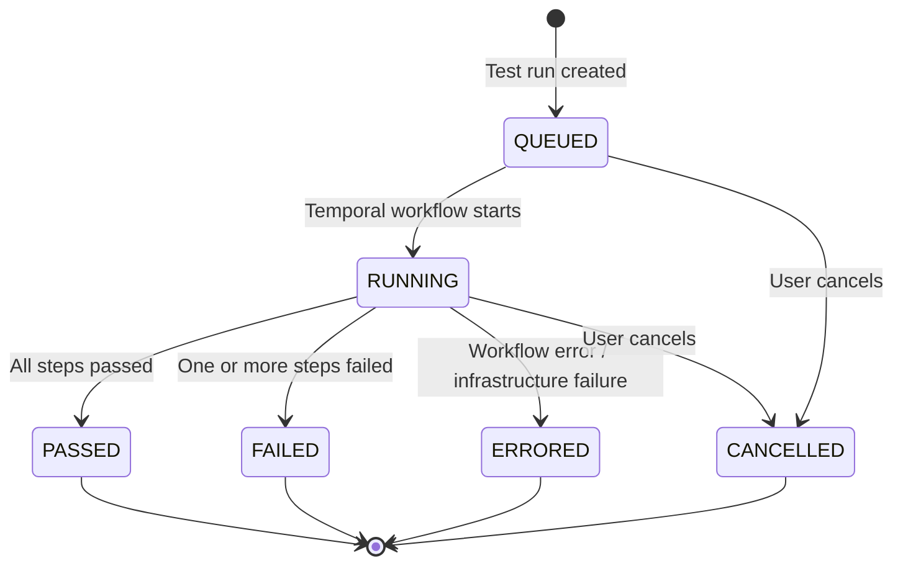

# Pipeline Service

## Overview

| Property | Value |
|---|---|
| **Purpose** | Pipeline configuration, test run management, result tracking, coverage snapshots |
| **Port** | 3004 |
| **Database** | `pipeline_db` (PostgreSQL, port 5438) |
| **Framework** | NestJS |
| **Gateway Route** | `/api/pipeline/*` |

## Prisma Schema

```prisma
enum PipelineTrigger {
  PUSH
  PULL_REQUEST
  SCHEDULE
  MANUAL
}

enum TestRunStatus {
  QUEUED
  RUNNING
  PASSED
  FAILED
  ERRORED
  CANCELLED
}

enum TestCheckType {
  UNIT
  INTEGRATION
  E2E
  LOAD
  LINT
  SAST
  DAST
  DEPENDENCY_AUDIT
  AI_REVIEW
}

enum TestStatus {
  PENDING
  RUNNING
  PASSED
  FAILED
  SKIPPED
  CANCELLED
}

model Pipeline {
  id        String          @id @default(uuid())
  projectId String
  name      String
  trigger   PipelineTrigger
  cronExpr  String?
  steps     Json            @default("[]")
  enabled   Boolean         @default(true)
  createdAt DateTime        @default(now())
  updatedAt DateTime        @updatedAt
  runs      TestRun[]
}

model TestRun {
  id          String        @id @default(uuid())
  pipelineId  String
  commitSha   String
  branch      String
  status      TestRunStatus @default(QUEUED)
  startedAt   DateTime?
  finishedAt  DateTime?
  triggeredBy String?
  metadata    Json          @default("{}")
  createdAt   DateTime      @default(now())
  pipeline    Pipeline      @relation(fields: [pipelineId], references: [id])
  results     TestResult[]
}

model TestResult {
  id          String        @id @default(uuid())
  runId       String
  checkType   TestCheckType
  status      TestStatus    @default(PENDING)
  summary     String        @default("")
  details     Json          @default("{}")
  artifactUrl String?
  durationMs  Int           @default(0)
  createdAt   DateTime      @default(now())
  run         TestRun       @relation(fields: [runId], references: [id])
  coverage    CoverageSnapshot?
}

model CoverageSnapshot {
  id          String     @id @default(uuid())
  resultId    String     @unique
  linePct     Float
  branchPct   Float
  functionPct Float
  uncovered   Json       @default("{}")
  result      TestResult @relation(fields: [resultId], references: [id])
}
```

## API Endpoints

### Pipeline Endpoints

All endpoints require `Bearer JWT` authentication.

| Method | Path | Auth | Description |
|---|---|---|---|
| `POST` | `/pipelines` | Bearer JWT | Create a new pipeline |
| `GET` | `/pipelines?projectId=<id>` | Bearer JWT | List pipelines (optionally by project) |
| `GET` | `/pipelines/:id` | Bearer JWT | Get pipeline by ID (includes run count) |
| `PATCH` | `/pipelines/:id` | Bearer JWT | Update pipeline configuration |
| `DELETE` | `/pipelines/:id` | Bearer JWT | Delete a pipeline |
| `POST` | `/pipelines/:id/toggle` | Bearer JWT | Toggle pipeline enabled/disabled |

### Test Run Endpoints

| Method | Path | Auth | Description |
|---|---|---|---|
| `POST` | `/test-runs` | Bearer JWT | Create and trigger a new test run |
| `GET` | `/test-runs?pipelineId=<id>` | Bearer JWT | List test runs for a pipeline |
| `GET` | `/test-runs/:id` | Bearer JWT | Get test run with results |
| `POST` | `/test-runs/:id/cancel` | Bearer JWT | Cancel a running test run |

## Pipeline Trigger Flow



## SSE Real-Time Updates

The Pipeline Service provides Server-Sent Events (SSE) for real-time test run progress monitoring.



## TestRun State Machine



### Status Descriptions

| Status | Description |
|---|---|
| `QUEUED` | Test run created, waiting for Temporal worker to pick it up |
| `RUNNING` | Temporal workflow is actively executing steps |
| `PASSED` | All configured steps completed successfully |
| `FAILED` | One or more steps reported a failure |
| `ERRORED` | Unexpected workflow or infrastructure error |
| `CANCELLED` | User or system cancelled the run before completion |

## Pipeline Configuration (steps JSON)

The `steps` field on the Pipeline model is a JSON array defining which checks to run and in what order:

```json
[
  { "checkType": "lint", "order": 1, "config": {} },
  { "checkType": "unit", "order": 2, "config": { "coverage": true } },
  { "checkType": "sast", "order": 3, "config": {} },
  { "checkType": "dep_audit", "order": 4, "config": {} },
  { "checkType": "e2e", "order": 5, "config": { "browser": "chromium" } },
  { "checkType": "load", "order": 6, "config": { "vus": 50, "duration": "5m" } }
]
```

### Available Check Types

| Check Type | Category | Description |
|---|---|---|
| `unit` | Testing | Unit tests (Jest, Vitest, etc.) |
| `e2e` | Testing | End-to-end tests (Cypress, Playwright) |
| `playwright_e2e` | Testing | Playwright-specific E2E tests |
| `load` | Performance | Load tests (generic) |
| `k6_load` | Performance | k6-based load tests |
| `lint` | Quality | Linting (ESLint, etc.) |
| `sast` | Security | Static Application Security Testing |
| `dast` | Security | Dynamic Application Security Testing |
| `dep_audit` | Security | Dependency vulnerability audit |
