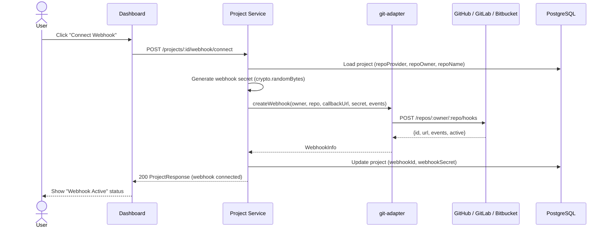
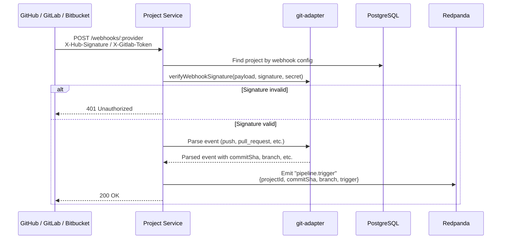

# Project Service

## Overview

| Property | Value |
|---|---|
| **Purpose** | Project management, git repository integration, webhook lifecycle |
| **Port** | 3003 |
| **Database** | `project_db` (PostgreSQL, port 5437) |
| **Framework** | NestJS |
| **Gateway Route** | `/api/project/*` |

## Prisma Schema

```prisma
enum RepoProvider {
  GITHUB
  GITLAB
  BITBUCKET
}

model Project {
  id            String       @id @default(uuid())
  orgId         String
  name          String
  repoUrl       String
  repoProvider  RepoProvider
  repoOwner     String
  repoName      String
  defaultBranch String       @default("main")
  webhookId     String?
  webhookSecret String?
  settings      Json         @default("{}")
  createdAt     DateTime     @default(now())
  updatedAt     DateTime     @updatedAt
  deletedAt     DateTime?

  @@unique([orgId, repoUrl])
}
```

## API Endpoints

All endpoints require `Bearer JWT` authentication.

| Method | Path | Auth | Description |
|---|---|---|---|
| `POST` | `/projects` | Bearer JWT | Create a new project |
| `GET` | `/projects?orgId=<orgId>` | Bearer JWT | List projects by organization |
| `GET` | `/projects/:id` | Bearer JWT | Get project by ID |
| `PATCH` | `/projects/:id` | Bearer JWT | Update a project |
| `DELETE` | `/projects/:id` | Bearer JWT | Soft delete a project |
| `POST` | `/projects/:id/webhook/connect` | Bearer JWT | Connect webhook for a project |
| `DELETE` | `/projects/:id/webhook/disconnect` | Bearer JWT | Disconnect webhook for a project |

## Webhook Setup Flow



## Webhook Event Processing Flow



## git-adapter Package

The `@testing-ai/git-adapter` package provides a unified interface for interacting with multiple git hosting providers. It abstracts away the differences between GitHub, GitLab, and Bitbucket APIs behind a common `GitProvider` interface.

### GitProvider Interface

```typescript
export interface GitProvider {
  getRepository(owner: string, repo: string): Promise<RepoInfo>;
  getBranches(owner: string, repo: string): Promise<Branch[]>;
  getCommit(owner: string, repo: string, sha: string): Promise<CommitInfo>;
  getDiff(owner: string, repo: string, base: string, head: string): Promise<string>;
  getFileContent(owner: string, repo: string, path: string, ref?: string): Promise<string>;
  createWebhook(owner: string, repo: string, url: string, secret: string, events: string[]): Promise<WebhookInfo>;
  deleteWebhook(owner: string, repo: string, webhookId: string): Promise<void>;
  verifyWebhookSignature(payload: string, signature: string, secret: string): boolean;
  listPullRequests(owner: string, repo: string, state?: 'open' | 'closed' | 'all'): Promise<PullRequest[]>;
  createCommitStatus(owner: string, repo: string, sha: string, status: CommitStatusInput): Promise<void>;
}
```

### Provider Comparison

| Feature | GitHub | GitLab | Bitbucket |
|---|---|---|---|
| **API Base URL** | `api.github.com` | `gitlab.com/api/v4` | `api.bitbucket.org/2.0` |
| **Webhook Signature** | HMAC-SHA256 (`X-Hub-Signature-256`) | Secret token (`X-Gitlab-Token`) | HMAC-SHA256 (`X-Hub-Signature`) |
| **Push Event Name** | `push` | `push_events` | `repo:push` |
| **PR Event Name** | `pull_request` | `merge_request_events` | `pullrequest:created` |
| **Commit Status API** | `POST /repos/:owner/:repo/statuses/:sha` | `POST /projects/:id/statuses/:sha` | `POST /repositories/:owner/:repo/commit/:sha/statuses/build` |
| **Diff Format** | Unified diff via API | Unified diff via API | Diffstat + spec via API |
| **File Content** | Base64 encoded | Base64 encoded | Raw or Base64 |

### Data Types

| Type | Description |
|---|---|
| `RepoInfo` | Repository metadata (name, fullName, private, defaultBranch, cloneUrl, language) |
| `Branch` | Branch info (name, sha, protected) |
| `CommitInfo` | Commit details (sha, message, author, committer, parents) |
| `WebhookInfo` | Webhook config (id, url, events, active) |
| `PullRequest` | PR details (number, title, state, sourceBranch, targetBranch, author) |
| `CommitStatusInput` | Status update (state: pending/success/failure/error, context, description, targetUrl) |
