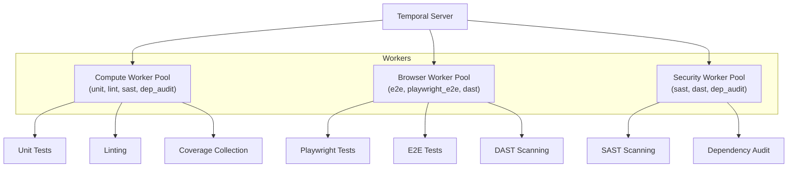

# Test Runner Service

## Overview

| Property | Value |
|---|---|
| **Purpose** | Temporal workflow worker that orchestrates test pipeline execution |
| **Type** | Temporal Worker (no HTTP port) |
| **Orchestration** | Temporal Server (port 7233) |
| **Artifact Storage** | MinIO (S3-compatible) |

The Test Runner Service does not expose an HTTP API. Instead, it registers as a Temporal worker that executes the `testPipelineWorkflow` when triggered by the Pipeline Service.

## TestPipelineWorkflow

The core workflow that executes a complete test pipeline.

```mermaid
flowchart TD
    Start([Workflow Start<br/>runId, repoUrl, commitSha, steps]) --> NotifyStart
    NotifyStart["notifyRunStarted<br/>Mark run as RUNNING"]
    NotifyStart --> PrepareRepo
    PrepareRepo["prepareRepository<br/>Clone/fetch repo at commitSha"]
    PrepareRepo --> SplitSteps
    SplitSteps{"Split steps into<br/>parallel & sequential"}

    SplitSteps --> ParallelPhase
    subgraph ParallelPhase["Phase 1: Parallel Execution"]
        Unit["runUnitTests"]
        Lint["runLinter"]
        SAST["runSAST"]
        DepAudit["runDependencyAudit"]
    end

    ParallelPhase --> CheckParallel{"Any parallel<br/>step failed?"}
    CheckParallel -- "Yes" --> MarkFailed1["overallStatus = FAILED"]
    CheckParallel -- "No" --> ContinueSeq
    MarkFailed1 --> ContinueSeq

    ContinueSeq --> UnitPassed{"Unit tests<br/>passed?"}

    UnitPassed -- "No" --> SkipE2E["Skip E2E tests<br/>(report as skipped)"]
    UnitPassed -- "Yes" --> E2EPhase

    subgraph E2EPhase["Phase 2: Sequential Execution"]
        E2E["runE2ETests /<br/>runPlaywrightTests"]
        LoadTest["runLoadTests /<br/>runK6LoadTest"]
        DAST["runDAST"]
    end

    SkipE2E --> CoveragePhase
    E2EPhase --> CoveragePhase

    subgraph CoveragePhase["Phase 3: Post-Test"]
        CollectCoverage["collectCoverage<br/>Gather coverage metrics"]
        CompareCoverage["compareCoverage<br/>Diff against baseline"]
    end

    CoveragePhase --> ArtifactPhase

    subgraph ArtifactPhase["Phase 4: Artifacts"]
        UploadScreenshots["uploadArtifact<br/>Screenshots from E2E"]
        UploadVideos["uploadArtifact<br/>Videos from E2E"]
        UploadCoverageDir["uploadDirectory<br/>Coverage reports"]
    end

    ArtifactPhase --> NotifyComplete
    NotifyComplete["notifyRunCompleted<br/>Mark run as PASSED/FAILED/ERRORED"]
    NotifyComplete --> Cleanup
    Cleanup["cleanupRepository<br/>Remove workspace"]
    Cleanup --> End([Workflow End])

    style Start fill:#22c55e,color:#fff
    style End fill:#22c55e,color:#fff
```



## Activity Groups

### Repository Activities

| Activity | Timeout | Retries | Description |
|---|---|---|---|
| `prepareRepository` | 5 min | 3 | Clone or fetch the git repository at a specific commit SHA |
| `cleanupRepository` | 5 min | 3 | Remove the workspace directory after workflow completion |

### Test Runner Activities

| Activity | Timeout | Retries | Heartbeat | Description |
|---|---|---|---|---|
| `runUnitTests` | 30 min | 2 | 2 min | Execute unit tests (Jest, Vitest, etc.) |
| `runLinter` | 30 min | 2 | 2 min | Run linting checks (ESLint, etc.) |
| `runE2ETests` | 30 min | 2 | 2 min | Execute generic E2E tests |
| `runLoadTests` | 30 min | 2 | 2 min | Run generic load tests |

### E2E Activities

| Activity | Timeout | Retries | Heartbeat | Description |
|---|---|---|---|---|
| `runPlaywrightTests` | 30 min | 2 | 2 min | Execute Playwright-based E2E tests with screenshots and video capture |

### Load Test Activities

| Activity | Timeout | Retries | Heartbeat | Description |
|---|---|---|---|---|
| `runK6LoadTest` | 30 min | 2 | 2 min | Execute k6 load tests |

### Security Activities

| Activity | Timeout | Retries | Description |
|---|---|---|---|
| `runSAST` | 15 min | 2 | Static Application Security Testing |
| `runDAST` | 15 min | 2 | Dynamic Application Security Testing |
| `runDependencyAudit` | 15 min | 2 | Dependency vulnerability scanning |

### Coverage Activities

| Activity | Timeout | Retries | Description |
|---|---|---|---|
| `collectCoverage` | 5 min | 3 | Collect code coverage metrics from test runs |
| `compareCoverage` | 5 min | 3 | Compare current coverage against a baseline |

### Artifact Activities

| Activity | Timeout | Retries | Description |
|---|---|---|---|
| `uploadArtifact` | 10 min | 3 | Upload a single file to MinIO |
| `uploadDirectory` | 10 min | 3 | Upload an entire directory to MinIO |

### Reporting Activities

| Activity | Timeout | Retries | Description |
|---|---|---|---|
| `notifyRunStarted` | 1 min | 5 | Notify Pipeline Service that the run has started |
| `reportStepResult` | 1 min | 5 | Report a single step result back to Pipeline Service |
| `notifyRunCompleted` | 1 min | 5 | Notify Pipeline Service that the run has completed |

## Worker Pool Architecture

The Test Runner uses specialized worker pools based on the activity types they handle.



| Worker Pool | Purpose | Resource Profile |
|---|---|---|
| **Compute** | CPU-bound tasks like unit tests, linting, coverage | Standard CPU, moderate memory |
| **Browser** | Browser-based tests requiring headless Chrome/Firefox | Higher memory, GPU optional |
| **Security** | Security scanning tools | Standard CPU, tool-specific dependencies |

## Parallel vs Sequential Execution

Steps are categorized into two phases:

| Phase | Check Types | Execution |
|---|---|---|
| **Parallel (Phase 1)** | `unit`, `lint`, `sast`, `dep_audit` | All run concurrently via `Promise.all` |
| **Sequential (Phase 2)** | `e2e`, `playwright_e2e`, `load`, `k6_load`, `dast` | Run one at a time, with conditional skipping |

### Conditional Execution Rules

- **E2E tests** (`e2e`, `playwright_e2e`): Skipped if unit tests did not pass. This prevents wasting browser resources on code with known unit-level failures.
- **Load tests** (`load`, `k6_load`): Run sequentially after E2E to avoid resource contention.
- **DAST**: Runs sequentially since it requires a running application.

## Error Handling

The workflow implements a "best-effort" error handling strategy:

1. **Step-level errors**: Caught by `safeRunStep()`. A failed step produces an `errored` result but does not crash the workflow. Other steps continue executing.

2. **Coverage errors**: Caught separately. A coverage collection failure does not fail the pipeline.

3. **Artifact upload errors**: Caught separately. Upload failures are silently ignored.

4. **Workflow-level errors**: If the workflow itself throws an unexpected error, the run is marked as `ERRORED` and the error is re-thrown for Temporal to handle (retry or fail).

5. **Cleanup**: The `finally` block always attempts workspace cleanup, regardless of workflow outcome.

## MinIO Artifact Storage

Test artifacts are organized in MinIO under the `test-artifacts` bucket:

```
test-artifacts/
  runs/
    <runId>/
      unit/
        screenshots/
      e2e/
        screenshots/
          screenshot-1.png
        videos/
          test-recording.webm
      playwright_e2e/
        screenshots/
        videos/
      coverage/
        lcov.info
        index.html
        ...
```
