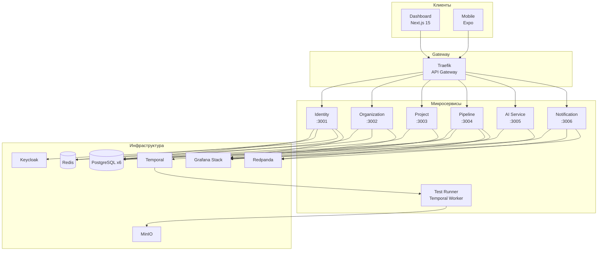

# Testing AI Assistant — Техническая документация

## Обзор проекта

**Testing AI Assistant** — это платформа для автоматизированного тестирования программного обеспечения с интеграцией искусственного интеллекта. Система построена на микросервисной архитектуре и предоставляет возможности автоматической генерации тестов, обнаружения багов, выявления нестабильных (flaky) тестов и анализа покрытия кода.

Платформа интегрируется с популярными Git-провайдерами (GitHub, GitLab, Bitbucket), обеспечивает оркестрацию тестовых пайплайнов через Temporal и доставляет уведомления по множеству каналов.

## Технологический стек

| Категория | Технология | Версия | Назначение |
|-----------|-----------|--------|------------|
| **Монорепозиторий** | Turborepo + pnpm | 2.3+ / 9.15+ | Управление пакетами и задачами |
| **Язык** | TypeScript | 5.6+ | Единый язык для всей кодовой базы |
| **Бэкенд** | NestJS | 10+ | Фреймворк микросервисов |
| **Фронтенд** | Next.js 15 (App Router) | 15+ | Веб-панель управления |
| **Мобильное приложение** | Expo (React Native) | SDK 51+ | Мобильный клиент |
| **БД** | PostgreSQL | 16 | Реляционное хранилище (per service) |
| **ORM** | Prisma | 5+ | Типизированный доступ к данным |
| **Кэш** | Redis | 7 | Кэширование и сессии |
| **Брокер сообщений** | Redpanda (Kafka API) | 24.1 | Событийная шина |
| **Оркестрация** | Temporal | 1.24 | Долгоживущие workflow |
| **Аутентификация** | Keycloak + JWT | 24.0 | IdP и авторизация |
| **Хранилище объектов** | MinIO | latest | S3-совместимое хранилище артефактов |
| **API Gateway** | Traefik | 3+ | Маршрутизация, TLS, rate limiting |
| **Наблюдаемость** | Grafana + Loki + Tempo + Prometheus | - | Логи, трейсы, метрики |
| **Телеметрия** | OpenTelemetry | 0.96 | Сбор и экспорт телеметрии |
| **IaC** | Terraform | 1+ | Инфраструктура как код (AWS) |
| **AI/LLM** | OpenAI (gpt-4.1-mini / o3) | - | Генерация и анализ |

## Содержание документации

### Общие разделы

| Документ | Описание |
|----------|----------|
| [Архитектура системы](./architecture.md) | Высокоуровневая архитектура, диаграммы взаимодействия, принципы проектирования |
| [Быстрый старт](./getting-started.md) | Установка, настройка окружения, запуск проекта |
| [Справочник API](./api-reference.md) | Сводная таблица всех эндпоинтов всех сервисов |
| [Архитектура баз данных](./database.md) | ER-диаграммы, паттерн database-per-service, миграции |
| [Событийная архитектура](./event-driven.md) | Топики Redpanda, потоки событий, EventEmitter2 |
| [Развёртывание](./deployment.md) | Docker Compose, Kubernetes, GitOps, Terraform |
| [Наблюдаемость](./observability.md) | OpenTelemetry, Grafana, Loki, Tempo, Prometheus |
| [Безопасность](./security.md) | JWT, Keycloak, RBAC, Traefik middleware, Vault |

### Микросервисы

| Документ | Сервис | Порт |
|----------|--------|------|
| [Identity Service](./services/identity.md) | Аутентификация и управление пользователями | 3001 |
| [Organization Service](./services/organization.md) | Управление организациями и членством | 3002 |
| [Project Service](./services/project.md) | Управление проектами и Git-интеграция | 3003 |
| [Pipeline Service](./services/pipeline.md) | Пайплайны, тестовые запуски, результаты | 3004 |
| [AI Service](./services/ai.md) | ИИ-генерация тестов и анализ | 3005 |
| [Notification Service](./services/notification.md) | Многоканальные уведомления | 3006 |
| [Test Runner Service](./services/test-runner.md) | Temporal-воркеры для выполнения тестов | 7233 (Temporal) |

### Клиентские приложения

| Документ | Описание |
|----------|----------|
| [Dashboard](./dashboard.md) | Веб-панель на Next.js 15 |
| [Мобильное приложение](./mobile.md) | Мобильный клиент на Expo/React Native |

## Архитектура в одной диаграмме

## Быстрые ссылки

- **Репозиторий**: monorepo (Turborepo + pnpm workspaces)
- **Node.js**: >= 20.0.0
- **Менеджер пакетов**: pnpm 9.15.4
- **Лицензия**: Private
