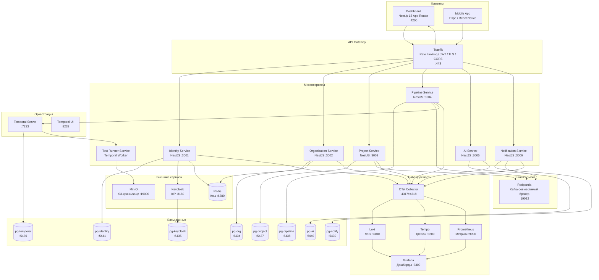
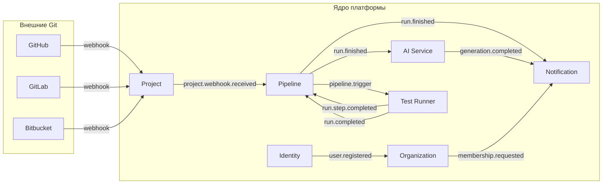
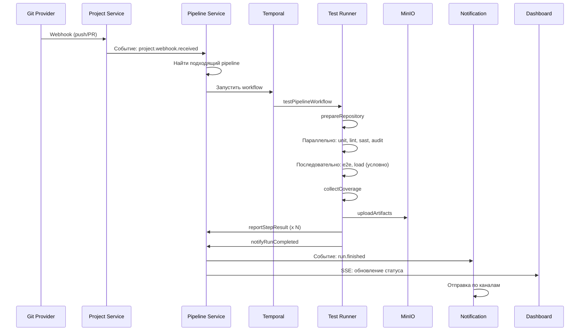
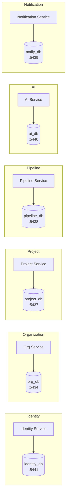

# Архитектура системы

## Высокоуровневая архитектура

Testing AI Assistant построен по принципу микросервисной архитектуры с событийно-ориентированным взаимодействием. Каждый сервис отвечает за свой ограниченный контекст (bounded context) и имеет собственную базу данных.

## Взаимодействие сервисов

## Потоки данных

### Поток тестового запуска

## Технологический стек с обоснованиями

| Технология | Обоснование выбора |
|------------|-------------------|
| **TypeScript** | Единый язык для бэкенда, фронтенда и мобильного приложения. Статическая типизация снижает количество ошибок |
| **NestJS** | Модульная архитектура, встроенная DI, поддержка OpenAPI, гибкость транспортов (HTTP, Kafka, gRPC) |
| **Next.js 15** | Server Components, App Router, встроенная аутентификация (NextAuth v5), оптимальная производительность |
| **Expo** | Кроссплатформенная мобильная разработка с доступом к нативным API, OTA-обновления |
| **PostgreSQL 16** | Надёжная СУБД с поддержкой JSON, полнотекстового поиска, partitioning |
| **Prisma** | Типобезопасный ORM с автогенерацией клиента, удобные миграции |
| **Redis** | Низколатентное кэширование, хранилище сессий, pub/sub для real-time |
| **Redpanda** | Kafka-совместимый брокер без JVM-зависимости, низкая задержка, простое развёртывание |
| **Temporal** | Надёжная оркестрация долгоживущих процессов с автоматическим retry и восстановлением |
| **Keycloak** | Полнофункциональный IdP с поддержкой OAuth 2.0, OIDC, федерации идентификаторов |
| **MinIO** | S3-совместимое хранилище для артефактов тестирования (скриншоты, отчёты, видео) |
| **Traefik** | Динамическая конфигурация, автоматические TLS-сертификаты, middleware-цепочки |
| **Grafana Stack** | Комплексная наблюдаемость: Loki (логи), Tempo (трейсы), Prometheus (метрики) |
| **OpenTelemetry** | Вендор-нейтральный стандарт телеметрии, единый SDK для всех сервисов |
| **Terraform** | IaC для воспроизводимого развёртывания облачной инфраструктуры |
| **pgvector** | Хранение эмбеддингов и поиск по косинусному сходству для RAG базы знаний |
| **Turborepo** | Инкрементальные сборки, кэширование задач, параллельное выполнение в monorepo |

## Принципы проектирования

### 1. Database-per-Service

Каждый микросервис владеет своей базой данных PostgreSQL. Это обеспечивает:
- Независимое развёртывание и масштабирование сервисов
- Изоляцию данных и предотвращение связывания на уровне БД
- Возможность выбора оптимальной схемы для каждого контекста

### 2. Event-Driven Architecture

Межсервисное взаимодействие осуществляется через события в Redpanda. Это обеспечивает:
- Слабую связанность между сервисами
- Возможность асинхронной обработки
- Устойчивость к временным отказам (гарантия доставки)
- Масштабирование через consumer groups

### 3. API Gateway Pattern

Traefik выступает единой точкой входа:
- Маршрутизация по PathPrefix (`/api/identity`, `/api/org`, и т.д.)
- Централизованный rate limiting
- JWT-валидация на уровне gateway
- Автоматическое TLS через Let's Encrypt
- Health checks для всех upstream-сервисов

### 4. Strangler Fig Pattern (для миграции)

Архитектура позволяет постепенно заменять или добавлять сервисы без влияния на остальную систему благодаря:
- Асинхронному взаимодействию через события
- API-версионированию
- Независимому развёртыванию

### 5. Observability by Design

Наблюдаемость встроена с первого дня:
- Распределённый трейсинг через OpenTelemetry
- Структурированное логирование в Loki
- Метрики приложений в Prometheus
- Централизованные дашборды в Grafana

### 6. Security in Depth

Многослойная модель безопасности:
- TLS на уровне API Gateway
- JWT-аутентификация с Keycloak
- RBAC на уровне организации (ADMIN/MEMBER/VIEWER)
- Rate limiting для защиты от DDoS
- Аудит действий через события
