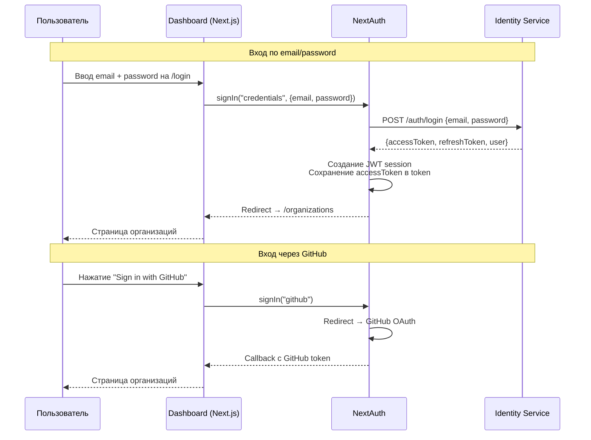
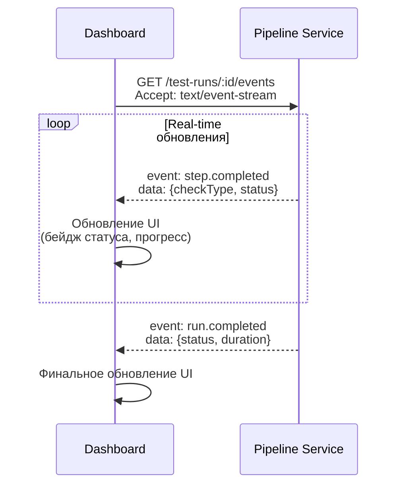

# Dashboard — Веб-панель управления

## Обзор

| Параметр | Значение |
|----------|----------|
| **Фреймворк** | Next.js 15 (App Router) |
| **Язык** | TypeScript |
| **Аутентификация** | NextAuth v5 (Auth.js) |
| **Состояние** | Zustand |
| **UI-библиотека** | shadcn/ui + Tailwind CSS |
| **Порт** | 4200 |

## Структура Next.js 15 App Router

```
apps/dashboard/src/app/
├── layout.tsx                           # Root layout (providers, fonts)
├── page.tsx                             # Landing / redirect
│
├── (auth)/                              # Группа авторизации
│   ├── layout.tsx                       # Auth layout (центрирование, минимальный UI)
│   ├── login/page.tsx                   # Страница входа
│   ├── register/page.tsx                # Страница регистрации
│   └── auth-error/page.tsx              # Страница ошибки авторизации
│
└── (dashboard)/                         # Группа дашборда (защищённая)
    ├── layout.tsx                       # Dashboard layout (sidebar, header)
    ├── organizations/
    │   ├── page.tsx                     # Список организаций
    │   ├── new/page.tsx                 # Создание организации
    │   └── [orgId]/
    │       ├── page.tsx                 # Обзор организации
    │       ├── members/page.tsx         # Управление участниками
    │       └── settings/page.tsx        # Настройки организации
    ├── projects/
    │   ├── page.tsx                     # Список проектов
    │   ├── new/page.tsx                 # Создание проекта
    │   └── [projectId]/
    │       ├── layout.tsx               # Layout проекта (синхронизация контекста)
    │       ├── page.tsx                 # Обзор проекта
    │       ├── settings/page.tsx        # Настройки проекта
    │       ├── pipelines/
    │       │   ├── page.tsx             # Список пайплайнов
    │       │   ├── new/page.tsx         # Создание пайплайна
    │       │   └── [pipelineId]/page.tsx # Детали пайплайна
    │       ├── coverage/page.tsx        # Отчёт о покрытии
    │       ├── chat/page.tsx           # AI-чат ассистент
    │       └── ai/
    │           ├── page.tsx             # AI-генерации проекта
    │           ├── generate/page.tsx    # Новая генерация
    │           └── [generationId]/page.tsx # Детали генерации
    ├── runs/
    │   └── [runId]/
    │       ├── page.tsx                 # Детали тестового запуска
    │       └── artifacts/page.tsx       # Артефакты запуска
    └── settings/
        └── notifications/page.tsx       # Настройки уведомлений
```

## Карта страниц

```mermaid
flowchart TD
    ROOT([Вход: /]) --> CHECK{Авторизован?}

    CHECK -->|Нет| AUTH_GROUP
    CHECK -->|Да| DASH_GROUP

    subgraph AUTH_GROUP [Группа авторизации / auth]
        LOGIN[/login<br/>Вход по email/password]
        REGISTER[/register<br/>Регистрация]
        AUTH_ERR[/auth-error<br/>Ошибка авторизации]
        LOGIN <--> REGISTER
    end

    subgraph DASH_GROUP [Группа дашборда / dashboard]
        ORGS[/organizations<br/>Список организаций]
        ORG_NEW[/organizations/new<br/>Создание организации]
        ORG_DETAIL[/organizations/orgId<br/>Обзор организации]
        ORG_MEMBERS[/organizations/orgId/members<br/>Участники]
        ORG_SETTINGS[/organizations/orgId/settings<br/>Настройки]

        PROJECTS[/projects<br/>Список проектов]
        PRJ_NEW[/projects/new<br/>Создание проекта]
        PRJ_DETAIL[/projects/projectId<br/>Обзор проекта]
        PRJ_SETTINGS[/projects/projectId/settings<br/>Настройки проекта]
        PRJ_PIPELINES[/projects/projectId/pipelines<br/>Пайплайны]
        PIP_NEW[/projects/projectId/pipelines/new<br/>Создание пайплайна]
        PIP_DETAIL[/projects/projectId/pipelines/pipelineId<br/>Детали пайплайна]
        PRJ_COVERAGE[/projects/projectId/coverage<br/>Покрытие]
        PRJ_CHAT[/projects/projectId/chat<br/>AI-чат]

        PRJ_AI[/projects/projectId/ai<br/>AI-генерации]
        AI_GEN[/projects/projectId/ai/generate<br/>Новая генерация]
        AI_DETAIL[/projects/projectId/ai/generationId<br/>Детали генерации]

        RUN_DETAIL[/runs/runId<br/>Детали запуска]
        RUN_ARTIFACTS[/runs/runId/artifacts<br/>Артефакты]

        NOTIF_SETTINGS[/settings/notifications<br/>Настройки уведомлений]
    end

    ORGS --> ORG_NEW
    ORGS --> ORG_DETAIL
    ORG_DETAIL --> ORG_MEMBERS & ORG_SETTINGS

    ORGS --> PROJECTS
    PROJECTS --> PRJ_NEW
    PROJECTS --> PRJ_DETAIL
    PRJ_DETAIL --> PRJ_SETTINGS & PRJ_PIPELINES & PRJ_COVERAGE & PRJ_CHAT & PRJ_AI
    PRJ_PIPELINES --> PIP_NEW & PIP_DETAIL
    PRJ_AI --> AI_GEN & AI_DETAIL

    PIP_DETAIL --> RUN_DETAIL
    RUN_DETAIL --> RUN_ARTIFACTS

    LOGIN -->|Успех| ORGS

    style AUTH_GROUP fill:#fef3e2,stroke:#f5a623
    style DASH_GROUP fill:#e8f4f8,stroke:#4a9eff
```

## Аутентификация (NextAuth v5)

### Конфигурация

Dashboard использует NextAuth v5 (Auth.js) с двумя провайдерами:

1. **Credentials** — email/password через Identity Service API
2. **GitHub** — OAuth через GitHub



### Middleware авторизации

NextAuth middleware защищает маршруты дашборда:

| Маршрут | Защита |
|---------|--------|
| `/login`, `/register` | Публичный (redirect на /organizations если авторизован) |
| `/dashboard/*` | Требуется авторизация |
| `/organizations/*` | Требуется авторизация |

### Callbacks

| Callback | Описание |
|----------|----------|
| `authorized` | Проверка доступа: redirect на /login для защищённых маршрутов |
| `jwt` | Добавление accessToken и refreshToken в JWT token |
| `session` | Добавление userId и accessToken в session |

## Управление состоянием (Zustand)

### Stores

Dashboard использует Zustand для клиентского состояния:

```typescript
// org-store.ts
interface OrgStore {
  currentOrgId: string | null;
  currentProjectId: string | null;
  currentProjectName: string | null;
  setCurrentOrgId: (id: string | null) => void;
  setCurrentProject: (id: string | null, name: string | null) => void;
}

// Хук useProjectContext синхронизирует параметры маршрута
// [projectId] со стором Zustand через layout проекта
```

### Паттерн использования

```
Server Component → fetch данных → передача как props → Client Component → Zustand store
```

| Тип данных | Источник | Хранение |
|-----------|----------|----------|
| Аутентификация | NextAuth session | Server-side (cookie) |
| Список организаций | Server Component fetch | Props → Zustand |
| Текущий проект | Server Component fetch | Props → Zustand |
| Результаты тестов | Client-side fetch | Zustand |
| SSE-обновления | EventSource | Zustand |
| UI состояние | Client-only | Zustand |

## Библиотека компонентов (shadcn/ui)

### Используемые компоненты

| Компонент | Описание | Применение |
|-----------|----------|------------|
| `Button` | Кнопка с вариантами | Действия, навигация |
| `Card` | Карточка | Контейнеры контента |
| `Table` | Таблица | Списки данных |
| `Dialog` | Модальное окно | Подтверждения, формы |
| `Form` | Форма (react-hook-form) | Ввод данных |
| `Input` | Текстовое поле | Формы |
| `Select` | Выбор из списка | Фильтры, формы |
| `Badge` | Метка/бейдж | Статусы, теги |
| `Tabs` | Вкладки | Переключение контента |
| `DropdownMenu` | Выпадающее меню | Контекстные действия |
| `Sidebar` | Боковая панель | Навигация |
| `Toast` | Уведомление | Feedback пользователю |
| `Skeleton` | Скелетон загрузки | Placeholder при загрузке |
| `Sheet` | Выезжающая панель | Мобильная навигация |

### Стилизация

| Инструмент | Назначение |
|-----------|------------|
| **Tailwind CSS** | Утилитарные классы |
| **CSS Variables** | Темизация (светлая/тёмная) |
| **cn()** | Утилита для слияния классов (clsx + tailwind-merge) |

## Real-time обновления

Dashboard подписывается на SSE (Server-Sent Events) для получения real-time обновлений тестовых запусков:



## Ключевые страницы

### Обзор проекта (/projects/[projectId])

- Информация о репозитории
- Статус webhook
- Последние тестовые запуски
- Покрытие кода (тренд)
- Быстрые действия (запуск, AI-генерация)

### Детали тестового запуска (/runs/[runId])

- Статус запуска (real-time через SSE)
- Список шагов с результатами
- Время выполнения каждого шага
- Покрытие кода (если собрано)
- Ссылки на артефакты

### AI Чат (/projects/[projectId]/chat)

- Разговорный AI-ассистент с вызовом инструментов
- RAG база знаний для контекстных ответов
- Потоковая передача ответов через SSE
- Многоходовые беседы с историей

### AI-генерация (/projects/[projectId]/ai/generate)

- Выбор типа генерации (TEST_GEN, BUG_DETECT, FLAKY_DETECT, COVERAGE_ADVICE)
- Ввод контекста (файлы, код)
- Отображение результата
- Кнопки принятия/отклонения с feedback
