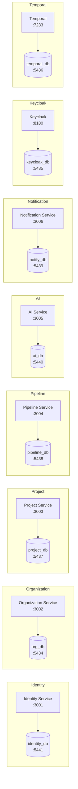
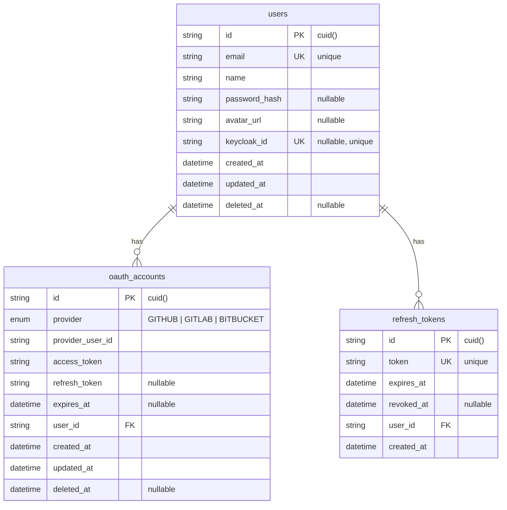
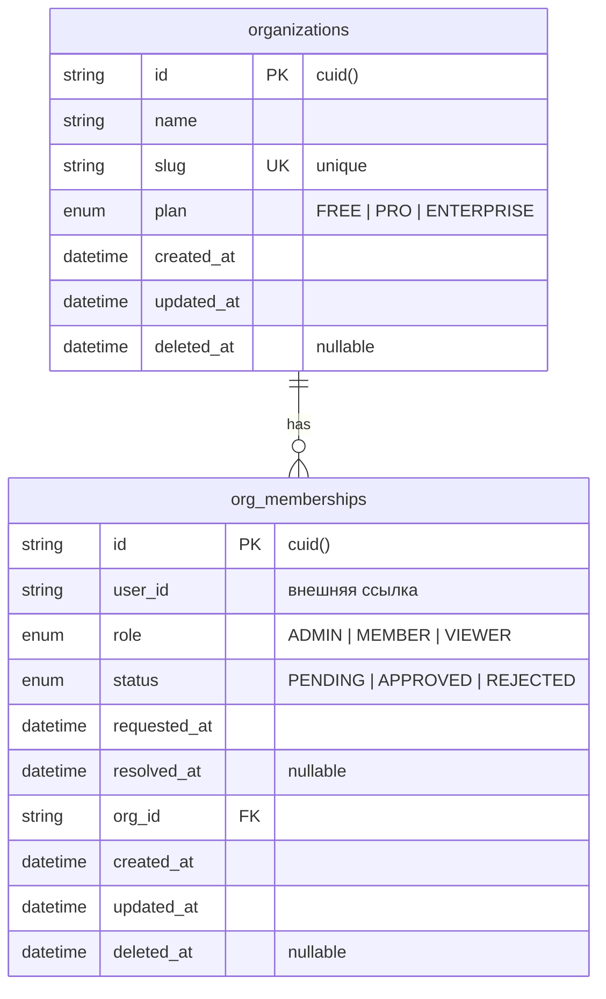
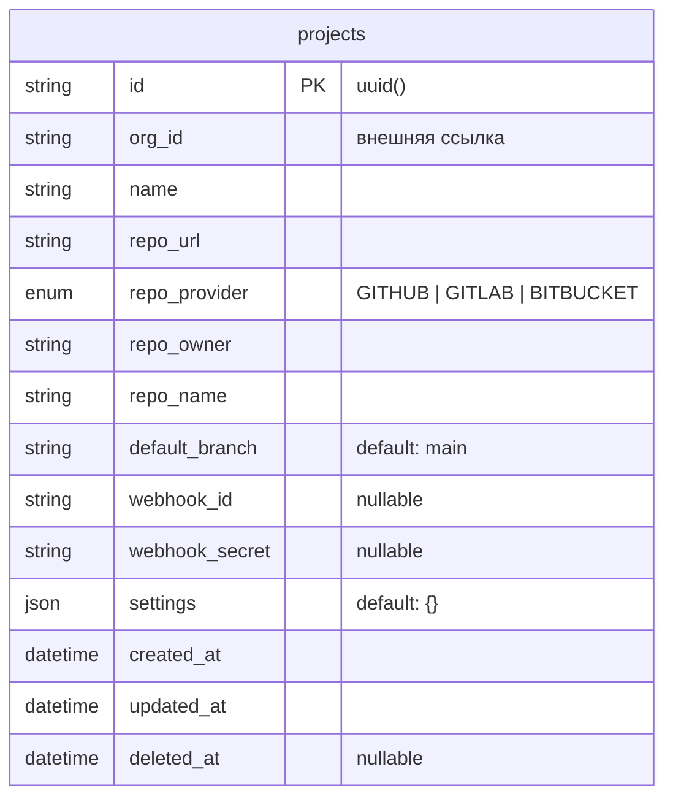
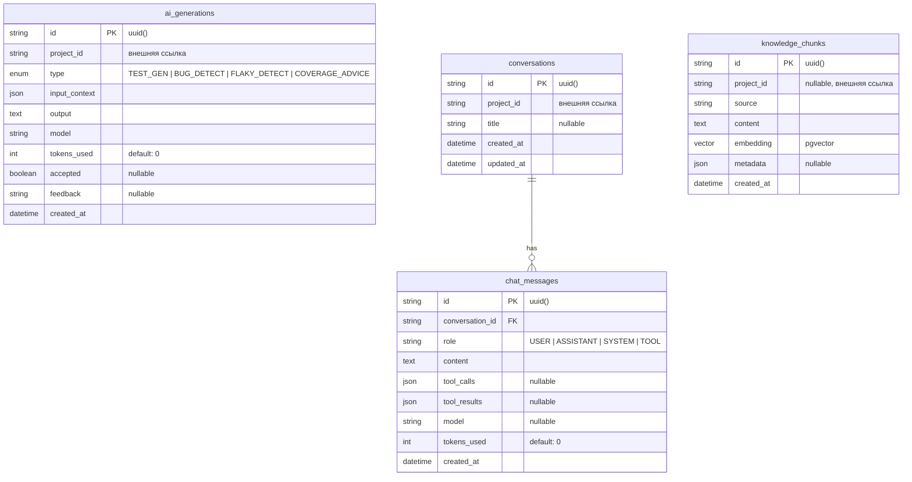
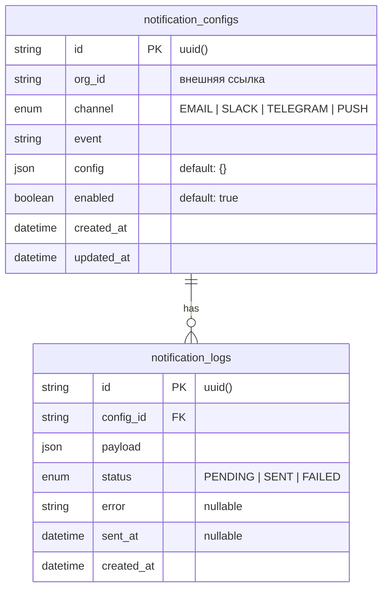
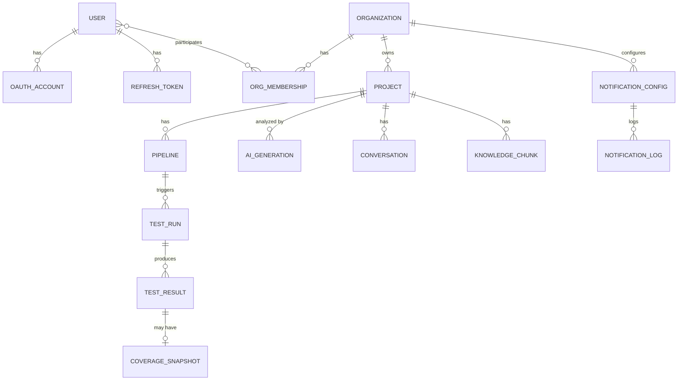
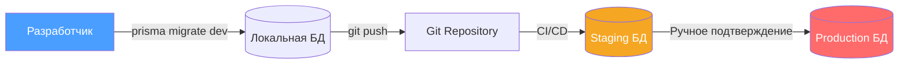

# Архитектура баз данных

## Паттерн Database-per-Service

Каждый микросервис владеет собственной базой данных PostgreSQL 16. Это обеспечивает:

- **Изоляцию данных** — сервисы не могут обращаться к таблицам друг друга напрямую
- **Независимое масштабирование** — каждая БД может быть оптимизирована отдельно
- **Автономность развёртывания** — миграции применяются независимо
- **Устойчивость** — проблема в одной БД не влияет на другие сервисы



## ER-диаграммы по сервисам

### Identity Service — identity_db



### Organization Service — org_db



### Project Service — project_db



### Pipeline Service — pipeline_db

```mermaid
erDiagram
    pipelines {
        string id PK "uuid()"
        string project_id "внешняя ссылка"
        string name
        enum trigger "PUSH | PULL_REQUEST | SCHEDULE | MANUAL"
        string cron_expr "nullable"
        json steps "default: []"
        boolean enabled "default: true"
        datetime created_at
        datetime updated_at
    }

    test_runs {
        string id PK "uuid()"
        string pipeline_id FK
        string commit_sha
        string branch
        enum status "QUEUED | RUNNING | PASSED | FAILED | ERRORED | CANCELLED"
        datetime started_at "nullable"
        datetime finished_at "nullable"
        string triggered_by "nullable"
        json metadata "default: {}"
        datetime created_at
    }

    test_results {
        string id PK "uuid()"
        string run_id FK
        enum check_type "UNIT | INTEGRATION | E2E | LOAD | LINT | SAST | DAST | DEPENDENCY_AUDIT | AI_REVIEW"
        enum status "PENDING | RUNNING | PASSED | FAILED | SKIPPED | CANCELLED"
        string summary
        json details "default: {}"
        string artifact_url "nullable"
        int duration_ms "default: 0"
        datetime created_at
    }

    coverage_snapshots {
        string id PK "uuid()"
        string result_id FK UK "unique"
        float line_pct
        float branch_pct
        float function_pct
        json uncovered "default: {}"
    }

    pipelines ||--o{ test_runs : "has"
    test_runs ||--o{ test_results : "has"
    test_results ||--o| coverage_snapshots : "has"
```

### AI Service — ai_db



### Notification Service — notify_db



## Общая обзорная ER-диаграмма



> **Примечание:** Связи между сервисами (например, Organization → Project) реализованы через хранение `orgId` / `projectId` как строковых полей, без foreign key на уровне БД. Целостность обеспечивается на уровне приложения и событий.

## Стратегия миграций

### Инструменты

Все миграции управляются через **Prisma Migrate**:

```bash
# Создание новой миграции
cd services/<service-name>
npx prisma migrate dev --name <migration-name>

# Применение миграций в production
npx prisma migrate deploy

# Генерация Prisma Client
npx prisma generate
```

### Правила миграций

| Правило | Описание |
|---------|----------|
| **Обратная совместимость** | Миграции не должны ломать текущую версию приложения |
| **Мягкое удаление** | Использование `deletedAt` вместо физического удаления |
| **Инкрементальность** | Каждая миграция — минимальное атомарное изменение |
| **Именование** | Формат: `YYYYMMDDHHMMSS_описание_на_английском` |
| **Тестирование** | Миграции тестируются на staging перед production |

### Процесс развёртывания миграций



### Индексы

Все модели используют индексы для оптимизации запросов:

| Сервис | Таблица | Индексы |
|--------|---------|---------|
| Identity | `users` | `email` (unique), `keycloak_id` (unique), `deleted_at` |
| Identity | `oauth_accounts` | `[provider, provider_user_id]` (unique), `user_id`, `deleted_at` |
| Identity | `refresh_tokens` | `token` (unique), `user_id` |
| Organization | `organizations` | `slug` (unique), `deleted_at` |
| Organization | `org_memberships` | `[user_id, org_id]` (unique), `org_id`, `user_id`, `deleted_at` |
| Project | `projects` | `[org_id, repo_url]` (unique), `org_id` |
| Pipeline | `pipelines` | `project_id` |
| Pipeline | `test_runs` | `pipeline_id`, `status` |
| Pipeline | `test_results` | `run_id` |
| Pipeline | `coverage_snapshots` | `result_id` (unique) |
| AI | `ai_generations` | `project_id`, `type` |
| Notification | `notification_configs` | `[org_id, channel, event]` (unique), `org_id` |
| Notification | `notification_logs` | `config_id`, `status` |
