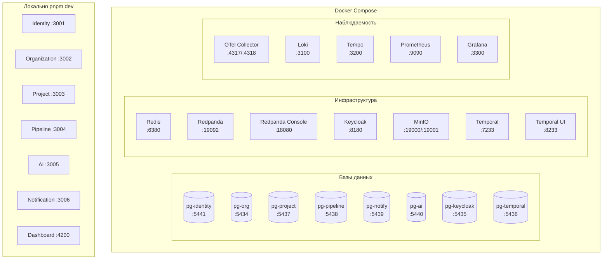
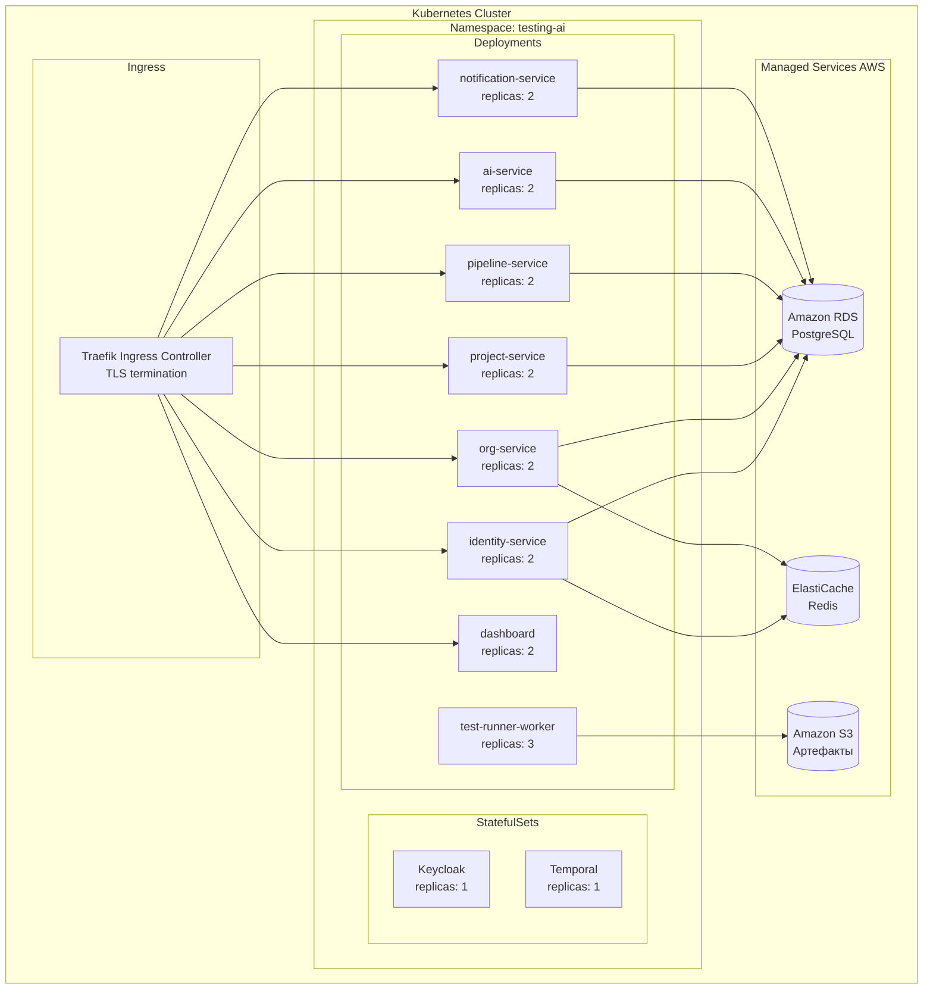
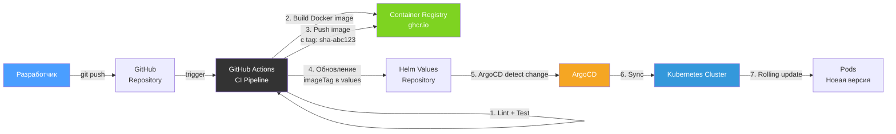
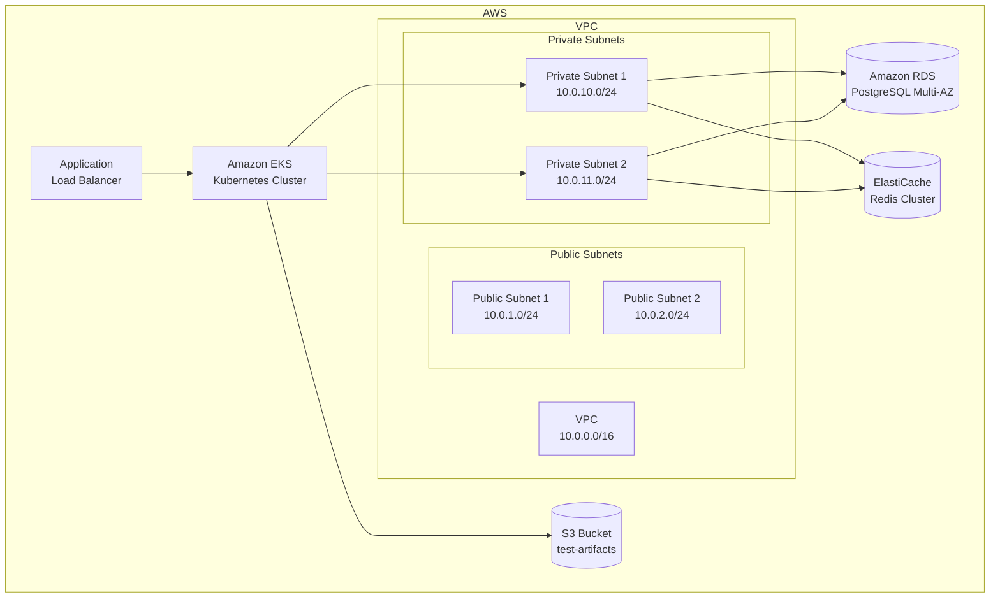

# Руководство по развёртыванию

## Обзор окружений

| Окружение | Инструмент | Назначение |
|-----------|-----------|------------|
| **Development** | Docker Compose | Локальная разработка |
| **Staging** | Kubernetes + Helm | Предпродуктивное тестирование |
| **Production** | Kubernetes + Helm + ArgoCD | Продуктивная среда |

## Docker Compose (разработка)

### Архитектура локальной среды



### Команды

```bash
# Запуск всей инфраструктуры
pnpm docker:up

# Остановка
pnpm docker:down

# Полный сброс (удаление volumes)
pnpm docker:reset

# Просмотр логов
docker compose logs -f <service-name>

# Проверка состояния
docker compose ps
```

### Контейнеры и порты

| Контейнер | Образ | Порт (хост) | Порт (контейнер) |
|-----------|-------|-------------|-----------------|
| pg-identity | postgres:16-alpine | 5441 | 5432 |
| pg-org | postgres:16-alpine | 5434 | 5432 |
| pg-project | postgres:16-alpine | 5437 | 5432 |
| pg-pipeline | postgres:16-alpine | 5438 | 5432 |
| pg-notify | postgres:16-alpine | 5439 | 5432 |
| pg-ai | postgres:16-alpine | 5440 | 5432 |
| pg-keycloak | postgres:16-alpine | 5435 | 5432 |
| pg-temporal | postgres:16-alpine | 5436 | 5432 |
| redis | redis:7-alpine | 6380 | 6379 |
| redpanda | redpandadata/redpanda:v24.1.1 | 19092 | 19092 |
| redpanda-console | redpandadata/console:v2.4.5 | 18080 | 8080 |
| keycloak | quay.io/keycloak/keycloak:24.0 | 8180 | 8080 |
| minio | minio/minio:latest | 19000/19001 | 9000/9001 |
| temporal | temporalio/auto-setup:1.24 | 7233 | 7233 |
| temporal-ui | temporalio/ui:2.26.2 | 8233 | 8080 |
| otel-collector | otel/opentelemetry-collector-contrib:0.96.0 | 4317/4318 | 4317/4318 |
| loki | grafana/loki:2.9.4 | 3100 | 3100 |
| tempo | grafana/tempo:2.3.1 | 3200 | 3200 |
| prometheus | prom/prometheus:v2.50.1 | 9090 | 9090 |
| grafana | grafana/grafana:10.3.3 | 3300 | 3000 |

## Kubernetes + Helm (staging/production)

### Архитектура кластера



### Описание Helm Values

```yaml
# values.yaml — основные параметры
global:
  imageRegistry: ghcr.io/your-org/testing-ai
  imageTag: "latest"
  environment: staging  # staging | production

# Каждый сервис настраивается отдельно
identity:
  replicaCount: 2
  image:
    repository: identity-service
    tag: ""  # Наследует global.imageTag
  port: 3001
  resources:
    requests:
      cpu: 100m
      memory: 256Mi
    limits:
      cpu: 500m
      memory: 512Mi
  env:
    IDENTITY_PORT: "3001"
    JWT_EXPIRATION: "1h"
  secrets:
    - name: identity-db-url
      key: DATABASE_URL
    - name: jwt-secret
      key: JWT_SECRET
  autoscaling:
    enabled: true
    minReplicas: 2
    maxReplicas: 5
    targetCPUUtilization: 70

organization:
  replicaCount: 2
  port: 3002
  # ... аналогично

pipeline:
  replicaCount: 2
  port: 3004
  # ... аналогично

testRunner:
  replicaCount: 3
  workerPools:
    compute:
      replicas: 3
      resources:
        requests:
          cpu: 500m
          memory: 1Gi
    browser:
      replicas: 2
      resources:
        requests:
          cpu: 1000m
          memory: 2Gi
    security:
      replicas: 2
      resources:
        requests:
          cpu: 500m
          memory: 1Gi

dashboard:
  replicaCount: 2
  port: 4200

# Инфраструктура
redis:
  external: true
  url: "redis://elasticache-endpoint:6379"

kafka:
  external: false  # Redpanda внутри кластера
  brokers: "redpanda-0.redpanda:29092"

temporal:
  address: "temporal:7233"

keycloak:
  replicaCount: 1
  adminPassword: ""  # Из Secret

# Наблюдаемость
observability:
  enabled: true
  otelCollector:
    endpoint: "otel-collector:4317"
  grafana:
    enabled: true
```

## GitOps-поток развёртывания



### Шаги CI/CD Pipeline (GitHub Actions)

| Шаг | Описание | Артефакт |
|-----|----------|----------|
| 1. Checkout | Клонирование репозитория | — |
| 2. Install | `pnpm install` | — |
| 3. Lint | `pnpm lint` | — |
| 4. Test | `pnpm test` | Результаты тестов |
| 5. Build | `pnpm build` | Собранные пакеты |
| 6. Docker Build | Build + push каждого сервиса | Docker images |
| 7. Update Values | Обновление `imageTag` в Helm values | Коммит в config repo |

## Terraform — Инфраструктура

### Обзор ресурсов



### Файлы Terraform

| Файл | Описание |
|------|----------|
| `main.tf` | Провайдер AWS, общие настройки |
| `variables.tf` | Входные переменные (регион, размеры инстансов и т.д.) |
| `outputs.tf` | Выходные значения (endpoint EKS, URL RDS и т.д.) |
| `backend.tf` | Конфигурация S3 backend для Terraform state |
| `vpc.tf` | VPC, подсети, маршрутизация, NAT Gateway |
| `eks.tf` | EKS кластер, node groups, IAM roles |
| `rds.tf` | RDS PostgreSQL — отдельные инстансы для каждого сервиса |
| `elasticache.tf` | ElastiCache Redis кластер |
| `s3.tf` | S3 bucket для артефактов тестирования |

### Команды Terraform

```bash
cd infrastructure/terraform

# Инициализация
terraform init

# Планирование
terraform plan -var-file=env/staging.tfvars

# Применение
terraform apply -var-file=env/staging.tfvars

# Удаление
terraform destroy -var-file=env/staging.tfvars
```

## Конфигурации окружений

### Development

| Параметр | Значение |
|----------|----------|
| Запуск | Docker Compose + `pnpm dev` |
| БД | Локальные PostgreSQL контейнеры |
| Redis | Локальный контейнер |
| Kafka | Redpanda (локальный) |
| S3 | MinIO (локальный) |
| TLS | Нет |
| Replicas | 1 (каждый сервис) |
| AI Model | gpt-4.1-mini (экономия) |

### Staging

| Параметр | Значение |
|----------|----------|
| Запуск | Kubernetes + Helm |
| БД | Amazon RDS (t3.medium) |
| Redis | ElastiCache (t3.small) |
| Kafka | Redpanda (в кластере) |
| S3 | Amazon S3 |
| TLS | Let's Encrypt (через Traefik) |
| Replicas | 2 (каждый сервис) |
| AI Model | gpt-4.1-mini + o3 |

### Production

| Параметр | Значение |
|----------|----------|
| Запуск | Kubernetes + Helm + ArgoCD |
| БД | Amazon RDS (r6g.large, Multi-AZ) |
| Redis | ElastiCache (r6g.large, Multi-AZ) |
| Kafka | Redpanda (выделенный кластер) |
| S3 | Amazon S3 (с lifecycle policies) |
| TLS | Let's Encrypt / ACM |
| Replicas | 2-5 (autoscaling) |
| AI Model | gpt-4.1-mini + o3 |
| Мониторинг | Grafana + PagerDuty |
| Бэкапы | Автоматические (RDS snapshots, S3 versioning) |
