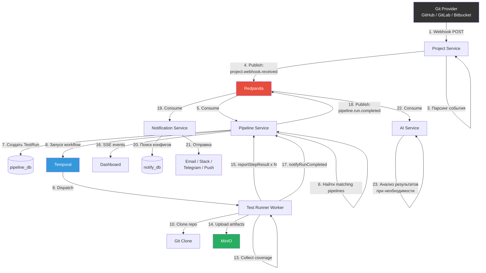

# Событийная архитектура

## Обзор

Testing AI Assistant использует двухуровневую событийную модель:

1. **Redpanda (Kafka API)** — межсервисные события с гарантией доставки
2. **EventEmitter2** — внутрисервисные события (in-process)

```mermaid
flowchart TD
    subgraph Межсервисные события
        RP[Redpanda<br/>Kafka-совместимый брокер<br/>:19092]
    end

    subgraph Внутрисервисные события
        EE[EventEmitter2<br/>In-process pub/sub]
    end

    SVC1[Сервис A] -->|KafkaJS produce| RP
    RP -->|KafkaJS consume| SVC2[Сервис B]

    SVC3[Модуль X] -->|emit| EE
    EE -->|@OnEvent| SVC4[Модуль Y]
```

## Топики Redpanda

### Список топиков

| Топик | Producer | Consumer | Описание |
|-------|----------|----------|----------|
| `project.webhook.received` | Project Service | Pipeline Service | Получен webhook от Git-провайдера |
| `pipeline.run.started` | Pipeline Service | Notification Service | Тестовый запуск начат |
| `pipeline.run.completed` | Pipeline Service | Notification Service, AI Service | Тестовый запуск завершён |
| `pipeline.step.completed` | Test Runner (via Pipeline) | Dashboard (SSE) | Шаг пайплайна завершён |
| `membership.requested` | Organization Service | Notification Service | Запрос на вступление |
| `membership.approved` | Organization Service | Notification Service | Членство одобрено |
| `membership.rejected` | Organization Service | Notification Service | Членство отклонено |
| `user.registered` | Identity Service | Organization Service | Новый пользователь зарегистрирован |
| `generation.completed` | AI Service | Notification Service | ИИ-генерация завершена |
| `coverage.changed` | Pipeline Service | Notification Service | Изменение покрытия кода |

### Payload-схемы

#### project.webhook.received

```json
{
  "projectId": "uuid",
  "provider": "GITHUB | GITLAB | BITBUCKET",
  "eventType": "push | pull_request",
  "branch": "main",
  "commitSha": "abc123def456",
  "author": {
    "login": "username",
    "email": "user@example.com"
  },
  "repository": {
    "owner": "org-name",
    "name": "repo-name",
    "url": "https://github.com/org-name/repo-name"
  },
  "pullRequest": {
    "number": 42,
    "title": "Fix bug",
    "sourceBranch": "feature/fix",
    "targetBranch": "main"
  },
  "timestamp": "2025-01-15T10:30:00.000Z"
}
```

#### pipeline.run.completed

```json
{
  "runId": "uuid",
  "pipelineId": "uuid",
  "projectId": "uuid",
  "status": "PASSED | FAILED | ERRORED",
  "commitSha": "abc123def456",
  "branch": "main",
  "triggeredBy": "user-id | webhook",
  "startedAt": "2025-01-15T10:30:00.000Z",
  "finishedAt": "2025-01-15T10:35:00.000Z",
  "results": [
    {
      "checkType": "UNIT",
      "status": "PASSED",
      "summary": "156 tests passed",
      "durationMs": 12450
    }
  ],
  "coverage": {
    "linePct": 85.5,
    "branchPct": 72.3,
    "functionPct": 91.2
  },
  "artifactUrls": ["https://minio/test-artifacts/runs/..."]
}
```

#### membership.requested

```json
{
  "membershipId": "cuid",
  "orgId": "cuid",
  "orgName": "Organization Name",
  "userId": "cuid",
  "userName": "User Name",
  "userEmail": "user@example.com",
  "role": "MEMBER",
  "requestedAt": "2025-01-15T10:30:00.000Z"
}
```

#### generation.completed

```json
{
  "generationId": "uuid",
  "projectId": "uuid",
  "type": "TEST_GEN | BUG_DETECT | FLAKY_DETECT | COVERAGE_ADVICE",
  "model": "gpt-4.1-mini",
  "tokensUsed": 2450,
  "timestamp": "2025-01-15T10:30:00.000Z"
}
```

## Полный поток данных

### От webhook до уведомления



## Таблица типов событий

### Межсервисные события (Redpanda)

| Событие | Producer | Consumer(s) | Триггер |
|---------|----------|------------|---------|
| `project.webhook.received` | Project | Pipeline | Входящий webhook от Git |
| `pipeline.run.started` | Pipeline | Notification | Temporal workflow начат |
| `pipeline.run.completed` | Pipeline | Notification, AI | Temporal workflow завершён |
| `pipeline.step.completed` | Pipeline | — (SSE) | Шаг завершён в workflow |
| `membership.requested` | Organization | Notification | POST /invite |
| `membership.approved` | Organization | Notification | PATCH /approve |
| `membership.rejected` | Organization | Notification | PATCH /reject |
| `user.registered` | Identity | Organization | POST /register |
| `generation.completed` | AI | Notification | POST /ai/generate завершён |
| `coverage.changed` | Pipeline | Notification | Изменение метрик покрытия |

### Внутрисервисные события (EventEmitter2)

| Событие | Сервис | Описание |
|---------|--------|----------|
| `auth.login.success` | Identity | Успешный вход пользователя |
| `auth.login.failed` | Identity | Неудачная попытка входа |
| `auth.token.refreshed` | Identity | Токен обновлён |
| `pipeline.trigger.matched` | Pipeline | Pipeline совпал с триггером |
| `testrun.status.changed` | Pipeline | Изменение статуса TestRun |
| `generation.started` | AI | Начало ИИ-генерации |
| `notification.sent` | Notification | Уведомление отправлено |
| `notification.failed` | Notification | Ошибка отправки уведомления |

## Конфигурация Redpanda

### Consumer Groups

| Consumer Group | Сервис | Топики |
|---------------|--------|--------|
| `pipeline-service` | Pipeline | `project.webhook.received` |
| `notification-service` | Notification | `pipeline.run.*`, `membership.*`, `generation.*`, `coverage.*` |
| `ai-service` | AI | `pipeline.run.completed` |
| `org-service` | Organization | `user.registered` |

### Параметры подключения

```
KAFKA_BROKERS=localhost:19092
```

- **Протокол**: Kafka API (совместимый с Redpanda)
- **Schema Registry**: `localhost:18081`
- **Redpanda Console**: `localhost:18080` (веб-интерфейс для мониторинга)

### Гарантии доставки

| Параметр | Значение |
|----------|----------|
| Гарантия | At-least-once |
| Ack | `all` (все реплики подтвердили) |
| Retry | Автоматический (KafkaJS) |
| Idempotency | На стороне consumer (по ID события) |
