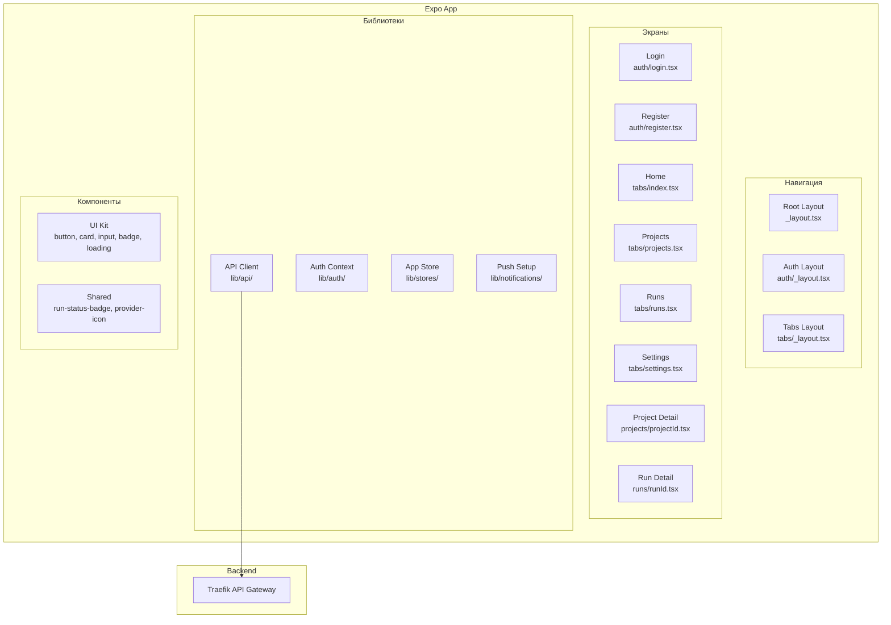
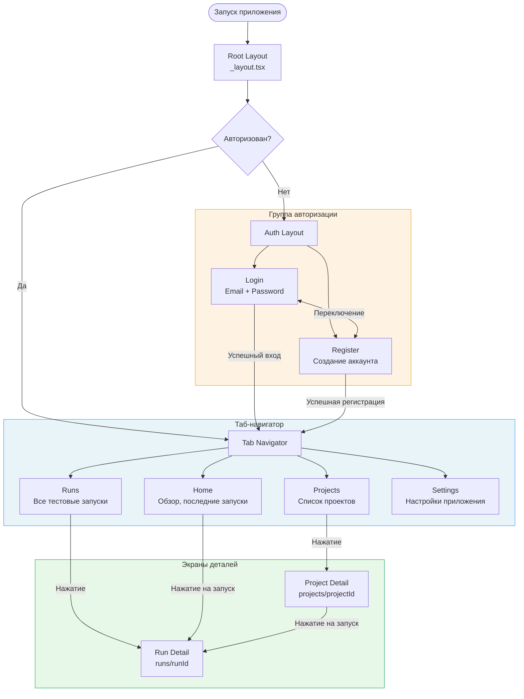
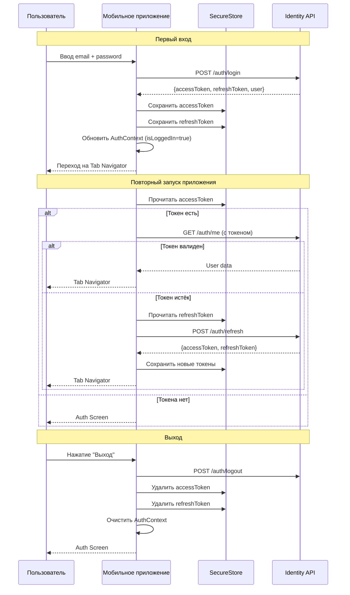
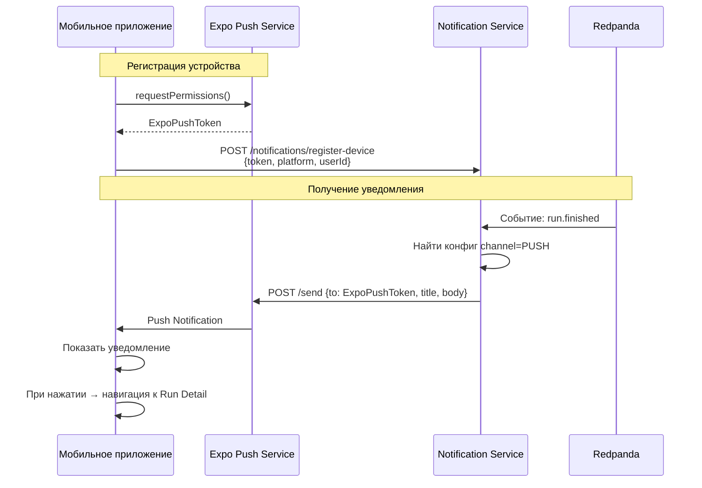

# Мобильное приложение

## Обзор

| Параметр | Значение |
|----------|----------|
| **Фреймворк** | Expo (React Native) |
| **Язык** | TypeScript |
| **Навигация** | Expo Router (file-based routing) |
| **Хранилище** | Zustand |
| **Безопасное хранилище** | expo-secure-store |
| **Push-уведомления** | Expo Notifications |

## Архитектура



## Карта экранов



## Поток авторизации

### SecureStore

Мобильное приложение использует `expo-secure-store` для безопасного хранения токенов в зашифрованном хранилище устройства (Keychain на iOS, EncryptedSharedPreferences на Android).



## Push-уведомления

### Архитектура



### Типы push-уведомлений

| Событие | Заголовок | Действие при нажатии |
|---------|-----------|---------------------|
| `run.finished` (PASSED) | "Тесты пройдены" | Открыть Run Detail |
| `run.finished` (FAILED) | "Тесты провалены" | Открыть Run Detail |
| `membership.approved` | "Приглашение принято" | Открыть Home |
| `generation.completed` | "AI-анализ готов" | Открыть Project Detail |

## Интеграция с API

### API Client

Файл `lib/api/client.ts` реализует базовый HTTP-клиент с автоматическим добавлением токена:

```typescript
// Упрощённая структура
class ApiClient {
  private baseUrl: string;

  async request(path: string, options?: RequestInit) {
    const token = await SecureStore.getItemAsync('accessToken');
    const response = await fetch(`${this.baseUrl}${path}`, {
      ...options,
      headers: {
        'Content-Type': 'application/json',
        Authorization: token ? `Bearer ${token}` : '',
        ...options?.headers,
      },
    });

    if (response.status === 401) {
      // Попытка обновления токена
      await this.refreshToken();
      return this.request(path, options);
    }

    return response.json();
  }
}
```

### API-модули

| Модуль | Файл | Описание |
|--------|------|----------|
| Auth | `lib/api/auth.ts` | Логин, регистрация, refresh |
| Organizations | `lib/api/organizations.ts` | Список организаций, участники |
| Projects | `lib/api/projects.ts` | CRUD проектов |
| Test Runs | `lib/api/test-runs.ts` | Запуски и результаты |

## Управление состоянием

### Zustand Store

```typescript
// lib/stores/app-store.ts
interface AppStore {
  // Auth
  user: User | null;
  isLoggedIn: boolean;

  // Organizations
  currentOrg: Organization | null;
  organizations: Organization[];

  // Actions
  setUser: (user: User | null) => void;
  setCurrentOrg: (org: Organization) => void;
  logout: () => void;
}
```

## UI-компоненты

| Компонент | Файл | Описание |
|-----------|------|----------|
| `Button` | `components/ui/button.tsx` | Кнопка с вариантами стилей |
| `Card` | `components/ui/card.tsx` | Карточка-контейнер |
| `Input` | `components/ui/input.tsx` | Текстовое поле ввода |
| `Badge` | `components/ui/badge.tsx` | Метка/бейдж |
| `Loading` | `components/ui/loading.tsx` | Индикатор загрузки |
| `RunStatusBadge` | `components/shared/run-status-badge.tsx` | Бейдж статуса запуска (PASSED/FAILED/...) |
| `ProviderIcon` | `components/shared/provider-icon.tsx` | Иконка Git-провайдера |

## Структура файлов

```
apps/mobile/
├── src/
│   ├── app/                    # Expo Router (file-based)
│   │   ├── _layout.tsx         # Root layout
│   │   ├── index.tsx           # Entry redirect
│   │   ├── auth/
│   │   │   ├── _layout.tsx     # Auth layout
│   │   │   ├── login.tsx       # Login screen
│   │   │   └── register.tsx    # Register screen
│   │   ├── (tabs)/
│   │   │   ├── _layout.tsx     # Tab navigator
│   │   │   ├── index.tsx       # Home tab
│   │   │   ├── projects.tsx    # Projects tab
│   │   │   ├── runs.tsx        # Runs tab
│   │   │   └── settings.tsx    # Settings tab
│   │   ├── projects/
│   │   │   └── [projectId].tsx # Project detail
│   │   └── runs/
│   │       └── [runId].tsx     # Run detail
│   ├── components/
│   │   ├── ui/                 # Базовые UI-компоненты
│   │   └── shared/             # Общие компоненты
│   ├── lib/
│   │   ├── api/                # HTTP-клиент и API-модули
│   │   ├── auth/               # AuthContext
│   │   ├── notifications/      # Push-уведомления
│   │   └── stores/             # Zustand stores
│   └── types/                  # TypeScript типы
```
