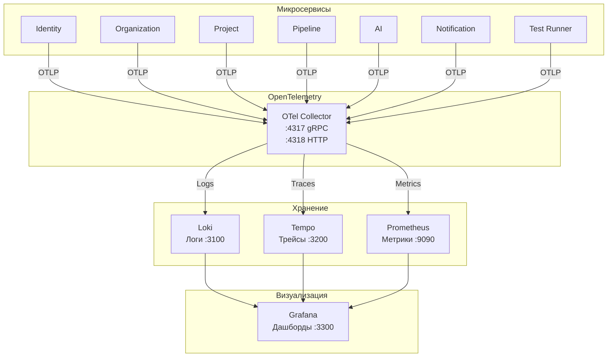
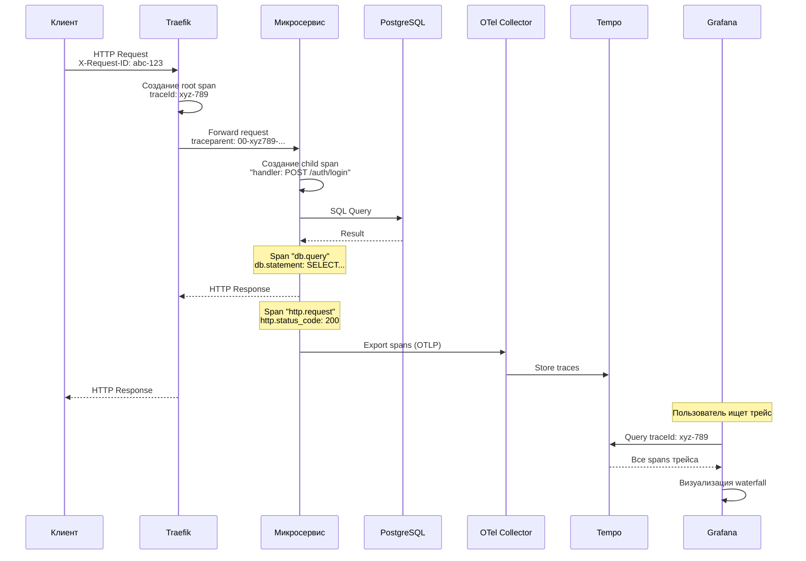

# Наблюдаемость

## Обзор

Система наблюдаемости Testing AI Assistant построена на трёх столпах: **логи**, **трейсы** и **метрики**. Все данные телеметрии собираются через OpenTelemetry Collector и визуализируются в Grafana.



## Настройка OpenTelemetry

### Конфигурация SDK

Каждый микросервис инициализирует OpenTelemetry SDK при запуске:

```typescript
// Пример настройки в NestJS сервисе
import { OTLPTraceExporter } from '@opentelemetry/exporter-trace-otlp-http';
import { OTLPLogExporter } from '@opentelemetry/exporter-logs-otlp-http';

const traceExporter = new OTLPTraceExporter({
  url: process.env.OTEL_EXPORTER_OTLP_ENDPOINT + '/v1/traces',
});

const logExporter = new OTLPLogExporter({
  url: process.env.OTEL_EXPORTER_OTLP_ENDPOINT + '/v1/logs',
});
```

### Переменные окружения

| Переменная | Значение | Описание |
|-----------|----------|----------|
| `OTEL_EXPORTER_OTLP_ENDPOINT` | `http://localhost:4318` | HTTP-эндпоинт OTel Collector |
| `OTEL_SERVICE_NAME` | `testing-ai` | Имя сервиса (перезаписывается для каждого) |
| `OTEL_RESOURCE_ATTRIBUTES` | `deployment.environment=dev` | Атрибуты ресурса |

### Конфигурация OTel Collector

```yaml
# otel-collector-config.yml
receivers:
  otlp:
    protocols:
      grpc:
        endpoint: 0.0.0.0:4317
      http:
        endpoint: 0.0.0.0:4318

processors:
  batch:
    timeout: 5s
    send_batch_size: 1024

exporters:
  loki:
    endpoint: http://loki:3100/loki/api/v1/push
  otlp/tempo:
    endpoint: tempo:4317
    tls:
      insecure: true
  prometheus:
    endpoint: 0.0.0.0:8889

service:
  pipelines:
    traces:
      receivers: [otlp]
      processors: [batch]
      exporters: [otlp/tempo]
    logs:
      receivers: [otlp]
      processors: [batch]
      exporters: [loki]
    metrics:
      receivers: [otlp]
      processors: [batch]
      exporters: [prometheus]
```

## Поток трейсинга



### Атрибуты span

| Атрибут | Описание | Пример |
|---------|----------|--------|
| `service.name` | Имя сервиса | `identity-service` |
| `http.method` | HTTP-метод | `POST` |
| `http.route` | Маршрут | `/auth/login` |
| `http.status_code` | Код ответа | `200` |
| `db.system` | СУБД | `postgresql` |
| `db.statement` | SQL-запрос | `SELECT * FROM users WHERE...` |
| `messaging.system` | Брокер | `kafka` |
| `messaging.destination` | Топик | `pipeline.run.completed` |

## Логирование (Loki)

### Структурированные логи

Все сервисы используют структурированное JSON-логирование:

```json
{
  "timestamp": "2025-01-15T10:30:00.000Z",
  "level": "info",
  "service": "pipeline-service",
  "traceId": "xyz789abc...",
  "spanId": "def456...",
  "message": "Test run completed",
  "metadata": {
    "runId": "uuid-123",
    "status": "PASSED",
    "durationMs": 45600
  }
}
```

### Уровни логирования

| Уровень | Использование |
|---------|--------------|
| `error` | Ошибки, требующие внимания |
| `warn` | Предупреждения (retry, degradation) |
| `info` | Важные бизнес-события |
| `debug` | Детальная информация для отладки |
| `verbose` | Максимально подробная информация |

### Запросы LogQL (Loki)

```logql
# Все ошибки identity-service за последний час
{service="identity-service"} |= "error" | json | level="error"

# Медленные запросы (>1000ms)
{service=~".*-service"} | json | durationMs > 1000

# Провалившиеся тестовые запуски
{service="pipeline-service"} |= "run.completed" | json | status="FAILED"
```

## Трейсинг (Tempo)

### Конфигурация Tempo

```yaml
# tempo-config.yml
server:
  http_listen_port: 3200

distributor:
  receivers:
    otlp:
      protocols:
        grpc:

storage:
  trace:
    backend: local
    local:
      path: /tmp/tempo/blocks
```

### Поиск трейсов в Grafana

| Критерий поиска | Пример |
|----------------|--------|
| По traceId | `xyz789abc123` |
| По сервису | `service.name = "pipeline-service"` |
| По HTTP-коду | `http.status_code = 500` |
| По длительности | `duration > 5s` |
| По маршруту | `http.route = "/auth/login"` |

## Метрики (Prometheus)

### Типы метрик

| Метрика | Тип | Описание |
|---------|-----|----------|
| `http_requests_total` | Counter | Общее количество HTTP-запросов |
| `http_request_duration_seconds` | Histogram | Длительность HTTP-запросов |
| `http_requests_in_flight` | Gauge | Текущие активные запросы |
| `db_query_duration_seconds` | Histogram | Длительность SQL-запросов |
| `kafka_messages_produced_total` | Counter | Отправленные сообщения в Kafka |
| `kafka_messages_consumed_total` | Counter | Полученные сообщения из Kafka |
| `test_runs_total` | Counter | Общее количество тестовых запусков |
| `test_run_duration_seconds` | Histogram | Длительность тестовых запусков |
| `ai_generation_tokens_total` | Counter | Использованные AI-токены |
| `ai_generation_duration_seconds` | Histogram | Длительность AI-генераций |

### Scrape-конфигурация Prometheus

```yaml
# prometheus.yml
scrape_configs:
  - job_name: 'otel-collector'
    scrape_interval: 15s
    static_configs:
      - targets: ['otel-collector:8889']
```

## Дашборды Grafana

### Предустановленные дашборды

| Дашборд | Описание | Панели |
|---------|----------|--------|
| **System Overview** | Общий обзор здоровья системы | Статус сервисов, error rate, latency P95 |
| **API Performance** | Производительность API | RPS, latency по эндпоинтам, error rate |
| **Test Runs** | Мониторинг тестовых запусков | Количество запусков, статусы, длительность |
| **AI Generations** | Мониторинг AI-генераций | Количество, токены, длительность, acceptance rate |
| **Kafka Monitoring** | Мониторинг Redpanda | Lag, throughput, error rate по топикам |
| **Database** | Мониторинг PostgreSQL | Connections, query time, cache hit ratio |
| **Infrastructure** | Мониторинг инфраструктуры | CPU, RAM, Disk, Network |

### Доступ к Grafana

| Параметр | Значение |
|----------|----------|
| URL | http://localhost:3300 |
| Логин | `admin` |
| Пароль | `admin` |
| Anonymous access | Включён (role: Viewer) |

### Источники данных

| Источник | Тип | URL |
|----------|-----|-----|
| Loki | Логи | http://loki:3100 |
| Tempo | Трейсы | http://tempo:3200 |
| Prometheus | Метрики | http://prometheus:9090 |

## Алертинг

### Примеры правил алертов

| Алерт | Условие | Severity |
|-------|---------|----------|
| HighErrorRate | error_rate > 5% за 5 мин | critical |
| SlowAPI | P95 latency > 2s за 10 мин | warning |
| TestRunStuck | TestRun в RUNNING > 60 мин | warning |
| KafkaLag | Consumer lag > 10000 | warning |
| DatabaseConnections | Connections > 80% от max | critical |
| DiskSpaceLow | Disk usage > 85% | warning |
