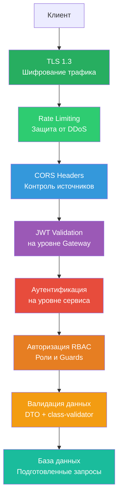
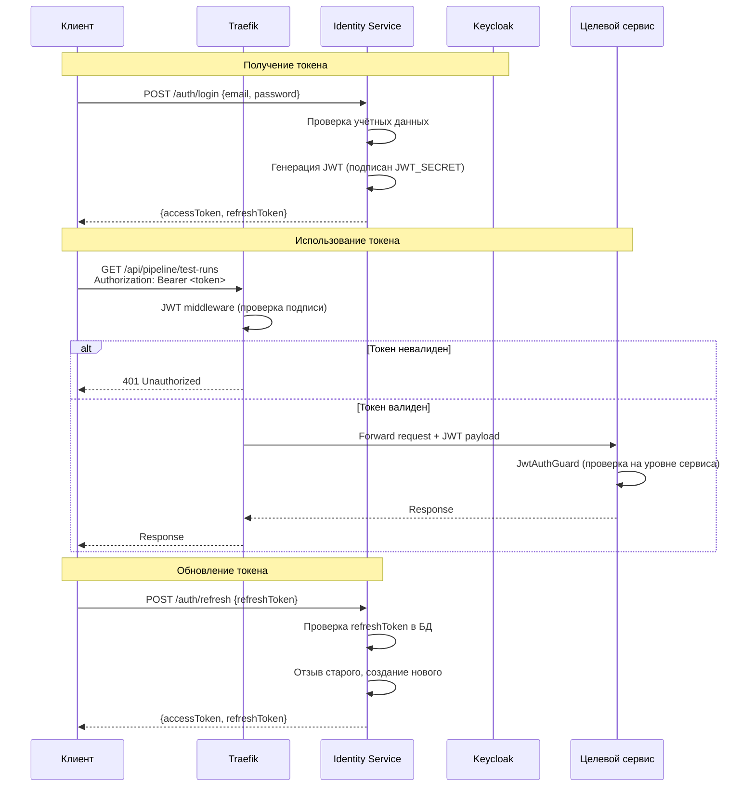
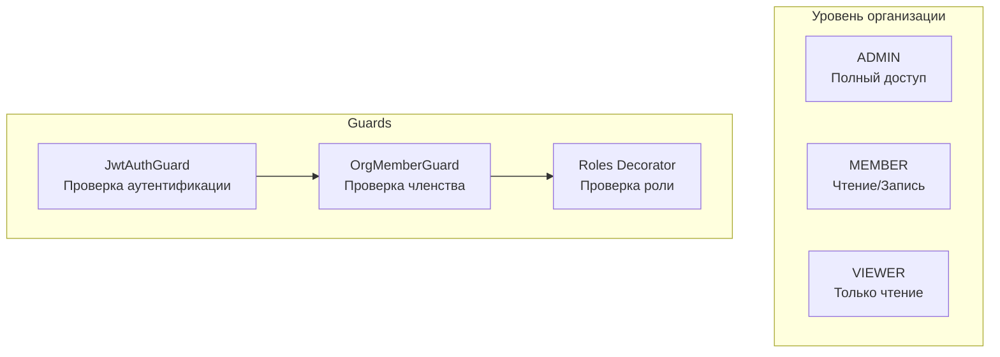
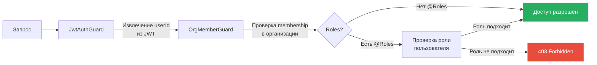
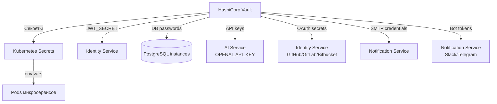

# Безопасность

## Обзор модели безопасности

Testing AI Assistant реализует многослойную модель безопасности (Defence in Depth):



## Аутентификация

### Keycloak + JWT



### Структура JWT-токена

```
Header:  { "alg": "HS256", "typ": "JWT" }
Payload: { "sub": "user-id", "email": "...", "name": "...", "iat": ..., "exp": ... }
```

| Параметр | Значение |
|----------|----------|
| Алгоритм | HS256 |
| TTL access token | 1 час |
| TTL refresh token | 7 дней |
| Хранение refresh token | БД (identity_db) |
| Отзыв refresh token | Поле `revokedAt` |

## Модель авторизации

### Ролевая модель (RBAC)



### Цепочка Guards



### Матрица доступа

| Ресурс / Действие | ADMIN | MEMBER | VIEWER | Публичный |
|--------------------|-------|--------|--------|-----------|
| Регистрация | - | - | - | + |
| Логин | - | - | - | + |
| Управление участниками | + | - | - | - |
| Создание проекта | + | + | - | - |
| Просмотр проекта | + | + | + | - |
| Настройка webhook | + | + | - | - |
| Создание пайплайна | + | + | - | - |
| Запуск тестов | + | + | - | - |
| Просмотр результатов | + | + | + | - |
| AI-генерация | + | + | - | - |
| Настройка уведомлений | + | - | - | - |

## Middleware безопасности Traefik

### Rate Limiting

```yaml
# Для маршрутов аутентификации
rate-limit-auth:
  rateLimit:
    average: 10      # 10 запросов
    period: 1m       # в минуту
    burst: 5         # пиковый burst

# Для остальных маршрутов
rate-limit-global:
  rateLimit:
    average: 100     # 100 запросов
    period: 1m       # в минуту
    burst: 50        # пиковый burst
```

### Заголовки безопасности

```yaml
cors-headers:
  headers:
    accessControlAllowMethods:
      - GET
      - POST
      - PATCH
      - DELETE
      - OPTIONS
    accessControlAllowHeaders:
      - Authorization
      - Content-Type
    accessControlAllowOriginList:
      - https://app.testing-ai.example.com
    accessControlMaxAge: 3600
    frameDeny: true
    contentTypeNosniff: true
    browserXssFilter: true
    referrerPolicy: "strict-origin-when-cross-origin"
    stsSeconds: 31536000
    stsIncludeSubdomains: true
```

### JWT Middleware

```yaml
jwt-auth:
  forwardAuth:
    address: http://identity-service:3001/auth/verify
    authResponseHeaders:
      - X-User-Id
      - X-User-Email
```

### Конфигурация TLS

```yaml
tls:
  certResolver: letsencrypt
  options:
    default:
      minVersion: VersionTLS12
      cipherSuites:
        - TLS_ECDHE_RSA_WITH_AES_128_GCM_SHA256
        - TLS_ECDHE_RSA_WITH_AES_256_GCM_SHA384
        - TLS_ECDHE_ECDSA_WITH_AES_128_GCM_SHA256
```

## Управление секретами через Vault

### Архитектура



### Хранимые секреты

| Секрет | Сервис | Описание |
|--------|--------|----------|
| `JWT_SECRET` | Identity | Ключ подписи JWT |
| `*_DB_URL` | Все сервисы | Строки подключения к БД (с паролями) |
| `OPENAI_API_KEY` | AI | Ключ API OpenAI |
| `GITHUB_CLIENT_SECRET` | Identity | OAuth секрет GitHub |
| `GITLAB_CLIENT_SECRET` | Identity | OAuth секрет GitLab |
| `BITBUCKET_CLIENT_SECRET` | Identity | OAuth секрет Bitbucket |
| `SMTP_PASS` | Notification | Пароль SMTP |
| `SLACK_BOT_TOKEN` | Notification | Токен Slack бота |
| `TELEGRAM_BOT_TOKEN` | Notification | Токен Telegram бота |
| `MINIO_SECRET_KEY` | Test Runner | Секретный ключ MinIO |
| `NEXTAUTH_SECRET` | Dashboard | Секрет NextAuth |
| `KEYCLOAK_ADMIN_PASSWORD` | Keycloak | Пароль администратора |

## OWASP-рекомендации

### Реализованные меры

| OWASP Top 10 | Мера | Реализация |
|--------------|------|-----------|
| **A01: Broken Access Control** | RBAC с Guards | `JwtAuthGuard`, `OrgMemberGuard`, `@Roles()` |
| **A02: Cryptographic Failures** | TLS + bcrypt | TLS 1.2+ на Traefik, bcrypt для паролей |
| **A03: Injection** | Параметризованные запросы | Prisma ORM (prepared statements) |
| **A04: Insecure Design** | Принцип минимальных привилегий | Database-per-service, роли организации |
| **A05: Security Misconfiguration** | Заголовки безопасности | Traefik middleware (CSP, XSS, HSTS) |
| **A06: Vulnerable Components** | Аудит зависимостей | `dep_audit` шаг в pipeline (npm audit / Snyk) |
| **A07: Auth Failures** | Rate limiting + token rotation | Rate limit на /auth/*, refresh token rotation |
| **A08: Data Integrity** | Webhook verification | HMAC подпись webhooks |
| **A09: Logging Failures** | Структурированные логи | OpenTelemetry + Loki (все действия логируются) |
| **A10: SSRF** | Валидация URL | Whitelist для Git-провайдеров, валидация callback URL |

### Дополнительные меры

| Мера | Описание |
|------|----------|
| **Мягкое удаление** | `deletedAt` вместо физического DELETE — для аудита |
| **Хэширование паролей** | bcrypt с cost factor 10+ |
| **CORS** | Строгий whitelist доменов |
| **Helmet** | NestJS Helmet middleware (HTTP headers) |
| **Validation** | class-validator + class-transformer (DTO) |
| **Sanitization** | Входные данные очищаются от HTML/JS |

## Конфигурация TLS

### Автоматические сертификаты (Let's Encrypt)

```yaml
# traefik.yml
certificatesResolvers:
  letsencrypt:
    acme:
      email: admin@testing-ai.example.com
      storage: /acme/acme.json
      httpChallenge:
        entryPoint: web
```

### Минимальная версия TLS

- **Production**: TLS 1.2 (минимум)
- **Рекомендация**: TLS 1.3

### Cipher Suites

Только современные, безопасные cipher suites:
- `TLS_ECDHE_RSA_WITH_AES_128_GCM_SHA256`
- `TLS_ECDHE_RSA_WITH_AES_256_GCM_SHA384`
- `TLS_ECDHE_ECDSA_WITH_AES_128_GCM_SHA256`
- `TLS_AES_128_GCM_SHA256` (TLS 1.3)
- `TLS_AES_256_GCM_SHA384` (TLS 1.3)
