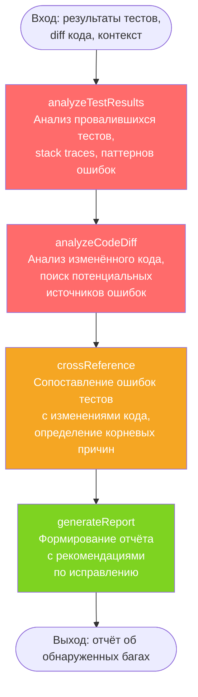
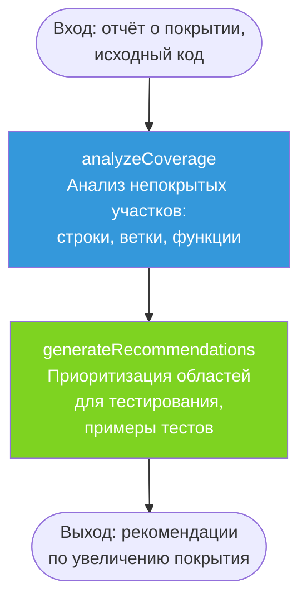
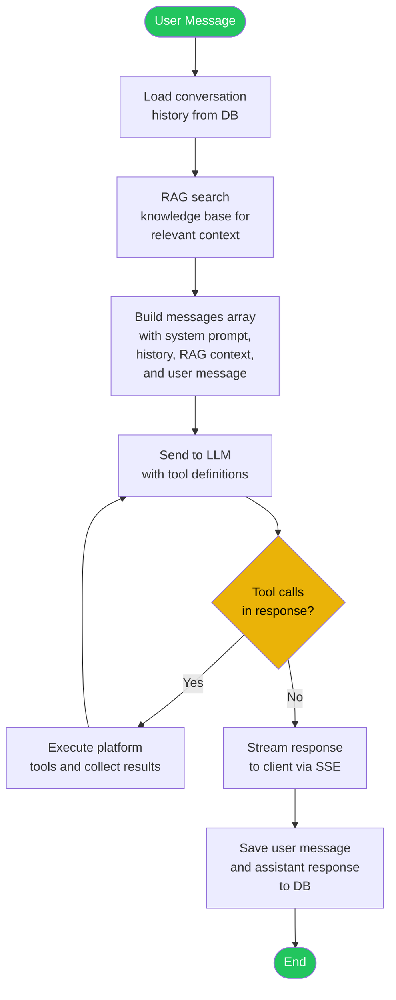
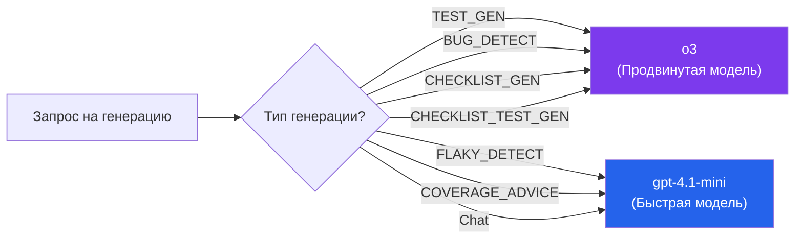

# AI Service — Сервис искусственного интеллекта

## Общие сведения

| Параметр | Значение |
|----------|----------|
| **Назначение** | ИИ-генерация тестов, обнаружение багов, выявление flaky-тестов, анализ покрытия |
| **Порт** | 3005 |
| **БД** | `ai_db` (PostgreSQL :5440) |
| **Фреймворк** | NestJS |
| **ORM** | Prisma |
| **Маршрут Gateway** | `/api/ai` |
| **LLM** | OpenAI (gpt-4.1-mini / o3) |

## Prisma-схема

### Модели

```
AIGeneration
├── id: String (uuid)
├── projectId: String
├── type: GenerationType (TEST_GEN | BUG_DETECT | FLAKY_DETECT | COVERAGE_ADVICE)
├── inputContext: Json (входные данные для агента)
├── output: String (Text — результат генерации)
├── model: String (использованная модель)
├── tokensUsed: Int (количество использованных токенов)
├── accepted: Boolean? (принял ли пользователь результат)
├── feedback: String? (текстовый отзыв)
└── createdAt: DateTime

Conversation
├── id: String (uuid)
├── projectId: String
├── userId: String
├── title: String? (заголовок беседы)
├── createdAt: DateTime
├── updatedAt: DateTime
└── messages: ChatMessage[] (связанные сообщения)

ChatMessage
├── id: String (uuid)
├── conversationId: String (FK → Conversation)
├── role: ChatMessageRole (USER | ASSISTANT | SYSTEM | TOOL)
├── content: String (Text — содержимое сообщения)
├── toolCalls: Json? (вызовы инструментов)
├── tokensUsed: Int (количество использованных токенов)
├── model: String? (использованная модель)
└── createdAt: DateTime

KnowledgeChunk
├── id: String (uuid)
├── projectId: String? (опциональная привязка к проекту)
├── source: String (путь к исходному документу)
├── title: String? (заголовок чанка)
├── content: String (Text — текстовое содержимое)
├── embedding: vector? (вектор эмбеддинга, pgvector)
├── tokens: Int (количество токенов в чанке)
├── createdAt: DateTime
└── updatedAt: DateTime
```

### Перечисления

| Enum | Значения | Описание |
|------|---------|----------|
| `GenerationType` | `TEST_GEN` | Генерация тестов |
| | `BUG_DETECT` | Обнаружение багов |
| | `FLAKY_DETECT` | Выявление нестабильных тестов |
| | `COVERAGE_ADVICE` | Рекомендации по покрытию |

## API-эндпоинты

| Метод | Путь | Авторизация | Описание |
|-------|------|-------------|----------|
| `POST` | `/ai/generate` | Bearer JWT | Запустить ИИ-генерацию |
| `GET` | `/ai/generations?projectId=&type=` | Bearer JWT | Список генераций проекта |
| `GET` | `/ai/generations/stats?projectId=` | Bearer JWT | Статистика генераций |
| `GET` | `/ai/generations/:id` | Bearer JWT | Детали конкретной генерации |
| `PATCH` | `/ai/generations/:id/feedback` | Bearer JWT | Обратная связь (принять/отклонить) |
| `POST` | `/ai/chat` | Bearer JWT | Отправить сообщение в чат (SSE поток) |
| `GET` | `/ai/chat/conversations?projectId=` | Bearer JWT | Список бесед |
| `GET` | `/ai/chat/conversations/:id` | Bearer JWT | Получить беседу с сообщениями |
| `DELETE` | `/ai/chat/conversations/:id` | Bearer JWT | Удалить беседу |
| `POST` | `/ai/knowledge/index` | Bearer JWT | Переиндексация документации |
| `GET` | `/ai/knowledge/search?q=&projectId=` | Bearer JWT | Поиск по базе знаний |

## Архитектура LangGraph-агентов

Каждый тип генерации реализован как граф состояний (LangGraph), определяющий последовательность шагов обработки.

### 1. Генератор тестов (TEST_GEN)


**Описание шагов:**

| Шаг | Модель | Описание |
|-----|--------|----------|
| `analyzeCode` | fast (gpt-4.1-mini) | Извлечение структуры: классы, функции, типы, зависимости |
| `generateTests` | advanced (o3) | Генерация unit/integration тестов с учётом edge cases |
| `validateTests` | fast (gpt-4.1-mini) | Синтаксическая проверка, валидация импортов |
| `refineTests` | advanced (o3) | Исправление ошибок по результатам валидации (до 3 итераций) |
| `formatOutput` | fast (gpt-4.1-mini) | Финальное форматирование и добавление комментариев |

### 2. Детектор багов (BUG_DETECT)



**Описание шагов:**

| Шаг | Модель | Описание |
|-----|--------|----------|
| `analyzeTestResults` | fast | Парсинг результатов, группировка по типам ошибок |
| `analyzeCodeDiff` | advanced | Глубокий анализ diff, поиск антипаттернов |
| `crossReference` | advanced | Корреляция ошибок и изменений, выявление корневой причины |
| `generateReport` | fast | Структурированный отчёт с приоритетами и рекомендациями |

### 3. Детектор flaky-тестов (FLAKY_DETECT)


**Описание шагов:**

| Шаг | Модель | Описание |
|-----|--------|----------|
| `statisticalAnalysis` | fast | Вычисление метрик: pass rate, средняя длительность, стандартное отклонение |
| `patternDetection` | advanced | Выявление причин нестабильности: race conditions, shared state, network |
| `generateRecommendations` | fast | Конкретные рекомендации по каждому flaky-тесту |

### 4. Советник по покрытию (COVERAGE_ADVICE)



**Описание шагов:**

| Шаг | Модель | Описание |
|-----|--------|----------|
| `analyzeCoverage` | fast | Парсинг отчёта, выявление критических непокрытых путей |
| `generateRecommendations` | advanced | Приоритизированные рекомендации с примерами тестового кода |

## Архитектура чат-агента

Чат-агент предоставляет разговорный интерфейс для взаимодействия с платформой. Он поддерживает многоходовые беседы с вызовом инструментов, контекстом из RAG базы знаний и потоковой передачей ответов через SSE.



**Маршрутизация моделей**: Используется быстрая модель (gpt-4.1-mini) для низколатентных разговорных ответов.

**Хранение бесед**: Каждая беседа сохраняется с полной историей сообщений. Беседы привязаны к проекту и пользователю, что позволяет задавать контекстные уточняющие вопросы.

**Цикл инструментов**: Когда LLM решает вызвать инструмент, агент выполняет его и передаёт результат обратно в LLM. Этот цикл продолжается до тех пор, пока LLM не сформирует финальный текстовый ответ.

## RAG база знаний

База знаний обеспечивает генерацию с дополнением извлечением (RAG), индексируя документацию в векторные эмбеддинги для семантического поиска.

### Принцип работы

- Документация из `docs/en/` и `user_docs/en/` индексируется в записи `KnowledgeChunk`
- Текст разбивается на чанки по ~500 токенов с перекрытием для сохранения контекста на границах
- Эмбеддинги генерируются через OpenAI `text-embedding-3-small` (1536 измерений)
- Эмбеддинги хранятся в колонках pgvector для эффективного поиска по косинусному сходству
- При получении вопроса пользователя: эмбеддинг запроса, поиск top-K похожих чанков, внедрение в системный промпт в качестве контекста

### Пайплайн индексации и запросов

```mermaid
flowchart TD
    subgraph Indexing["Indexing Pipeline"]
        Docs["Read docs from<br/>docs/en/ and user_docs/en/"] --> Split
        Split["Split into ~500<br/>token chunks"] --> Embed
        Embed["Generate embeddings<br/>via text-embedding-3-small"] --> Store
        Store["Store chunks +<br/>vectors in pgvector"]
    end

    subgraph Query["Query Pipeline"]
        Question["User question"] --> EmbedQuery
        EmbedQuery["Embed query via<br/>text-embedding-3-small"] --> Search
        Search["Cosine similarity<br/>search in pgvector"] --> TopK
        TopK["Return top-K<br/>relevant chunks"] --> Inject
        Inject["Inject chunks into<br/>system prompt as context"]
    end

    style Docs fill:#2563eb,color:#fff
    style Store fill:#2563eb,color:#fff
    style Question fill:#22c55e,color:#fff
    style Inject fill:#22c55e,color:#fff
```



### Конфигурация

| Параметр | Значение по умолчанию | Описание |
|----------|----------------------|----------|
| Размер чанка | ~500 токенов | Целевой размер каждого текстового чанка |
| Перекрытие чанков | ~50 токенов | Перекрытие между последовательными чанками |
| Модель эмбеддинга | `text-embedding-3-small` | Модель OpenAI для эмбеддингов (1536 измерений) |
| Top-K | 5 | Количество чанков, возвращаемых на запрос |
| Порог сходства | 0.7 | Минимальная оценка косинусного сходства для включения |

## Инструменты платформы

Чат-агент имеет доступ к инструментам платформы, позволяющим ему запрашивать данные и взаимодействовать с платформой тестирования от имени пользователя.

| Инструмент | Описание | Целевой сервис |
|-----------|----------|----------------|
| `list_projects` | Список всех проектов, доступных пользователю | Project |
| `list_pipelines` | Список пайплайнов для заданного проекта | Pipeline |
| `trigger_pipeline` | Запуск нового пайплайна | Pipeline |
| `get_run_status` | Получение текущего статуса тестового запуска | Pipeline |
| `list_checklists` | Список тестовых чеклистов проекта | Pipeline |
| `create_checklist` | Создание нового тестового чеклиста | Pipeline |
| `run_checklist` | Выполнение запуска чеклиста | Pipeline |
| `get_checklist_run` | Получение статуса и результатов запуска чеклиста | Pipeline |
| `generate_tests` | Запуск ИИ-генерации тестов для исходного кода | AI |
| `search_knowledge` | Поиск по RAG базе знаний | AI |

Каждый инструмент определён с JSON Schema, описывающей его параметры. LLM самостоятельно решает, когда и как вызывать инструменты, основываясь на запросе пользователя. Результаты инструментов передаются обратно в LLM для включения в финальный ответ.

## Стратегия маршрутизации моделей

Система использует две модели OpenAI для оптимального баланса между скоростью и качеством.



### Распределение задач

| Модель | Переменная | Области использования | Характеристики |
|--------|-----------|----------------------|----------------|
| **gpt-4.1-mini** | `OPENAI_MODEL_FAST` | Детекция flaky, советы по покрытию, чат | Низкая задержка, низкая стоимость, достаточно для поиска паттернов и бесед |
| **o3** | `OPENAI_MODEL_ADVANCED` | Генерация тестов, обнаружение багов, генерация чеклистов, генерация тестов по чеклисту | Глубокое рассуждение, высокая точность для генерации кода |

### Параметры моделей

| Параметр | fast (gpt-4.1-mini) | advanced (o3) |
|----------|---------------------|---------------|
| Скорость | Высокая (~1-3 сек) | Средняя (~5-15 сек) |
| Стоимость | Низкая | Высокая |
| Качество рассуждений | Хорошее | Отличное |
| Контекстное окно | Большое | Большое |
| Применение | Парсинг, валидация, форматирование | Генерация, анализ, рефакторинг |

## Обратная связь

Пользователи могут оставить обратную связь по каждой генерации:

- **accepted: true** — результат принят, полезен
- **accepted: false** — результат отклонён
- **feedback** — текстовый комментарий

Данные обратной связи используются для улучшения промптов и анализа качества ИИ-генераций.
