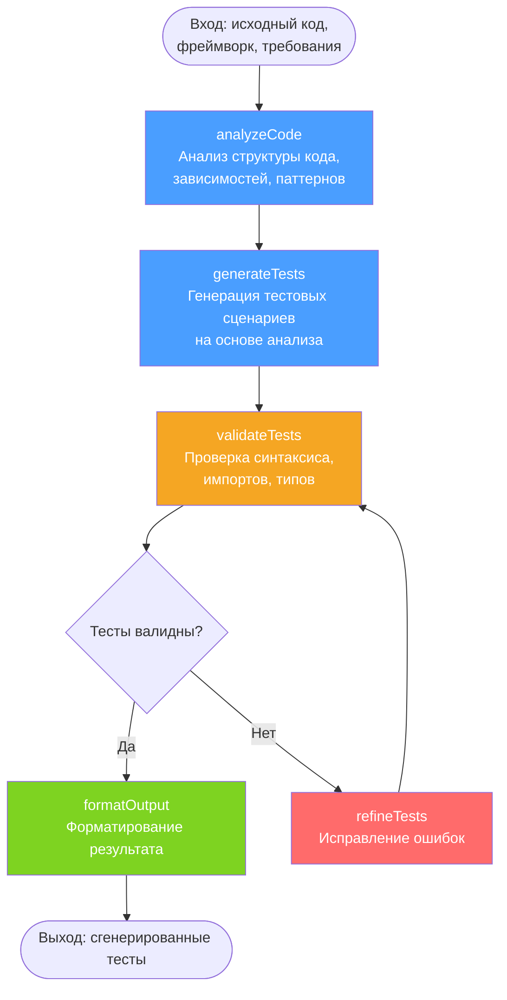
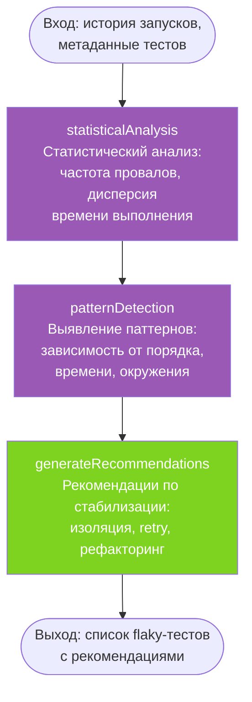
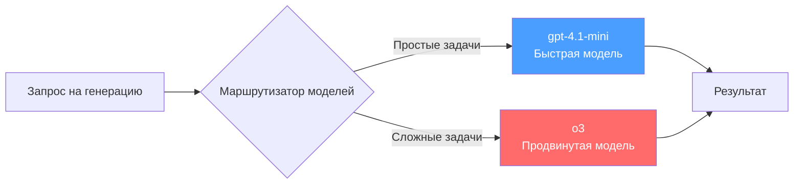

# AI Service — Сервис искусственного интеллекта

## Общие сведения

| Параметр | Значение |
|----------|----------|
| **Назначение** | ИИ-генерация тестов, обнаружение багов, выявление flaky-тестов, анализ покрытия |
| **Порт** | 3005 |
| **БД** | `ai_db` (PostgreSQL :5440) |
| **Фреймворк** | NestJS |
| **ORM** | Prisma |
| **Маршрут Gateway** | `/api/ai` |
| **LLM** | OpenAI (gpt-4.1-mini / o3) |

## Prisma-схема

### Модели

```
AIGeneration
├── id: String (uuid)
├── projectId: String
├── type: GenerationType (TEST_GEN | BUG_DETECT | FLAKY_DETECT | COVERAGE_ADVICE)
├── inputContext: Json (входные данные для агента)
├── output: String (Text — результат генерации)
├── model: String (использованная модель)
├── tokensUsed: Int (количество использованных токенов)
├── accepted: Boolean? (принял ли пользователь результат)
├── feedback: String? (текстовый отзыв)
└── createdAt: DateTime
```

### Перечисления

| Enum | Значения | Описание |
|------|---------|----------|
| `GenerationType` | `TEST_GEN` | Генерация тестов |
| | `BUG_DETECT` | Обнаружение багов |
| | `FLAKY_DETECT` | Выявление нестабильных тестов |
| | `COVERAGE_ADVICE` | Рекомендации по покрытию |

## API-эндпоинты

| Метод | Путь | Авторизация | Описание |
|-------|------|-------------|----------|
| `POST` | `/ai/generate` | Bearer JWT | Запустить ИИ-генерацию |
| `GET` | `/ai/generations?projectId=&type=` | Bearer JWT | Список генераций проекта |
| `GET` | `/ai/generations/stats?projectId=` | Bearer JWT | Статистика генераций |
| `GET` | `/ai/generations/:id` | Bearer JWT | Детали конкретной генерации |
| `PATCH` | `/ai/generations/:id/feedback` | Bearer JWT | Обратная связь (принять/отклонить) |

## Архитектура LangGraph-агентов

Каждый тип генерации реализован как граф состояний (LangGraph), определяющий последовательность шагов обработки.

### 1. Генератор тестов (TEST_GEN)



**Описание шагов:**

| Шаг | Модель | Описание |
|-----|--------|----------|
| `analyzeCode` | fast (gpt-4.1-mini) | Извлечение структуры: классы, функции, типы, зависимости |
| `generateTests` | advanced (o3) | Генерация unit/integration тестов с учётом edge cases |
| `validateTests` | fast (gpt-4.1-mini) | Синтаксическая проверка, валидация импортов |
| `refineTests` | advanced (o3) | Исправление ошибок по результатам валидации (до 3 итераций) |
| `formatOutput` | fast (gpt-4.1-mini) | Финальное форматирование и добавление комментариев |

### 2. Детектор багов (BUG_DETECT)


**Описание шагов:**

| Шаг | Модель | Описание |
|-----|--------|----------|
| `analyzeTestResults` | fast | Парсинг результатов, группировка по типам ошибок |
| `analyzeCodeDiff` | advanced | Глубокий анализ diff, поиск антипаттернов |
| `crossReference` | advanced | Корреляция ошибок и изменений, выявление корневой причины |
| `generateReport` | fast | Структурированный отчёт с приоритетами и рекомендациями |

### 3. Детектор flaky-тестов (FLAKY_DETECT)



**Описание шагов:**

| Шаг | Модель | Описание |
|-----|--------|----------|
| `statisticalAnalysis` | fast | Вычисление метрик: pass rate, средняя длительность, стандартное отклонение |
| `patternDetection` | advanced | Выявление причин нестабильности: race conditions, shared state, network |
| `generateRecommendations` | fast | Конкретные рекомендации по каждому flaky-тесту |

### 4. Советник по покрытию (COVERAGE_ADVICE)


**Описание шагов:**

| Шаг | Модель | Описание |
|-----|--------|----------|
| `analyzeCoverage` | fast | Парсинг отчёта, выявление критических непокрытых путей |
| `generateRecommendations` | advanced | Приоритизированные рекомендации с примерами тестового кода |

## Стратегия маршрутизации моделей

Система использует две модели OpenAI для оптимального баланса между скоростью и качеством.



### Распределение задач

| Задача | Модель | Обоснование |
|--------|--------|------------|
| Анализ структуры кода | fast (gpt-4.1-mini) | Извлечение метаданных — простая задача |
| Генерация тестов | advanced (o3) | Требует глубокого понимания логики |
| Валидация синтаксиса | fast (gpt-4.1-mini) | Формальная проверка |
| Рефайн/исправление | advanced (o3) | Требует анализа ошибок и контекста |
| Форматирование | fast (gpt-4.1-mini) | Механическое преобразование |
| Парсинг результатов | fast (gpt-4.1-mini) | Структурированные данные |
| Глубокий анализ diff | advanced (o3) | Поиск неочевидных зависимостей |
| Cross-reference | advanced (o3) | Корреляция разнородных данных |
| Генерация отчётов | fast (gpt-4.1-mini) | Шаблонный вывод |
| Выявление паттернов | advanced (o3) | Сложный анализ зависимостей |
| Рекомендации по покрытию | advanced (o3) | Приоритизация требует глубокого анализа |

### Параметры моделей

| Параметр | fast (gpt-4.1-mini) | advanced (o3) |
|----------|---------------------|---------------|
| Скорость | Высокая (~1-3 сек) | Средняя (~5-15 сек) |
| Стоимость | Низкая | Высокая |
| Качество рассуждений | Хорошее | Отличное |
| Контекстное окно | Большое | Большое |
| Применение | Парсинг, валидация, форматирование | Генерация, анализ, рефакторинг |

## Обратная связь

Пользователи могут оставить обратную связь по каждой генерации:

- **accepted: true** — результат принят, полезен
- **accepted: false** — результат отклонён
- **feedback** — текстовый комментарий

Данные обратной связи используются для улучшения промптов и анализа качества ИИ-генераций.
