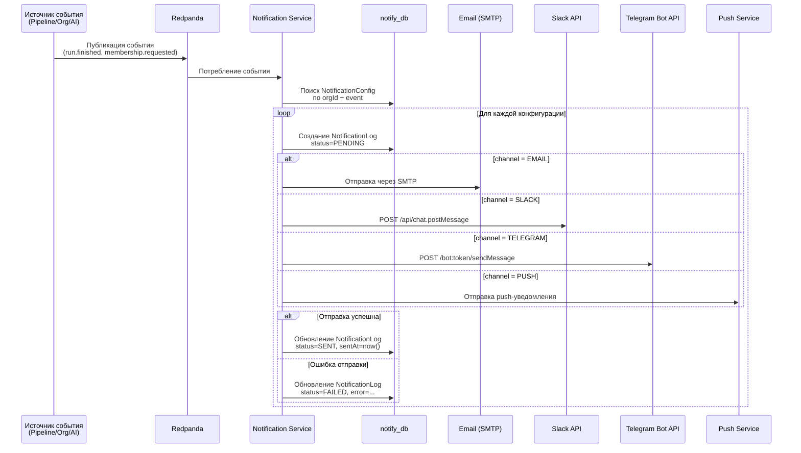

# Notification Service — Сервис уведомлений

## Общие сведения

| Параметр | Значение |
|----------|----------|
| **Назначение** | Многоканальная доставка уведомлений (email, Slack, Telegram, push) |
| **Порт** | 3006 |
| **БД** | `notify_db` (PostgreSQL :5439) |
| **Фреймворк** | NestJS |
| **ORM** | Prisma |
| **Маршрут Gateway** | `/api/notifications` |

## Prisma-схема

### Модели

```
NotificationConfig
├── id: String (uuid)
├── orgId: String
├── channel: NotificationChannel (EMAIL | SLACK | TELEGRAM | PUSH)
├── event: String (например: "run.finished", "membership.requested")
├── config: Json (настройки канала: адреса, каналы, токены)
├── enabled: Boolean (default: true)
├── createdAt / updatedAt
├── logs: NotificationLog[]
└── @@unique([orgId, channel, event])

NotificationLog
├── id: String (uuid)
├── configId → NotificationConfig
├── payload: Json (данные уведомления)
├── status: NotificationStatus (PENDING | SENT | FAILED)
├── error: String? (текст ошибки при неудаче)
├── sentAt: DateTime?
└── createdAt: DateTime
```

### Перечисления

| Enum | Значения | Описание |
|------|---------|----------|
| `NotificationChannel` | `EMAIL`, `SLACK`, `TELEGRAM`, `PUSH` | Канал доставки |
| `NotificationStatus` | `PENDING`, `SENT`, `FAILED` | Статус отправки |

## API-эндпоинты

| Метод | Путь | Авторизация | Описание |
|-------|------|-------------|----------|
| `POST` | `/notifications/configs` | Bearer JWT | Создать конфигурацию уведомления |
| `GET` | `/notifications/configs?orgId=` | Bearer JWT | Список конфигураций по организации |
| `GET` | `/notifications/configs/:id` | Bearer JWT | Получить конфигурацию по ID |
| `PATCH` | `/notifications/configs/:id` | Bearer JWT | Обновить конфигурацию |
| `DELETE` | `/notifications/configs/:id` | Bearer JWT | Удалить конфигурацию |

## Поток уведомлений



## Примеры конфигурации каналов

### Email

```json
{
  "orgId": "org-123",
  "channel": "EMAIL",
  "event": "run.finished",
  "enabled": true,
  "config": {
    "recipients": [
      "team@example.com",
      "lead@example.com"
    ],
    "subjectTemplate": "Test Run {{status}} — {{projectName}}",
    "onlyOnFailure": false
  }
}
```

### Slack

```json
{
  "orgId": "org-123",
  "channel": "SLACK",
  "event": "run.finished",
  "enabled": true,
  "config": {
    "channelId": "C0123456789",
    "mentionOnFailure": ["@here"],
    "includeDetails": true,
    "threadPerPipeline": true
  }
}
```

### Telegram

```json
{
  "orgId": "org-123",
  "channel": "TELEGRAM",
  "event": "run.finished",
  "enabled": true,
  "config": {
    "chatId": "-1001234567890",
    "parseMode": "MarkdownV2",
    "disableNotification": false,
    "onlyOnFailure": true
  }
}
```

### Push (мобильные уведомления)

```json
{
  "orgId": "org-123",
  "channel": "PUSH",
  "event": "run.finished",
  "enabled": true,
  "config": {
    "sendToAllMembers": true,
    "priority": "high",
    "sound": "default"
  }
}
```

## Поддерживаемые события

| Событие | Источник | Описание |
|---------|----------|----------|
| `run.finished` | Pipeline Service | Тестовый запуск завершён |
| `run.failed` | Pipeline Service | Тестовый запуск провален |
| `membership.requested` | Organization Service | Запрос на членство |
| `membership.approved` | Organization Service | Членство одобрено |
| `membership.rejected` | Organization Service | Членство отклонено |
| `generation.completed` | AI Service | ИИ-генерация завершена |
| `pipeline.created` | Pipeline Service | Создан новый пайплайн |
| `coverage.decreased` | Pipeline Service | Покрытие кода уменьшилось |

## Конфигурация

| Переменная | Описание |
|-----------|----------|
| `SMTP_HOST` | Хост SMTP-сервера |
| `SMTP_PORT` | Порт SMTP (по умолчанию 587) |
| `SMTP_USER` | Имя пользователя SMTP |
| `SMTP_PASS` | Пароль SMTP |
| `SLACK_BOT_TOKEN` | OAuth-токен Slack-бота (xoxb-...) |
| `TELEGRAM_BOT_TOKEN` | Токен Telegram-бота от @BotFather |

## Повторные попытки и обработка ошибок

| Параметр | Значение |
|----------|----------|
| Максимум попыток | 3 |
| Интервал между попытками | Экспоненциальный backoff (1s, 5s, 15s) |
| Таймаут отправки | 10 секунд |
| Логирование | Все попытки записываются в NotificationLog |
