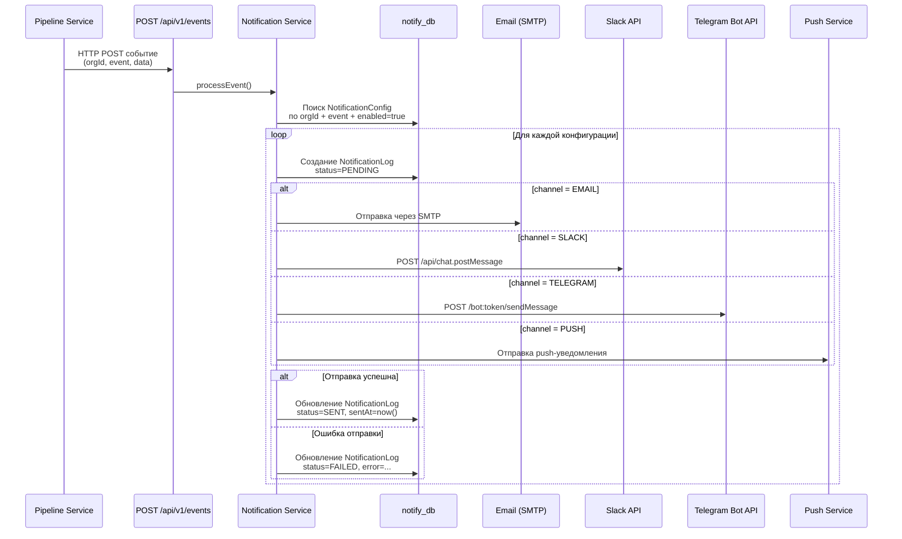

# Notification Service — Сервис уведомлений

## Общие сведения

| Параметр | Значение |
|----------|----------|
| **Назначение** | Многоканальная доставка уведомлений (email, Slack, Telegram, push) |
| **Порт** | 3006 |
| **БД** | `notify_db` (PostgreSQL :5439) |
| **Фреймворк** | NestJS |
| **ORM** | Prisma |
| **Маршрут Gateway** | `/api/notifications` |

## Prisma-схема

### Модели

```
NotificationConfig
├── id: String (uuid)
├── orgId: String
├── channel: NotificationChannel (EMAIL | SLACK | TELEGRAM | PUSH)
├── event: String (например: "run.finished", "membership.requested")
├── config: Json (настройки канала: адреса, каналы, токены)
├── enabled: Boolean (default: true)
├── createdAt / updatedAt
├── logs: NotificationLog[]
└── @@unique([orgId, channel, event])

NotificationLog
├── id: String (uuid)
├── configId → NotificationConfig
├── payload: Json (данные уведомления)
├── status: NotificationStatus (PENDING | SENT | FAILED)
├── error: String? (текст ошибки при неудаче)
├── sentAt: DateTime?
└── createdAt: DateTime
```

### Перечисления

| Enum | Значения | Описание |
|------|---------|----------|
| `NotificationChannel` | `EMAIL`, `SLACK`, `TELEGRAM`, `PUSH` | Канал доставки |
| `NotificationStatus` | `PENDING`, `SENT`, `FAILED` | Статус отправки |

## API-эндпоинты

### Публичные эндпоинты (требуют JWT)

| Метод | Путь | Авторизация | Описание |
|-------|------|-------------|----------|
| `POST` | `/notifications/configs` | Bearer JWT | Создать конфигурацию уведомления |
| `GET` | `/notifications/configs?orgId=` | Bearer JWT | Список конфигураций по организации |
| `GET` | `/notifications/configs/:id` | Bearer JWT | Получить конфигурацию по ID |
| `PATCH` | `/notifications/configs/:id` | Bearer JWT | Обновить конфигурацию |
| `DELETE` | `/notifications/configs/:id` | Bearer JWT | Удалить конфигурацию |
| `POST` | `/notifications/configs/:id/test` | Bearer JWT | Отправить тестовое уведомление через эту конфигурацию |

### Внутренние эндпоинты (без авторизации, `@Public()`)

| Метод | Путь | Авторизация | Описание |
|-------|------|-------------|----------|
| `POST` | `/api/v1/events` | Нет | Приём событий от других сервисов |

#### `POST /api/v1/events`

Используется другими сервисами (например, Pipeline) для инициации отправки уведомлений. Этот эндпоинт заменяет предыдущий подход через `EventEmitter` внутри процесса, который не работал между отдельными NestJS-процессами.

**Тело запроса:**

```json
{
  "orgId": "org-uuid",
  "event": "run.finished",
  "data": {
    "runId": "run-uuid",
    "runName": "Smoke tests",
    "passed": 42,
    "failed": 3,
    "total": 45,
    "duration": "2m 15s"
  }
}
```

**Ответ:** `{ "received": true }`

Эндпоинт вызывает `SenderService.processEvent()`, который ищет все активные записи `NotificationConfig`, соответствующие `orgId` и `event`, затем отправляет уведомления через соответствующие каналы.

#### `POST /notifications/configs/:id/test`

Отправляет тестовое уведомление через конкретную конфигурацию. Использует `SenderService.sendToConfig()` для отправки тестовых данных через одну конфигурацию, не затрагивая остальные.

## Межсервисная интеграция

### Pipeline → Notification

При завершении тестового прогона (`TestRunService.complete()`) сервис Pipeline отправляет HTTP POST на сервис уведомлений:

```
POST http://localhost:3006/api/v1/events
{
  "orgId": "<получен через project service>",
  "event": "run.finished" | "run.failed",
  "data": { runId, runName, passed, failed, total, ... }
}
```

Сервис Pipeline получает `orgId`, обращаясь к Project service (так как прогоны привязаны к проектам, а проекты — к организациям).

**Переменная окружения в Pipeline service:**
```env
NOTIFICATION_SERVICE_URL=http://localhost:3006
```

## Поток уведомлений



## Поддерживаемые события

| Событие | Источник | Описание |
|---------|----------|----------|
| `run.finished` | Pipeline Service | Тестовый запуск завершён |
| `run.failed` | Pipeline Service | Тестовый запуск провален |
| `membership.requested` | Organization Service | Запрос на членство |
| `membership.approved` | Organization Service | Членство одобрено |
| `membership.rejected` | Organization Service | Членство отклонено |
| `generation.completed` | AI Service | ИИ-генерация завершена |
| `pipeline.trigger` | Project Service | Pipeline запущен (webhook) |

## Примеры конфигурации каналов

### Email

```json
{
  "orgId": "org-123",
  "channel": "EMAIL",
  "event": "run.finished",
  "enabled": true,
  "config": {
    "emails": ["team@example.com", "lead@example.com"]
  }
}
```

Переменные окружения: `SMTP_HOST`, `SMTP_PORT`, `SMTP_USER`, `SMTP_PASS`

### Slack

```json
{
  "orgId": "org-123",
  "channel": "SLACK",
  "event": "run.finished",
  "enabled": true,
  "config": {
    "slackChannel": "#ci-results"
  }
}
```

Переменные окружения: `SLACK_BOT_TOKEN` (OAuth-токен бота со scope `chat:write`)

### Telegram

```json
{
  "orgId": "org-123",
  "channel": "TELEGRAM",
  "event": "run.finished",
  "enabled": true,
  "config": {
    "chatId": "-1001234567890"
  }
}
```

Переменные окружения: `TELEGRAM_BOT_TOKEN`

### Push (мобильные уведомления)

```json
{
  "orgId": "org-123",
  "channel": "PUSH",
  "event": "run.finished",
  "enabled": true,
  "config": {
    "sendToAllMembers": true,
    "priority": "high",
    "sound": "default"
  }
}
```

## Ключевые классы

| Класс | Назначение |
|-------|-----------|
| `ConfigController` | CRUD для конфигураций уведомлений + эндпоинт тестирования |
| `EventsController` | Внутренний `@Public()` эндпоинт для приёма событий от других сервисов |
| `SenderService` | Диспетчеризация уведомлений; `processEvent()` для множества конфигов, `sendToConfig()` для одного |
| `EmailSender` | Отправка через SMTP (Nodemailer) |
| `SlackSender` | Отправка в Slack-каналы (читает `slackChannel` из config) |
| `TelegramSender` | Отправка через Telegram Bot API (читает `chatId` из config) |

## Конфигурация

| Переменная | Описание |
|-----------|----------|
| `SMTP_HOST` | Хост SMTP-сервера |
| `SMTP_PORT` | Порт SMTP (по умолчанию 587) |
| `SMTP_USER` | Имя пользователя SMTP |
| `SMTP_PASS` | Пароль SMTP |
| `SLACK_BOT_TOKEN` | OAuth-токен Slack-бота (xoxb-...) |
| `TELEGRAM_BOT_TOKEN` | Токен Telegram-бота от @BotFather |

## Повторные попытки и обработка ошибок

| Параметр | Значение |
|----------|----------|
| Максимум попыток | 3 |
| Интервал между попытками | Экспоненциальный backoff (1s, 5s, 15s) |
| Таймаут отправки | 10 секунд |
| Логирование | Все попытки записываются в NotificationLog |
