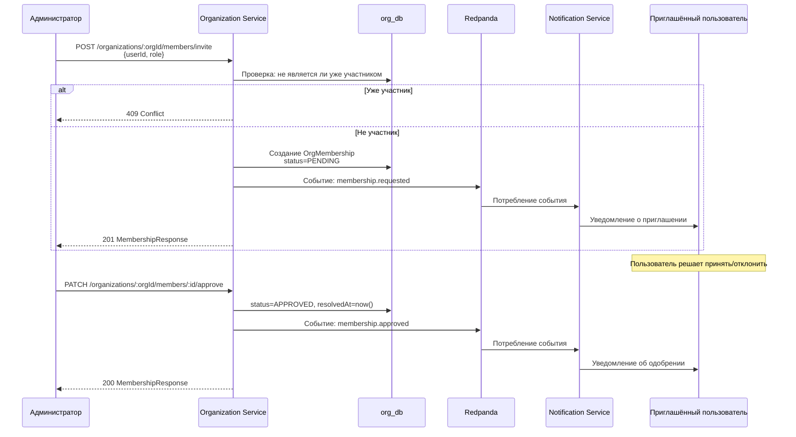
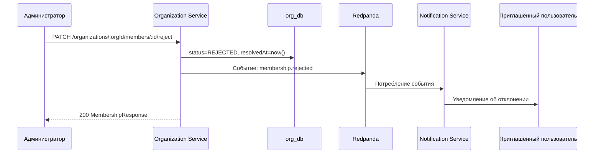
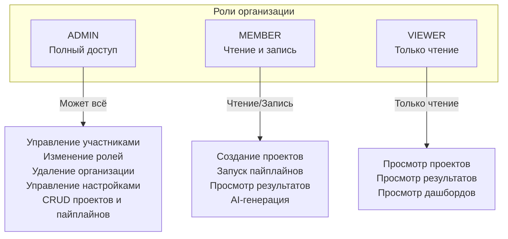

# Organization Service — Сервис организаций

## Общие сведения

| Параметр | Значение |
|----------|----------|
| **Назначение** | Управление организациями, членством и ролевой моделью |
| **Порт** | 3002 |
| **БД** | `org_db` (PostgreSQL :5434) |
| **Фреймворк** | NestJS |
| **ORM** | Prisma |
| **Маршрут Gateway** | `/api/org` |

## Prisma-схема

### Модели

```
Organization
├── id: String (cuid)
├── name: String
├── slug: String (unique)
├── plan: OrgPlan (FREE | PRO | ENTERPRISE)
├── createdAt / updatedAt / deletedAt
└── memberships: OrgMembership[]

OrgMembership
├── id: String (cuid)
├── userId: String
├── role: OrgMemberRole (ADMIN | MEMBER | VIEWER)
├── status: OrgMemberStatus (PENDING | APPROVED | REJECTED)
├── requestedAt: DateTime
├── resolvedAt: DateTime?
├── orgId → Organization
├── createdAt / updatedAt / deletedAt
└── @@unique([userId, orgId])
```

### Перечисления

| Enum | Значения | Описание |
|------|---------|----------|
| `OrgPlan` | `FREE`, `PRO`, `ENTERPRISE` | Тарифный план организации |
| `OrgMemberRole` | `ADMIN`, `MEMBER`, `VIEWER` | Роль участника |
| `OrgMemberStatus` | `PENDING`, `APPROVED`, `REJECTED` | Статус приглашения |

## API-эндпоинты

| Метод | Путь | Авторизация | Роль | Описание |
|-------|------|-------------|------|----------|
| `POST` | `/organizations/:orgId/members/invite` | Bearer JWT | ADMIN | Пригласить участника |
| `GET` | `/organizations/:orgId/members` | Bearer JWT | Любой | Список участников организации |
| `PATCH` | `/organizations/:orgId/members/:memberId/approve` | Bearer JWT | ADMIN | Одобрить приглашение |
| `PATCH` | `/organizations/:orgId/members/:memberId/reject` | Bearer JWT | ADMIN | Отклонить приглашение |
| `PATCH` | `/organizations/:orgId/members/:memberId/role` | Bearer JWT | ADMIN | Изменить роль участника |
| `DELETE` | `/organizations/:orgId/members/:memberId` | Bearer JWT | ADMIN | Удалить участника |

## Поток членства

### Приглашение и одобрение



### Отклонение приглашения



## Ролевая модель



### Матрица разрешений

| Действие | ADMIN | MEMBER | VIEWER |
|----------|-------|--------|--------|
| Просмотр организации | + | + | + |
| Просмотр участников | + | + | + |
| Приглашение участников | + | - | - |
| Одобрение/Отклонение | + | - | - |
| Изменение ролей | + | - | - |
| Удаление участников | + | - | - |
| Создание проектов | + | + | - |
| Запуск пайплайнов | + | + | - |
| Просмотр проектов | + | + | + |
| Настройки организации | + | - | - |
| Удаление организации | + | - | - |

## OrgMemberGuard

`OrgMemberGuard` — guard NestJS, проверяющий принадлежность текущего пользователя к организации и наличие необходимой роли.

### Логика работы

1. Извлекает `orgId` из параметров маршрута
2. Извлекает `userId` из JWT payload
3. Ищет запись `OrgMembership` для пары (`userId`, `orgId`) со статусом `APPROVED`
4. Если запись не найдена — возвращает `403 Forbidden`
5. Если указан декоратор `@Roles(...)` — проверяет, что роль пользователя входит в список разрешённых

### Пример использования

```typescript
@Controller('organizations/:orgId/members')
@UseGuards(JwtAuthGuard, OrgMemberGuard)
export class MembershipController {

  @Post('invite')
  @Roles('ADMIN')
  async invite(...) { ... }

  @Get()
  // Доступно для любой роли (ADMIN, MEMBER, VIEWER)
  async findAll(...) { ... }
}
```

## Тарифные планы

| План | Описание | Ограничения |
|------|----------|------------|
| `FREE` | Бесплатный план | Ограниченное количество проектов и участников |
| `PRO` | Профессиональный | Расширенные лимиты, AI-функции |
| `ENTERPRISE` | Корпоративный | Без ограничений, приоритетная поддержка, SSO |
