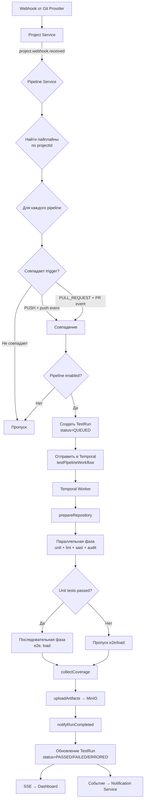
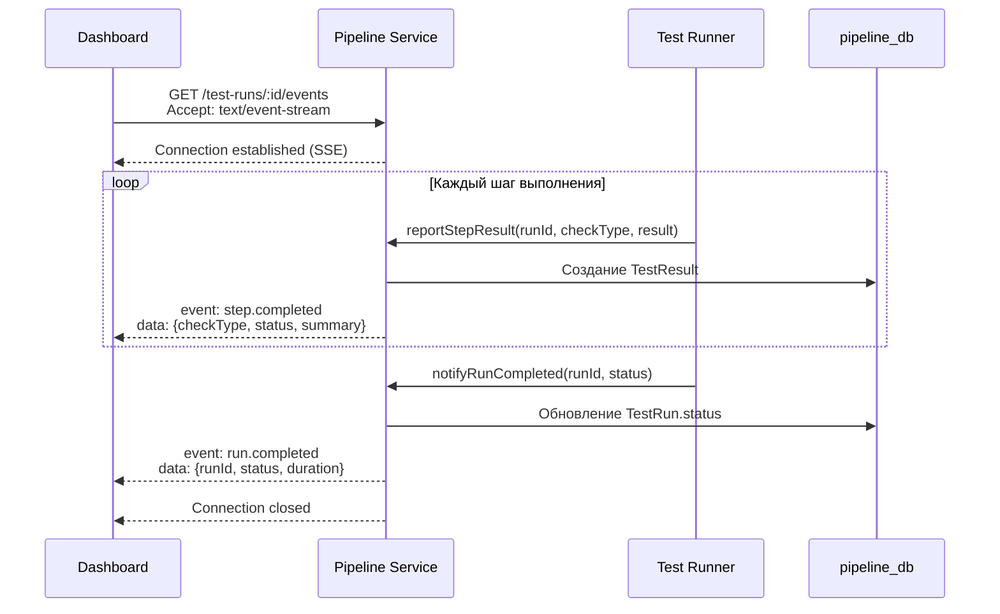
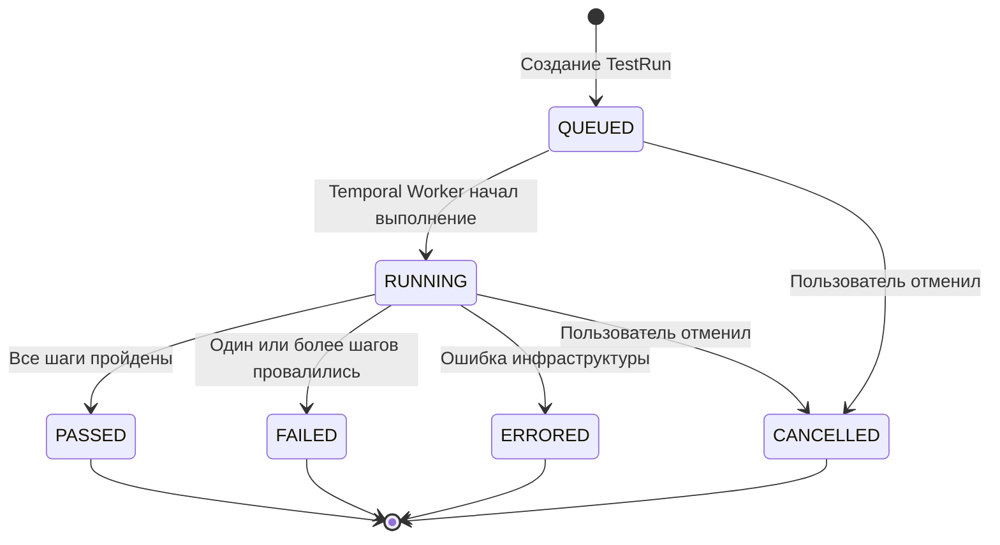
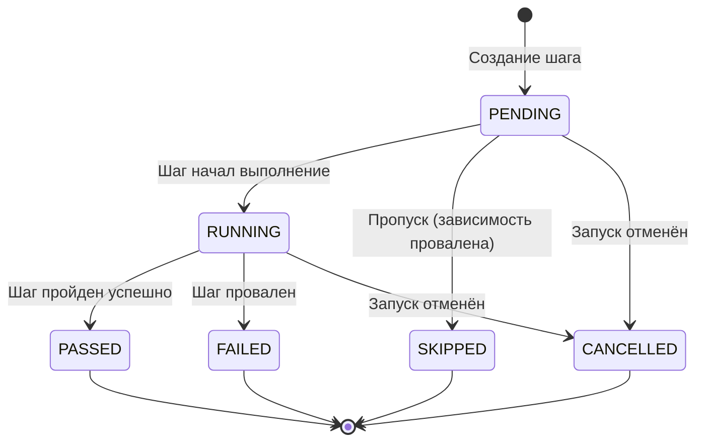

# Pipeline Service — Сервис пайплайнов

## Общие сведения

| Параметр | Значение |
|----------|----------|
| **Назначение** | Управление тестовыми пайплайнами, запуск тестов, сбор результатов, SSE-обновления |
| **Порт** | 3004 |
| **БД** | `pipeline_db` (PostgreSQL :5438) |
| **Фреймворк** | NestJS |
| **ORM** | Prisma |
| **Маршрут Gateway** | `/api/pipeline` |

## Prisma-схема

### Модели

```
Pipeline
├── id: String (uuid)
├── projectId: String
├── name: String
├── trigger: PipelineTrigger (PUSH | PULL_REQUEST | SCHEDULE | MANUAL)
├── cronExpr: String? (для SCHEDULE)
├── steps: Json (default: "[]")
├── enabled: Boolean (default: true)
├── createdAt / updatedAt
└── runs: TestRun[]

TestRun
├── id: String (uuid)
├── pipelineId → Pipeline
├── commitSha: String
├── branch: String
├── status: TestRunStatus (QUEUED | RUNNING | PASSED | FAILED | ERRORED | CANCELLED)
├── startedAt: DateTime?
├── finishedAt: DateTime?
├── triggeredBy: String?
├── metadata: Json
├── createdAt: DateTime
└── results: TestResult[]

TestResult
├── id: String (uuid)
├── runId → TestRun
├── checkType: TestCheckType
├── status: TestStatus (PENDING | RUNNING | PASSED | FAILED | SKIPPED | CANCELLED)
├── summary: String
├── details: Json
├── artifactUrl: String?
├── durationMs: Int
├── createdAt: DateTime
└── coverage: CoverageSnapshot?

CoverageSnapshot
├── id: String (uuid)
├── resultId → TestResult (unique)
├── linePct: Float
├── branchPct: Float
├── functionPct: Float
└── uncovered: Json
```

### Перечисления

| Enum | Значения |
|------|---------|
| `PipelineTrigger` | `PUSH`, `PULL_REQUEST`, `SCHEDULE`, `MANUAL` |
| `TestRunStatus` | `QUEUED`, `RUNNING`, `PASSED`, `FAILED`, `ERRORED`, `CANCELLED` |
| `TestCheckType` | `UNIT`, `INTEGRATION`, `E2E`, `LOAD`, `LINT`, `SAST`, `DAST`, `DEPENDENCY_AUDIT`, `AI_REVIEW` |
| `TestStatus` | `PENDING`, `RUNNING`, `PASSED`, `FAILED`, `SKIPPED`, `CANCELLED` |

## API-эндпоинты

### Pipelines

| Метод | Путь | Авторизация | Описание |
|-------|------|-------------|----------|
| `POST` | `/pipelines` | Bearer JWT | Создать пайплайн |
| `GET` | `/pipelines?projectId=` | Bearer JWT | Список пайплайнов (по проекту) |
| `GET` | `/pipelines/:id` | Bearer JWT | Получить пайплайн по ID |
| `PATCH` | `/pipelines/:id` | Bearer JWT | Обновить пайплайн |
| `DELETE` | `/pipelines/:id` | Bearer JWT | Удалить пайплайн |
| `POST` | `/pipelines/:id/toggle` | Bearer JWT | Включить/выключить пайплайн |

### Test Runs

| Метод | Путь | Авторизация | Описание |
|-------|------|-------------|----------|
| `POST` | `/test-runs` | Bearer JWT | Создать тестовый запуск |
| `GET` | `/test-runs?pipelineId=` | Bearer JWT | Список запусков по пайплайну |
| `GET` | `/test-runs/:id` | Bearer JWT | Получить запуск с результатами |
| `POST` | `/test-runs/:id/cancel` | Bearer JWT | Отменить запуск |

## Триггер пайплайна



## SSE Real-Time обновления

Pipeline Service предоставляет Server-Sent Events (SSE) для real-time обновлений статусов тестовых запусков.



### Формат SSE-сообщений

```
event: step.completed
data: {"checkType":"unit","status":"passed","summary":"156 tests passed","durationMs":12450}

event: step.completed
data: {"checkType":"lint","status":"passed","summary":"No issues found","durationMs":3200}

event: run.completed
data: {"runId":"abc-123","status":"PASSED","finishedAt":"2025-01-15T10:30:00Z"}
```

## Машина состояний TestRun



### Описание статусов

| Статус | Описание |
|--------|----------|
| `QUEUED` | Запуск создан, ожидает начала выполнения в Temporal |
| `RUNNING` | Temporal Worker выполняет шаги пайплайна |
| `PASSED` | Все шаги завершены успешно |
| `FAILED` | Один или более шагов провалены (тесты не прошли, линтер нашёл ошибки и т.д.) |
| `ERRORED` | Ошибка инфраструктуры (недоступен Git, ошибка Temporal и т.д.) |
| `CANCELLED` | Запуск отменён пользователем |

## Машина состояний TestResult



## Конфигурация шагов пайплайна (steps)

Поле `steps` в модели Pipeline — это JSON-массив, определяющий последовательность шагов.

```json
[
  {
    "checkType": "unit",
    "order": 1,
    "config": {
      "framework": "jest",
      "coverage": true,
      "coverageThreshold": 80
    }
  },
  {
    "checkType": "lint",
    "order": 1,
    "config": {
      "tool": "eslint"
    }
  },
  {
    "checkType": "sast",
    "order": 1,
    "config": {
      "tool": "semgrep"
    }
  },
  {
    "checkType": "e2e",
    "order": 2,
    "config": {
      "framework": "playwright",
      "browsers": ["chromium", "firefox"]
    }
  }
]
```

Шаги с одинаковым `order` выполняются параллельно, с разным — последовательно.
