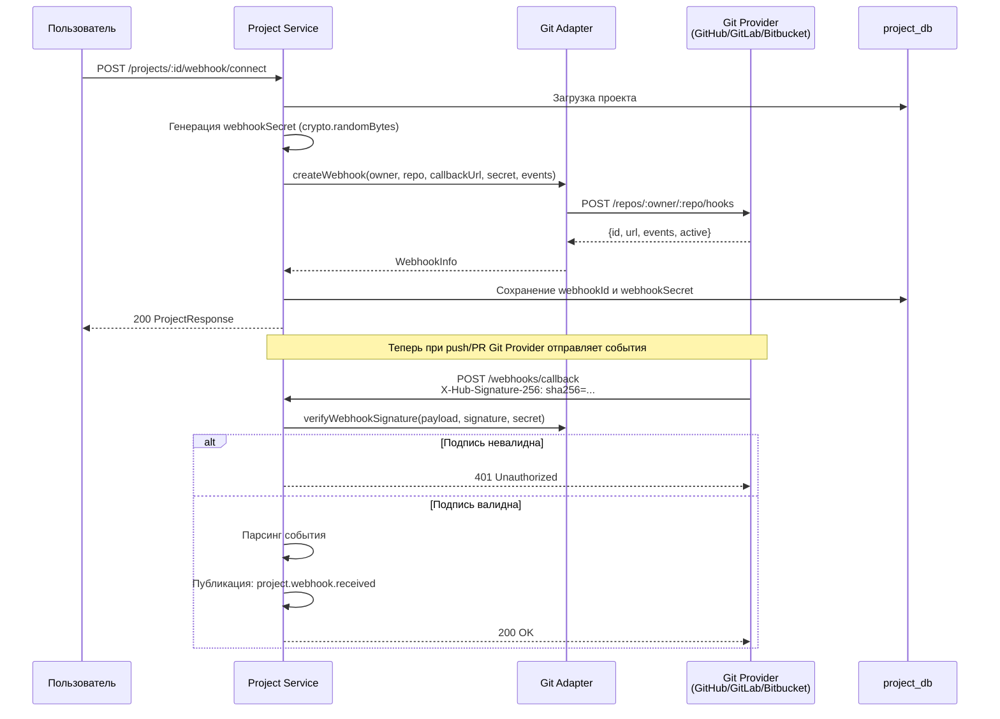
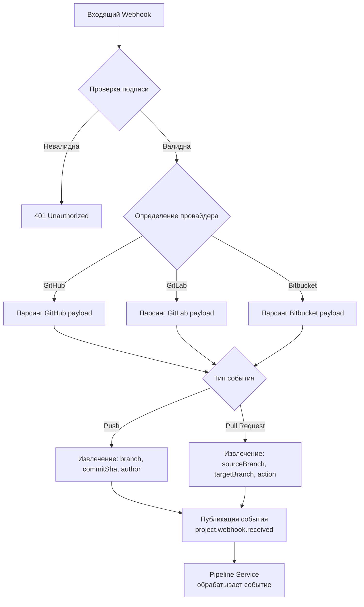

# Project Service — Сервис проектов

## Общие сведения

| Параметр | Значение |
|----------|----------|
| **Назначение** | Управление проектами, Git-интеграция, настройка webhook |
| **Порт** | 3003 |
| **БД** | `project_db` (PostgreSQL :5437) |
| **Фреймворк** | NestJS |
| **ORM** | Prisma |
| **Маршрут Gateway** | `/api/project` |

## Prisma-схема

### Модели

```
Project
├── id: String (uuid)
├── orgId: String
├── name: String
├── repoUrl: String
├── repoProvider: RepoProvider (GITHUB | GITLAB | BITBUCKET)
├── repoOwner: String
├── repoName: String
├── defaultBranch: String (default: "main")
├── webhookId: String?
├── webhookSecret: String?
├── settings: Json (default: "{}")
├── createdAt / updatedAt / deletedAt
└── @@unique([orgId, repoUrl])
```

### Перечисления

| Enum | Значения |
|------|---------|
| `RepoProvider` | `GITHUB`, `GITLAB`, `BITBUCKET` |

## API-эндпоинты

| Метод | Путь | Авторизация | Описание |
|-------|------|-------------|----------|
| `POST` | `/projects` | Bearer JWT | Создать проект |
| `GET` | `/projects?orgId=` | Bearer JWT | Список проектов организации |
| `GET` | `/projects/:id` | Bearer JWT | Получить проект по ID |
| `PATCH` | `/projects/:id` | Bearer JWT | Обновить проект |
| `DELETE` | `/projects/:id` | Bearer JWT | Мягкое удаление проекта |
| `POST` | `/projects/:id/webhook/connect` | Bearer JWT | Подключить webhook |
| `DELETE` | `/projects/:id/webhook/disconnect` | Bearer JWT | Отключить webhook |

## Настройка Webhook



## Git Adapter

Пакет `@testing-ai/git-adapter` предоставляет унифицированный интерфейс для работы с различными Git-провайдерами.

### Интерфейс GitProvider

| Метод | Описание |
|-------|----------|
| `getRepository(owner, repo)` | Получить информацию о репозитории |
| `getBranches(owner, repo)` | Список веток |
| `getCommit(owner, repo, sha)` | Информация о коммите |
| `getDiff(owner, repo, base, head)` | Получить diff между коммитами |
| `getFileContent(owner, repo, path, ref?)` | Содержимое файла |
| `createWebhook(owner, repo, url, secret, events)` | Создать webhook |
| `deleteWebhook(owner, repo, webhookId)` | Удалить webhook |
| `verifyWebhookSignature(payload, signature, secret)` | Проверить подпись webhook |
| `listPullRequests(owner, repo, state?)` | Список pull/merge requests |
| `createCommitStatus(owner, repo, sha, status)` | Установить статус коммита |

### Сравнение провайдеров

| Возможность | GitHub | GitLab | Bitbucket |
|-------------|--------|--------|-----------|
| **API версия** | REST v3 | REST v4 | REST 2.0 |
| **Webhook подпись** | HMAC-SHA256 (`X-Hub-Signature-256`) | Secret Token (`X-Gitlab-Token`) | HMAC-SHA256 (`X-Hub-Signature`) |
| **События push** | `push` | `push_events` | `repo:push` |
| **События PR** | `pull_request` | `merge_request_events` | `pullrequest:*` |
| **Статус коммита** | Commit Status API | Commit Status API | Build Status API |
| **OAuth scopes** | `repo`, `admin:repo_hook` | `api`, `read_repository` | `repository`, `webhook` |
| **Rate limits** | 5000 req/h (auth) | 2000 req/min | 1000 req/h |

### Типы данных

```typescript
interface RepoInfo {
  id: string;
  name: string;
  fullName: string;
  description: string | null;
  private: boolean;
  defaultBranch: string;
  cloneUrl: string;
  htmlUrl: string;
  language: string | null;
}

interface WebhookInfo {
  id: string;
  url: string;
  events: string[];
  active: boolean;
}

interface CommitStatusInput {
  state: 'pending' | 'success' | 'failure' | 'error';
  context: string;
  description?: string;
  targetUrl?: string;
}
```

## Парсинг Webhook-событий

### Структура обработки



### Поддерживаемые события

| Событие | GitHub | GitLab | Bitbucket | Действие |
|---------|--------|--------|-----------|----------|
| Push в ветку | `push` | `Push Hook` | `repo:push` | Триггер pipeline (PUSH) |
| Открытие PR | `pull_request.opened` | `Merge Request Hook` | `pullrequest:created` | Триггер pipeline (PULL_REQUEST) |
| Обновление PR | `pull_request.synchronize` | `Merge Request Hook` | `pullrequest:updated` | Повторный триггер |
