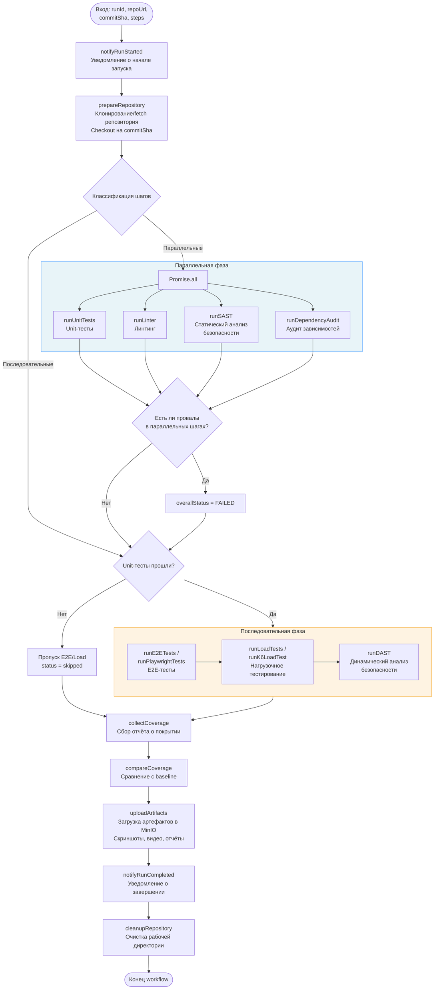
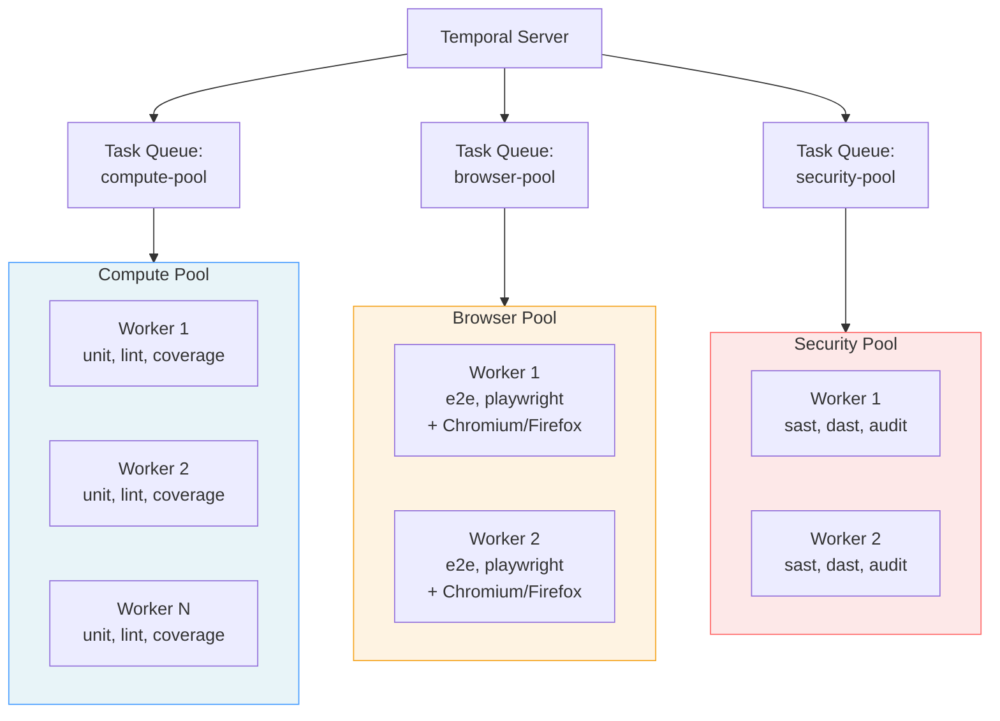
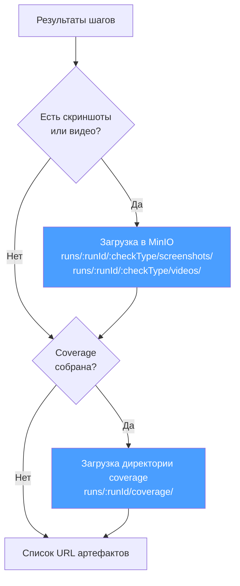

# Test Runner Service — Сервис запуска тестов

## Общие сведения

| Параметр | Значение |
|----------|----------|
| **Назначение** | Выполнение тестовых шагов пайплайна через Temporal Workflows |
| **Интеграция** | Temporal Server (:7233) |
| **Тип** | Temporal Worker (без собственного HTTP API) |
| **Хранилище артефактов** | MinIO (S3-совместимое) |

Test Runner Service реализован как набор Temporal Workers, выполняющих Activities для различных типов тестирования. Сервис не имеет собственного HTTP API — вся координация происходит через Temporal.

## TestPipelineWorkflow

Основной workflow, оркестрирующий весь процесс тестирования.



## Описание Activities

### Repository Activities

| Activity | Таймаут | Retry | Описание |
|----------|---------|-------|----------|
| `prepareRepository` | 5 мин | 3 попытки | Клонирование репозитория, checkout на commitSha |
| `cleanupRepository` | 5 мин | 3 попытки | Удаление рабочей директории |

### Test Runner Activities

| Activity | Таймаут | Retry | Heartbeat | Описание |
|----------|---------|-------|-----------|----------|
| `runUnitTests` | 30 мин | 2 попытки | 2 мин | Запуск unit-тестов (Jest/Vitest/Mocha) |
| `runLinter` | 30 мин | 2 попытки | 2 мин | Запуск линтера (ESLint/Prettier) |
| `runE2ETests` | 30 мин | 2 попытки | 2 мин | Запуск E2E-тестов (Cypress/Playwright) |
| `runLoadTests` | 30 мин | 2 попытки | 2 мин | Запуск нагрузочных тестов (k6/Artillery) |

### Security Activities

| Activity | Таймаут | Retry | Описание |
|----------|---------|-------|----------|
| `runSAST` | 15 мин | 2 попытки | Статический анализ безопасности (Semgrep) |
| `runDAST` | 15 мин | 2 попытки | Динамический анализ безопасности |
| `runDependencyAudit` | 15 мин | 2 попытки | Аудит зависимостей (npm audit/Snyk) |

### E2E Activities

| Activity | Таймаут | Retry | Heartbeat | Описание |
|----------|---------|-------|-----------|----------|
| `runPlaywrightTests` | 30 мин | 2 попытки | 2 мин | Запуск Playwright тестов с браузерами |

### Coverage Activities

| Activity | Таймаут | Retry | Описание |
|----------|---------|-------|----------|
| `collectCoverage` | 5 мин | 3 попытки | Сбор данных покрытия (Istanbul/c8) |
| `compareCoverage` | 5 мин | 3 попытки | Сравнение с baseline покрытия |

### Artifact Activities

| Activity | Таймаут | Retry | Описание |
|----------|---------|-------|----------|
| `uploadArtifact` | 10 мин | 3 попытки | Загрузка одного файла в MinIO |
| `uploadDirectory` | 10 мин | 3 попытки | Загрузка директории в MinIO |

### Reporting Activities

| Activity | Таймаут | Retry | Описание |
|----------|---------|-------|----------|
| `reportStepResult` | 1 мин | 5 попыток | Отправка результата шага в Pipeline Service |
| `notifyRunStarted` | 1 мин | 5 попыток | Уведомление о начале запуска |
| `notifyRunCompleted` | 1 мин | 5 попыток | Уведомление о завершении запуска |

### Load Test Activities

| Activity | Таймаут | Retry | Heartbeat | Описание |
|----------|---------|-------|-----------|----------|
| `runK6LoadTest` | 30 мин | 2 попытки | 2 мин | Запуск k6 нагрузочного тестирования |

## Архитектура пулов воркеров



### Характеристики пулов

| Пул | Task Queue | Типы проверок | Требования | Масштабирование |
|-----|-----------|---------------|-----------|----------------|
| **Compute** | `compute-pool` | unit, lint, coverage, load | CPU, RAM | Горизонтальное (по нагрузке) |
| **Browser** | `browser-pool` | e2e, playwright_e2e | CPU, RAM, браузеры (Chromium, Firefox) | Ограниченное (ресурсоёмко) |
| **Security** | `security-pool` | sast, dast, dep_audit | CPU, инструменты безопасности | Горизонтальное |

## Обработка ошибок

### Стратегия устойчивости

1. **safeRunStep** — обёртка, перехватывающая ошибки отдельных шагов, чтобы провал одного шага не крашил весь workflow
2. **Best-effort reporting** — если отправка результата шага не удалась, workflow продолжает выполнение
3. **Best-effort artifacts** — ошибки загрузки артефактов не прерывают workflow
4. **Cleanup в finally** — рабочая директория очищается в любом случае

### Условия пропуска шагов

| Условие | Действие |
|---------|----------|
| Unit-тесты провалены | E2E и Playwright тесты пропускаются (status: skipped) |
| Activity выбросила исключение | Шаг помечается как `errored`, workflow продолжается |
| Coverage отключена в config | Фаза сбора покрытия пропускается |

## Загрузка артефактов в MinIO



### Структура хранения в MinIO

```
test-artifacts/
└── runs/
    └── {runId}/
        ├── unit/
        │   └── screenshots/
        ├── e2e/
        │   ├── screenshots/
        │   └── videos/
        ├── playwright_e2e/
        │   ├── screenshots/
        │   └── videos/
        └── coverage/
            ├── index.html
            ├── lcov.info
            └── ...
```
