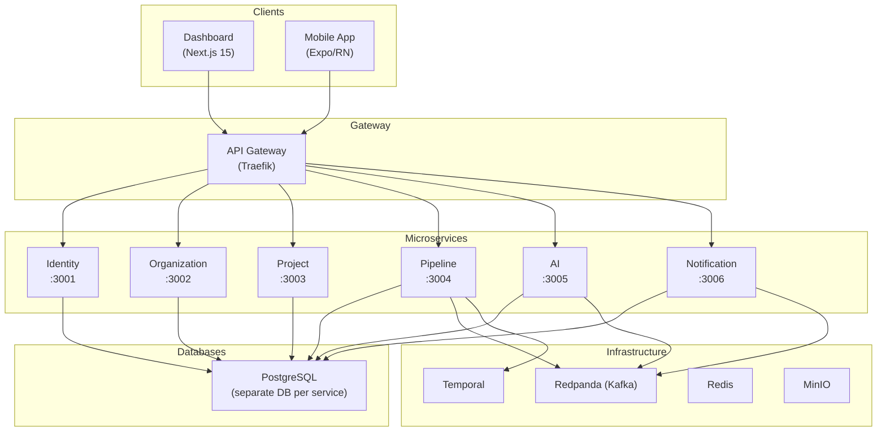

# Architecture

## System Overview

Testing AI Assistant is built on a microservices architecture with event-driven communication between services.

## Microservices

### Identity Service (port 3001)

User management and authentication.

- User registration and login
- JWT tokens (access + refresh)
- OAuth2 integration: GitHub, GitLab, Bitbucket
- Keycloak synchronization (optional)
- Token blacklisting via Redis

**Stack:** NestJS, Prisma, PostgreSQL, Passport.js, JWT

### Organization Service (port 3002)

Organization and membership management.

- Organization CRUD
- Member invitations
- Approval/rejection workflows
- Role model: `ADMIN`, `MEMBER`, `VIEWER`

**Stack:** NestJS, Prisma, PostgreSQL

### Project Service (port 3003)

Project management and Git provider integration.

- Project CRUD within organizations
- Git repository connections (GitHub, GitLab, Bitbucket)
- Webhook management: create, delete, process events
- Auto-trigger pipelines on push/PR

**Stack:** NestJS, Prisma, PostgreSQL, `@testing-ai/git-adapter`

### Pipeline Service (port 3004)

Test pipeline and run management.

- Pipeline configuration (test types, schedule, parameters)
- Test run creation and cancellation
- Test result storage
- Code coverage snapshots
- SSE (Server-Sent Events) for real-time updates

**Stack:** NestJS, Prisma, PostgreSQL, SSE

### AI Service (port 3005)

AI-powered test generation, analysis, and conversational assistant.

- Test generation based on project code
- Potential bug detection
- Flaky test detection
- Coverage improvement recommendations
- **AI Chat with tool calling** — conversational interface for platform actions
- **RAG knowledge base** — documentation-aware answers using pgvector embeddings
- LangGraph-based agents

**Stack:** NestJS, Prisma, PostgreSQL + pgvector, LangChain, LangGraph, OpenAI API

### Notification Service (port 3006)

Multi-channel notifications.

- Email (SMTP)
- Slack
- Telegram
- Push notifications
- Configurable notification rules

**Stack:** NestJS, Prisma, PostgreSQL

### Test Runner (Temporal Worker)

Test pipeline execution engine.

- Orchestration via Temporal workflows
- Test execution: unit, integration, E2E, load, security
- Coverage metric collection
- Artifact upload to MinIO
- No HTTP port (background worker)

**Stack:** Temporal SDK, MinIO SDK

## Infrastructure Components

| Component | Purpose |
|-----------|---------|
| **PostgreSQL** | Persistent data storage (separate DB per service) |
| **Redpanda** | Kafka-compatible message broker for event-driven communication |
| **Temporal** | Long-running workflow orchestration for test runs |
| **Redis** | Caching, token blacklisting, session management |
| **MinIO** | S3-compatible artifact storage |
| **Keycloak** | Authentication provider (SSO), optional |
| **Traefik** | API gateway: TLS termination, routing, rate limiting |
| **OpenTelemetry** | Instrumentation for traces and metrics |
| **Grafana** | Log, trace, and metric visualization |
| **Prometheus** | Metric collection and storage |
| **Loki** | Log aggregation |
| **Tempo** | Distributed trace storage |

## Architectural Patterns

- **Database-per-service** — each service owns its database
- **Event-driven** — asynchronous communication via Redpanda (Kafka)
- **CQRS-lite** — commands via REST API, reads via events
- **API Gateway** — single entry point via Traefik
- **JWT authentication** — stateless token-based authentication
- **RBAC** — role-based access control

## Technology Stack

| Layer | Technologies |
|-------|-------------|
| Backend | NestJS 10, Prisma 5, PostgreSQL 16 |
| Frontend Web | Next.js 15, React 19, Tailwind CSS |
| Frontend Mobile | Expo 52, React Native 0.76 |
| Message Broker | Redpanda 24.1 (Kafka-compatible) |
| Workflows | Temporal 1.24 |
| Authentication | Keycloak 24.0 |
| Storage | MinIO (S3-compatible) |
| Cache | Redis 7 |
| API Gateway | Traefik 3.x |
| Observability | OpenTelemetry + Grafana stack |
| Package Manager | pnpm 9.15.4 |
| Build Tool | Turborepo 2.3 |
