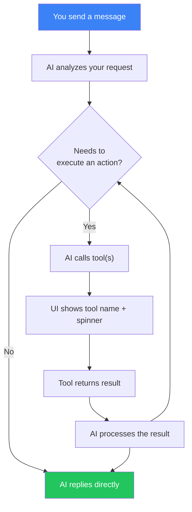
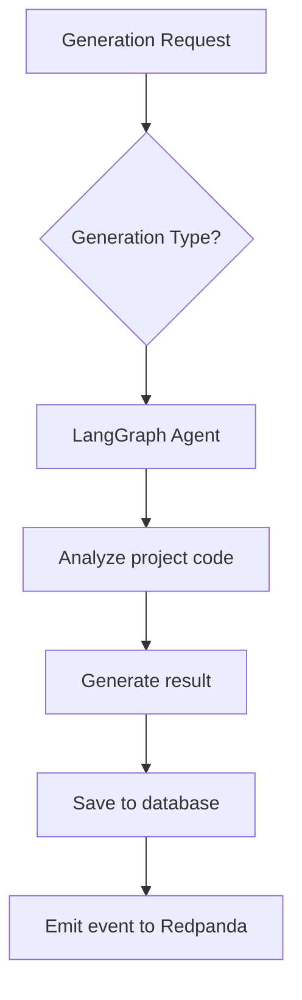

# AI Generation

## Overview

The AI Service uses LangGraph-based agents and the OpenAI API for automatic code analysis and test generation. The service is available on port **3005**.

## AI Generation Types

### 1. Test Generation

Automatic creation of tests for existing code.

**How it works:**
1. The AI agent analyzes the project source code
2. Identifies functions and classes not covered by tests
3. Generates tests using the project's test framework (Jest, Vitest, etc.)
4. Returns ready-to-use test code

**When to use:**
- When code coverage is low
- For new code written without TDD
- For generating edge-case tests

### 2. Bug Detection

AI-powered code analysis for potential bugs.

**How it works:**
1. The system automatically fetches project context: source code from the git repository (recent diff, file contents) and latest test results from the Pipeline service
2. The agent analyzes the fetched code and test results
3. Searches for patterns that commonly lead to bugs, analyzes edge conditions and error handling
4. Provides a structured report with found issues

No manual input is required — just click "Generate". If needed, you can manually provide context via the collapsible "Advanced" section.

**Results are displayed as rich cards** color-coded by severity (Critical, High, Medium, Low). Each card includes: title, description, code location, impact assessment, and fix suggestion.

**Reports are automatically localized** to the user's language (English, Russian, Polish).

**What it detects:**
- Unhandled exceptions
- Race conditions
- Memory leaks
- Typing issues
- Incorrect null/undefined handling

### 3. Flaky Test Detection

Identification of unstable tests that sometimes pass and sometimes fail.

**How it works:**
1. The system automatically fetches the last 10 test run history from the Pipeline service
2. The agent performs statistical analysis and finds tests with unstable results
3. Identifies the flakiness pattern and probable cause
4. Suggests specific fixes

No manual input is required — just click "Generate".

**Results are displayed as rich cards** with metrics: overall Health Score, Flakiness Score per test, fail rate, pattern label (e.g., "Timing", "Shared State"), description, impact assessment, and recommendations.

**Reports are automatically localized** to the user's language.

**Common causes of flaky tests:**
- Time dependency
- Race conditions in async code
- Execution order dependency
- Uncleared state between tests

### 4. Coverage Advice

Recommendations for improving code test coverage.

**How it works:**
1. The system automatically fetches coverage data (Coverage Snapshot) from the Pipeline service
2. When no coverage data exists, it falls back to analyzing source files from the git repository and finds files without corresponding tests
3. The agent identifies critical uncovered areas and prioritizes by importance
4. Suggests specific tests to write with sample code stubs

No manual input is required — just click "Generate".

**Results are displayed as rich cards** color-coded by priority. Each card includes: file path, test type badge (Unit, Integration, E2E), description, and a sample test stub.

**Reports are automatically localized** to the user's language.

### 5. Checklist Generation

AI-generated test checklists from application analysis.

**How it works:**
1. Provide a target URL, repository URL, or app description
2. The AI agent analyzes the application's features and workflows
3. Generates a comprehensive checklist of 10-25 test scenarios
4. Each item includes title, description, expected behavior, and priority

**When to use:**
- Starting QA for a new application
- Comprehensive regression test planning
- Onboarding new QA team members to a project

### 6. Checklist Test Generation

AI-generated Playwright E2E tests from individual checklist items.

**How it works:**
1. Select a checklist item that describes a test scenario
2. The AI agent analyzes the scenario and plans test steps
3. Generates a complete Playwright test with accessible selectors
4. Validates syntax and refines up to 3 times
5. Returns ready-to-execute test code

**When to use:**
- Automating manual test checklists
- Generating E2E tests for functional testing against a live app
- Converting acceptance criteria into executable tests

## AI Chat Assistant

The AI Service includes a conversational chat interface that can answer questions and execute platform actions.

### Features

- **Conversational interface** — ask questions in natural language
- **RAG knowledge base** — answers are enriched with indexed documentation from `docs/en/` and `user_docs/en/`
- **Tool calling** — the AI can execute platform actions on your behalf (see details below)
- **Conversation history** — conversations are saved per project and persist across sessions

### Available Tools

The chat assistant has access to 10 tools that interact with the platform. You don't need to call them by name — just describe what you want in natural language, and the AI will pick the right tool.

#### Projects

| Tool | What it does | Example prompt |
|------|-------------|----------------|
| `list_projects` | Returns all projects accessible to you | *"Show me my projects"* |
| `list_pipelines` | Returns pipelines for a specific project | *"What pipelines does this project have?"* |

#### Test Runs

| Tool | What it does | Example prompt |
|------|-------------|----------------|
| `trigger_pipeline` | Starts a new test run for a pipeline. Returns the created run with its ID and status. | *"Run the CI pipeline"* |
| `get_run_status` | Fetches current status, steps, and results of a test run. | *"What's the status of the last run?"* |

#### Checklists

| Tool | What it does | Example prompt |
|------|-------------|----------------|
| `list_checklists` | Returns all checklists for the current project | *"Show me all checklists"* |
| `create_checklist` | Creates a new checklist with test items. You can specify name, description, target URL, and items with title, description, expected behavior, and priority (LOW / MEDIUM / HIGH / CRITICAL). | *"Create a checklist for login page testing with 5 items"* |
| `run_checklist` | Executes a checklist against a target URL. Starts a Temporal workflow that runs each item as a Playwright test. | *"Run the login checklist against http://localhost:4200"* |
| `get_checklist_run` | Returns results of a checklist run — status of each item, summaries, screenshots. | *"Show me results of the last checklist run"* |

#### AI Generation

| Tool | What it does | Example prompt |
|------|-------------|----------------|
| `generate_tests` | Triggers an AI generation (TEST_GEN, BUG_DETECT, FLAKY_DETECT, COVERAGE_ADVICE, CHECKLIST_GEN, CHECKLIST_TEST_GEN). Requires a project ID, type, and input context. | *"Generate unit tests for this project"* |

#### Knowledge Base

| Tool | What it does | Example prompt |
|------|-------------|----------------|
| `search_knowledge` | Searches the indexed documentation using semantic similarity. Returns relevant documentation chunks. | *"How do webhooks work in this app?"* |

### How Tool Calling Works

When you send a message, the AI decides whether it needs to use a tool:



In the chat UI:
- Tool calls appear as small labels with a wrench icon
- While a tool is running, a spinner is shown
- After completion, a checkmark appears — click to expand the raw result
- The AI then summarizes the result in natural language

### Example Conversations

**Creating and running a checklist:**
> **You:** Create a checklist for testing the registration page
> **AI:** *(calls `create_checklist`)* Done! I've created a checklist "Registration Page Testing" with 8 items including email validation, password strength, duplicate email handling...
> **You:** Run it against http://localhost:4200
> **AI:** *(calls `run_checklist`)* Started! The checklist run ID is `abc-123`. It's currently running...
> **You:** What's the status?
> **AI:** *(calls `get_checklist_run`)* 6 of 8 items passed. 2 failed: "Password strength indicator" and "Terms checkbox validation". Here are the details...

**Asking about the platform:**
> **You:** How do I set up Slack notifications?
> **AI:** *(calls `search_knowledge`)* Based on the documentation: Go to Settings → Notifications, click "Add Configuration", select Slack as the channel, enter your channel name (e.g. #testing-alerts)...

### Usage via Dashboard

1. Open project → "Chat" in the sidebar
2. Type your question or request
3. The AI streams its response in real-time
4. If the AI needs to execute an action, it will show tool calls and results
5. Previous conversations are listed in the left sidebar

### Usage via API

#### Send Message

```http
POST /ai/chat
Authorization: Bearer <token>
Content-Type: application/json

{
  "message": "Create a checklist for login testing",
  "projectId": "project-uuid",
  "conversationId": "conversation-uuid"
}
```

Response: SSE stream with events of type `text`, `tool_call`, `tool_result`, `done`, `error`.

#### List Conversations

```http
GET /ai/chat/conversations?projectId=<id>
Authorization: Bearer <token>
```

#### Get Conversation

```http
GET /ai/chat/conversations/:id
Authorization: Bearer <token>
```

#### Delete Conversation

```http
DELETE /ai/chat/conversations/:id
Authorization: Bearer <token>
```

### Knowledge Base Indexing

The knowledge base can be re-indexed via API:

```http
POST /ai/knowledge/index
Authorization: Bearer <token>
```

This scans `docs/en/` and `user_docs/en/`, splits documents into chunks, generates embeddings via OpenAI, and stores them with pgvector for similarity search.

## Usage

### Via Dashboard

1. Open project → "AI"
2. Click "New Generation"
3. Select generation type (for BUG_DETECT, FLAKY_DETECT, COVERAGE_ADVICE the context is fetched automatically)
4. Click "Generate" and wait for the result
5. Review the results displayed as visual cards
6. Decide: "Accept" or "Reject"

### Via API

#### Start Generation

```http
POST /ai/generate
Authorization: Bearer <token>
Content-Type: application/json

{
  "projectId": "project-uuid",
  "type": "TEST_GENERATION"
}
```

Available types:
- `TEST_GENERATION` — test generation
- `BUG_DETECTION` — bug detection
- `FLAKY_TEST_DETECTION` — flaky test detection
- `COVERAGE_ADVICE` — coverage recommendations

#### List Generations

```http
GET /ai/generations?projectId=<id>&type=<type>
Authorization: Bearer <token>
```

#### Generation Details

```http
GET /ai/generations/:id
Authorization: Bearer <token>
```

#### Feedback

```http
PATCH /ai/generations/:id/feedback
Authorization: Bearer <token>
Content-Type: application/json

{
  "status": "ACCEPTED",
  "feedback": "Tests are correct, applying"
}
```

Statuses: `ACCEPTED`, `REJECTED`

#### Statistics

```http
GET /ai/generations/stats?projectId=<id>
Authorization: Bearer <token>
```

## AI Configuration

Set in `.env`:

```env
# OpenAI API key (required)
OPENAI_API_KEY=sk-your-key

# Models
OPENAI_MODEL_FAST=gpt-4.1-mini      # For fast tasks
OPENAI_MODEL_ADVANCED=o3             # For complex analysis
```

## Agent Architecture

The AI Service uses LangGraph to orchestrate agents:



Each generation type has a specialized agent with a unique set of tools and prompts.

## Best Practices

- **Review results** — AI can generate incorrect tests
- **Use feedback** — this helps improve generation quality
- **Start with TEST_GENERATION** — this is the most mature generation type
- **Combine with manual coverage** — AI supplements, not replaces, manual tests

## Smart Test Generator Wizard

The Smart Test Generator is a guided, multi-step workflow that analyzes your project repository and generates production-quality test files using AI. It connects directly to your Git provider, understands your project structure and conventions, and produces tests that follow your existing patterns.

### What It Does

- Scans your repository to detect language, framework, test patterns, and project structure
- Analyzes source files and proposes which tests to create, with descriptions and priority levels
- Lets you choose which proposed tests to generate
- Generates complete, runnable test files with correct imports and mocking patterns
- Validates generated code locally (TypeScript type checking and ESLint) and auto-fixes errors
- Lets you review and edit every generated test before committing
- Creates a dedicated branch and optionally opens a pull request

### Prerequisites

Before using the wizard, you need a **provider token** configured for your organization:

1. Navigate to **Organization Settings** in the sidebar
2. Go to the **Integrations** tab
3. Click **Add Provider Token**
4. Select your Git provider (GitHub, GitLab, or Bitbucket)
5. Paste a personal access token or app token with the following permissions:
   - **GitHub**: `repo` scope (full repository access)
   - **GitLab**: `api` scope
   - **Bitbucket**: Repository read and write permissions
6. Save the token

The token is shared across all projects in the organization. Any organization member can use the wizard once a token is configured.

### Step-by-Step Walkthrough

#### Step 1: Start a Session

Open a project, navigate to the **AI** tab, and click **Generate Tests**. The system creates a new session and begins analyzing your repository.

During analysis, the system:
- Fetches your repository's file tree
- Reads configuration files (package.json, tsconfig.json, jest.config.ts, etc.)
- Identifies existing test files and their patterns
- Uses AI to build a structured profile of your project (language, framework, directory layout, dependencies)

This typically takes 5--15 seconds. The analysis result is cached, so subsequent sessions for the same project skip re-analysis.

#### Step 2: Review the Proposal

Once analysis completes, click **Generate Proposal** (or it may proceed automatically). You can optionally specify a **focus area** (e.g., "authentication module", "data transformers") to guide the AI.

The AI examines up to 30 source files and produces a list of proposed test files. Each proposal item includes:

- **Target file**: The source file to be tested
- **Test file path**: Where the test file will be created (follows your existing naming conventions)
- **Test type**: Unit, integration, or E2E
- **Description**: What the tests will cover
- **Rationale**: Why these tests are valuable
- **Priority**: High (critical logic, no existing tests), Medium (important but partially covered), or Low (nice to have)
- **Estimated test count**: How many individual test cases will be generated

#### Step 3: Approve Items

Review the proposal and select which tests you want to generate. You can select all items or pick specific ones. High-priority items are highlighted.

Click **Approve & Generate** to proceed.

#### Step 4: Generation

The AI generates test code for each approved item. This runs in the background; you can see real-time progress:

- Which file is being generated (e.g., "2 of 5")
- The current phase for each file: collecting context, analyzing, generating, post-processing, LLM review

For each test file, the system:
1. Fetches the target source file and its local imports (types, interfaces, utilities)
2. Fetches up to 3 existing test files as style examples
3. Computes correct relative import paths from the test file to source files
4. Calls the AI to generate the test code
5. Strips markdown formatting, removes unused imports/variables, fixes common type issues
6. Runs a second AI pass to review and fix import paths and type errors

#### Step 5: Validation

After all tests are generated, the system validates them automatically:

1. Clones your repository into a temporary directory
2. Installs dependencies (detects pnpm/yarn/npm automatically)
3. Copies generated test files into the clone
4. Runs `tsc --noEmit` to check for TypeScript errors
5. Runs ESLint to check for linting violations
6. If errors are found, sends them to the AI for correction and re-validates (up to 3 attempts)

You can **skip validation** at any time if you prefer to fix issues manually.

#### Step 6: Review

All generated tests are displayed in an editor view. You can:

- **Read the code** for each generated test file
- **Edit** any test file directly in the browser
- **Regenerate** individual tests that do not meet your expectations (sends them back through the generation pipeline while preserving all other tests)

Take your time in this step. The session remains in `REVIEW` status until you commit or cancel.

#### Step 7: Commit

When you are satisfied with the tests:

1. Optionally customize the **commit message** (a sensible default is provided)
2. Optionally check **Create Pull Request** to open a PR automatically
3. Click **Commit**

The system:
- Creates a branch named `ai/test-gen-{timestamp}` from your default branch
- Commits all generated test files in a single commit
- If requested, opens a pull request with a summary listing all generated files and the session ID

You will receive links to the commit and the pull request (if created).

### Managing Sessions

#### Resuming a Session

Sessions persist across browser sessions. If you close the page during generation or review, simply return to the project's AI tab and the session list will show your in-progress sessions. Click on a session to resume from wherever it stopped.

#### Cancelling a Session

You can cancel a session at any point before it reaches a terminal state (COMMITTED, CANCELLED, or FAILED). Cancelling during generation stops the process after the current file finishes. Already-generated tests are preserved in the session record but are not committed.

#### Regenerating Tests

From the review step, you can select individual tests to regenerate without starting over. This is useful when:

- A specific test has incorrect mocking patterns
- You want to try a different testing approach for one file
- The AI missed an important edge case

You can also regenerate from an already-committed session to improve specific tests and commit again.

#### Session History

The AI tab shows recent sessions for the current project (up to 20). You can view past sessions to see what was generated, review commit links, or re-generate from a previous session's proposal.

### Tips and Best Practices

1. **Set a focus area** when generating proposals. A targeted proposal (e.g., "services layer" or "utility functions") produces better results than analyzing the entire codebase.

2. **Start with high-priority items**. Approve 3-5 high-priority tests first, review the quality, then do additional rounds if satisfied.

3. **Review the project profile** after the first analysis. If the detected framework or patterns look wrong, re-run analysis or adjust your project configuration.

4. **Check import paths carefully**. The system computes relative imports automatically, but complex monorepo path aliases (e.g., `@app/shared`) may need manual correction.

5. **Use existing tests as examples**. The generator reads up to 3 of your existing test files to match style. If your repo has well-structured test examples, the output quality improves significantly.

6. **Do not skip validation unless you have a reason**. The tsc + eslint validation catches real issues that would fail in CI. The auto-fix loop resolves most problems automatically.

7. **Always create a PR** rather than committing directly. This lets your team review the AI-generated tests in the normal code review workflow.

8. **Token usage**: Each session consumes LLM tokens. The session detail view shows `totalTokensUsed`. A typical 5-file generation uses roughly 30,000-60,000 tokens depending on source file complexity.

### Troubleshooting

**"No GITHUB token configured for this organization"**
An organization admin needs to add a provider token in Organization Settings > Integrations. See Prerequisites above.

**Session stuck in ANALYZING**
The system may be waiting for the Git provider API. Large repositories (10,000+ files) take longer. If it stays for more than 60 seconds, check that the provider token has sufficient permissions and the repository URL is correct.

**Validation fails repeatedly**
Some projects have complex build configurations that the validator cannot replicate in an isolated clone (e.g., custom Webpack loaders, code generation steps). Click "Skip Validation" and fix any issues after committing.

**Generated tests have wrong import paths**
This happens most often in monorepos with TypeScript path aliases (e.g., `paths` in `tsconfig.json`). The system uses relative paths, not aliases. You can edit the imports in the review step, or configure `tsconfig.json` `paths` to match relative layouts.

**"Project not found" error**
The AI service fetches project metadata from the Project service via an internal API. Ensure both services are running and `PROJECT_SERVICE_URL` is configured correctly.

**Tests reference types or functions that do not exist**
The AI occasionally hallucinates interface properties or function signatures. Review generated mock objects against your actual source code. The LLM validation pass catches most of these, but complex types may slip through.

**Generation is slow**
Each test file involves 2-3 LLM calls (analyze, generate, validate). For 10 approved items, expect 3-5 minutes. The system processes files sequentially to manage API rate limits and context quality. You can cancel and commit a partial result from the review step.

### Supported Languages and Frameworks

The wizard has been tested with:

| Language    | Frameworks                          |
|-------------|-------------------------------------|
| TypeScript  | Jest, Vitest, Mocha, Playwright     |
| JavaScript  | Jest, Vitest, Mocha                 |
| Python      | pytest                              |
| Java        | JUnit                               |
| Go          | testing (standard library)          |
| Rust        | cargo test                          |

Best results are achieved with TypeScript/JavaScript projects using Jest or Vitest, as these have the most sophisticated import resolution and validation support.
