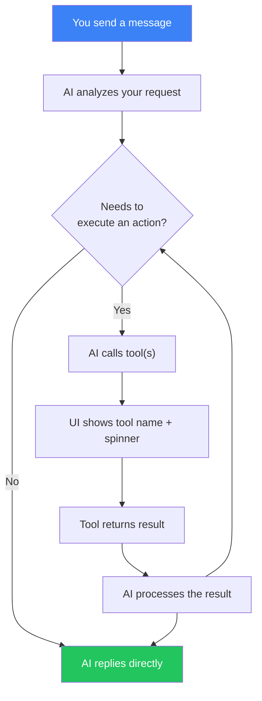
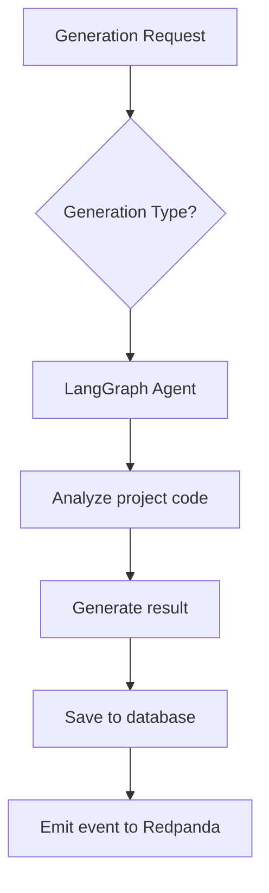

# AI Generation

## Overview

The AI Service uses LangGraph-based agents and the OpenAI API for automatic code analysis and test generation. The service is available on port **3005**.

## AI Generation Types

### 1. Test Generation

Automatic creation of tests for existing code.

**How it works:**
1. The AI agent analyzes the project source code
2. Identifies functions and classes not covered by tests
3. Generates tests using the project's test framework (Jest, Vitest, etc.)
4. Returns ready-to-use test code

**When to use:**
- When code coverage is low
- For new code written without TDD
- For generating edge-case tests

### 2. Bug Detection

AI-powered code analysis for potential bugs.

**How it works:**
1. The agent scans the project code
2. Searches for patterns that commonly lead to bugs
3. Analyzes edge conditions and error handling
4. Provides descriptions of found issues and fix recommendations

**What it detects:**
- Unhandled exceptions
- Race conditions
- Memory leaks
- Typing issues
- Incorrect null/undefined handling

### 3. Flaky Test Detection

Identification of unstable tests that sometimes pass and sometimes fail.

**How it works:**
1. The agent analyzes run history
2. Finds tests with unstable results
3. Determines the probable cause of instability
4. Suggests fixes

**Common causes of flaky tests:**
- Time dependency
- Race conditions in async code
- Execution order dependency
- Uncleared state between tests

### 4. Coverage Advice

Recommendations for improving code test coverage.

**How it works:**
1. The agent analyzes current coverage
2. Identifies critical uncovered areas
3. Prioritizes by importance
4. Suggests specific tests to write

### 5. Checklist Generation

AI-generated test checklists from application analysis.

**How it works:**
1. Provide a target URL, repository URL, or app description
2. The AI agent analyzes the application's features and workflows
3. Generates a comprehensive checklist of 10-25 test scenarios
4. Each item includes title, description, expected behavior, and priority

**When to use:**
- Starting QA for a new application
- Comprehensive regression test planning
- Onboarding new QA team members to a project

### 6. Checklist Test Generation

AI-generated Playwright E2E tests from individual checklist items.

**How it works:**
1. Select a checklist item that describes a test scenario
2. The AI agent analyzes the scenario and plans test steps
3. Generates a complete Playwright test with accessible selectors
4. Validates syntax and refines up to 3 times
5. Returns ready-to-execute test code

**When to use:**
- Automating manual test checklists
- Generating E2E tests for functional testing against a live app
- Converting acceptance criteria into executable tests

## AI Chat Assistant

The AI Service includes a conversational chat interface that can answer questions and execute platform actions.

### Features

- **Conversational interface** — ask questions in natural language
- **RAG knowledge base** — answers are enriched with indexed documentation from `docs/en/` and `user_docs/en/`
- **Tool calling** — the AI can execute platform actions on your behalf (see details below)
- **Conversation history** — conversations are saved per project and persist across sessions

### Available Tools

The chat assistant has access to 10 tools that interact with the platform. You don't need to call them by name — just describe what you want in natural language, and the AI will pick the right tool.

#### Projects

| Tool | What it does | Example prompt |
|------|-------------|----------------|
| `list_projects` | Returns all projects accessible to you | *"Show me my projects"* |
| `list_pipelines` | Returns pipelines for a specific project | *"What pipelines does this project have?"* |

#### Test Runs

| Tool | What it does | Example prompt |
|------|-------------|----------------|
| `trigger_pipeline` | Starts a new test run for a pipeline. Returns the created run with its ID and status. | *"Run the CI pipeline"* |
| `get_run_status` | Fetches current status, steps, and results of a test run. | *"What's the status of the last run?"* |

#### Checklists

| Tool | What it does | Example prompt |
|------|-------------|----------------|
| `list_checklists` | Returns all checklists for the current project | *"Show me all checklists"* |
| `create_checklist` | Creates a new checklist with test items. You can specify name, description, target URL, and items with title, description, expected behavior, and priority (LOW / MEDIUM / HIGH / CRITICAL). | *"Create a checklist for login page testing with 5 items"* |
| `run_checklist` | Executes a checklist against a target URL. Starts a Temporal workflow that runs each item as a Playwright test. | *"Run the login checklist against http://localhost:4200"* |
| `get_checklist_run` | Returns results of a checklist run — status of each item, summaries, screenshots. | *"Show me results of the last checklist run"* |

#### AI Generation

| Tool | What it does | Example prompt |
|------|-------------|----------------|
| `generate_tests` | Triggers an AI generation (TEST_GEN, BUG_DETECT, FLAKY_DETECT, COVERAGE_ADVICE, CHECKLIST_GEN, CHECKLIST_TEST_GEN). Requires a project ID, type, and input context. | *"Generate unit tests for this project"* |

#### Knowledge Base

| Tool | What it does | Example prompt |
|------|-------------|----------------|
| `search_knowledge` | Searches the indexed documentation using semantic similarity. Returns relevant documentation chunks. | *"How do webhooks work in this app?"* |

### How Tool Calling Works

When you send a message, the AI decides whether it needs to use a tool:



In the chat UI:
- Tool calls appear as small labels with a wrench icon
- While a tool is running, a spinner is shown
- After completion, a checkmark appears — click to expand the raw result
- The AI then summarizes the result in natural language

### Example Conversations

**Creating and running a checklist:**
> **You:** Create a checklist for testing the registration page
> **AI:** *(calls `create_checklist`)* Done! I've created a checklist "Registration Page Testing" with 8 items including email validation, password strength, duplicate email handling...
> **You:** Run it against http://localhost:4200
> **AI:** *(calls `run_checklist`)* Started! The checklist run ID is `abc-123`. It's currently running...
> **You:** What's the status?
> **AI:** *(calls `get_checklist_run`)* 6 of 8 items passed. 2 failed: "Password strength indicator" and "Terms checkbox validation". Here are the details...

**Asking about the platform:**
> **You:** How do I set up Slack notifications?
> **AI:** *(calls `search_knowledge`)* Based on the documentation: Go to Settings → Notifications, click "Add Configuration", select Slack as the channel, enter your channel name (e.g. #testing-alerts)...

### Usage via Dashboard

1. Open project → "Chat" in the sidebar
2. Type your question or request
3. The AI streams its response in real-time
4. If the AI needs to execute an action, it will show tool calls and results
5. Previous conversations are listed in the left sidebar

### Usage via API

#### Send Message

```http
POST /ai/chat
Authorization: Bearer <token>
Content-Type: application/json

{
  "message": "Create a checklist for login testing",
  "projectId": "project-uuid",
  "conversationId": "conversation-uuid"
}
```

Response: SSE stream with events of type `text`, `tool_call`, `tool_result`, `done`, `error`.

#### List Conversations

```http
GET /ai/chat/conversations?projectId=<id>
Authorization: Bearer <token>
```

#### Get Conversation

```http
GET /ai/chat/conversations/:id
Authorization: Bearer <token>
```

#### Delete Conversation

```http
DELETE /ai/chat/conversations/:id
Authorization: Bearer <token>
```

### Knowledge Base Indexing

The knowledge base can be re-indexed via API:

```http
POST /ai/knowledge/index
Authorization: Bearer <token>
```

This scans `docs/en/` and `user_docs/en/`, splits documents into chunks, generates embeddings via OpenAI, and stores them with pgvector for similarity search.

## Usage

### Via Dashboard

1. Open project → "AI"
2. Click "New Generation"
3. Select generation type
4. Wait for the result
5. Review and decide: "Accept" or "Reject"

### Via API

#### Start Generation

```http
POST /ai/generate
Authorization: Bearer <token>
Content-Type: application/json

{
  "projectId": "project-uuid",
  "type": "TEST_GENERATION"
}
```

Available types:
- `TEST_GENERATION` — test generation
- `BUG_DETECTION` — bug detection
- `FLAKY_TEST_DETECTION` — flaky test detection
- `COVERAGE_ADVICE` — coverage recommendations

#### List Generations

```http
GET /ai/generations?projectId=<id>&type=<type>
Authorization: Bearer <token>
```

#### Generation Details

```http
GET /ai/generations/:id
Authorization: Bearer <token>
```

#### Feedback

```http
PATCH /ai/generations/:id/feedback
Authorization: Bearer <token>
Content-Type: application/json

{
  "status": "ACCEPTED",
  "feedback": "Tests are correct, applying"
}
```

Statuses: `ACCEPTED`, `REJECTED`

#### Statistics

```http
GET /ai/generations/stats?projectId=<id>
Authorization: Bearer <token>
```

## AI Configuration

Set in `.env`:

```env
# OpenAI API key (required)
OPENAI_API_KEY=sk-your-key

# Models
OPENAI_MODEL_FAST=gpt-4.1-mini      # For fast tasks
OPENAI_MODEL_ADVANCED=o3             # For complex analysis
```

## Agent Architecture

The AI Service uses LangGraph to orchestrate agents:



Each generation type has a specialized agent with a unique set of tools and prompts.

## Best Practices

- **Review results** — AI can generate incorrect tests
- **Use feedback** — this helps improve generation quality
- **Start with TEST_GENERATION** — this is the most mature generation type
- **Combine with manual coverage** — AI supplements, not replaces, manual tests
