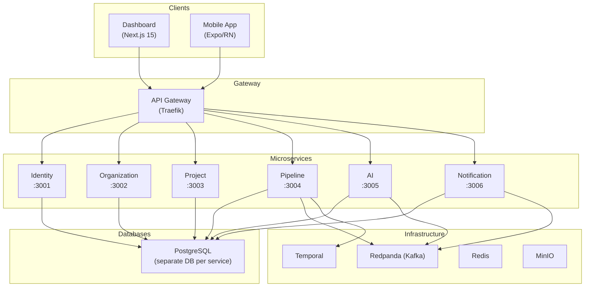

# Architektura

## Przegląd systemu

Testing AI Assistant jest zbudowany na architekturze mikroserwisowej z komunikacją sterowaną zdarzeniami między serwisami.

## Mikroserwisy

### Identity Service (port 3001)

Zarządzanie użytkownikami i uwierzytelnianie.

- Rejestracja i logowanie użytkowników
- Tokeny JWT (access + refresh)
- Integracja OAuth2: GitHub, GitLab, Bitbucket
- Synchronizacja z Keycloak (opcjonalnie)
- Czarna lista tokenów przez Redis

**Stos technologiczny:** NestJS, Prisma, PostgreSQL, Passport.js, JWT

### Organization Service (port 3002)

Zarządzanie organizacjami i członkostwem.

- CRUD organizacji
- Zapraszanie członków
- Zatwierdzanie/odrzucanie wniosków
- Model ról: `ADMIN`, `MEMBER`, `VIEWER`

**Stos technologiczny:** NestJS, Prisma, PostgreSQL

### Project Service (port 3003)

Zarządzanie projektami i integracja z dostawcami Git.

- CRUD projektów w ramach organizacji
- Połączenie z repozytoriami Git (GitHub, GitLab, Bitbucket)
- Zarządzanie webhookami: tworzenie, usuwanie, przetwarzanie zdarzeń
- Automatyczne uruchamianie pipeline'ów przy push/PR

**Stos technologiczny:** NestJS, Prisma, PostgreSQL, `@testing-ai/git-adapter`

### Pipeline Service (port 3004)

Zarządzanie pipeline'ami testowymi i przebiegami.

- Konfiguracja pipeline'ów (typy testów, harmonogram, parametry)
- Tworzenie i anulowanie przebiegów testowych
- Przechowywanie wyników testów
- Migawki pokrycia kodu
- SSE (Server-Sent Events) dla aktualizacji w czasie rzeczywistym

**Stos technologiczny:** NestJS, Prisma, PostgreSQL, SSE

### AI Service (port 3005)

Generowanie i analiza testów oparta na AI oraz asystent konwersacyjny.

- Generowanie testów na podstawie kodu projektu
- Wykrywanie potencjalnych błędów
- Wykrywanie niestabilnych testów (flaky tests)
- Rekomendacje dotyczące poprawy pokrycia
- **Czat AI z wywoływaniem narzędzi** — interfejs konwersacyjny do akcji na platformie
- **Baza wiedzy RAG** — odpowiedzi wzbogacone o dokumentację z użyciem embeddingów pgvector
- Agenty oparte na LangGraph

**Stos technologiczny:** NestJS, Prisma, PostgreSQL + pgvector, LangChain, LangGraph, OpenAI API

### Notification Service (port 3006)

Powiadomienia wielokanałowe.

- Email (SMTP)
- Slack
- Telegram
- Powiadomienia push
- Konfigurowalne reguły powiadomień

**Stos technologiczny:** NestJS, Prisma, PostgreSQL

### Test Runner (Temporal Worker)

Silnik wykonywania pipeline'ów testowych.

- Orkiestracja przez Temporal workflows
- Wykonywanie testów: unit, integration, E2E, load, security
- Zbieranie metryk pokrycia
- Przesyłanie artefaktów do MinIO
- Brak portu HTTP (proces w tle)

**Stos technologiczny:** Temporal SDK, MinIO SDK

## Komponenty infrastrukturalne

| Komponent | Przeznaczenie |
|-----------|--------------|
| **PostgreSQL** | Trwałe przechowywanie danych (osobna baza na serwis) |
| **Redpanda** | Broker wiadomości kompatybilny z Kafka |
| **Temporal** | Orkiestracja długo trwających workflow dla przebiegów testowych |
| **Redis** | Cache, czarna lista tokenów, zarządzanie sesjami |
| **MinIO** | Magazyn artefaktów kompatybilny z S3 |
| **Keycloak** | Dostawca uwierzytelniania (SSO), opcjonalny |
| **Traefik** | Brama API: terminacja TLS, routing, rate limiting |
| **OpenTelemetry** | Instrumentacja do zbierania śladów i metryk |
| **Grafana** | Wizualizacja logów, śladów i metryk |
| **Prometheus** | Zbieranie i przechowywanie metryk |
| **Loki** | Agregacja logów |
| **Tempo** | Przechowywanie rozproszonych śladów |

## Wzorce architektoniczne

- **Database-per-service** — każdy serwis ma własną bazę danych
- **Event-driven** — asynchroniczna komunikacja przez Redpanda (Kafka)
- **CQRS-lite** — komendy przez REST API, odczyt przez zdarzenia
- **API Gateway** — jeden punkt wejścia przez Traefik
- **Uwierzytelnianie JWT** — bezstanowe uwierzytelnianie oparte na tokenach
- **RBAC** — kontrola dostępu oparta na rolach

## Stos technologiczny

| Warstwa | Technologie |
|---------|------------|
| Backend | NestJS 10, Prisma 5, PostgreSQL 16 + pgvector |
| Frontend Web | Next.js 15, React 19, Tailwind CSS |
| Frontend Mobile | Expo 52, React Native 0.76 |
| Broker wiadomości | Redpanda 24.1 (kompatybilny z Kafka) |
| Workflow | Temporal 1.24 |
| Uwierzytelnianie | Keycloak 24.0 |
| Magazyn | MinIO (kompatybilny z S3) |
| Cache | Redis 7 |
| API Gateway | Traefik 3.x |
| Obserwowalność | OpenTelemetry + stos Grafana |
| Menedżer pakietów | pnpm 9.15.4 |
| Narzędzie budowania | Turborepo 2.3 |
