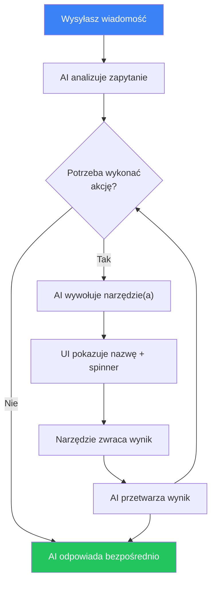
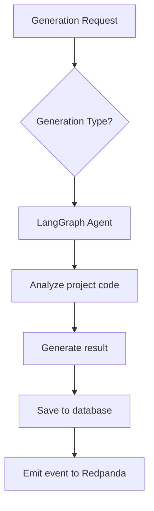

# Generowanie AI

## Przegląd

AI Service wykorzystuje agentów opartych na LangGraph i API OpenAI do automatycznej analizy kodu i generowania testów. Serwis dostępny na porcie **3005**.

## Typy generowania AI

### 1. Generowanie testów (Test Generation)

Automatyczne tworzenie testów dla istniejącego kodu.

**Jak to działa:**
1. Agent AI analizuje kod źródłowy projektu
2. Identyfikuje funkcje i klasy niepokryte testami
3. Generuje testy z uwzględnieniem używanego frameworka (Jest, Vitest itd.)
4. Zwraca gotowy do użycia kod testów

**Kiedy używać:**
- Przy niskim pokryciu kodu
- Dla nowego kodu napisanego bez TDD
- Do generowania testów dla przypadków brzegowych

### 2. Wykrywanie błędów (Bug Detection)

Analiza kodu przez AI pod kątem potencjalnych błędów.

**Jak to działa:**
1. Agent skanuje kod projektu
2. Szuka wzorców często prowadzących do błędów
3. Analizuje warunki brzegowe i obsługę błędów
4. Dostarcza opisy znalezionych problemów i rekomendacje naprawy

**Co wykrywa:**
- Nieobsłużone wyjątki
- Wyścigi (race conditions)
- Wycieki pamięci
- Problemy z typowaniem
- Nieprawidłowa obsługa null/undefined

### 3. Wykrywanie niestabilnych testów (Flaky Test Detection)

Identyfikacja niestabilnych testów, które czasem przechodzą, a czasem nie.

**Jak to działa:**
1. Agent analizuje historię przebiegów
2. Znajduje testy z niestabilnymi wynikami
3. Określa prawdopodobną przyczynę niestabilności
4. Proponuje sposoby naprawy

**Typowe przyczyny niestabilnych testów:**
- Zależność od czasu
- Wyścigi w kodzie asynchronicznym
- Zależność od kolejności wykonania
- Nieoczyszczony stan między testami

### 4. Porady dotyczące pokrycia (Coverage Advice)

Rekomendacje dotyczące poprawy pokrycia kodu testami.

**Jak to działa:**
1. Agent analizuje bieżące pokrycie
2. Identyfikuje krytyczne niepokryte obszary
3. Priorytetyzuje według ważności
4. Proponuje konkretne testy do napisania

### 5. Generowanie checklisty

Checklisty testowe generowane przez AI na podstawie analizy aplikacji.

**Jak to działa:**
1. Podaj URL docelowy, URL repozytorium lub opis aplikacji
2. Agent AI analizuje funkcje i przepływy aplikacji
3. Generuje kompleksową checklistę 10-25 scenariuszy testowych
4. Każdy element zawiera tytuł, opis, oczekiwane zachowanie i priorytet

**Kiedy używać:**
- Rozpoczynanie QA dla nowej aplikacji
- Kompleksowe planowanie testów regresyjnych
- Wdrażanie nowych członków zespołu QA

### 6. Generowanie testów z checklisty

Testy Playwright E2E generowane przez AI z poszczególnych elementów checklisty.

**Jak to działa:**
1. Wybierz element checklisty opisujący scenariusz testowy
2. Agent AI analizuje scenariusz i planuje kroki testu
3. Generuje kompletny test Playwright z dostępnymi selektorami
4. Waliduje składnię i udoskonala do 3 razy
5. Zwraca gotowy do wykonania kod testu

**Kiedy używać:**
- Automatyzacja ręcznych checklist testowych
- Generowanie testów E2E do testowania funkcjonalnego
- Konwersja kryteriów akceptacji na wykonywalne testy

## Asystent czatu AI

AI Service zawiera interfejs konwersacyjnego czatu, który potrafi odpowiadać na pytania i wykonywać akcje na platformie.

### Funkcje

- **Interfejs konwersacyjny** — zadawaj pytania w języku naturalnym
- **Baza wiedzy RAG** — odpowiedzi wzbogacone o zaindeksowaną dokumentację z `docs/en/` i `user_docs/en/`
- **Wywoływanie narzędzi** — AI może wykonywać akcje na platformie w Twoim imieniu (szczegóły poniżej)
- **Historia konwersacji** — konwersacje są zapisywane per projekt i utrzymywane między sesjami

### Dostępne narzędzia

Asystent czatu ma dostęp do 10 narzędzi do interakcji z platformą. Nie musisz wywoływać ich po nazwie — po prostu opisz, co chcesz zrobić, a AI wybierze odpowiednie narzędzie.

#### Projekty

| Narzędzie | Co robi | Przykładowe polecenie |
|-----------|---------|----------------------|
| `list_projects` | Zwraca wszystkie dostępne projekty | *„Pokaż moje projekty"* |
| `list_pipelines` | Zwraca pipeline'y konkretnego projektu | *„Jakie pipeline'y ma ten projekt?"* |

#### Przebiegi testowe

| Narzędzie | Co robi | Przykładowe polecenie |
|-----------|---------|----------------------|
| `trigger_pipeline` | Uruchamia nowy przebieg testowy dla pipeline'u. Zwraca utworzony przebieg z ID i statusem. | *„Uruchom pipeline CI"* |
| `get_run_status` | Pobiera aktualny status, kroki i wyniki przebiegu testowego. | *„Jaki jest status ostatniego przebiegu?"* |

#### Checklisty

| Narzędzie | Co robi | Przykładowe polecenie |
|-----------|---------|----------------------|
| `list_checklists` | Zwraca wszystkie checklisty bieżącego projektu | *„Pokaż wszystkie checklisty"* |
| `create_checklist` | Tworzy nową checklistę z elementami testowymi. Można podać nazwę, opis, docelowy URL i elementy z tytułem, opisem, oczekiwanym zachowaniem i priorytetem (LOW / MEDIUM / HIGH / CRITICAL). | *„Utwórz checklistę do testowania strony logowania z 5 elementami"* |
| `run_checklist` | Wykonuje checklistę pod docelowym URL. Uruchamia workflow Temporal, który wykonuje każdy element jako test Playwright. | *„Uruchom checklistę logowania na http://localhost:4200"* |
| `get_checklist_run` | Zwraca wyniki wykonania checklisty — status każdego elementu, podsumowania, zrzuty ekranu. | *„Pokaż wyniki ostatniego uruchomienia checklisty"* |

#### Generowanie AI

| Narzędzie | Co robi | Przykładowe polecenie |
|-----------|---------|----------------------|
| `generate_tests` | Uruchamia generowanie AI (TEST_GEN, BUG_DETECT, FLAKY_DETECT, COVERAGE_ADVICE, CHECKLIST_GEN, CHECKLIST_TEST_GEN). Wymaga ID projektu, typu i kontekstu wejściowego. | *„Wygeneruj testy jednostkowe dla tego projektu"* |

#### Baza wiedzy

| Narzędzie | Co robi | Przykładowe polecenie |
|-----------|---------|----------------------|
| `search_knowledge` | Wyszukuje w zaindeksowanej dokumentacji za pomocą podobieństwa semantycznego. Zwraca odpowiednie fragmenty dokumentacji. | *„Jak działają webhooki w tej aplikacji?"* |

### Jak działa wywoływanie narzędzi

Gdy wysyłasz wiadomość, AI decyduje, czy potrzebuje użyć narzędzia:



W interfejsie czatu:
- Wywołania narzędzi wyświetlane są jako etykiety z ikoną klucza
- Podczas działania narzędzia wyświetlany jest spinner
- Po zakończeniu pojawia się znacznik — kliknij, aby rozwinąć surowy wynik
- Następnie AI podsumowuje wynik w języku naturalnym

### Przykładowe konwersacje

**Tworzenie i uruchamianie checklisty:**
> **Ty:** Utwórz checklistę do testowania strony rejestracji
> **AI:** *(wywołuje `create_checklist`)* Gotowe! Utworzyłem checklistę „Testowanie strony rejestracji" z 8 elementami, w tym walidacja email, siła hasła, obsługa duplikatu email...
> **Ty:** Uruchom ją na http://localhost:4200
> **AI:** *(wywołuje `run_checklist`)* Uruchomiono! ID przebiegu checklisty: `abc-123`. Trwa wykonywanie...
> **Ty:** Jaki jest status?
> **AI:** *(wywołuje `get_checklist_run`)* 6 z 8 elementów zaliczonych. 2 niezaliczone: „Wskaźnik siły hasła" i „Walidacja checkboxa regulaminu". Szczegóły...

**Pytanie o platformę:**
> **Ty:** Jak skonfigurować powiadomienia Slack?
> **AI:** *(wywołuje `search_knowledge`)* Według dokumentacji: przejdź do Ustawienia → Powiadomienia, kliknij „Dodaj konfigurację", wybierz Slack jako kanał, wpisz nazwę kanału (np. #testing-alerts)...

### Użycie przez Dashboard

1. Otwórz projekt → „Czat" w menu bocznym
2. Wpisz swoje pytanie lub żądanie
3. AI strumieniowo wyświetla odpowiedź w czasie rzeczywistym
4. Jeśli AI musi wykonać akcję, pokaże wywołania narzędzi i wyniki
5. Poprzednie konwersacje są wyświetlone w lewym panelu bocznym

### Użycie przez API

#### Wysłanie wiadomości

```http
POST /ai/chat
Authorization: Bearer <token>
Content-Type: application/json

{
  "message": "Utwórz checklistę do testowania logowania",
  "projectId": "uuid-projektu",
  "conversationId": "uuid-konwersacji"
}
```

Odpowiedź: strumień SSE ze zdarzeniami typu `text`, `tool_call`, `tool_result`, `done`, `error`.

#### Lista konwersacji

```http
GET /ai/chat/conversations?projectId=<id>
Authorization: Bearer <token>
```

#### Pobranie konwersacji

```http
GET /ai/chat/conversations/:id
Authorization: Bearer <token>
```

#### Usunięcie konwersacji

```http
DELETE /ai/chat/conversations/:id
Authorization: Bearer <token>
```

### Indeksowanie bazy wiedzy

Bazę wiedzy można przeindeksować przez API:

```http
POST /ai/knowledge/index
Authorization: Bearer <token>
```

Endpoint skanuje `docs/en/` i `user_docs/en/`, dzieli dokumenty na fragmenty, generuje embeddingi przez OpenAI i zapisuje je z użyciem pgvector do wyszukiwania podobieństwa.

## Użytkowanie

### Przez Dashboard

1. Otwórz projekt → „AI"
2. Kliknij „Nowe generowanie"
3. Wybierz typ generowania
4. Poczekaj na wynik
5. Przejrzyj i zdecyduj: „Zaakceptuj" lub „Odrzuć"

### Przez API

#### Uruchomienie generowania

```http
POST /ai/generate
Authorization: Bearer <token>
Content-Type: application/json

{
  "projectId": "uuid-projektu",
  "type": "TEST_GENERATION"
}
```

Dostępne typy:
- `TEST_GENERATION` — generowanie testów
- `BUG_DETECTION` — wykrywanie błędów
- `FLAKY_TEST_DETECTION` — wykrywanie niestabilnych testów
- `COVERAGE_ADVICE` — rekomendacje pokrycia

#### Lista generowań

```http
GET /ai/generations?projectId=<id>&type=<type>
Authorization: Bearer <token>
```

#### Szczegóły generowania

```http
GET /ai/generations/:id
Authorization: Bearer <token>
```

#### Informacja zwrotna

```http
PATCH /ai/generations/:id/feedback
Authorization: Bearer <token>
Content-Type: application/json

{
  "status": "ACCEPTED",
  "feedback": "Testy są poprawne, stosuję"
}
```

Statusy: `ACCEPTED`, `REJECTED`

#### Statystyki

```http
GET /ai/generations/stats?projectId=<id>
Authorization: Bearer <token>
```

## Konfiguracja AI

Ustaw w `.env`:

```env
# Klucz API OpenAI (wymagany)
OPENAI_API_KEY=sk-twoj-klucz

# Modele
OPENAI_MODEL_FAST=gpt-4.1-mini      # Dla szybkich zadań
OPENAI_MODEL_ADVANCED=o3             # Dla złożonej analizy
```

## Architektura agentów

AI Service używa LangGraph do orkiestracji agentów:



Każdy typ generowania ma wyspecjalizowanego agenta z unikalnym zestawem narzędzi i promptów.

## Najlepsze praktyki

- **Weryfikuj wyniki** — AI może generować niepoprawne testy
- **Używaj informacji zwrotnej** — to pomaga poprawić jakość generowania
- **Zacznij od TEST_GENERATION** — to najbardziej dojrzały typ generowania
- **Łącz z ręcznym pokryciem** — AI uzupełnia, a nie zastępuje ręczne testy

## Kreator inteligentnego generowania testów (Smart Test Generator Wizard)

Kreator inteligentnego generowania testów to wieloetapowy przepływ pracy, który analizuje repozytorium projektu i generuje gotowe do użycia pliki testowe za pomocą AI. Łączy się bezpośrednio z dostawcą Git, rozumie strukturę i konwencje projektu oraz tworzy testy zgodne z istniejącymi wzorcami.

### Co robi

- Skanuje repozytorium w celu wykrycia języka, frameworka, wzorców testowych i struktury projektu
- Analizuje pliki źródłowe i proponuje, jakie testy utworzyć, z opisami i poziomami priorytetu
- Pozwala wybrać, które z proponowanych testów wygenerować
- Generuje kompletne, uruchamialne pliki testowe z poprawnymi importami i wzorcami mockowania
- Waliduje wygenerowany kod lokalnie (sprawdzanie typów TypeScript i ESLint) i automatycznie naprawia błędy
- Pozwala przejrzeć i edytować każdy wygenerowany test przed zacommitowaniem
- Tworzy dedykowaną gałąź i opcjonalnie otwiera pull request

### Wymagania wstępne

Przed użyciem kreatora potrzebujesz **tokenu dostawcy** skonfigurowanego dla organizacji:

1. Przejdź do **Ustawień organizacji** w pasku bocznym
2. Otwórz zakładkę **Integracje**
3. Kliknij **Dodaj token dostawcy**
4. Wybierz dostawcę Git (GitHub, GitLab lub Bitbucket)
5. Wklej osobisty token dostępu lub token aplikacji z następującymi uprawnieniami:
   - **GitHub**: zakres `repo` (pełny dostęp do repozytorium)
   - **GitLab**: zakres `api`
   - **Bitbucket**: uprawnienia odczytu i zapisu repozytorium
6. Zapisz token

Token jest współdzielony między wszystkimi projektami w organizacji. Każdy członek organizacji może korzystać z kreatora po skonfigurowaniu tokenu.

### Przewodnik krok po kroku

#### Krok 1: Rozpoczęcie sesji

Otwórz projekt, przejdź do zakładki **AI** i kliknij **Generuj testy**. System tworzy nową sesję i rozpoczyna analizę repozytorium.

Podczas analizy system:
- Pobiera drzewo plików repozytorium
- Czyta pliki konfiguracyjne (package.json, tsconfig.json, jest.config.ts itd.)
- Identyfikuje istniejące pliki testowe i ich wzorce
- Używa AI do zbudowania ustrukturyzowanego profilu projektu (język, framework, układ katalogów, zależności)

Zwykle zajmuje to 5–15 sekund. Wynik analizy jest cachowany, więc kolejne sesje dla tego samego projektu pomijają ponowną analizę.

#### Krok 2: Przegląd propozycji

Po zakończeniu analizy kliknij **Wygeneruj propozycję** (lub proces może kontynuować automatycznie). Opcjonalnie możesz określić **obszar zainteresowania** (np. „moduł uwierzytelniania", „transformatory danych"), aby pokierować AI.

AI analizuje do 30 plików źródłowych i tworzy listę proponowanych plików testowych. Każdy element propozycji zawiera:

- **Plik docelowy**: plik źródłowy do przetestowania
- **Ścieżka pliku testowego**: gdzie zostanie utworzony plik testowy (zgodnie z istniejącymi konwencjami nazewnictwa)
- **Typ testu**: jednostkowy, integracyjny lub E2E
- **Opis**: co będą pokrywać testy
- **Uzasadnienie**: dlaczego te testy są wartościowe
- **Priorytet**: Wysoki (krytyczna logika, brak istniejących testów), Średni (ważne, ale częściowo pokryte) lub Niski (opcjonalne)
- **Szacowana liczba testów**: ile indywidualnych przypadków testowych zostanie wygenerowanych

#### Krok 3: Zatwierdzenie elementów

Przejrzyj propozycję i wybierz, które testy chcesz wygenerować. Możesz wybrać wszystkie elementy lub konkretne. Elementy o wysokim priorytecie są wyróżnione.

Kliknij **Zatwierdź i wygeneruj**, aby kontynuować.

#### Krok 4: Generowanie

AI generuje kod testów dla każdego zatwierdzonego elementu. Odbywa się to w tle; możesz śledzić postęp w czasie rzeczywistym:

- Który plik jest generowany (np. „2 z 5")
- Bieżąca faza dla każdego pliku: zbieranie kontekstu, analiza, generowanie, post-processing, przegląd LLM

Dla każdego pliku testowego system:
1. Pobiera docelowy plik źródłowy i jego lokalne importy (typy, interfejsy, narzędzia)
2. Pobiera do 3 istniejących plików testowych jako przykłady stylu
3. Oblicza poprawne względne ścieżki importów od pliku testowego do plików źródłowych
4. Wywołuje AI do wygenerowania kodu testu
5. Usuwa formatowanie markdown, nieużywane importy/zmienne, naprawia typowe problemy z typami
6. Uruchamia drugi przebieg AI w celu przeglądu i naprawy ścieżek importów oraz błędów typów

#### Krok 5: Walidacja

Po wygenerowaniu wszystkich testów system automatycznie je waliduje:

1. Klonuje repozytorium do tymczasowego katalogu
2. Instaluje zależności (automatycznie wykrywa pnpm/yarn/npm)
3. Kopiuje wygenerowane pliki testowe do klona
4. Uruchamia `tsc --noEmit` w celu sprawdzenia błędów TypeScript
5. Uruchamia ESLint w celu sprawdzenia naruszeń lintingu
6. Jeśli znaleziono błędy, wysyła je do AI w celu korekty i ponownie waliduje (do 3 prób)

Możesz **pominąć walidację** w dowolnym momencie, jeśli wolisz naprawić problemy ręcznie.

#### Krok 6: Przegląd

Wszystkie wygenerowane testy są wyświetlane w widoku edytora. Możesz:

- **Przeczytać kod** każdego wygenerowanego pliku testowego
- **Edytować** dowolny plik testowy bezpośrednio w przeglądarce
- **Przegenerować** poszczególne testy, które nie spełniają oczekiwań (wysyła je z powrotem przez pipeline generowania, zachowując wszystkie inne testy)

Nie spiesz się na tym etapie. Sesja pozostaje w statusie `REVIEW`, dopóki nie zacommitujesz lub nie anulujesz.

#### Krok 7: Commit

Gdy jesteś zadowolony z testów:

1. Opcjonalnie dostosuj **wiadomość commita** (domyślnie generowana jest sensowna wartość)
2. Opcjonalnie zaznacz **Utwórz Pull Request**, aby automatycznie otworzyć PR
3. Kliknij **Commit**

System:
- Tworzy gałąź o nazwie `ai/test-gen-{timestamp}` z domyślnej gałęzi
- Commituje wszystkie wygenerowane pliki testowe w jednym commicie
- Na życzenie otwiera pull request z podsumowaniem wymieniającym wszystkie wygenerowane pliki i ID sesji

Otrzymasz linki do commita i pull requesta (jeśli został utworzony).

### Zarządzanie sesjami

#### Wznawianie sesji

Sesje są zachowywane między sesjami przeglądarki. Jeśli zamkniesz stronę podczas generowania lub przeglądu, po prostu wróć do zakładki AI projektu, a lista sesji pokaże sesje w toku. Kliknij na sesję, aby wznowić od miejsca, w którym się zatrzymała.

#### Anulowanie sesji

Możesz anulować sesję w dowolnym momencie przed osiągnięciem stanu końcowego (COMMITTED, CANCELLED lub FAILED). Anulowanie podczas generowania zatrzymuje proces po zakończeniu bieżącego pliku. Już wygenerowane testy są zachowane w rekordzie sesji, ale nie są commitowane.

#### Regeneracja testów

Na etapie przeglądu możesz wybrać poszczególne testy do regeneracji bez rozpoczynania od nowa. Jest to przydatne, gdy:

- Konkretny test ma nieprawidłowe wzorce mockowania
- Chcesz wypróbować inne podejście testowe dla jednego pliku
- AI pominął ważny przypadek brzegowy

Możesz także regenerować testy z już zacommitowanej sesji, aby ulepszyć konkretne testy i zacommitować ponownie.

#### Historia sesji

Zakładka AI pokazuje ostatnie sesje bieżącego projektu (do 20). Możesz przeglądać poprzednie sesje, aby zobaczyć, co zostało wygenerowane, przejrzeć linki do commitów lub przegenerować z propozycji poprzedniej sesji.

### Wskazówki i najlepsze praktyki

1. **Określ obszar zainteresowania** podczas generowania propozycji. Ukierunkowana propozycja (np. „warstwa usług" lub „funkcje narzędziowe") daje lepsze wyniki niż analiza całej bazy kodu.

2. **Zacznij od elementów o wysokim priorytecie**. Zatwierdź najpierw 3–5 testów o wysokim priorytecie, oceń jakość, a następnie wykonaj dodatkowe rundy, jeśli jesteś zadowolony.

3. **Sprawdź profil projektu** po pierwszej analizie. Jeśli wykryty framework lub wzorce wyglądają nieprawidłowo, uruchom analizę ponownie lub dostosuj konfigurację projektu.

4. **Dokładnie sprawdzaj ścieżki importów**. System oblicza względne importy automatycznie, ale złożone aliasy ścieżek monorepo (np. `@app/shared`) mogą wymagać ręcznej korekty.

5. **Używaj istniejących testów jako przykładów**. Generator czyta do 3 istniejących plików testowych, aby dopasować styl. Jeśli repozytorium ma dobrze ustrukturyzowane przykłady testów, jakość wyjścia znacznie się poprawia.

6. **Nie pomijaj walidacji bez powodu**. Walidacja tsc + eslint wykrywa rzeczywiste problemy, które spowodowałyby błąd w CI. Pętla automatycznej naprawy rozwiązuje większość problemów automatycznie.

7. **Zawsze twórz PR** zamiast commitować bezpośrednio. Pozwala to zespołowi przejrzeć testy wygenerowane przez AI w normalnym procesie code review.

8. **Zużycie tokenów**: Każda sesja zużywa tokeny LLM. W szczegółach sesji wyświetlane jest `totalTokensUsed`. Typowe generowanie 5 plików zużywa około 30 000–60 000 tokenów w zależności od złożoności plików źródłowych.

### Rozwiązywanie problemów

**„Brak skonfigurowanego tokenu GITHUB dla tej organizacji"**
Administrator organizacji musi dodać token dostawcy w Ustawienia organizacji > Integracje. Zobacz sekcję „Wymagania wstępne" powyżej.

**Sesja utknęła w stanie ANALYZING**
System może czekać na odpowiedź API dostawcy Git. Duże repozytoria (10 000+ plików) wymagają więcej czasu. Jeśli stan utrzymuje się dłużej niż 60 sekund, sprawdź, czy token dostawcy ma wystarczające uprawnienia, a URL repozytorium jest poprawny.

**Walidacja ciągle kończy się niepowodzeniem**
Niektóre projekty mają złożone konfiguracje budowania, których walidator nie może odtworzyć w izolowanym klonie (np. niestandardowe loadery Webpack, etapy generowania kodu). Kliknij „Pomiń walidację" i napraw problemy po zacommitowaniu.

**Wygenerowane testy mają nieprawidłowe ścieżki importów**
Najczęściej zdarza się to w monorepo z aliasami ścieżek TypeScript (np. `paths` w `tsconfig.json`). System używa ścieżek względnych, a nie aliasów. Możesz edytować importy na etapie przeglądu lub skonfigurować `paths` w `tsconfig.json` zgodnie ze względnym układem.

**Błąd „Nie znaleziono projektu"**
Serwis AI pobiera metadane projektu z serwisu projektów przez wewnętrzne API. Upewnij się, że oba serwisy są uruchomione i `PROJECT_SERVICE_URL` jest poprawnie skonfigurowany.

**Testy odwołują się do nieistniejących typów lub funkcji**
AI czasami „halucynuje" właściwości interfejsów lub sygnatury funkcji. Porównaj wygenerowane obiekty mock z rzeczywistym kodem źródłowym. Przebieg walidacji LLM wykrywa większość takich przypadków, ale złożone typy mogą się prześlizgnąć.

**Generowanie jest powolne**
Każdy plik testowy wymaga 2–3 wywołań LLM (analiza, generowanie, walidacja). Dla 10 zatwierdzonych elementów spodziewaj się 3–5 minut. System przetwarza pliki sekwencyjnie, aby zarządzać limitami API i jakością kontekstu. Możesz anulować i zacommitować częściowy wynik na etapie przeglądu.

### Obsługiwane języki i frameworki

Kreator został przetestowany z:

| Język       | Frameworki                          |
|-------------|-------------------------------------|
| TypeScript  | Jest, Vitest, Mocha, Playwright     |
| JavaScript  | Jest, Vitest, Mocha                 |
| Python      | pytest                              |
| Java        | JUnit                               |
| Go          | testing (biblioteka standardowa)    |
| Rust        | cargo test                          |

Najlepsze wyniki osiągane są z projektami TypeScript/JavaScript używającymi Jest lub Vitest, ponieważ mają najbardziej zaawansowane wsparcie rozwiązywania importów i walidacji.
