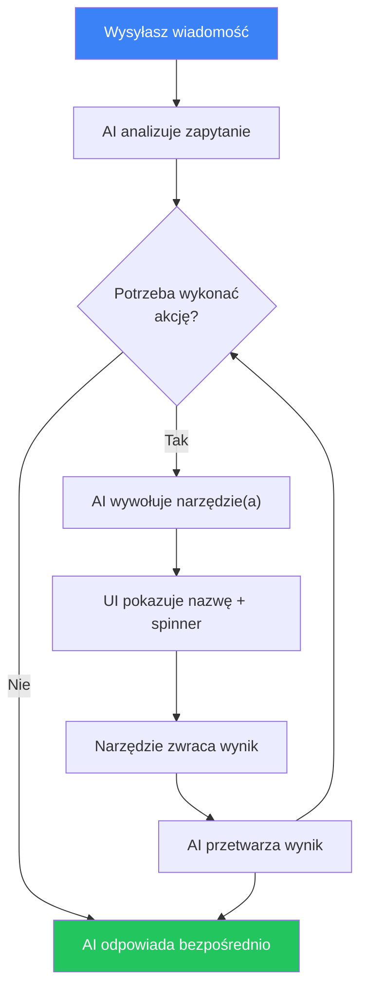
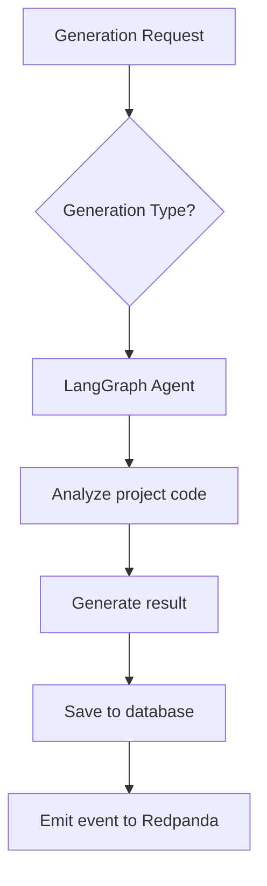

# Generowanie AI

## Przegląd

AI Service wykorzystuje agentów opartych na LangGraph i API OpenAI do automatycznej analizy kodu i generowania testów. Serwis dostępny na porcie **3005**.

## Typy generowania AI

### 1. Generowanie testów (Test Generation)

Automatyczne tworzenie testów dla istniejącego kodu.

**Jak to działa:**
1. Agent AI analizuje kod źródłowy projektu
2. Identyfikuje funkcje i klasy niepokryte testami
3. Generuje testy z uwzględnieniem używanego frameworka (Jest, Vitest itd.)
4. Zwraca gotowy do użycia kod testów

**Kiedy używać:**
- Przy niskim pokryciu kodu
- Dla nowego kodu napisanego bez TDD
- Do generowania testów dla przypadków brzegowych

### 2. Wykrywanie błędów (Bug Detection)

Analiza kodu przez AI pod kątem potencjalnych błędów.

**Jak to działa:**
1. Agent skanuje kod projektu
2. Szuka wzorców często prowadzących do błędów
3. Analizuje warunki brzegowe i obsługę błędów
4. Dostarcza opisy znalezionych problemów i rekomendacje naprawy

**Co wykrywa:**
- Nieobsłużone wyjątki
- Wyścigi (race conditions)
- Wycieki pamięci
- Problemy z typowaniem
- Nieprawidłowa obsługa null/undefined

### 3. Wykrywanie niestabilnych testów (Flaky Test Detection)

Identyfikacja niestabilnych testów, które czasem przechodzą, a czasem nie.

**Jak to działa:**
1. Agent analizuje historię przebiegów
2. Znajduje testy z niestabilnymi wynikami
3. Określa prawdopodobną przyczynę niestabilności
4. Proponuje sposoby naprawy

**Typowe przyczyny niestabilnych testów:**
- Zależność od czasu
- Wyścigi w kodzie asynchronicznym
- Zależność od kolejności wykonania
- Nieoczyszczony stan między testami

### 4. Porady dotyczące pokrycia (Coverage Advice)

Rekomendacje dotyczące poprawy pokrycia kodu testami.

**Jak to działa:**
1. Agent analizuje bieżące pokrycie
2. Identyfikuje krytyczne niepokryte obszary
3. Priorytetyzuje według ważności
4. Proponuje konkretne testy do napisania

### 5. Generowanie checklisty

Checklisty testowe generowane przez AI na podstawie analizy aplikacji.

**Jak to działa:**
1. Podaj URL docelowy, URL repozytorium lub opis aplikacji
2. Agent AI analizuje funkcje i przepływy aplikacji
3. Generuje kompleksową checklistę 10-25 scenariuszy testowych
4. Każdy element zawiera tytuł, opis, oczekiwane zachowanie i priorytet

**Kiedy używać:**
- Rozpoczynanie QA dla nowej aplikacji
- Kompleksowe planowanie testów regresyjnych
- Wdrażanie nowych członków zespołu QA

### 6. Generowanie testów z checklisty

Testy Playwright E2E generowane przez AI z poszczególnych elementów checklisty.

**Jak to działa:**
1. Wybierz element checklisty opisujący scenariusz testowy
2. Agent AI analizuje scenariusz i planuje kroki testu
3. Generuje kompletny test Playwright z dostępnymi selektorami
4. Waliduje składnię i udoskonala do 3 razy
5. Zwraca gotowy do wykonania kod testu

**Kiedy używać:**
- Automatyzacja ręcznych checklist testowych
- Generowanie testów E2E do testowania funkcjonalnego
- Konwersja kryteriów akceptacji na wykonywalne testy

## Asystent czatu AI

AI Service zawiera interfejs konwersacyjnego czatu, który potrafi odpowiadać na pytania i wykonywać akcje na platformie.

### Funkcje

- **Interfejs konwersacyjny** — zadawaj pytania w języku naturalnym
- **Baza wiedzy RAG** — odpowiedzi wzbogacone o zaindeksowaną dokumentację z `docs/en/` i `user_docs/en/`
- **Wywoływanie narzędzi** — AI może wykonywać akcje na platformie w Twoim imieniu (szczegóły poniżej)
- **Historia konwersacji** — konwersacje są zapisywane per projekt i utrzymywane między sesjami

### Dostępne narzędzia

Asystent czatu ma dostęp do 10 narzędzi do interakcji z platformą. Nie musisz wywoływać ich po nazwie — po prostu opisz, co chcesz zrobić, a AI wybierze odpowiednie narzędzie.

#### Projekty

| Narzędzie | Co robi | Przykładowe polecenie |
|-----------|---------|----------------------|
| `list_projects` | Zwraca wszystkie dostępne projekty | *„Pokaż moje projekty"* |
| `list_pipelines` | Zwraca pipeline'y konkretnego projektu | *„Jakie pipeline'y ma ten projekt?"* |

#### Przebiegi testowe

| Narzędzie | Co robi | Przykładowe polecenie |
|-----------|---------|----------------------|
| `trigger_pipeline` | Uruchamia nowy przebieg testowy dla pipeline'u. Zwraca utworzony przebieg z ID i statusem. | *„Uruchom pipeline CI"* |
| `get_run_status` | Pobiera aktualny status, kroki i wyniki przebiegu testowego. | *„Jaki jest status ostatniego przebiegu?"* |

#### Checklisty

| Narzędzie | Co robi | Przykładowe polecenie |
|-----------|---------|----------------------|
| `list_checklists` | Zwraca wszystkie checklisty bieżącego projektu | *„Pokaż wszystkie checklisty"* |
| `create_checklist` | Tworzy nową checklistę z elementami testowymi. Można podać nazwę, opis, docelowy URL i elementy z tytułem, opisem, oczekiwanym zachowaniem i priorytetem (LOW / MEDIUM / HIGH / CRITICAL). | *„Utwórz checklistę do testowania strony logowania z 5 elementami"* |
| `run_checklist` | Wykonuje checklistę pod docelowym URL. Uruchamia workflow Temporal, który wykonuje każdy element jako test Playwright. | *„Uruchom checklistę logowania na http://localhost:4200"* |
| `get_checklist_run` | Zwraca wyniki wykonania checklisty — status każdego elementu, podsumowania, zrzuty ekranu. | *„Pokaż wyniki ostatniego uruchomienia checklisty"* |

#### Generowanie AI

| Narzędzie | Co robi | Przykładowe polecenie |
|-----------|---------|----------------------|
| `generate_tests` | Uruchamia generowanie AI (TEST_GEN, BUG_DETECT, FLAKY_DETECT, COVERAGE_ADVICE, CHECKLIST_GEN, CHECKLIST_TEST_GEN). Wymaga ID projektu, typu i kontekstu wejściowego. | *„Wygeneruj testy jednostkowe dla tego projektu"* |

#### Baza wiedzy

| Narzędzie | Co robi | Przykładowe polecenie |
|-----------|---------|----------------------|
| `search_knowledge` | Wyszukuje w zaindeksowanej dokumentacji za pomocą podobieństwa semantycznego. Zwraca odpowiednie fragmenty dokumentacji. | *„Jak działają webhooki w tej aplikacji?"* |

### Jak działa wywoływanie narzędzi

Gdy wysyłasz wiadomość, AI decyduje, czy potrzebuje użyć narzędzia:



W interfejsie czatu:
- Wywołania narzędzi wyświetlane są jako etykiety z ikoną klucza
- Podczas działania narzędzia wyświetlany jest spinner
- Po zakończeniu pojawia się znacznik — kliknij, aby rozwinąć surowy wynik
- Następnie AI podsumowuje wynik w języku naturalnym

### Przykładowe konwersacje

**Tworzenie i uruchamianie checklisty:**
> **Ty:** Utwórz checklistę do testowania strony rejestracji
> **AI:** *(wywołuje `create_checklist`)* Gotowe! Utworzyłem checklistę „Testowanie strony rejestracji" z 8 elementami, w tym walidacja email, siła hasła, obsługa duplikatu email...
> **Ty:** Uruchom ją na http://localhost:4200
> **AI:** *(wywołuje `run_checklist`)* Uruchomiono! ID przebiegu checklisty: `abc-123`. Trwa wykonywanie...
> **Ty:** Jaki jest status?
> **AI:** *(wywołuje `get_checklist_run`)* 6 z 8 elementów zaliczonych. 2 niezaliczone: „Wskaźnik siły hasła" i „Walidacja checkboxa regulaminu". Szczegóły...

**Pytanie o platformę:**
> **Ty:** Jak skonfigurować powiadomienia Slack?
> **AI:** *(wywołuje `search_knowledge`)* Według dokumentacji: przejdź do Ustawienia → Powiadomienia, kliknij „Dodaj konfigurację", wybierz Slack jako kanał, wpisz nazwę kanału (np. #testing-alerts)...

### Użycie przez Dashboard

1. Otwórz projekt → „Czat" w menu bocznym
2. Wpisz swoje pytanie lub żądanie
3. AI strumieniowo wyświetla odpowiedź w czasie rzeczywistym
4. Jeśli AI musi wykonać akcję, pokaże wywołania narzędzi i wyniki
5. Poprzednie konwersacje są wyświetlone w lewym panelu bocznym

### Użycie przez API

#### Wysłanie wiadomości

```http
POST /ai/chat
Authorization: Bearer <token>
Content-Type: application/json

{
  "message": "Utwórz checklistę do testowania logowania",
  "projectId": "uuid-projektu",
  "conversationId": "uuid-konwersacji"
}
```

Odpowiedź: strumień SSE ze zdarzeniami typu `text`, `tool_call`, `tool_result`, `done`, `error`.

#### Lista konwersacji

```http
GET /ai/chat/conversations?projectId=<id>
Authorization: Bearer <token>
```

#### Pobranie konwersacji

```http
GET /ai/chat/conversations/:id
Authorization: Bearer <token>
```

#### Usunięcie konwersacji

```http
DELETE /ai/chat/conversations/:id
Authorization: Bearer <token>
```

### Indeksowanie bazy wiedzy

Bazę wiedzy można przeindeksować przez API:

```http
POST /ai/knowledge/index
Authorization: Bearer <token>
```

Endpoint skanuje `docs/en/` i `user_docs/en/`, dzieli dokumenty na fragmenty, generuje embeddingi przez OpenAI i zapisuje je z użyciem pgvector do wyszukiwania podobieństwa.

## Użytkowanie

### Przez Dashboard

1. Otwórz projekt → „AI"
2. Kliknij „Nowe generowanie"
3. Wybierz typ generowania
4. Poczekaj na wynik
5. Przejrzyj i zdecyduj: „Zaakceptuj" lub „Odrzuć"

### Przez API

#### Uruchomienie generowania

```http
POST /ai/generate
Authorization: Bearer <token>
Content-Type: application/json

{
  "projectId": "uuid-projektu",
  "type": "TEST_GENERATION"
}
```

Dostępne typy:
- `TEST_GENERATION` — generowanie testów
- `BUG_DETECTION` — wykrywanie błędów
- `FLAKY_TEST_DETECTION` — wykrywanie niestabilnych testów
- `COVERAGE_ADVICE` — rekomendacje pokrycia

#### Lista generowań

```http
GET /ai/generations?projectId=<id>&type=<type>
Authorization: Bearer <token>
```

#### Szczegóły generowania

```http
GET /ai/generations/:id
Authorization: Bearer <token>
```

#### Informacja zwrotna

```http
PATCH /ai/generations/:id/feedback
Authorization: Bearer <token>
Content-Type: application/json

{
  "status": "ACCEPTED",
  "feedback": "Testy są poprawne, stosuję"
}
```

Statusy: `ACCEPTED`, `REJECTED`

#### Statystyki

```http
GET /ai/generations/stats?projectId=<id>
Authorization: Bearer <token>
```

## Konfiguracja AI

Ustaw w `.env`:

```env
# Klucz API OpenAI (wymagany)
OPENAI_API_KEY=sk-twoj-klucz

# Modele
OPENAI_MODEL_FAST=gpt-4.1-mini      # Dla szybkich zadań
OPENAI_MODEL_ADVANCED=o3             # Dla złożonej analizy
```

## Architektura agentów

AI Service używa LangGraph do orkiestracji agentów:



Każdy typ generowania ma wyspecjalizowanego agenta z unikalnym zestawem narzędzi i promptów.

## Najlepsze praktyki

- **Weryfikuj wyniki** — AI może generować niepoprawne testy
- **Używaj informacji zwrotnej** — to pomaga poprawić jakość generowania
- **Zacznij od TEST_GENERATION** — to najbardziej dojrzały typ generowania
- **Łącz z ręcznym pokryciem** — AI uzupełnia, a nie zastępuje ręczne testy
