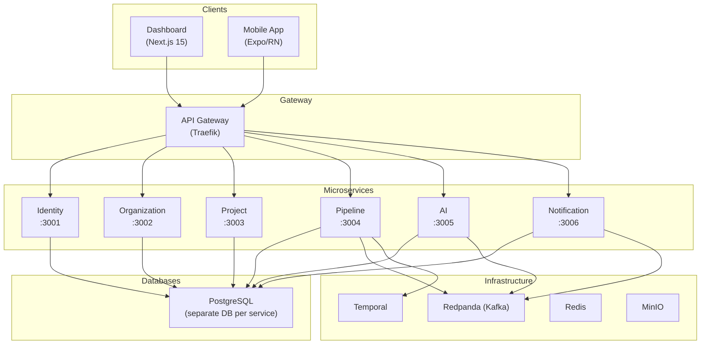

# Архитектура

## Обзор системы

Testing AI Assistant построен на микросервисной архитектуре с событийно-ориентированным взаимодействием между сервисами.

## Микросервисы

### Identity Service (порт 3001)

Управление пользователями и аутентификацией.

- Регистрация и вход пользователей
- JWT-токены (access + refresh)
- OAuth2-интеграция: GitHub, GitLab, Bitbucket
- Синхронизация с Keycloak (опционально)
- Чёрный список токенов через Redis

**Технологии:** NestJS, Prisma, PostgreSQL, Passport.js, JWT

### Organization Service (порт 3002)

Управление организациями и членством.

- CRUD организаций
- Приглашение участников
- Одобрение/отклонение заявок
- Ролевая модель: `ADMIN`, `MEMBER`, `VIEWER`

**Технологии:** NestJS, Prisma, PostgreSQL

### Project Service (порт 3003)

Управление проектами и интеграция с Git-провайдерами.

- CRUD проектов в рамках организации
- Подключение к Git-репозиториям (GitHub, GitLab, Bitbucket)
- Управление вебхуками: создание, удаление, обработка событий
- Автоматический запуск пайплайнов по push/PR

**Технологии:** NestJS, Prisma, PostgreSQL, пакет `@testing-ai/git-adapter`

### Pipeline Service (порт 3004)

Управление тестовыми пайплайнами и прогонами.

- Конфигурация пайплайнов (типы тестов, расписание, параметры)
- Запуск и отмена тестовых прогонов
- Сохранение результатов тестов
- Снимки покрытия кода
- SSE (Server-Sent Events) для обновлений в реальном времени

**Технологии:** NestJS, Prisma, PostgreSQL, SSE

### AI Service (порт 3005)

AI-генерация, анализ тестов и разговорный ассистент.

- Генерация тестов на основе кода проекта
- Обнаружение потенциальных багов
- Детекция flaky-тестов
- Рекомендации по улучшению покрытия
- **AI-чат с вызовом инструментов** — разговорный интерфейс для действий на платформе
- **RAG-база знаний** — ответы с учётом проиндексированной документации через pgvector-эмбеддинги
- Агенты на базе LangGraph

**Технологии:** NestJS, Prisma, PostgreSQL + pgvector, LangChain, LangGraph, OpenAI API

### Notification Service (порт 3006)

Мультиканальные уведомления.

- Email (SMTP)
- Slack
- Telegram
- Push-уведомления
- Конфигурируемые правила уведомлений

**Технологии:** NestJS, Prisma, PostgreSQL

### Test Runner (Temporal Worker)

Исполнение тестовых пайплайнов.

- Оркестрация через Temporal workflows
- Выполнение тестов: unit, integration, E2E, load, security
- Сбор метрик покрытия
- Загрузка артефактов в MinIO
- Не имеет HTTP-порта (фоновый воркер)

**Технологии:** Temporal SDK, MinIO SDK

## Инфраструктурные компоненты

| Компонент | Назначение |
|-----------|-----------|
| **PostgreSQL** | Персистентное хранение данных (отдельная БД на сервис) |
| **Redpanda** | Kafka-совместимый брокер сообщений для событийного взаимодействия |
| **Temporal** | Оркестрация долгоживущих workflow для тестовых прогонов |
| **Redis** | Кэширование, чёрный список токенов, управление сессиями |
| **MinIO** | S3-совместимое хранилище для артефактов тестов |
| **Keycloak** | Провайдер аутентификации (SSO), опциональный |
| **Traefik** | API-шлюз: TLS-терминация, маршрутизация, rate limiting |
| **OpenTelemetry** | Инструментация для сбора трейсов и метрик |
| **Grafana** | Визуализация логов, трейсов и метрик |
| **Prometheus** | Сбор и хранение метрик |
| **Loki** | Агрегация логов |
| **Tempo** | Хранение распределённых трейсов |

## Архитектурные паттерны

- **Database-per-service** — каждый сервис имеет свою базу данных
- **Event-driven** — асинхронное взаимодействие через Redpanda (Kafka)
- **CQRS-lite** — команды через REST API, чтение через события
- **API Gateway** — единая точка входа через Traefik
- **JWT-аутентификация** — stateless аутентификация на основе токенов
- **RBAC** — ролевой контроль доступа

## Технологический стек

| Слой | Технологии |
|------|-----------|
| Backend | NestJS 10, Prisma 5, PostgreSQL 16 + pgvector |
| Frontend Web | Next.js 15, React 19, Tailwind CSS |
| Frontend Mobile | Expo 52, React Native 0.76 |
| Брокер сообщений | Redpanda 24.1 (Kafka-совместимый) |
| Workflow | Temporal 1.24 |
| Аутентификация | Keycloak 24.0 |
| Хранилище | MinIO (S3-совместимый) |
| Кэш | Redis 7 |
| API Gateway | Traefik 3.x |
| Наблюдаемость | OpenTelemetry + Grafana stack |
| Пакетный менеджер | pnpm 9.15.4 |
| Сборка | Turborepo 2.3 |
