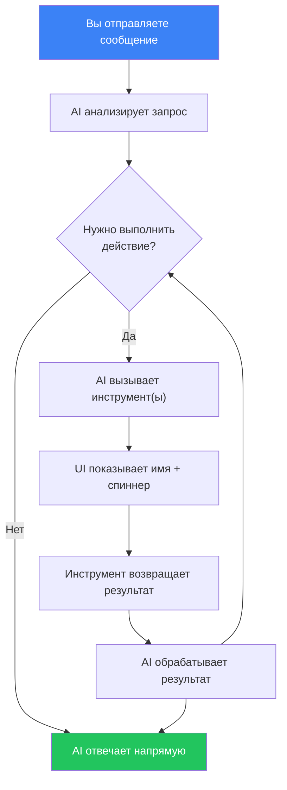
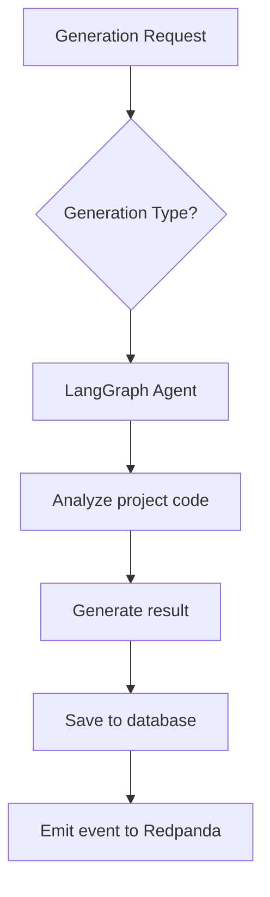

# AI-генерация

## Обзор

AI Service использует агенты на базе LangGraph и OpenAI API для автоматического анализа кода и генерации тестов. Сервис доступен на порту **3005**.

## Типы AI-генерации

### 1. Генерация тестов (Test Generation)

Автоматическое создание тестов для существующего кода.

**Как работает:**
1. AI-агент анализирует исходный код проекта
2. Определяет функции и классы, не покрытые тестами
3. Генерирует тесты с учётом используемого фреймворка (Jest, Vitest и др.)
4. Возвращает готовый к применению код тестов

**Когда использовать:**
- При низком покрытии кода
- Для нового кода, написанного без TDD
- Для генерации edge-case тестов

### 2. Обнаружение багов (Bug Detection)

AI-анализ кода на предмет потенциальных ошибок.

**Как работает:**
1. Система автоматически загружает контекст проекта: исходный код из git-репозитория (последний diff, содержимое файлов) и результаты последних тестов из Pipeline-сервиса
2. Агент анализирует загруженный код и результаты тестов
3. Ищет паттерны, часто приводящие к багам, анализирует граничные условия и обработку ошибок
4. Предоставляет структурированный отчёт с найденными проблемами

Ручной ввод данных не требуется — достаточно нажать «Сгенерировать». При необходимости можно вручную указать контекст в разделе «Дополнительно».

**Результаты отображаются как карточки** с цветовой кодировкой по серьёзности (Critical, High, Medium, Low). Каждая карточка содержит: заголовок, описание, местоположение в коде, оценку влияния и предложение по исправлению.

**Отчёт автоматически локализуется** на язык пользователя (русский, английский, польский).

**Что обнаруживает:**
- Необработанные исключения
- Race conditions
- Утечки памяти
- Проблемы с типизацией
- Неправильная обработка null/undefined

### 3. Детекция flaky-тестов (Flaky Test Detection)

Выявление нестабильных тестов, которые иногда проходят, а иногда нет.

**Как работает:**
1. Система автоматически загружает историю последних 10 тестовых прогонов проекта из Pipeline-сервиса
2. Агент проводит статистический анализ результатов и находит тесты с нестабильными результатами
3. Определяет паттерн нестабильности и вероятную причину
4. Предлагает конкретные способы исправления

Ручной ввод данных не требуется — достаточно нажать «Сгенерировать».

**Результаты отображаются как карточки** с показателями: общий показатель здоровья (Health Score), оценка нестабильности (Flakiness Score), частота сбоев, метка паттерна (например, «Timing», «Shared State»), описание, оценка влияния и рекомендации.

**Отчёт автоматически локализуется** на язык пользователя.

**Типичные причины flaky-тестов:**
- Зависимость от времени
- Гонки (race conditions) в асинхронном коде
- Зависимость от порядка выполнения
- Неочищенное состояние между тестами

### 4. Рекомендации по покрытию (Coverage Advice)

Советы по улучшению покрытия кода тестами.

**Как работает:**
1. Система автоматически загружает данные о покрытии (Coverage Snapshot) из Pipeline-сервиса
2. Если данные покрытия отсутствуют, система анализирует исходные файлы из git-репозитория и находит файлы без соответствующих тестов
3. Агент определяет критические непокрытые участки и приоритизирует их по степени важности
4. Предлагает конкретные тесты для написания с примерами кода

Ручной ввод данных не требуется — достаточно нажать «Сгенерировать».

**Результаты отображаются как карточки** с цветовой кодировкой по приоритету. Каждая карточка содержит: путь к файлу, тип теста (Unit, Integration, E2E), описание и пример тестового кода (stub).

**Отчёт автоматически локализуется** на язык пользователя.

## AI Чат-ассистент

AI Service включает разговорный чат-интерфейс, который может отвечать на вопросы и выполнять действия на платформе.

### Возможности

- **Разговорный интерфейс** — задавайте вопросы на естественном языке
- **RAG-база знаний** — ответы обогащаются проиндексированной документацией из `docs/en/` и `user_docs/en/`
- **Вызов инструментов** — AI может выполнять действия на платформе от вашего имени (подробности ниже)
- **История диалогов** — диалоги сохраняются для каждого проекта и доступны между сессиями

### Доступные инструменты

Чат-ассистент имеет доступ к 10 инструментам для взаимодействия с платформой. Вам не нужно вызывать их по имени — просто опишите, что хотите сделать, и AI выберет нужный инструмент.

#### Проекты

| Инструмент | Что делает | Пример запроса |
|------------|-----------|----------------|
| `list_projects` | Возвращает все доступные вам проекты | *«Покажи мои проекты»* |
| `list_pipelines` | Возвращает пайплайны конкретного проекта | *«Какие пайплайны есть у этого проекта?»* |

#### Тестовые прогоны

| Инструмент | Что делает | Пример запроса |
|------------|-----------|----------------|
| `trigger_pipeline` | Запускает новый тестовый прогон для пайплайна. Возвращает созданный прогон с ID и статусом. | *«Запусти CI пайплайн»* |
| `get_run_status` | Получает текущий статус, шаги и результаты тестового прогона. | *«Какой статус последнего прогона?»* |

#### Чек-листы

| Инструмент | Что делает | Пример запроса |
|------------|-----------|----------------|
| `list_checklists` | Возвращает все чек-листы текущего проекта | *«Покажи все чек-листы»* |
| `create_checklist` | Создаёт новый чек-лист с тестовыми пунктами. Можно указать название, описание, целевой URL и пункты с заголовком, описанием, ожидаемым поведением и приоритетом (LOW / MEDIUM / HIGH / CRITICAL). | *«Создай чек-лист для тестирования страницы логина из 5 пунктов»* |
| `run_checklist` | Запускает чек-лист по целевому URL. Стартует Temporal-воркфлоу, который выполняет каждый пункт как Playwright-тест. | *«Запусти чек-лист логина на http://localhost:4200»* |
| `get_checklist_run` | Возвращает результаты запуска чек-листа — статус каждого пункта, описания, скриншоты. | *«Покажи результаты последнего запуска чек-листа»* |

#### AI-генерация

| Инструмент | Что делает | Пример запроса |
|------------|-----------|----------------|
| `generate_tests` | Запускает AI-генерацию (TEST_GEN, BUG_DETECT, FLAKY_DETECT, COVERAGE_ADVICE, CHECKLIST_GEN, CHECKLIST_TEST_GEN). Требуется ID проекта, тип и входной контекст. | *«Сгенерируй юнит-тесты для этого проекта»* |

#### База знаний

| Инструмент | Что делает | Пример запроса |
|------------|-----------|----------------|
| `search_knowledge` | Ищет по проиндексированной документации с помощью семантического сходства. Возвращает релевантные фрагменты документации. | *«Как работают вебхуки в этом приложении?»* |

### Как работает вызов инструментов

Когда вы отправляете сообщение, AI решает, нужно ли использовать инструмент:



В интерфейсе чата:
- Вызовы инструментов отображаются как метки с иконкой гаечного ключа
- Пока инструмент выполняется, показывается спиннер
- После завершения появляется галочка — нажмите, чтобы развернуть сырой результат
- Затем AI резюмирует результат на естественном языке

### Примеры диалогов

**Создание и запуск чек-листа:**
> **Вы:** Создай чек-лист для тестирования страницы регистрации
> **AI:** *(вызывает `create_checklist`)* Готово! Я создал чек-лист «Тестирование страницы регистрации» с 8 пунктами, включая валидацию email, надёжность пароля, обработку дублирующего email...
> **Вы:** Запусти его на http://localhost:4200
> **AI:** *(вызывает `run_checklist`)* Запущено! ID запуска чек-листа: `abc-123`. Сейчас выполняется...
> **Вы:** Какой статус?
> **AI:** *(вызывает `get_checklist_run`)* 6 из 8 пунктов прошли. 2 провалены: «Индикатор надёжности пароля» и «Валидация чекбокса согласия». Подробности...

**Вопрос о платформе:**
> **Вы:** Как настроить Slack-уведомления?
> **AI:** *(вызывает `search_knowledge`)* Согласно документации: перейдите в Настройки → Уведомления, нажмите «Добавить конфигурацию», выберите Slack как канал, введите название канала (например, #testing-alerts)...

### Использование через Dashboard

1. Откройте проект и выберите "Чат" в боковом меню
2. Введите ваш вопрос или запрос
3. AI передаёт ответ в реальном времени (потоковая передача)
4. Если AI необходимо выполнить действие, он покажет вызовы инструментов и результаты
5. Предыдущие диалоги доступны в левой боковой панели

### Использование через API

#### Отправка сообщения

```http
POST /ai/chat
Authorization: Bearer <token>
Content-Type: application/json

{
  "message": "Создай чек-лист для тестирования авторизации",
  "projectId": "uuid-проекта",
  "conversationId": "uuid-диалога"
}
```

Ответ: SSE-поток с событиями типов `text`, `tool_call`, `tool_result`, `done`, `error`.

#### Список диалогов

```http
GET /ai/chat/conversations?projectId=<id>
Authorization: Bearer <token>
```

#### Получить диалог

```http
GET /ai/chat/conversations/:id
Authorization: Bearer <token>
```

#### Удалить диалог

```http
DELETE /ai/chat/conversations/:id
Authorization: Bearer <token>
```

### Индексация базы знаний

Базу знаний можно переиндексировать через API:

```http
POST /ai/knowledge/index
Authorization: Bearer <token>
```

Эта операция сканирует `docs/en/` и `user_docs/en/`, разбивает документы на фрагменты, генерирует эмбеддинги через OpenAI и сохраняет их с помощью pgvector для поиска по сходству.

## Использование

### Через Dashboard

1. Откройте проект → «AI»
2. Нажмите «Новая генерация»
3. Выберите тип генерации (для BUG_DETECT, FLAKY_DETECT, COVERAGE_ADVICE контекст загружается автоматически)
4. Нажмите «Сгенерировать» и дождитесь результата
5. Просмотрите результаты в виде визуальных карточек
6. Примите решение: «Принять» или «Отклонить»

### Через API

#### Запуск генерации

```http
POST /ai/generate
Authorization: Bearer <token>
Content-Type: application/json

{
  "projectId": "uuid-проекта",
  "type": "TEST_GENERATION"
}
```

Доступные типы:
- `TEST_GENERATION` — генерация тестов
- `BUG_DETECTION` — обнаружение багов
- `FLAKY_TEST_DETECTION` — детекция flaky-тестов
- `COVERAGE_ADVICE` — рекомендации по покрытию

#### Список генераций

```http
GET /ai/generations?projectId=<id>&type=<type>
Authorization: Bearer <token>
```

#### Детали генерации

```http
GET /ai/generations/:id
Authorization: Bearer <token>
```

#### Обратная связь

```http
PATCH /ai/generations/:id/feedback
Authorization: Bearer <token>
Content-Type: application/json

{
  "status": "ACCEPTED",
  "feedback": "Тесты корректны, применяю"
}
```

Статусы: `ACCEPTED`, `REJECTED`

#### Статистика

```http
GET /ai/generations/stats?projectId=<id>
Authorization: Bearer <token>
```

## Конфигурация AI

Настройте в `.env`:

```env
# API-ключ OpenAI (обязательно)
OPENAI_API_KEY=sk-ваш-ключ

# Модели
OPENAI_MODEL_FAST=gpt-4.1-mini      # Для быстрых задач
OPENAI_MODEL_ADVANCED=o3             # Для сложного анализа
```

## Архитектура агентов

AI Service использует LangGraph для оркестрации агентов:



Каждый тип генерации имеет специализированного агента с уникальным набором инструментов и промптов.

## Лучшие практики

- **Проверяйте результаты** — AI может генерировать некорректные тесты
- **Используйте обратную связь** — это помогает улучшить качество генерации
- **Начинайте с TEST_GENERATION** — это наиболее зрелый тип генерации
- **Комбинируйте с ручным покрытием** — AI дополняет, а не заменяет ручные тесты

## Мастер умной генерации тестов (Smart Test Generator Wizard)

Мастер умной генерации тестов — это пошаговый процесс, который анализирует ваш репозиторий проекта и генерирует готовые к использованию тестовые файлы с помощью AI. Он напрямую подключается к вашему Git-провайдеру, понимает структуру и соглашения проекта и создаёт тесты, следуя вашим существующим паттернам.

### Что он делает

- Сканирует репозиторий для определения языка, фреймворка, паттернов тестирования и структуры проекта
- Анализирует исходные файлы и предлагает, какие тесты создать, с описаниями и уровнями приоритета
- Позволяет выбрать, какие из предложенных тестов генерировать
- Генерирует полные, запускаемые тестовые файлы с правильными импортами и паттернами мокирования
- Валидирует сгенерированный код локально (проверка типов TypeScript и ESLint) и автоматически исправляет ошибки
- Позволяет просмотреть и отредактировать каждый сгенерированный тест перед коммитом
- Создаёт отдельную ветку и опционально открывает пулл-реквест

### Предварительные условия

Перед использованием мастера необходимо настроить **токен провайдера** для вашей организации:

1. Перейдите в **Настройки организации** в боковом меню
2. Откройте вкладку **Интеграции**
3. Нажмите **Добавить токен провайдера**
4. Выберите вашего Git-провайдера (GitHub, GitLab или Bitbucket)
5. Вставьте персональный токен доступа или токен приложения со следующими разрешениями:
   - **GitHub**: область `repo` (полный доступ к репозиторию)
   - **GitLab**: область `api`
   - **Bitbucket**: права на чтение и запись репозитория
6. Сохраните токен

Токен используется для всех проектов организации. Любой участник организации может использовать мастер после настройки токена.

### Пошаговое руководство

#### Шаг 1: Запуск сессии

Откройте проект, перейдите на вкладку **AI** и нажмите **Генерация тестов**. Система создаст новую сессию и начнёт анализ вашего репозитория.

Во время анализа система:
- Загружает дерево файлов репозитория
- Читает конфигурационные файлы (package.json, tsconfig.json, jest.config.ts и др.)
- Определяет существующие тестовые файлы и их паттерны
- Использует AI для построения структурированного профиля проекта (язык, фреймворк, структура директорий, зависимости)

Обычно это занимает 5–15 секунд. Результат анализа кэшируется, поэтому последующие сессии для того же проекта пропускают повторный анализ.

#### Шаг 2: Просмотр предложения

После завершения анализа нажмите **Сгенерировать предложение** (или процесс может продолжиться автоматически). Вы можете опционально указать **область фокуса** (например, «модуль аутентификации», «преобразователи данных»), чтобы направить AI.

AI анализирует до 30 исходных файлов и создаёт список предлагаемых тестовых файлов. Каждый пункт предложения включает:

- **Целевой файл**: исходный файл для тестирования
- **Путь тестового файла**: где будет создан тестовый файл (следует вашим существующим соглашениям об именовании)
- **Тип теста**: модульный, интеграционный или E2E
- **Описание**: что будут покрывать тесты
- **Обоснование**: почему эти тесты ценны
- **Приоритет**: Высокий (критическая логика, нет существующих тестов), Средний (важно, но частично покрыто) или Низкий (желательно)
- **Оценка количества тестов**: сколько отдельных тест-кейсов будет сгенерировано

#### Шаг 3: Одобрение пунктов

Просмотрите предложение и выберите, какие тесты вы хотите сгенерировать. Можно выбрать все пункты или конкретные. Пункты с высоким приоритетом выделены.

Нажмите **Одобрить и сгенерировать** для продолжения.

#### Шаг 4: Генерация

AI генерирует код тестов для каждого одобренного пункта. Это выполняется в фоне; вы можете видеть прогресс в реальном времени:

- Какой файл генерируется (например, «2 из 5»)
- Текущая фаза для каждого файла: сбор контекста, анализ, генерация, пост-обработка, LLM-проверка

Для каждого тестового файла система:
1. Загружает целевой исходный файл и его локальные импорты (типы, интерфейсы, утилиты)
2. Загружает до 3 существующих тестовых файлов как примеры стиля
3. Вычисляет правильные относительные пути импортов от тестового файла к исходным файлам
4. Вызывает AI для генерации кода теста
5. Удаляет markdown-форматирование, убирает неиспользуемые импорты/переменные, исправляет типичные проблемы с типами
6. Запускает второй проход AI для проверки и исправления путей импортов и ошибок типов

#### Шаг 5: Валидация

После генерации всех тестов система автоматически их валидирует:

1. Клонирует ваш репозиторий во временную директорию
2. Устанавливает зависимости (автоматически определяет pnpm/yarn/npm)
3. Копирует сгенерированные тестовые файлы в клон
4. Запускает `tsc --noEmit` для проверки ошибок TypeScript
5. Запускает ESLint для проверки нарушений линтинга
6. Если обнаружены ошибки, отправляет их AI для исправления и повторно валидирует (до 3 попыток)

Вы можете **пропустить валидацию** в любой момент, если предпочитаете исправить проблемы вручную.

#### Шаг 6: Проверка

Все сгенерированные тесты отображаются в виде редактора. Вы можете:

- **Прочитать код** каждого сгенерированного тестового файла
- **Отредактировать** любой тестовый файл прямо в браузере
- **Перегенерировать** отдельные тесты, которые не соответствуют вашим ожиданиям (отправляет их обратно через пайплайн генерации, сохраняя все остальные тесты)

Не торопитесь на этом шаге. Сессия остаётся в статусе `REVIEW`, пока вы не закоммитите или не отмените.

#### Шаг 7: Коммит

Когда вы удовлетворены тестами:

1. Опционально настройте **сообщение коммита** (по умолчанию предоставляется разумное значение)
2. Опционально отметьте **Создать пулл-реквест** для автоматического открытия PR
3. Нажмите **Коммит**

Система:
- Создаёт ветку с именем `ai/test-gen-{timestamp}` от вашей ветки по умолчанию
- Коммитит все сгенерированные тестовые файлы одним коммитом
- При запросе открывает пулл-реквест с описанием, перечисляющим все сгенерированные файлы и ID сессии

Вы получите ссылки на коммит и пулл-реквест (если создан).

### Управление сессиями

#### Возобновление сессии

Сессии сохраняются между сессиями браузера. Если вы закроете страницу во время генерации или проверки, просто вернитесь на вкладку AI проекта, и список сессий покажет ваши незавершённые сессии. Нажмите на сессию, чтобы возобновить с того места, где она остановилась.

#### Отмена сессии

Вы можете отменить сессию в любой момент до достижения терминального состояния (COMMITTED, CANCELLED или FAILED). Отмена во время генерации останавливает процесс после завершения текущего файла. Уже сгенерированные тесты сохраняются в записи сессии, но не коммитятся.

#### Перегенерация тестов

На шаге проверки вы можете выбрать отдельные тесты для перегенерации без начала заново. Это полезно, когда:

- Конкретный тест имеет неправильные паттерны мокирования
- Вы хотите попробовать другой подход к тестированию одного файла
- AI пропустил важный граничный случай

Вы также можете перегенерировать тесты из уже закоммиченной сессии для улучшения конкретных тестов и повторного коммита.

#### История сессий

Вкладка AI показывает недавние сессии текущего проекта (до 20). Вы можете просматривать прошлые сессии, чтобы увидеть, что было сгенерировано, просмотреть ссылки на коммиты или перегенерировать из предложения предыдущей сессии.

### Советы и лучшие практики

1. **Указывайте область фокуса** при генерации предложений. Целевое предложение (например, «слой сервисов» или «утилитарные функции») даёт лучшие результаты, чем анализ всей кодовой базы.

2. **Начинайте с пунктов высокого приоритета**. Одобрите сначала 3–5 тестов с высоким приоритетом, оцените качество, затем делайте дополнительные раунды, если удовлетворены.

3. **Проверяйте профиль проекта** после первого анализа. Если обнаруженный фреймворк или паттерны выглядят неправильно, перезапустите анализ или скорректируйте конфигурацию проекта.

4. **Внимательно проверяйте пути импортов**. Система вычисляет относительные импорты автоматически, но сложные алиасы путей монорепозитория (например, `@app/shared`) могут потребовать ручной коррекции.

5. **Используйте существующие тесты как примеры**. Генератор читает до 3 ваших существующих тестовых файлов для соответствия стилю. Если в вашем репозитории есть хорошо структурированные примеры тестов, качество вывода значительно улучшается.

6. **Не пропускайте валидацию без причины**. Валидация tsc + eslint обнаруживает реальные проблемы, которые привели бы к сбою в CI. Цикл автоисправления решает большинство проблем автоматически.

7. **Всегда создавайте PR** вместо прямого коммита. Это позволяет вашей команде проверить тесты, сгенерированные AI, в обычном процессе код-ревью.

8. **Использование токенов**: Каждая сессия потребляет токены LLM. В деталях сессии отображается `totalTokensUsed`. Типичная генерация из 5 файлов использует примерно 30 000–60 000 токенов в зависимости от сложности исходных файлов.

### Устранение неполадок

**«Токен GITHUB не настроен для этой организации»**
Администратор организации должен добавить токен провайдера в Настройки организации > Интеграции. См. раздел «Предварительные условия» выше.

**Сессия зависла в состоянии ANALYZING**
Система может ожидать ответа от API Git-провайдера. Большие репозитории (10 000+ файлов) занимают больше времени. Если состояние держится более 60 секунд, проверьте, что токен провайдера имеет достаточные разрешения и URL репозитория указан правильно.

**Валидация постоянно завершается ошибкой**
Некоторые проекты имеют сложные конфигурации сборки, которые валидатор не может воспроизвести в изолированном клоне (например, пользовательские Webpack-загрузчики, этапы генерации кода). Нажмите «Пропустить валидацию» и исправьте проблемы после коммита.

**В сгенерированных тестах неправильные пути импортов**
Чаще всего это происходит в монорепозиториях с алиасами путей TypeScript (например, `paths` в `tsconfig.json`). Система использует относительные пути, а не алиасы. Вы можете отредактировать импорты на шаге проверки или настроить `paths` в `tsconfig.json` в соответствии с относительной структурой.

**Ошибка «Проект не найден»**
AI-сервис получает метаданные проекта из сервиса проектов через внутренний API. Убедитесь, что оба сервиса запущены и `PROJECT_SERVICE_URL` настроен правильно.

**Тесты ссылаются на несуществующие типы или функции**
AI иногда «галлюцинирует» свойства интерфейсов или сигнатуры функций. Сверьте сгенерированные мок-объекты с вашим реальным исходным кодом. Проход LLM-валидации обнаруживает большинство таких случаев, но сложные типы могут проскочить.

**Генерация идёт медленно**
Каждый тестовый файл включает 2–3 вызова LLM (анализ, генерация, валидация). Для 10 одобренных пунктов ожидайте 3–5 минут. Система обрабатывает файлы последовательно для управления лимитами API и качеством контекста. Вы можете отменить и закоммитить частичный результат на шаге проверки.

### Поддерживаемые языки и фреймворки

Мастер протестирован с:

| Язык        | Фреймворки                          |
|-------------|-------------------------------------|
| TypeScript  | Jest, Vitest, Mocha, Playwright     |
| JavaScript  | Jest, Vitest, Mocha                 |
| Python      | pytest                              |
| Java        | JUnit                               |
| Go          | testing (стандартная библиотека)     |
| Rust        | cargo test                          |

Лучшие результаты достигаются с проектами TypeScript/JavaScript, использующими Jest или Vitest, так как они имеют наиболее продвинутую поддержку разрешения импортов и валидации.
