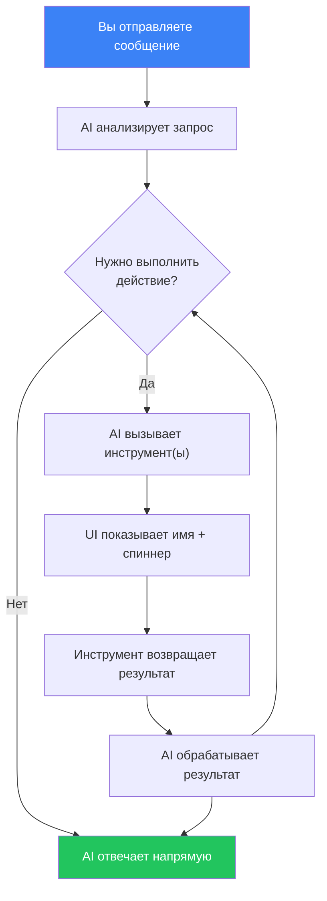
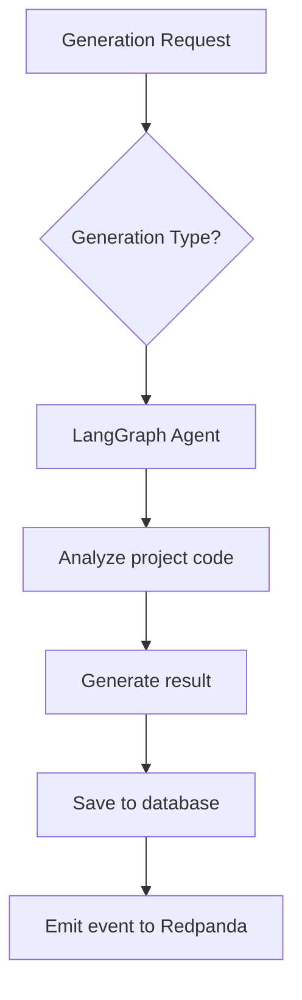

# AI-генерация

## Обзор

AI Service использует агенты на базе LangGraph и OpenAI API для автоматического анализа кода и генерации тестов. Сервис доступен на порту **3005**.

## Типы AI-генерации

### 1. Генерация тестов (Test Generation)

Автоматическое создание тестов для существующего кода.

**Как работает:**
1. AI-агент анализирует исходный код проекта
2. Определяет функции и классы, не покрытые тестами
3. Генерирует тесты с учётом используемого фреймворка (Jest, Vitest и др.)
4. Возвращает готовый к применению код тестов

**Когда использовать:**
- При низком покрытии кода
- Для нового кода, написанного без TDD
- Для генерации edge-case тестов

### 2. Обнаружение багов (Bug Detection)

AI-анализ кода на предмет потенциальных ошибок.

**Как работает:**
1. Агент сканирует код проекта
2. Ищет паттерны, часто приводящие к багам
3. Анализирует граничные условия и обработку ошибок
4. Предоставляет описание найденных проблем и рекомендации по исправлению

**Что обнаруживает:**
- Необработанные исключения
- Race conditions
- Утечки памяти
- Проблемы с типизацией
- Неправильная обработка null/undefined

### 3. Детекция flaky-тестов (Flaky Test Detection)

Выявление нестабильных тестов, которые иногда проходят, а иногда нет.

**Как работает:**
1. Агент анализирует историю прогонов
2. Находит тесты с нестабильными результатами
3. Определяет вероятную причину нестабильности
4. Предлагает способы исправления

**Типичные причины flaky-тестов:**
- Зависимость от времени
- Гонки (race conditions) в асинхронном коде
- Зависимость от порядка выполнения
- Неочищенное состояние между тестами

### 4. Рекомендации по покрытию (Coverage Advice)

Советы по улучшению покрытия кода тестами.

**Как работает:**
1. Агент анализирует текущее покрытие
2. Определяет критические непокрытые участки
3. Приоритизирует по степени важности
4. Предлагает конкретные тесты для написания

## AI Чат-ассистент

AI Service включает разговорный чат-интерфейс, который может отвечать на вопросы и выполнять действия на платформе.

### Возможности

- **Разговорный интерфейс** — задавайте вопросы на естественном языке
- **RAG-база знаний** — ответы обогащаются проиндексированной документацией из `docs/en/` и `user_docs/en/`
- **Вызов инструментов** — AI может выполнять действия на платформе от вашего имени (подробности ниже)
- **История диалогов** — диалоги сохраняются для каждого проекта и доступны между сессиями

### Доступные инструменты

Чат-ассистент имеет доступ к 10 инструментам для взаимодействия с платформой. Вам не нужно вызывать их по имени — просто опишите, что хотите сделать, и AI выберет нужный инструмент.

#### Проекты

| Инструмент | Что делает | Пример запроса |
|------------|-----------|----------------|
| `list_projects` | Возвращает все доступные вам проекты | *«Покажи мои проекты»* |
| `list_pipelines` | Возвращает пайплайны конкретного проекта | *«Какие пайплайны есть у этого проекта?»* |

#### Тестовые прогоны

| Инструмент | Что делает | Пример запроса |
|------------|-----------|----------------|
| `trigger_pipeline` | Запускает новый тестовый прогон для пайплайна. Возвращает созданный прогон с ID и статусом. | *«Запусти CI пайплайн»* |
| `get_run_status` | Получает текущий статус, шаги и результаты тестового прогона. | *«Какой статус последнего прогона?»* |

#### Чек-листы

| Инструмент | Что делает | Пример запроса |
|------------|-----------|----------------|
| `list_checklists` | Возвращает все чек-листы текущего проекта | *«Покажи все чек-листы»* |
| `create_checklist` | Создаёт новый чек-лист с тестовыми пунктами. Можно указать название, описание, целевой URL и пункты с заголовком, описанием, ожидаемым поведением и приоритетом (LOW / MEDIUM / HIGH / CRITICAL). | *«Создай чек-лист для тестирования страницы логина из 5 пунктов»* |
| `run_checklist` | Запускает чек-лист по целевому URL. Стартует Temporal-воркфлоу, который выполняет каждый пункт как Playwright-тест. | *«Запусти чек-лист логина на http://localhost:4200»* |
| `get_checklist_run` | Возвращает результаты запуска чек-листа — статус каждого пункта, описания, скриншоты. | *«Покажи результаты последнего запуска чек-листа»* |

#### AI-генерация

| Инструмент | Что делает | Пример запроса |
|------------|-----------|----------------|
| `generate_tests` | Запускает AI-генерацию (TEST_GEN, BUG_DETECT, FLAKY_DETECT, COVERAGE_ADVICE, CHECKLIST_GEN, CHECKLIST_TEST_GEN). Требуется ID проекта, тип и входной контекст. | *«Сгенерируй юнит-тесты для этого проекта»* |

#### База знаний

| Инструмент | Что делает | Пример запроса |
|------------|-----------|----------------|
| `search_knowledge` | Ищет по проиндексированной документации с помощью семантического сходства. Возвращает релевантные фрагменты документации. | *«Как работают вебхуки в этом приложении?»* |

### Как работает вызов инструментов

Когда вы отправляете сообщение, AI решает, нужно ли использовать инструмент:



В интерфейсе чата:
- Вызовы инструментов отображаются как метки с иконкой гаечного ключа
- Пока инструмент выполняется, показывается спиннер
- После завершения появляется галочка — нажмите, чтобы развернуть сырой результат
- Затем AI резюмирует результат на естественном языке

### Примеры диалогов

**Создание и запуск чек-листа:**
> **Вы:** Создай чек-лист для тестирования страницы регистрации
> **AI:** *(вызывает `create_checklist`)* Готово! Я создал чек-лист «Тестирование страницы регистрации» с 8 пунктами, включая валидацию email, надёжность пароля, обработку дублирующего email...
> **Вы:** Запусти его на http://localhost:4200
> **AI:** *(вызывает `run_checklist`)* Запущено! ID запуска чек-листа: `abc-123`. Сейчас выполняется...
> **Вы:** Какой статус?
> **AI:** *(вызывает `get_checklist_run`)* 6 из 8 пунктов прошли. 2 провалены: «Индикатор надёжности пароля» и «Валидация чекбокса согласия». Подробности...

**Вопрос о платформе:**
> **Вы:** Как настроить Slack-уведомления?
> **AI:** *(вызывает `search_knowledge`)* Согласно документации: перейдите в Настройки → Уведомления, нажмите «Добавить конфигурацию», выберите Slack как канал, введите название канала (например, #testing-alerts)...

### Использование через Dashboard

1. Откройте проект и выберите "Чат" в боковом меню
2. Введите ваш вопрос или запрос
3. AI передаёт ответ в реальном времени (потоковая передача)
4. Если AI необходимо выполнить действие, он покажет вызовы инструментов и результаты
5. Предыдущие диалоги доступны в левой боковой панели

### Использование через API

#### Отправка сообщения

```http
POST /ai/chat
Authorization: Bearer <token>
Content-Type: application/json

{
  "message": "Создай чек-лист для тестирования авторизации",
  "projectId": "uuid-проекта",
  "conversationId": "uuid-диалога"
}
```

Ответ: SSE-поток с событиями типов `text`, `tool_call`, `tool_result`, `done`, `error`.

#### Список диалогов

```http
GET /ai/chat/conversations?projectId=<id>
Authorization: Bearer <token>
```

#### Получить диалог

```http
GET /ai/chat/conversations/:id
Authorization: Bearer <token>
```

#### Удалить диалог

```http
DELETE /ai/chat/conversations/:id
Authorization: Bearer <token>
```

### Индексация базы знаний

Базу знаний можно переиндексировать через API:

```http
POST /ai/knowledge/index
Authorization: Bearer <token>
```

Эта операция сканирует `docs/en/` и `user_docs/en/`, разбивает документы на фрагменты, генерирует эмбеддинги через OpenAI и сохраняет их с помощью pgvector для поиска по сходству.

## Использование

### Через Dashboard

1. Откройте проект → «AI»
2. Нажмите «Новая генерация»
3. Выберите тип генерации
4. Дождитесь результата
5. Просмотрите и примите решение: «Принять» или «Отклонить»

### Через API

#### Запуск генерации

```http
POST /ai/generate
Authorization: Bearer <token>
Content-Type: application/json

{
  "projectId": "uuid-проекта",
  "type": "TEST_GENERATION"
}
```

Доступные типы:
- `TEST_GENERATION` — генерация тестов
- `BUG_DETECTION` — обнаружение багов
- `FLAKY_TEST_DETECTION` — детекция flaky-тестов
- `COVERAGE_ADVICE` — рекомендации по покрытию

#### Список генераций

```http
GET /ai/generations?projectId=<id>&type=<type>
Authorization: Bearer <token>
```

#### Детали генерации

```http
GET /ai/generations/:id
Authorization: Bearer <token>
```

#### Обратная связь

```http
PATCH /ai/generations/:id/feedback
Authorization: Bearer <token>
Content-Type: application/json

{
  "status": "ACCEPTED",
  "feedback": "Тесты корректны, применяю"
}
```

Статусы: `ACCEPTED`, `REJECTED`

#### Статистика

```http
GET /ai/generations/stats?projectId=<id>
Authorization: Bearer <token>
```

## Конфигурация AI

Настройте в `.env`:

```env
# API-ключ OpenAI (обязательно)
OPENAI_API_KEY=sk-ваш-ключ

# Модели
OPENAI_MODEL_FAST=gpt-4.1-mini      # Для быстрых задач
OPENAI_MODEL_ADVANCED=o3             # Для сложного анализа
```

## Архитектура агентов

AI Service использует LangGraph для оркестрации агентов:



Каждый тип генерации имеет специализированного агента с уникальным набором инструментов и промптов.

## Лучшие практики

- **Проверяйте результаты** — AI может генерировать некорректные тесты
- **Используйте обратную связь** — это помогает улучшить качество генерации
- **Начинайте с TEST_GENERATION** — это наиболее зрелый тип генерации
- **Комбинируйте с ручным покрытием** — AI дополняет, а не заменяет ручные тесты
